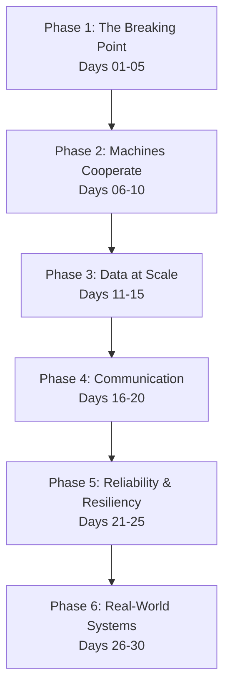

<div align="center">

# 🚀 30 Days of Distributed Systems

### *Understanding How Modern Software Actually Works*


[](https://github.com/userhimanshuverma/30_Days_of_Distributed_Systems/stargazers)
[](https://github.com/userhimanshuverma/30_Days_of_Distributed_Systems/network/members)
[](LICENSE)
[](CONTRIBUTING.md)
[](CONTRIBUTING.md)
[](https://github.com/userhimanshuverma/30_Days_of_Distributed_Systems/issues)
[](https://github.com/userhimanshuverma/30_Days_of_Distributed_Systems/discussions)

</div>

---

## 📌 Introduction

Every software engineer eventually learns **Kubernetes**. 
Then **Kafka**. 
Then **NoSQL databases**. 
Then **Cloud Infrastructure**. 
Then **AI Clusters**.

Yet, very few engineers step back to understand the fundamental core engineering principles connecting them all.

We spend years memorizing API endpoints, CLI parameters, and framework syntax without asking the hard underlying questions:
* *Why does etcd need 3 or 5 nodes instead of 4?*
* *What happens to a database transaction when the network cable between data centers snaps?*
* *How does Kafka guarantee message order when thousands of events flood in every second?*

This repository exists to bridge that exact gap. It is a **production-grade engineering handbook** crafted to build deep, mental-model-level intuition for distributed systems.

---

## 🎯 Why This Repository Exists

Most learning resources fall into one of two traps:
1. **Tool-centric tutorials**: They teach you *how* to configure a specific tool (`docker-compose`, `helm`, `redis-cli`), but leave you stranded when that tool fails at 3 AM in production.
2. **Academic papers**: They swamp you with formal mathematical proofs without showing how those equations turn into actual code running in a cloud instance.

> **Tools change every few years. The fundamental laws of physics, networking, and distributed consensus remain the same.**

This repository focuses relentlessly on **WHY**. Why single-node setups break down, why trade-offs are unavoidable, and why modern tech giants design systems the way they do.

---

## 🧠 What You'll Learn

| Core Topic | Why It Matters | Real Systems Built On It |
| :--- | :--- | :--- |
| **Replication** | Guarantees data durability & high availability across node crashes | MySQL, PostgreSQL, CockroachDB |
| **Consensus & Raft** | Enables multiple nodes to safely agree on shared state | etcd, Consul, Kubernetes |
| **Sharding & Partitioning** | Scales storage beyond the physical limits of a single machine | DynamoDB, Cassandra, MongoDB |
| **Leader Election** | Appoints a single coordinator to prevent concurrent write chaos | Apache ZooKeeper, Kafka |
| **CAP & Consistency** | Helps you choose between immediate accuracy and system availability | Amazon Dynamo, Google Spanner |
| **Messaging & Queues** | Decouples services and buffers high-throughput asynchronous events | Apache Kafka, RabbitMQ |
| **Distributed Transactions** | Ensures atomic multi-node updates without corrupting data | Google Spanner, CockroachDB |
| **Load Balancing** | Evenly spreads incoming traffic to prevent single-point overload | NGINX, HAProxy, Envoy |
| **Resilience & Circuit Breakers** | Prevents cascading failures when downstream dependencies degrade | Netflix Hystrix, Resilience4j |

---

## 🗺️ Learning Roadmap

The 30-day journey is organized into **6 structured phases**, moving logically from single-machine bottlenecks to planetary-scale architecture:



### 🔴 PHASE 1: The Breaking Point (Days 01–05)
*Explores why single servers fail and introduces core distributed trade-offs.*
- [x] [Day 01: Why One Server Is Never Enough](days/Day-01-Why-One-Server-Is-Never-Enough)
- [x] [Day 02: The Day Scaling Up Stops Working](days/Day-02-The-Day-Scaling-Up-Stops-Working)
- [x] [Day 03: When Servers Die](days/Day-03-When-Servers-Die)
- [x] [Day 04: The Replication Problem](days/Day-04-The-Replication-Problem)
- [x] [Day 05: The Impossible Triangle (CAP Theorem)](days/Day-05-The-Impossible-Triangle)

### 🟡 PHASE 2: Machines Cooperate (Days 06–10)
*Covers consensus, leadership, and detecting failures in untrusted networks.*
- [x] [Day 06: Leader Election](days/Day-06-Leader-Election)
- [x] [Day 07: Consensus & Distributed Agreement](days/Day-07-Consensus)
- [x] [Day 08: Split-Brain Scenarios](days/Day-08-Split-Brain)
- [x] [Day 09: Heartbeats & Lease Management](days/Day-09-Heartbeats)
- [x] [Day 10: Failure Detection (Phi Accrual)](days/Day-10-Failure-Detection)

### 🟢 PHASE 3: Data at Scale (Days 11–15)
*Deep dive into database partitioning, quorums, and eventual consistency.*
- [x] [Day 11: Why Databases Shard](days/Day-11-Why-Databases-Shard)
- [x] [Day 12: Consistent Hashing & Sharding](days/Day-12-Sharding)
- [x] [Day 13: Replication Models (Sync vs Async)](days/Day-13-Replication)
- [x] [Day 14: Quorums & Read/Write Math](days/Day-14-Quorums)
- [x] [Day 15: Eventual Consistency & Conflict Resolution](days/Day-15-Eventual-Consistency)

### 🔵 PHASE 4: Network Communication (Days 16–20)
*Covers inter-service communication protocols and data exchange formats.*
- [x] [Day 16: Remote Procedure Calls (RPC)](days/Day-16-RPC)
- [x] [Day 17: gRPC vs REST Protocol Deep-Dive](days/Day-17-gRPC-vs-REST)
- [x] [Day 18: Asynchronous Messaging Patterns](days/Day-18-Messaging)
- [x] [Day 19: Exactly-Once Processing Semantics](days/Day-19-Exactly-Once)
- [x] [Day 20: Distributed Transactions (2PC & Saga)](days/Day-20-Distributed-Transactions)

### 🟣 PHASE 5: Reliability & Resiliency (Days 21–25)
*Guarding against backpressure, thundering herds, and network degradation.*
- [x] [Day 21: Retries, Exponential Backoff & Jitter](days/Day-21-Retries)
- [x] [Day 22: Timeouts & Deadlines](days/Day-22-Timeouts)
- [x] [Day 23: Circuit Breakers](days/Day-23-Circuit-Breakers)
- [x] [Day 24: Load Balancing Algorithms](days/Day-24-Load-Balancing)
- [x] [Day 25: Service Discovery & Health Checking](days/Day-25-Service-Discovery)

### ⚪ PHASE 6: Real-World Systems (Days 26–30)
*Deconstructing production architectures powering globally scaled companies.*
- [x] [Day 26: Google Search Architecture](days/Day-26-Google-Search)
- [x] [Day 27: WhatsApp Real-Time Messaging](days/Day-27-WhatsApp)
- [x] [Day 28: Netflix Video Streaming Engine](days/Day-28-Netflix)
- [x] [Day 29: ChatGPT & Large Language Model Serving](days/Day-29-ChatGPT)
- [x] [Day 30: Building a Distributed System from Scratch](days/Day-30-Building-a-Distributed-System)

---

## 📁 Repository Structure

```
30_Days_of_Distributed_Systems/
├── days/           # 30 self-contained daily engineering chapters
├── case-studies/   # Real-world production architecture breakdowns
├── playgrounds/    # Runnable interactive simulation scripts
├── cheatsheets/    # Fast revision cheatsheets for core concepts
├── resources/      # Curated papers, books, blogs, and videos
└── assets/         # Global diagrams, illustrations, and banners
```

- **`days/`**: Every daily chapter lives inside its dedicated folder containing a comprehensive `README.md`, supporting code, diagrams, and paper references.
- **`case-studies/`**: Detailed breakdowns of architectural decisions made by companies like Netflix, Google, Uber, and WhatsApp.
- **`playgrounds/`**: Minimal runnable Python, Go, or Java simulations of complex protocols (e.g., simulating Raft consensus or Leader Election locally).
- **`cheatsheets/`**: One-page reference documents optimized for quick review before system design interviews or architecture reviews.

---

## ✨ Repository Highlights

| Feature | Description |
| :--- | :--- |
| 🖼️ **Visual Explanations** | Custom Mermaid diagrams, sequence flowcharts, and architecture visual maps. |
| 🏢 **Production Examples** | Real incident write-ups and architectural post-mortems from top tech companies. |
| 💻 **Interactive Code** | Clean, un-bloated simulation scripts you can run right on your terminal. |
| 💡 **Engineering Intuition** | Step-by-step problem-first approach rather than abstract definition dumps. |
| 📚 **Curated References** | Direct links to foundational academic papers (Spanner, Dynamo, Raft, MapReduce). |

---

## ⚡ What Makes This Repository Different?

```
Traditional Approach:
[Definitions] ➔ [Theory & Formulas] ➔ [Memorization] ➔ [Forgotten in 2 Weeks]

This Repository's Approach:
[Real Failure Scenario] ➔ [Engineering Thinking] ➔ [Visual Flow] ➔ [Code Simulation] ➔ [Production System Study] ➔ [Deep Intuition]
```

---

## 🏢 Systems & Companies We'll Study

We analyze the underlying engineering decisions of world-class infrastructure:

- **Google**: Google Search, Spanner, Bigtable, Borg
- **Netflix**: Global CDN, Chaos Engineering, Video Microservices
- **Uber**: Geospatial Sharding (H3), Real-Time Dispatch Engine
- **WhatsApp**: Erlang Actor Model, Millions of Concurrent Connections
- **OpenAI / ChatGPT**: Distributed Inference & Cluster GPU Scheduling
- **Amazon**: Dynamo DB paper, Eventual Consistency, Quorums
- **Cloudflare**: Anycast routing, Edge Caching, DDoS Mitigation

---

## 🔍 Featured Case Studies

- 🔍 **[Google Search](case-studies/Google)**: Web crawling at scale, inverted indexing, and distributed query serving.
- 🎬 **[Netflix Streaming](case-studies/Netflix)**: Adaptive bitrate streaming, global multi-region failover, and microservice resilience.
- 💬 **[WhatsApp Messaging](case-studies/WhatsApp)**: Handling billions of messages daily with minimal latency and high availability.
- 🚗 **[Uber Location Engine](case-studies/Uber)**: Dynamic supply/demand matching across geographical micro-shards.
- 🤖 **[ChatGPT Serving](case-studies/ChatGPT)**: Distributed KV caching, pipeline parallelism, and low-latency token generation.

---

## 🧪 Interactive Playgrounds

Don't just read about distributed systems—run them:

- 🗳️ **[Raft Consensus](playgrounds/raft)**: Watch nodes send heartbeats, request votes, and recover from simulated network partitions.
- 👑 **[Leader Election](playgrounds/leader-election)**: See how nodes detect dead leaders and coordinate a new election seamlessly.
- ⚖️ **[Load Balancer](playgrounds/load-balancer)**: Compare Round Robin, Least Connections, and Consistent Hashing in real-time.
- 🧩 **[Sharding & Hash Rings](playgrounds/sharding)**: Observe how adding or removing nodes re-distributes keys with minimal movement.

---

## 📝 Cheatsheets

Quick-reference guides designed for rapid mental refreshers:

- 📄 **[CAP Theorem Cheatsheet](cheatsheets/CAP-Theorem.md)**
- 📄 **[Replication Models Cheatsheet](cheatsheets/Replication.md)**
- 📄 **[Consistency Spectrum Cheatsheet](cheatsheets/Consistency.md)**
- 📄 **[Leader Election Cheatsheet](cheatsheets/Leader-Election.md)**
- 📄 **[Raft Protocol Cheatsheet](cheatsheets/Raft.md)**
- 📄 **[Caching Strategies Cheatsheet](cheatsheets/Caching.md)**
- 📄 **[Service Discovery Cheatsheet](cheatsheets/Service-Discovery.md)**
- 📄 **[Sharding & Partitioning Cheatsheet](cheatsheets/Sharding.md)**

---

## 👥 Who Should Read This?

| Profile | Why You'll Benefit |
| :--- | :--- |
| **Software Engineers** | Transition from writing single-instance code to designing scalable, resilient systems. |
| **Backend & API Engineers** | Understand how network latencies, serialization, and queues affect API performance. |
| **Cloud & DevOps Engineers** | Gain clarity on what Kubernetes, etcd, and service meshes are doing under the hood. |
| **System Design Interviewees** | Master the core trade-offs expected in Senior and Staff-level technical interviews. |
| **Computer Science Students** | Bridge the gap between theoretical academia and industry engineering realities. |

---

## 🔑 Prerequisites

You do **not** need prior distributed systems experience! You only need:
- Basic understanding of programming (Python, Go, Java, or C++)
- Familiarity with basic networking concepts (IP addresses, HTTP, TCP/IP)
- An open mind and curiosity for engineering trade-offs

---

## 📖 How to Get the Most Out of This Repository

1. **Follow the Roadmap sequentially**: Each day builds on the mental model established in previous days.
2. **Examine the Diagrams**: Study the visual flows before diving deep into text.
3. **Run the Playgrounds**: Execute the code scripts in `playgrounds/` to see algorithms react to simulated failures.
4. **Bookmark Cheatsheets**: Keep them handy for architectural discussions or interviews.

---

## 🤝 Contributing

Contributions make the open-source community an incredible place to learn, inspire, and create! Any contributions you make are **greatly appreciated**.

If you have a suggestion that would make this better:
1. Fork the Project
2. Create your Feature Branch (`git checkout -b feature/AmazingFeature`)
3. Commit your Changes (`git commit -m 'Add some AmazingFeature'`)
4. Push to the Branch (`git push origin feature/AmazingFeature`)
5. Open a Pull Request

Please read our **[CONTRIBUTING.md](CONTRIBUTING.md)** and **[CODE_OF_CONDUCT.md](CODE_OF_CONDUCT.md)** for details.

---

## ⭐ Support & Community

If you find this repository valuable:
- Give it a **Star ⭐** at the top right of this page!
- **Fork 🍴** it to keep your own reference copy.
- **Share 📢** it with your fellow engineers, teammates, or study groups.

---

## 🌐 Connect With Me

- **LinkedIn**: [Himanshu Verma](https://www.linkedin.com/in/himanshu-verma-822a07286/)
- **Portfolio**: [Himanshu Verma](https://himanshuverma-theta.vercel.app/)

---

## 📜 License

Distributed under the **MIT License**. See **[LICENSE](LICENSE)** for more information.

---

<div align="center">

> *"Great engineers don't just know what tools to use.*  
> *They understand why systems break and how to build them to survive."*

### **Happy Learning! 🚀**

</div>
