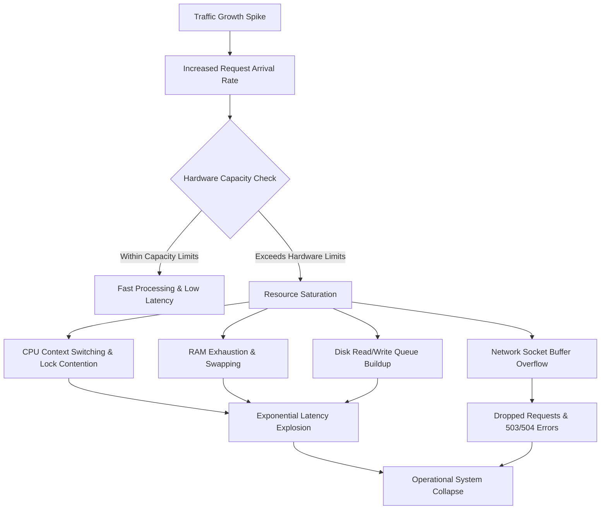

# 🚀 Day 1: Why One Server Is Never Enough

Every successful application eventually reaches a point where a single computer can no longer keep up.

This failure does not happen because your software became worse, or because your database query was missing an index. It happens because **success itself creates an entirely new class of physical engineering problems**.

Before we discuss complex architectures, frameworks, or distributed protocols, we must first understand a simple truth: **every physical computer has hard, unbreakable hardware limits**.

---

## 💥 The Problem: The 3 AM Outage Story

Imagine you launch a new social media application. 

For the first six months, everything is smooth. You deploy your application onto a single cloud server. Your database, your web server, and your file storage all run comfortably on this one machine. It handles your 500 daily users effortlessly, responding in under 50 milliseconds.

Then, an influencer shares your application overnight.

You wake up at 3:00 AM to a storm of notifications. **One million users** are attempting to open your app simultaneously.

Yesterday, everything worked flawlessly. Today:

* 🐢 **Pages load painfully slowly**: Simple feeds take 15 to 30 seconds to render.
* ⏳ **API requests time out**: Mobile clients display spinning loaders before failing with `504 Gateway Timeout`.
* 🔒 **Login fails intermittently**: Users enter valid credentials, but authentication requests drop silently.
* 📁 **File uploads take forever**: Profile picture uploads hang indefinitely and crash halfway through.
* 📈 **Dashboards show total exhaustion**: CPU utilization is pegged at 100%, RAM is completely full, and network interfaces are saturated.

You check your code. You didn't push any bugs. The code running today is identical to the code that ran perfectly yesterday.

So why is your server dying?

---

## 🔬 Why This Happens: The Physics of Silicon

To understand why your application collapsed, we must look past the software and inspect the physical hardware inside that single server.

A computer is not a magical machine with infinite capacity. It is a collection of physical silicon chips, electrical buses, and storage media. Under heavy traffic, four distinct physical bottlenecks emerge:

```
+-----------------------------------------------------------------------+
|                            SINGLE SERVER                              |
|                                                                       |
|  +-------------------+                      +-------------------+     |
|  |     CPU Core      |                      |    System RAM     |     |
|  | (Cycles Saturated)|                      | (Capacity Exhausted)    |
|  +---------+---------+                      +---------+---------+     |
|            |                                          |               |
|            +-------------------+----------------------+               |
|                                |                                      |
|  +---------+---------+         |            +---------+---------+     |
|  | Network Bandwidth |         |            | Storage Throughput|     |
|  | (Packets Dropped) |         |            | (I/O Queue Backlog)|     |
|  +-------------------+                      +-------------------+     |
+-----------------------------------------------------------------------+
```

### 1. CPU (Central Processing Unit)
The CPU isn't "slow"—it simply cannot execute an unlimited number of instructions simultaneously. If a single request requires 10 million CPU cycles to parse JSON, check session tokens, and query a database, a 4-core CPU can only process a fixed number of requests per second. When 10,000 requests arrive at the exact same millisecond, incoming work must wait in line. 

### 2. RAM (Random Access Memory)
Memory is the temporary workspace where your web server holds active HTTP connections, user sessions, and database query buffers. RAM has a strict physical capacity ceiling (e.g., 16 GB). As thousands of concurrent connections open, each connection consumes a slice of memory. Once RAM is full, the operating system either starts swapping memory to disk (slowing execution by 1,000x) or terminates processes entirely to prevent kernel panic.

### 3. Network Bandwidth
Your server connects to the internet through a physical network card (e.g., a 1 Gbps interface). Every HTTP header, JSON payload, and image transfer consumes bytes over this pipe. Once your incoming and outgoing traffic reaches 1 Gigabits per second, the physical wire is full. Additional network packets arriving at the network interface are dropped at the hardware level, resulting in connection timeouts.

### 4. Storage Throughput (Disk I/O)
Whether using traditional HDDs or modern NVMe SSDs, reading and writing data takes physical time. Disk drives have a hard limit on Input/Output Operations Per Second (IOPS) and read/write bandwidth. When hundreds of users attempt to write to the database or upload images at once, the disk read/write queue grows, causing database queries to freeze.

---

## ❌ The Wrong Solution: "Let's Just Buy a Bigger Server"

When faced with hardware saturation, the most intuitive reaction is simple:

> *"The server is out of CPU and RAM? Let's upgrade it from 4 cores to 64 cores and from 16 GB to 512 GB of RAM!"*

This approach is known as **Vertical Scaling** (or *Scaling Up*).

```
+------------------+         UPGRADE         +------------------+
|  Small Server    |  -------------------->  |   Giant Server   |
|  4 Cores, 16GB   |  (Vertical Scaling) |  64 Cores, 512GB |
+------------------+                         +------------------+
```

Vertical scaling works wonderfully at first. You click a button in your cloud console, restart the server, and suddenly your app can handle 10x more traffic.

However, relying on vertical scaling as your long-term scaling strategy eventually leads to a dead end due to five fundamental barriers:

1. **Physical Hardware Ceiling**: There is a maximum size for any single physical computer motherboard. You cannot buy a machine with 50,000 CPU cores or 100 Terabytes of RAM on a single board.
2. **Exponential Cost Curves**: Upgrading from a standard server to a high-end server increases cost linearly. But upgrading to enterprise-grade, ultra-large hardware causes costs to scale exponentially. A server twice as large often costs 10x as much.
3. **Downtime During Upgrades**: Upgrading physical RAM or CPU specs on a single host requires shutting the server down. While your server reboots, your application is completely offline.
4. **Single Point of Failure (SPOF)**: No matter how powerful or expensive your single giant server is, it still relies on one power supply, one motherboard, and one host hypervisor. If a hardware failure occurs, your entire business goes offline instantly.
5. **Diminishing Returns**: Doubling CPU cores does not double performance. Operating system context switching, memory bus locks, and thread synchronization overhead mean that a 64-core machine rarely delivers 64x the throughput of a single core.

---

## 🍽️ The Right Mental Model: The Restaurant Analogy

To grasp why single-machine scaling fails, consider a popular restaurant.

```
+----------------------------------------------------------------+
|                        ONE RESTAURANT                          |
|                                                                |
|   [ Customers Waiting Outside in a Long Queue (Socket Backlog) ]  |
|                                |                               |
|                                v                               |
|   +--------------------------------------------------------+   |
|   |                    SINGLE KITCHEN                      |   |
|   |  Chefs Bumping Into Each Other (Context Switching)     |   |
|   |  Single Oven (Disk I/O Bottleneck)                     |   |
|   |  Limited Counter Space (RAM Exhaustion)                |   |
|   +--------------------------------------------------------+   |
+----------------------------------------------------------------+
```

Imagine a small bistro with one chef and one oven. As customer demand grows, the owner hires a second chef, then a third, and installs a larger stove. Food comes out faster.

But as traffic surges further, the owner keeps adding chefs into the **same single kitchen**:

* The chefs start bumping into each other, spending more time dodging colleagues than cooking (**Context Switching Overhead**).
* All chefs wait in line to use the one main stove (**Disk I/O & Memory Lock Contention**).
* The dining area reaches physical capacity, and a massive line of hungry customers forms outside in the rain (**Network Queue Backlog**).
* Parking space runs out completely (**Bandwidth Limits**).

At this point, **cooking faster is no longer the solution**. 

The fundamental problem is expecting **one single building to feed an entire city**.

---

## ⚙️ How It Actually Works: The Architectural Escalation

When software grows, engineers move through a natural, step-by-step realization:

```
[ More Users ] 
     │
     ▼
[ More HTTP Requests ] 
     │
     ▼
[ Higher Hardware Load ] 
     │
     ▼
[ Hardware Saturation (CPU / RAM / Disk / Net) ] 
     │
     ▼
[ Severe Operational Pain (Timeouts, Crashes, Outages) ] 
     │
     ▼
💡 REALIZATION: "We don't have a programming problem anymore. We have a systems problem."
```

When your application reaches this breaking point, optimizing algorithms or writing cleaner code only yields minor gains. You cannot code your way around the laws of physics.

This realization forces engineers to step back and ask the ultimate architectural question:

> *"If one machine cannot handle the load, how can we combine multiple separate computers to work together as a single unified system?"*

---

## 🎨 Visual Explanation

### 1. ASCII Overview: Single Server Saturation Under Increasing Traffic

```
TRAFFIC LOAD              SERVER STATE                         CLIENT EXPERIENCE
---------------------------------------------------------------------------------
Light Traffic        +--------------------+                   
(100 req/sec)   ---> | CPU:  10% | RAM: 15% |  --------------->   Fast Response
                     | DISK:  5% | NET:  8% |                     (20ms latency)
                     +--------------------+                   

Peak Load            +--------------------+                   
(1,000 req/sec) ---> | CPU:  75% | RAM: 60% |  --------------->   Noticeable Delay
                     | DISK: 50% | NET: 65% |                     (250ms latency)
                     +--------------------+                   

Viral Overload       +--------------------+                   
(10,000 req/sec)---> | CPU: 100% | RAM: 99% |  --------------->   CRASH & TIMEOUTS
                     | DISK: 100%| NET: 100%|                     (504 Gateway Timeout)
                     +--------------------+                   
                               |
                        [ QUEUE OVERFLOW ]
                       (Dropped Packets)
```

### 2. Mermaid Flow Diagram: Traffic Growth to Operational Collapse



### 3. Resource Bottleneck Diagram

```
+------------------------------------------------------------------------+
|                   THE FOUR SILICON BOTTLENECKS                         |
+------------------------------------------------------------------------+
|  [ CPU LIMIT ]               |  [ MEMORY LIMIT ]                       |
|  - Fixed Instruction Cycles  |  - Finite RAM Capacity (e.g. 16GB)       |
|  - Core Count Ceiling        |  - Socket Buffer Exhaustion            |
|  - Context Switching Costs   |  - OS Thrashing & Swap Slowdowns        |
|------------------------------+-----------------------------------------|
|  [ DISK I/O LIMIT ]          |  [ NETWORK LIMIT ]                      |
|  - IOPS Bottlenecks          |  - Physical NIC Pipe (e.g. 1 Gbps)       |
|  - Read/Write Head Latency   |  - Packet Drop at Hardware Interface    |
|  - Storage Queue Backlog     |  - Max Concurrent TCP Connections       |
+------------------------------------------------------------------------+
```

### 4. Planned Graphic Assets

The following visual diagrams are specified for `assets/` to further illustrate these concepts:

* **`assets/single-server-overview.png`**: High-level architectural illustration showing incoming user client requests hitting a single host server containing unified Web, App, and Database layers.
* **`assets/resource-bottlenecks.png`**: Visual breakdown detailing the 4 core hardware resources (CPU, RAM, Storage, Network) with meters pegged in red under severe load.
* **`assets/traffic-growth.png`**: Graph plotting Request Volume vs. Latency Curve, demonstrating the sharp knee-point where latency spikes exponentially right before server collapse.
* **`assets/vertical-scaling-limits.png`**: Comparative diagram contrasting the initial linear benefits of vertical scaling against the brick wall of diminishing returns and exponential cost curves.

---

## 🏢 Real World Example: Netflix

Consider **Netflix**, which serves high-definition streaming media to hundreds of millions of concurrent viewers worldwide every single day.

```
               [ Millions of Concurrent Viewers Worldwide ]
                                   │
                                   ▼
               +---------------------------------------+
               |  Can ONE Server handle this load?     |
               |                                       |
               |  ❌ NO PHYSICAL SERVER EXISTS WITH:   |
               |   - Terabits/sec network pipes        |
               |   - Petabytes of RAM                  |
               |   - Millions of CPU cores             |
               +---------------------------------------+
```

If Netflix relied on a single server—no matter how giant or custom-built—it would fail immediately:
1. **Network Hardware Bottlenecks**: Streaming 4K video requires roughly 25 Megabits per second per user. Serving 10 million concurrent streams requires 250 Terabits per second of network output. No single motherboard or Network Interface Card (NIC) in existence can output 250 Tbps.
2. **Storage Throughput Limits**: Millions of users request different video files simultaneously. A single storage controller cannot read petabytes of video data fast enough to prevent buffering playback failures worldwide.

Because hardware physics limits the total capacity of any single machine, platforms like Netflix cannot depend on one server. They are fundamentally forced to explore architectures beyond a single node.

---

## 💻 Build It Yourself: Simulating Server Saturation

To experience hardware limits firsthand, explore the educational simulations in the [code directory](file:///d:/30_Days_of_Distributed_Systems/days/Day-01-Why-One-Server-Is-Never-Enough/code/):

### 1. [server_simulation.py](file:///d:/30_Days_of_Distributed_Systems/days/Day-01-Why-One-Server-Is-Never-Enough/code/server_simulation.py)
Simulates a multi-threaded web server receiving an increasing stream of HTTP requests:
* Demonstrates how requests pile up in the operating system's in-memory queue.
* Shows average response latency exploding as traffic approaches worker capacity.
* Triggers request drops (503 Service Unavailable) once the backlog queue reaches physical capacity.

### 2. [cpu_bound_demo.py](file:///d:/30_Days_of_Distributed_Systems/days/Day-01-Why-One-Server-Is-Never-Enough/code/cpu_bound_demo.py)
Simulates heavy CPU calculation workloads across concurrent threads:
* Measures how CPU core execution limits constrain overall request throughput.
* Demonstrates why adding requests beyond physical CPU core counts increases wait times without increasing throughput.

#### Running the Simulations:

```bash
# Navigate to the Day 1 code directory
cd days/Day-01-Why-One-Server-Is-Never-Enough/code

# Run the request queue saturation simulation
python server_simulation.py

# Run the CPU core constraint benchmark
python cpu_bound_demo.py
```

---

## ❓ Common Misconceptions

| Misconception | Reality |
| :--- | :--- |
| **"Bigger servers solve scaling problems forever."** | Vertical scaling hits a hard physical ceiling. Motherboards have finite CPU sockets, RAM slots, and bus speeds. Cost also grows exponentially. |
| **"CPU is the only resource that matters."** | Applications frequently crash due to RAM exhaustion, Network Bandwidth limits, or Disk I/O bottlenecks long before CPU reaches 100%. |
| **"More RAM automatically speeds up performance."** | Adding RAM prevents memory exhaustion crashes, but does not increase CPU instruction execution speed or Network interface throughput. |
| **"Faster SSDs eliminate all storage issues."** | SSDs are significantly faster than HDDs, but still have hard limits on IOPS and controller bandwidth under heavy concurrent write loads. |
| **"Good code alone removes hardware limits."** | Optimized algorithms reduce CPU cycles per request, but cannot bypass physical silicon bounds when total user volume increases by 1,000x. |

---

## ⚖️ Production Trade-offs: Vertical Scaling (Scaling Up)

While a single server eventually reaches a hard ceiling, vertical scaling remains a viable option in early production stages.

```
                            VERTICAL SCALING
                                   │
         ┌─────────────────────────┴─────────────────────────┐
         ▼                                                   ▼
  [ ADVANTAGES ]                                      [ DISADVANTAGES ]
  - Simple Architecture                               - Hard Ceiling on Capacity
  - No Network Overhead                               - Exponential Upgrade Costs
  - Minimal Operational Complexity                    - Single Point of Failure (SPOF)
                                                      - Downtime Required During Upgrades
```

### Advantages
* **Simplicity**: No complex networking, coordination logic, or distributed data management required.
* **Easy Management**: Single deployment target, straightforward logging, and simple monitoring.
* **Zero Network Latency Between Services**: Code, database, and cache communicate via fast local IPC or loopback memory without inter-machine network delays.

### Disadvantages
* **Hardware Ceiling**: Physical limits restrict maximum growth.
* **Expensive Upgrades**: Costs scale exponentially for top-tier enterprise hardware.
* **Downtime Risks**: Physical hardware upgrades require taking the machine offline.
* **Single Point of Failure**: Hardware crashes take down the entire application.

### Operational Considerations
* **Capacity Planning**: Monitoring CPU, Memory, Disk, and Network thresholds to predict when saturation will occur.
* **Cost Efficiency**: Knowing when upgrading a single server becomes more expensive than restructuring the application.

---

## 🎯 Key Takeaways

1. **Hardware is finite**: Every computer has strict physical limits on CPU, RAM, Disk I/O, and Network Bandwidth.
2. **Success creates engineering problems**: Outages during traffic surges are rarely caused by software bugs; they are caused by resource saturation.
3. **CPU isn't "slow"**: It simply cannot execute an infinite number of instructions at the exact same time.
4. **RAM holds active state**: Exhausting RAM forces OS swapping or process termination.
5. **Network pipes fill up**: Once network interface bandwidth is saturated, incoming packets are dropped.
6. **Disk I/O creates bottlenecks**: Storage read/write queues slow down database access under concurrent load.
7. **Vertical scaling helps initially**: Upgrading a server is easy, but quickly hits physical silicon bounds.
8. **Costs scale exponentially**: Supercomputers cost disproportionately more than standard commodity hardware.
9. **Single servers are Single Points of Failure**: One hardware glitch takes down your entire service.
10. **The shift to systems engineering**: Scaling beyond one server requires transitioning from programming problems to systems architecture problems.

---

## 🧪 Interview Questions

### 1. Why does vertical scaling eventually stop working as a long-term growth strategy?
* **Answer**: Vertical scaling hits physical hardware ceilings (maximum CPU cores and RAM slots on a single motherboard), incurs exponential hardware upgrade costs, introduces downtime risks during physical upgrades, and maintains a single point of failure.

### 2. Which hardware resource typically becomes the first bottleneck in a web application serving dynamic content?
* **Answer**: It depends on the workload. I/O-bound applications (like databases or file services) usually hit Disk IOPS or Network Bandwidth limits first. Computational workloads (like image processing or data rendering) hit CPU core limits first. Memory-heavy applications (like in-memory caching) hit RAM limits first.

### 3. Why can a perfectly optimized application with zero software bugs still fail during a traffic spike?
* **Answer**: Because optimization only minimizes resource consumption per request—it cannot eliminate it. When incoming request volume exceeds the total physical instruction execution rate or network bandwidth of the host machine, requests queue up and eventually time out.

### 4. What are the operational risks of relying on a single large server for production?
* **Answer**: The primary risk is a Single Point of Failure (SPOF). Hardware crashes, power supply failures, network card faults, or OS kernel panics result in 100% application downtime. Additionally, hardware resource upgrades require scheduled maintenance downtime.

### 5. How do engineers determine that a system has reached the limits of a single machine?
* **Answer**: By monitoring system metrics: CPU utilization hitting 100%, RAM usage nearing capacity with active swapping, Disk I/O queue depths growing, network interface saturation, and client-side metrics showing rising response latencies and connection timeouts.

---

## 📖 Further Reading

For a curated list of books, engineering blogs, official documentation, and talks on hardware bottlenecks and system capacity, see [references.md](file:///d:/30_Days_of_Distributed_Systems/days/Day-01-Why-One-Server-Is-Never-Enough/references.md).

---

### What you'll build intuition for tomorrow

When a single server reaches its physical limits, the next logical step seems obvious:

> *"Why don't we simply buy a second server and split the work between them?"*

Adding a second server feels like a simple fix. But the moment you connect a second computer to your system, you leave the predictable world of single-machine execution and enter a completely new domain of software engineering...

Tomorrow, in **Day 2: The Day Scaling Up Stops Working**, we will explore what happens when we attempt to add that second server—and why doing so introduces a whole new set of engineering challenges.
