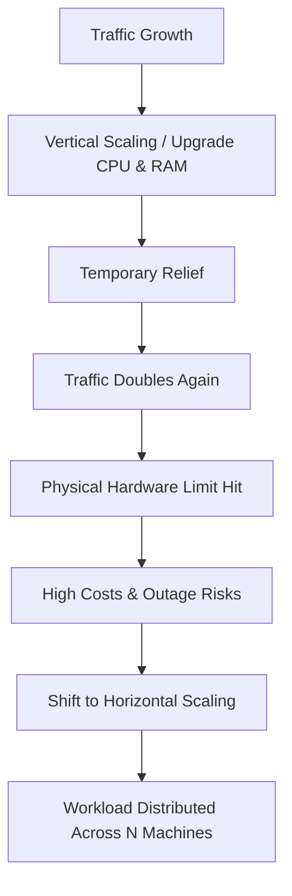

# 🚀 Day 2: The Day Scaling Up Stops Working

Every successful engineering team eventually hits a invisible wall.

In the early days of an application, scaling feels easy. When your server slows down, you simply upgrade it. You add more CPU cores, double the RAM, or swap in a faster SSD. With the click of a button in your cloud provider's dashboard, performance instantly recovers. The team celebrates, and business continues as usual.

However, this strategy carries a hidden trap: **hardware upgrades stop solving scalability problems once you reach physical and economic limits.**

Today, we will discover why relying solely on bigger hardware eventually fails, why physical silicon imposes hard boundaries, and how top engineering organizations make the fundamental mental leap from one giant machine to a cluster of smaller ones.

---

## 💥 The Problem

Let's look at a realistic production scenario.

Three months ago, your application experienced a sudden surge in traffic. Response times spiked, CPU utilization hovered near 95%, and users complained about slow page loads. Your engineering team took the obvious path: you upgraded your cloud server from a 4-core, 16 GB instance to a 16-core, 64 GB instance.

Immediately, your metrics returned to healthy green levels. Requests responded in milliseconds, CPU usage dropped to 20%, and everyone breathed a sigh of relief. Vertical scaling saved the day.

Now, fast forward to today:

* 📈 **Traffic doubles again**: Marketing runs a major campaign, and thousands of new active users join simultaneously.
* ⚡ **CPU usage spikes**: All 16 CPU cores hit 100% saturation.
* 🛑 **Memory pressure returns**: Connection pools fill up, RAM fills to capacity, and the server starts swapping memory to disk.
* 🐢 **Response times degrade**: Requests that previously took 50ms now take 4,000ms or time out entirely.
* 😠 **Customers experience delays**: Users face spinning loaders, broken checkout flows, and HTTP 504 gateway timeouts.

Your team gathers in an emergency incident room. Someone looks at the server dashboard and asks the obvious question:

> **"Should we buy an even bigger server?"**

---

## 🔬 Why This Happens

To understand why buying a bigger server is no longer working, we have to look past software and understand the physical realities of hardware. 

Computer hardware does not scale infinitely. When you double a server's physical specifications, you do **not** get double the performance. Instead, you hit diminishing returns caused by physical bottlenecks inside the computer:

```
+-----------------------------------------------------------------------------+
|                            SINGLE SERVER LIMITS                             |
|                                                                             |
|  [ CPU Scaling Limits ]        [ Memory Bus Bottlenecks ]                   |
|  - Inter-core lock overhead    - Memory channel contention                  |
|  - Amdahl's Law threshold      - High cost per GB above thresholds          |
|                                                                             |
|  [ Network Interface Ceilings ] [ Storage IOPS Saturation ]                 |
|  - 10Gbps/40Gbps NIC max       - PCI express queue bottlenecks              |
+-----------------------------------------------------------------------------+
```

### 1. CPU Scaling Limitations
Adding more CPU cores to a single motherboard introduces communication overhead. Cores must coordinate with each other when accessing shared memory. When 64 or 128 cores compete for the same system bus, cores spend time waiting on thread locks rather than executing code. Beyond a certain point, doubling your core count only improves actual throughput by a fraction.

### 2. Memory Limitations
RAM modules sit on physical motherboard channels. As you increase RAM capacity (e.g., from 128 GB to 1.5 TB), the motherboard requires multiple physical processor sockets (NUMA architecture). Transferring data between memory slots attached to different physical CPUs incurs latency penalties. Furthermore, enterprise-grade high-density RAM becomes exponentially expensive per gigabyte.

### 3. Network Interface Limits
Every server connects to the network via a physical Network Interface Card (NIC). If your card handles up to 10 Gigabits per second, that is an absolute ceiling. Regardless of how many idle CPU cores you have, if your network card is saturated with incoming and outgoing data, additional network packets are dropped at the hardware layer.

### 4. Storage Throughput
Even fast NVMe SSDs have physical limits on Input/Output Operations Per Second (IOPS) and total PCI Express bus throughput. When thousands of concurrent user requests attempt to read and write to disk simultaneously, the disk queue overflows, freezing database operations.

### 5. Physical Hardware Ceilings
Motherboard manufacturers cannot fit unlimited CPU sockets or RAM slots onto a single physical board. There is a hard physical limit to the largest single machine you can purchase on Earth.

### 6. Cost Versus Benefit
Server pricing is non-linear. Upgrading from a standard 8-core server to a 16-core server might cost double. But upgrading to a specialized 128-core enterprise mainframe with 2 TB of RAM can cost **15x to 20x more**. You pay astronomical prices for tiny performance improvements.

---

## ❌ The Wrong Solution

When performance degrades, the default instinct for many engineering teams is to repeat what worked in the past:

1. Upgrade the CPU to the next tier.
2. Add more RAM.
3. Attach faster SSD storage.
4. Repeat when traffic grows.

This habit of continuously beefing up a single machine is called **Vertical Scaling** (or *Scaling Up*).

```
+-------------------+        UPGRADE HARDWARE        +-------------------+
|   Small Server    |  --------------------------->  |   Giant Server    |
|   4 Cores, 16 GB  |      (Vertical Scaling)    |  64 Cores, 256 GB |
+-------------------+                                +-------------------+
```

While vertical scaling is a great quick fix for early-stage applications, relying on it as your long-term architecture strategy leads to severe consequences:

* 💰 **Extremely Expensive**: Enterprise monster servers carry massive price premiums that drain engineering budgets.
* ⚠️ **Operationally Risky**: Upgrading physical RAM or CPU specs on a single server requires shutting the machine down. Every hardware upgrade causes planned application downtime.
* 🛠️ **Difficult to Maintain**: Large single servers often run multiple competing background tasks, making memory leaks and CPU spikes hard to isolate.
* 🚧 **Limited by Hardware Availability**: You will eventually hit the absolute top spec available from cloud providers or hardware vendors. When traffic doubles after that, you have nowhere left to upgrade.

Vertical scaling solves capacity problems for a month or two, but it guarantees an architectural dead end.

---

## 🍽️ The Right Mental Model: The Restaurant Analogy

To break out of the vertical scaling trap, we need a better mental model.

Imagine you open a small local burger restaurant:

```
+--------------------------------------------------------+
|                 SINGLE MEGA-RESTAURANT                 |
|  - 1 Giant Kitchen (Crowded cooks bumping into each other)|
|  - 1 Entrance Door (Huge line of waiting customers)   |
|  - 1 Order Counter (Bottlenecked cashier)              |
+--------------------------------------------------------+
```

As your restaurant becomes popular, the dining room fills up and orders back up in the kitchen. 

To handle more customers, you start making the existing building bigger. You buy a larger stove, install a giant refrigerator, and squeeze ten more cooks into the kitchen. 

For a while, this works. But soon:
* The kitchen becomes so crowded that cooks bump into each other and waste time waiting for counter space.
* The single front door cannot physically fit more than two people walking through at once.
* If the power goes out in that single building, **every single customer in the city goes hungry.**

### The Breakthrough Shift

Instead of endlessly expanding that single mega-restaurant building, what if you opened **four separate branch restaurants** across different neighborhoods in the city?

```
+----------------+   +----------------+   +----------------+   +----------------+
|  Branch 1      |   |  Branch 2      |   |  Branch 3      |   |  Branch 4      |
|  Small Kitchen |   |  Small Kitchen |   |  Small Kitchen |   |  Small Kitchen |
+----------------+   +----------------+   +----------------+   +----------------+
```

Each restaurant has its own modest kitchen, its own doors, and its own staff. Customers naturally split up and visit the branch closest to them. 

Now look at what happens:
* If customer traffic doubles city-wide, you don't need to build a supercomputer kitchen. You simply open Branch 5 and Branch 6.
* If Branch 2 experiences a kitchen fire, Branches 1, 3, and 4 continue serving customers without interruption.
* Building ten standard branch kitchens is far cheaper than constructing one mega-skyscraper restaurant.

### Relating This Back to Software

Software engineering underwent this exact same mental shift:

Engineers stopped asking:  
**"How can one machine do more work?"**

And started asking:  
**"How can many machines share the work?"**

This shift—spreading work across multiple independent machines—is called **Horizontal Scaling** (or *Scaling Out*).

---

## 🔄 How It Actually Works

The transition from single-server thinking to multi-server architecture follows a predictable engineering progression:

```
[ 1. Start with One Server ] 
         │
         ▼
[ 2. Increase Server Size (Vertical Scaling) ] 
         │
         ▼
[ 3. Gain Temporary Relief ] 
         │
         ▼
[ 4. Traffic Doubles Again & Hardware Costs Explode ] 
         │
         ▼
[ 5. Single Point of Failure Causes Severe Outage ] 
         │
         ▼
[ 6. Rethink Architecture: Adopt Horizontal Scaling ] 
         │
         ▼
[ 7. Spread Workload Across Multiple Commodity Servers ]
```

Conceptually, horizontal scaling means that instead of buying one $5,000/month server with 96 CPU cores, you deploy **ten $50/month commodity servers** with 4 CPU cores each.

When a customer makes a request, the request is directed to one of your available machines. Because each machine only handles a fraction of the total traffic, every server operates comfortably within its CPU, memory, and network limits.

If traffic doubles next month, you don't suffer an emergency outage or migrate to specialized mainframes. You simply launch ten additional commodity servers. System capacity grows linearly with your needs.

---

## 🎨 Visual Explanation

### 1. ASCII Architecture Diagram

```
VERTICAL SCALING (Scaling Up)
-----------------------------
   Traffic Spike
        │
        ▼
┌──────────────┐
│  ONE GIANT   │  ◄── Hard Physical Ceiling!
│  SUPER-SERVER│  ◄── Saturated CPU & RAM
│ ($4,800/mo)  │  ◄── Single Point of Failure
└──────────────┘

HORIZONTAL SCALING (Scaling Out)
--------------------------------
           Traffic Spike
                 │
   ┌─────────────┼─────────────┐
   ▼             ▼             ▼
┌──────┐      ┌──────┐      ┌──────┐
│Node 1│      │Node 2│      │Node 3│  ◄── Cheap Commodity Servers ($50/mo each)
└──────┘      └──────┘      └──────┘  ◄── Workload Shared Evenly
                                      ◄── Add Node 4, 5, 6 as traffic grows
```

### 2. Mermaid Lifecycle Diagram



### 3. Comparison Diagram

```
+---------------------------+-----------------------------------+-----------------------------------+
| Dimension                 | Vertical Scaling (Scaling Up)     | Horizontal Scaling (Scaling Out)  |
+---------------------------+-----------------------------------+-----------------------------------+
| Scaling Direction         | Upward (Bigger hardware specs)    | Outward (More server instances)   |
| Hardware Cost             | Non-linear / Exponential          | Linear & Predictable              |
| Scaling Limit             | Hard hardware ceiling             | Virtually limitless               |
| Availability              | Low (Single Point of Failure)     | High (Fault tolerant across nodes)|
| Operational Complexity    | Low (One machine to manage)       | Higher (Multiple nodes to manage) |
| Hardware Upgrade Method   | Requires server reboot/downtime   | Add nodes dynamically with 0 down |
+---------------------------+-----------------------------------+-----------------------------------+
```

### 🖼️ Architecture Image Descriptions (Assets)

Inside the [assets/](file:///d:/30_Days_of_Distributed_Systems/days/Day-02-The-Day-Scaling-Up-Stops-Working/assets) directory, the following conceptual diagrams illustrate these principles:

1. **`assets/vertical-scaling.png`**  
   *Illustration showing a single server tower being stacked with increasingly heavy CPU chips and RAM sticks until the motherboard cracks under physical load, labeled with skyrocketing dollar signs and a "Hardware Ceiling" barrier.*
2. **`assets/horizontal-scaling.png`**  
   *Illustration showing a clean row of identical, modest commodity server nodes lined up side by side, connected in parallel, effortlessly sharing a stream of incoming user requests.*
3. **`assets/scaling-comparison.png`**  
   *Infographic comparing Vertical vs. Horizontal scaling across cost curves, availability risks, and capacity limits side by side.*
4. **`assets/restaurant-analogy.png`**  
   *A two-panel comic illustration: Panel 1 shows a single overcrowded, chaotic burger restaurant with a long line out the door; Panel 2 shows four smaller, neat neighborhood branch restaurants serving happy customers efficiently.*

---

## 🌍 Real World Example: Google Search

In the late 1990s, web search engines like AltaVista and Yahoo relied on expensive enterprise supercomputers and mainframes (such as multi-million-dollar Sun Microsystems servers) to index the web. 

When Google was founded, web traffic and the size of the internet were growing exponentially. Google's founders realized that purchasing larger mainframes would quickly bankrupted the company. No single supercomputer on Earth could store and query the entire World Wide Web.

```
 Traditional View (1990s):      Google's Architectural Paradigm Shift:
 ┌───────────────────────┐      ┌────────┐ ┌────────┐ ┌────────┐ ┌────────┐
 │ Multi-Million-Dollar  │  vs  │ Cheap  │ │ Cheap  │ │ Cheap  │ │ Cheap  │
 │ Enterprise Mainframe  │      │ Server │ │ Server │ │ Server │ │ Server │
 └───────────────────────┘      └────────┘ └────────┘ └────────┘ └────────┘
```

Instead of buying ultra-expensive enterprise servers, Google pioneered an architecture built entirely out of **thousands of standard, low-cost commodity PCs**. 

By writing software capable of spreading search queries across hundreds of cheap machines in parallel, Google achieved unprecedented search speeds at a fraction of the hardware cost. This fundamental shift proved to the tech industry that horizontal cluster architectures beat single mainframes.

---

## 💻 Build It Yourself: Interactive Simulations

To experience the practical differences between vertical and horizontal scaling, explore the two Python simulations inside the [code/](file:///d:/30_Days_of_Distributed_Systems/days/Day-02-The-Day-Scaling-Up-Stops-Working/code) directory:

### 1. Vertical Scaling Simulation
The script [vertical_scaling_simulation.py](file:///d:/30_Days_of_Distributed_Systems/days/Day-02-The-Day-Scaling-Up-Stops-Working/code/vertical_scaling_simulation.py) models a single server undergoing hardware upgrades under increasing request traffic.

Run the simulation:
```bash
python code/vertical_scaling_simulation.py
```

*What you'll observe*: Upgrading from a 2-core to a 48-core server brings initial relief. However, when traffic hits peak levels (7,500 req/sec), even a 96-core Monster Server costing $4,800/month becomes saturated, experiences severe latency spikes, and drops requests.

### 2. Horizontal Scaling Demo
The script [horizontal_scaling_demo.py](file:///d:/30_Days_of_Distributed_Systems/days/Day-02-The-Day-Scaling-Up-Stops-Working/code/horizontal_scaling_demo.py) models spreading that exact same 7,500 req/sec workload across a cluster of $50/month commodity nodes.

Run the demo:
```bash
python code/horizontal_scaling_demo.py
```

*What you'll observe*: Distributing traffic across 10 or 15 commodity nodes lowers monthly infrastructure costs by 90% while keeping latency fast and predictable (~48ms vs >800ms timeouts).

---

## ❓ Common Misconceptions

### 1. "Bigger servers solve scalability permanently."
**FALSE.** Vertical scaling always hits a physical ceiling defined by motherboard architecture, memory channel limits, and network interface cards. Additionally, costs scale exponentially rather than linearly.

### 2. "Horizontal scaling is always cheaper."
**FALSE.** For small applications with low traffic, running one single $20/month server is much simpler and cheaper than running 5 distributed servers. Horizontal scaling becomes cost-effective only when workloads exceed standard single-machine capacities.

### 3. "Adding more CPU cores automatically speeds up every application."
**FALSE.** If your software application is single-threaded or constrained by sequential business logic, additional CPU cores sit idle. Code must be designed to execute tasks independently to benefit from multi-core or multi-machine environments (Amdahl's Law).

### 4. "Vertical scaling is bad engineering practice."
**FALSE.** Vertical scaling is often the **right first choice**. It is simple, requires zero architectural changes, and keeps operational overhead low. Good engineers scale vertically first until it is no longer cost-effective or physically viable, then transition to horizontal scaling.

---

## ⚖️ Production Trade-offs

| Architectural Model | Advantages | Disadvantages |
| :--- | :--- | :--- |
| **Vertical Scaling** *(Scaling Up)* | • **Simple Architecture**: No need to worry about multi-node state or distributed coordination.<br>• **Easy Deployment**: Code runs on one machine just like local development.<br>• **Low Operational Overhead**: Only one operating system and host to monitor. | • **Hard Hardware Ceilings**: Bound by physical motherboards.<br>• **Single Point of Failure**: Hardware crash takes down entire app.<br>• **Downtime Upgrades**: Upgrading specs requires rebooting.<br>• **Exponential Cost**: High-end servers carry extreme price markups. |
| **Horizontal Scaling** *(Scaling Out)* | • **Unlimited Growth**: Capacity scales by simply adding more machines.<br>• **High Availability**: If one server crashes, remaining servers keep running.<br>• **Linear Cost Efficiency**: Uses low-cost, standard commodity servers.<br>• **Zero Downtime**: Add or remove nodes without taking app offline. | • **Increased Architectural Complexity**: Software must support running across multiple nodes.<br>• **Operational Overhead**: Managing logging, monitoring, and deployments across many machines.<br>• **Coordination Challenges**: Sharing data and state requires careful design. |

---

## 🎯 Key Takeaways

1. Every physical computer has hard hardware limits across CPU, RAM, Network NIC, and Disk IOPS.
2. Vertical scaling (*scaling up*) means upgrading a single machine's hardware components.
3. Vertical hardware pricing is non-linear—costs increase exponentially while performance gains diminish.
4. Upgrading vertical hardware on a single server introduces planned maintenance downtime.
5. A single large server remains a Single Point of Failure (SPOF), no matter how expensive it is.
6. Horizontal scaling (*scaling out*) means sharing workloads across multiple smaller machines.
7. The core mental shift is moving from *"How can one machine do more?"* to *"How can many machines share work?"*
8. Horizontal scaling allows linear cost growth using low-cost commodity hardware.
9. Vertical scaling is often the right choice early on; horizontal scaling is necessary for long-term scale.
10. Buying bigger servers is only a temporary solution.

---

## 🧪 Interview Questions

### Q1: Why does vertical scaling eventually stop working for high-growth applications?
**Answer:** Vertical scaling hits physical hardware boundaries (CPU socket limits, memory bus bandwidth limits, and NIC throughput ceilings). Additionally, enterprise hardware costs grow exponentially, and single-server architectures suffer from maintenance downtime and single points of failure.

### Q2: What is Amdahl's Law, and how does it relate to upgrading server hardware?
**Answer:** Amdahl's Law states that the theoretical speedup of a program is limited by its sequential (non-parallelizable) portion. Adding more CPU cores yields diminishing returns if thread synchronization, lock contention, or sequential task dependencies dominate the workload.

### Q3: When is vertical scaling still the recommended engineering choice?
**Answer:** Vertical scaling is ideal when application traffic is low-to-moderate, when rapid delivery is prioritized over complex infrastructure, or when the workload relies heavily on simple ACID transactions on a single database where multi-node coordination overhead is unnecessary.

### Q4: What is the main economic advantage of horizontal scaling over vertical scaling at massive scale?
**Answer:** Horizontal scaling utilizes standardized, low-cost commodity hardware where cost scales linearly with node count. In contrast, ultra-large vertical servers carry exponential pricing premiums due to specialized motherboards and enterprise components.

### Q5: What new engineering challenges emerge when you transition from 1 server to 10 servers?
**Answer:** Transitioning to multiple servers introduces operational complexity (deploying code across multiple targets, aggregating logs/metrics), architectural complexity (handling multi-node state), and request distribution challenges (deciding which machine handles incoming requests).

---

## 📖 Further Reading

To deepen your understanding of physical hardware limits and scaling trade-offs, explore our curated reading list in [references.md](file:///d:/30_Days_of_Distributed_Systems/days/Day-02-The-Day-Scaling-Up-Stops-Working/references.md), including:

* **Designing Data-Intensive Applications** (Chapter 1: Reliable, Scalable, and Maintainable Applications)
* **Google SRE Book** (Chapter 2: Empowering SREs & Infrastructure Scale)
* **Google's Original Cluster Architecture Research Paper**

---

## 🔮 What You'll Build Intuition for Tomorrow

Now that we understand why work must be shared across multiple servers, a fundamental new challenge appears:

> **Once you have multiple servers running side by side, how does incoming user traffic know which server should handle the next request? And what happens when one of those servers suddenly dies mid-operation?**

Tomorrow, on **Day 3: When Servers Die**, we will explore what happens when hardware fails in a multi-server world and build intuition for keeping systems alive when individual machines fail!
