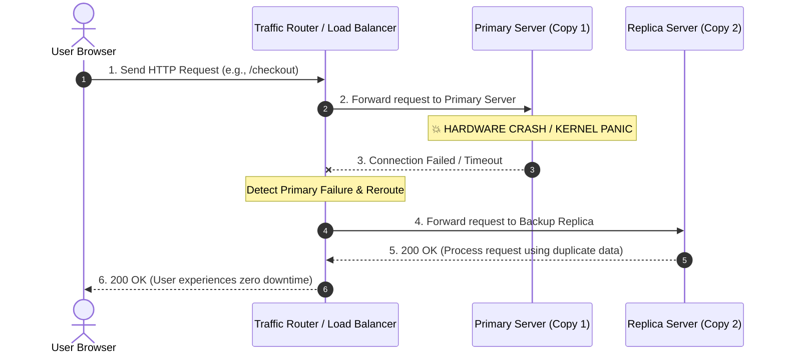

# 🚀 Day 3: What Happens When Your Server Dies?

Server failures in production are not a matter of *if*—they are a matter of *when*.

Every physical computer running in a data center will eventually crash. A power supply burns out, a solid-state drive wears out, a kernel panics, or a network fiber cable gets cut by physical construction. The real question in software engineering isn't whether a machine will fail, but **what happens to your application and business when it does**.

---

## 💥 The Problem: The 2 AM Emergency

It is 2:00 AM on a Tuesday.

You are fast asleep when your phone vibrates violently on your nightstand. It is an urgent high-severity alert from your monitoring platform:

> **ALERT [CRITICAL]:** `Primary Application Node (10.0.0.15)` is unreachable. Ping timeout. HTTP 503 errors spiking to 100%.

You scramble to open your laptop. You try SSHing into the machine. The terminal hangs indefinitely: `Connection timed out`. You open your company's web app in a browser, and you are greeted by a cold, blank error screen: `502 Bad Gateway`.

The only server running your application has completely crashed.

Within minutes, the blast radius of this single machine failure ripples through the entire company:

* 🔐 **Login Failures**: Customers opening the app cannot authenticate. Existing sessions are instantly kicked out.
* 🛒 **Orders Dropped**: Shopping carts are abandoned at checkout. Payments fail mid-flight, leaving transactions stuck in unknown states.
* ⏳ **API Timeouts**: Mobile applications and third-party partner integrations freeze up and time out.
* 📞 **Support Tickets Exploding**: Angry user emails and social media complaints surge into customer support channels.
* 🚨 **Engineers Rushing**: Developers and ops engineers are dragged into an emergency war room, frantically attempting to reboot hardware or restore access.

Take a moment to ask yourself the central question of single-server architecture:

> **What happens if everything your business relies on depends on one single machine?**

When that single machine dies, your entire business dies with it.

---

## 🔬 Why This Happens: Physical Machines Fail

To build resilient software, we must strip away the illusion that cloud servers are magical, invincible abstractions. Servers are physical machines sitting in metal racks inside giant data centers.

```
+------------------------------------------------------------------+
|                   THE REALITY OF HARDWARE                        |
|                                                                  |
|   [ Motherboard ] ---> Electronics degrade over time             |
|   [ SSD Storage ] ---> Flash memory blocks wear out              |
|   [ Power Supply] ---> Capacitors short-circuit & burn out       |
|   [ RAM Sticks  ] ---> Cosmic rays cause bit flips & panics      |
|   [ Network Cable]---> Physical switches & routers drop traffic   |
|   [ Human Factor]---> Misconfigurations & bad deploys happen     |
+------------------------------------------------------------------+
```

Servers fail constantly for very straightforward physical and operational reasons:

* ⚡ **Hardware Faults**: Power supplies pop, memory chips experience bit flips, and motherboards fail.
* 💾 **Disk Failures**: Solid-state drives (SSDs) and hard drives have finite lifespans. They corrupt data or suffer total controller death without warning.
* 🔌 **Power Outages**: Data center backup generators fail, or circuit breakers trip under heavy electrical load.
* 💥 **Operating System Crashes**: Linux kernel panics, out-of-memory (OOM) killer terminations, or unhandled driver bugs halt execution.
* 🌐 **Network Failures**: Top-of-rack switches fail, DNS routes break, or physical fiber lines get damaged.
* 🙋 **Human Mistakes**: An engineer accidentally runs `sudo reboot`, pushes a faulty config file, or deletes a critical system volume.

The fundamental engineering realization is this:

> **Failure is normal. Expecting hardware to last forever is a fantasy. Planning for failure is engineering.**

---

## ❌ The Wrong Solution: "Let's Just Buy a Immortally Expensive Server"

When beginner developers first experience a server crash, their immediate instinct is often to throw money at the hardware layer:

1. *"Let me buy enterprise-grade hardware with dual power supplies!"*
2. *"Let me pay for ultra-expensive cloud instances with guaranteed 99.99% hardware uptime!"*
3. *"Let instance monitoring replace faulty disks automatically within 30 minutes!"*
4. *"Let's just cross our fingers and hope failures never happen!"*

Why does none of this solve the core problem?

Because **no single machine is immortal**.

Even an enterprise server costing $100,000 that has redundant power supplies and gold-plated components still resides in one physical location, connected to one rack switch, running one operating system kernel. If a localized fire, cooling loss, rack power loss, or kernel panic occurs, that $100,000 server goes offline just as completely as a $20 virtual machine.

Hoping hardware won't fail is not a strategy. True reliability cannot be bought through expensive hardware; it must be designed into software architecture.

---

## 🏛️ The Right Mental Model: The Central Library Analogy

To understand how software architects solve this problem, consider a simple real-world analogy: **a community library**.

```
+-------------------------------------------------------------------+
|                        THE LIBRARY ANALOGY                        |
|                                                                   |
|  SINGLE COPY SCENARIO:                                            |
|  [ Rare Book ] ---> Stored in 1 room. Book gets damaged/stolen.   |
|                 ---> RESULT: Nobody in the city can read it!      |
|                                                                   |
|  REPLICATED COPIES SCENARIO:                                      |
|  [ Copy #1 ] (Room A)   [ Copy #2 ] (Room B)   [ Copy #3 ] (Room C) |
|       |                      |                      |             |
|    (Crashes/Damaged)   (Reader served!)       (Reader served!)   |
|                 ---> RESULT: Library stays open & functional!     |
+-------------------------------------------------------------------+
```

Imagine a city library that owns **only one physical copy** of an extremely popular reference manual.

* If a patron spills coffee on that single copy, or if it gets misplaced, or if the room it is kept in is locked for maintenance...
* **Nobody in the entire city can read that book.** The library's service for that book is 100% unavailable.

Now imagine a different library policy:

* The library keeps **three identical copies** of the book in three separate rooms across the building.
* If copy #1 gets damaged or locked away, the librarian simply hands a patron copy #2 or copy #3 from another room.
* The reader gets the exact information they needed without delay. The library never stops serving its community.

Connecting this directly to software architecture:

> **Replication is the practice of keeping multiple identical copies of your application state on separate physical machines so that if one machine disappears, your users never notice.**

Notice how simple this mental model is: we are not changing how the book is written; we are simply storing extra copies so that the loss of one copy is no longer a catastrophe.

---

## ⚙️ How It Actually Works: Transitioning From Single to Replicated

Let's walk through the mental evolution of engineering a system that survives server loss:

```
Step 1: One Server Stores All Data
        [ User Request ] ---> [ Primary Server (1 Copy) ]
        
Step 2: Primary Server Fails
        [ User Request ] ---> [ Primary Server (CRASHED 💥) ] ---> ❌ Downtime!

Step 3: Engineers Add Backup Copies (Replication)
        [ User Request ] ---> [ Primary Server (CRASHED 💥) ]
                                    |
                                    v (Reroute Traffic)
                             [ Replica Server (Copy 2) ] ---> ✅ Success!
```

1. **Initial State**: You launch with a single server handling incoming requests and holding application data.
2. **The Failure**: That server suffers a physical hardware fault and shuts down.
3. **The Outage**: All incoming traffic hits a dead endpoint. Your application goes down completely.
4. **The Realization**: Engineers realize that relying on a single copy makes hardware failure a business-ending threat.
5. **The Redundant Design**: Instead of running one server, you launch a second machine (a **Replica**) that holds duplicate copies of the application data and code.
6. **The Continuous Service**: When the primary machine dies, incoming traffic is redirected to the replica machine. The backup machine continues serving users as if nothing happened.

Notice what we are *not* discussing yet: we aren't worrying about how the copies stay synced in real-time or how consensus is reached. Those are challenges we will unlock later. Today, focus purely on the core intuition: **multiple copies turn a catastrophic outage into a minor background event.**

---

## 🖼️ Visual Explanation

### ASCII Diagram: Single Server Failure vs. Replicated Resilience

```
======================================================================
SCENARIO A: SINGLE SERVER (SINGLE POINT OF FAILURE)
======================================================================

 [ User ] ----( HTTP Request )----> [ Server A ] (ONLY COPY)
                                          |
                                    [ CRASH 💥 ]
                                          |
 [ User ] <---( 503 Service Unavailable )-+ (TOTAL OUTAGE)


======================================================================
SCENARIO B: REPLICATED SERVERS (HIGH AVAILABILITY)
======================================================================

                                    +--> [ Server A ] (CRASHED 💥)
                                    |
 [ User ] ----( HTTP Request )------+ (Auto-Failover / Reroute)
                                    |
                                    +--> [ Server B ] (REPLICA COPY)
                                                |
                                       (Processes Request)
                                                |
 [ User ] <-------( 200 OK Success )------------+ (ZERO DOWNTIME)
```

---

### Mermaid Sequence Diagram: Automatic Failover to Replica



---

### Failure Timeline: Single Copy vs. Replicated Copy

```
SINGLE SERVER TIMELINE:
[ Normal Operation ] -------> [ Server Crash 💥 ] -------> [ Total Business Outage 🛑 ]
(100% Availability)          (0% Availability)           (Waiting hours for manual reboot)

REPLICATED TIMELINE:
[ Normal Operation ] -------> [ Server Crash 💥 ] -------> [ Replica Serves Traffic 🟢 ]
(Primary handling requests)  (Traffic rerouted)          (100% Continuous Availability)
```

---

### Specified Image Assets (Inside `assets/`)

The following diagram assets illustrate key concepts for this lesson:

* **`assets/single-server-failure.png`**: A architectural diagram illustrating a single application server crashing due to a power failure, showing red error indicators propagating to end-user clients.
* **`assets/replication-overview.png`**: A high-level visual showing traffic being distributed across a primary server node and an active replica node storing secondary data copies.
* **`assets/failure-recovery.png`**: A timeline graphic contrasting the downtime curve of a single-node outage against the instant failover recovery curve of a replicated cluster.
* **`assets/library-analogy.png`**: An intuitive illustration depicting a single rare book being destroyed in a library versus multiple duplicate copies placed in separate reading rooms.

---

## 🌍 Real-World Example: How Google Survives Daily Server Deaths

Think about Google's search engine, Gmail, or YouTube.

Google operates millions of physical servers across global data centers. At Google's scale, physical hardware failure is not a rare occurrence—it is a continuous, second-by-second certainty. On any given day inside Google's infrastructure:

* Hundreds of hard drives and SSDs break down.
* Dozens of physical rack servers freeze or lose power.
* Network switches drop interfaces unexpectedly.

Yet, when you search on Google or watch a YouTube video, you never see an error page saying *"Sorry, the server storing this video burned out its power supply."*

Why?

Because **Google never relies on a single server for anything**. Every piece of data, every microservice, and every index is replicated across multiple physical machines in different server racks and data centers. When a server running Google Search dies, Google's infrastructure instantly routes your query to another machine holding a replica of that service. 

To the end user, Google appears 100% online, even while hundreds of underlying machines are dying every single hour.

---

## 💻 Build It Yourself: Simulating Server Death & Replication Failover

To solidify your intuition, we have built two simple Python educational simulations inside the [`code/`](file:///d:/30_Days_of_Distributed_Systems/days/Day-03-When-Servers-Die/code) directory:

1. **[`single_server_failure.py`](file:///d:/30_Days_of_Distributed_Systems/days/Day-03-When-Servers-Die/code/single_server_failure.py)**: Demonstrates what happens when a system relies on a single server node. Once the node crashes, 100% of user requests drop, causing total business downtime.
2. **[`simple_replication_demo.py`](file:///d:/30_Days_of_Distributed_Systems/days/Day-03-When-Servers-Die/code/simple_replication_demo.py)**: Demonstrates how maintaining a backup replica node allows traffic to failover seamlessly when the primary node crashes.

### Running the Code

Open your terminal, navigate to the repository root, and run:

```bash
# Test 1: See the total failure of a single-server setup
python days/Day-03-When-Servers-Die/code/single_server_failure.py

# Test 2: See how a replicated backup copy preserves availability
python days/Day-03-When-Servers-Die/code/simple_replication_demo.py
```

### Code Highlight: Routing to a Backup Copy

In `simple_replication_demo.py`, observe how straightforward the failover logic is at a conceptual level:

```python
class ReplicatedSystem:
    def __init__(self):
        self.primary = ServerNode("Primary-Server-01")
        self.replica = ServerNode("Replica-Server-02")

    def route_request(self, request_id, action):
        # 1. Try Primary Server first
        if self.primary.is_alive:
            return self.primary.process_request(request_id, action)

        # 2. Seamless Fallback to Replica Copy if Primary is DEAD
        print(f"[WARN] Primary is down! Rerouting request #{request_id} to Replica...")
        if self.replica.is_alive:
            return self.replica.process_request(request_id, action)

        # 3. Complete system failure only if ALL copies are dead
        return False
```

Executing these scripts will give you empirical proof of why having a backup copy transforms system resilience.

---

## ⚠️ Common Misconceptions

When learning about replication for the first time, it is easy to draw incorrect conclusions. Let's clear up four major misunderstandings:

| Misconception | The Engineering Reality |
| :--- | :--- |
| **"Replication prevents server crashes."** | **False.** Replication does not stop servers from dying. Hardware will still crash. Replication simply ensures your business stays online *when* they die. |
| **"Buying expensive hardware eliminates the need for replicas."** | **False.** High-end hardware still suffers power outages, kernel panics, and human operational errors. |
| **"Having one backup copy solves every availability problem."** | **False.** What happens if the backup copy dies too? Or what happens if both copies receive conflicting edits? A backup copy is just the first step. |
| **"Replication automatically keeps all copies perfectly identical."** | **False.** Copying data across network cables takes physical time. Keeping copies identical is one of the hardest problems in computer science. |

---

## ⚖️ Production Trade-offs

Adding replica servers is not a free lunch. Software engineering is entirely about balancing trade-offs:

### 🟢 Advantages
* **Higher Availability**: System uptime remains high even during sudden hardware crashes.
* **Reduced Business Downtime**: Prevents revenue loss, customer frustration, and SLA penalties.
* **Fault Tolerance**: The system gracefully tolerates individual component deaths.
* **Improved Business Continuity**: Maintenance and hardware upgrades can be performed on one node while replicas serve live traffic.

### 🔴 Disadvantages & Complexities
* **Higher Infrastructure Costs**: Running 2 or 3 servers instead of 1 doubles or triples your cloud hardware bill.
* **Additional Storage Overhead**: Storing multiple copies of data requires 2x–3x total disk capacity.
* **Increased Operational Complexity**: You now have to monitor, configure, and manage multiple servers instead of one.
* **Keeping Copies Synchronized**: When data changes on machine A, how and when does machine B find out? (We will explore this next!).

---

## 🎯 Key Takeaways

1. **Hardware is mortal**: Every server, disk, power supply, and network switch will eventually fail in production.
2. **Single point of failure (SPOF)**: Relying on one server means a single hardware fault causes a complete business outage.
3. **Failure is an engineering problem**: You cannot prevent physical hardware from breaking, but you can build software that survives it.
4. **Vertical hardware upgrades don't eliminate crash risk**: Expensive servers still suffer kernel panics, rack power outages, and human errors.
5. **The core intuition of replication**: Storing multiple copies of your application state ensures that when one copy disappears, another copy takes over.
6. **The library analogy**: Storing duplicate books in different rooms ensures readers can always access knowledge even if one book gets damaged.
7. **Business continuity**: Redundancy transforms catastrophic 2 AM crashes into minor background events.
8. **Replication introduces cost & complexity**: Redundancy requires more hardware, more monitoring, and extra network traffic.
9. **Replication does not mean instant perfection**: Having multiple copies creates a brand-new engineering challenge: keeping those copies identical.
10. **The foundational rule**: *"If there is only one copy, failure becomes a business problem."*

---

## 🙋 Interview Questions

### Q1: Why isn't upgrading to a single, extremely powerful enterprise server sufficient for high availability?
**Answer:** No matter how powerful or expensive a single server is, it remains a Single Point of Failure (SPOF). It still relies on one physical location, one rack power supply, one motherboard, and one OS kernel. If any of those components fail, or if an engineer misconfigures the host, 100% of the application goes offline. High availability requires redundancy across separate independent machines.

### Q2: What business risks does an organization take by storing only one copy of customer data?
**Answer:** Storing only one copy exposes the business to catastrophic data loss, total service unavailability during hardware crashes, SLA violation penalties, loss of customer trust, and severe financial impact during prolonged outages.

### Q3: How does replication improve system reliability?
**Answer:** Replication improves reliability by eliminating single points of failure. By keeping redundant copies of data and services on separate physical nodes, the system can automatically reroute user requests to an active replica if the primary node fails, maintaining continuous uptime.

### Q4: Does implementing replication eliminate server failures?
**Answer:** No. Replication does not stop physical machines, disks, or networks from failing. Instead, replication changes the *impact* of those failures—transforming what would have been a total system outage into a transparent, background failover event.

### Q5: What new operational challenges are introduced when moving from one server to multiple replicated servers?
**Answer:** Moving to multiple replicated servers increases infrastructure cost (paying for extra machines and storage), adds operational complexity (monitoring multiple nodes and handling failover routes), and introduces the fundamental challenge of data synchronization across nodes.

---

## 📖 Further Reading

To deepen your understanding of single points of failure, redundancy design, and real-world outage case studies, check out our curated resources in **[`references.md`](file:///d:/30_Days_of_Distributed_Systems/days/Day-03-When-Servers-Die/references.md)**.

---

## 🔮 What You'll Build Intuition for Tomorrow

Now you understand why replication is necessary: **if there is only one copy, failure becomes a business problem.**

So we decide to create multiple copies of our data across different servers.

But this immediately unlocks a brand-new, mind-bending problem:

> **If two copies of the same data exist on two different machines, how do we make sure they don't become different when users update them?**

Tomorrow, in **Day 4**, we will explore **The Replication Problem**—and experience firsthand what happens when duplicate copies drift out of sync!
