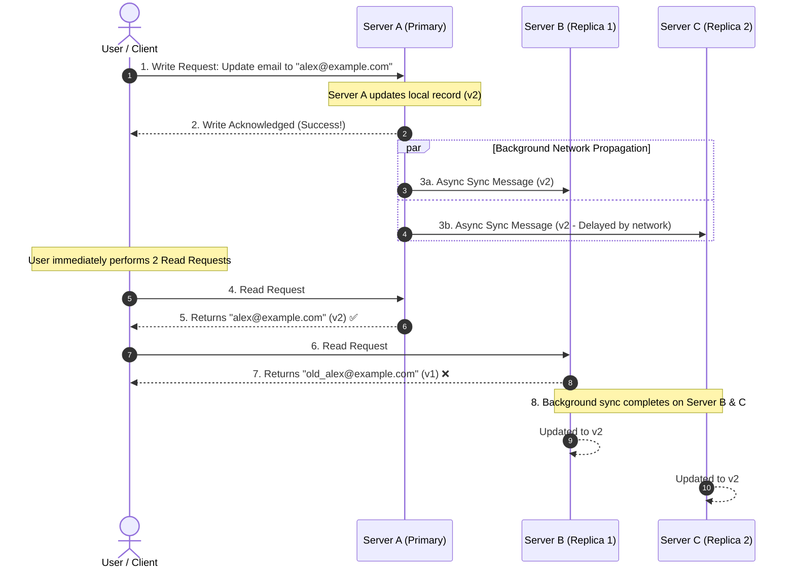

# 🚀 Day 4: Why Copying Data Creates Bigger Problems

Yesterday, we solved a major problem: **server crashes**.

By creating duplicate copies of our application state across multiple machines—a practice known as **replication**—we ensured that if one server dies, another machine is ready to step in. Our application survives hardware failure, and our users experience zero downtime.

Replication solved the availability problem. But the moment we made duplicate copies of our data, we unlocked a brand-new, far more subtle engineering dilemma:

> **When multiple copies of the same data exist across different machines, which copy should users trust?**

Making copies of data is easy. Keeping them synchronized is the real challenge.

---

## 💥 The Problem: The Inconsistent Login Nightmare

Imagine you are an engineer at a rapidly growing web platform.

A user named Sarah opens her account settings and decides to update her account password from `Password123` to `SuperSecret2026!`. 

Her web browser sends an HTTP request to your backend infrastructure. The request lands on **Server A**. Server A receives the update, updates its internal database record, and responds with a success message: `Password updated successfully!`

```
             [ User Updates Password to 'SuperSecret2026!' ]
                                   |
                                   v
                         [ Server A (Updated!) ]
                         password = 'SuperSecret2026!'
```

Ten seconds later, Sarah opens a second browser tab and attempts to log into the application using her brand-new password (`SuperSecret2026!`).

Her login request is routed to **Server B**. But Server B has not received Sarah's password update yet. Server B still has her old password (`Password123`) stored in memory.

```
          [ User Tries Logging In with 'SuperSecret2026!' ]
                                   |
                                   v
                        [ Server B (Stale Copy) ]
                         password = 'Password123'
                                   |
                                   v
                     ❌ ERROR: "Invalid Password!"
```

Server B compares Sarah's input (`SuperSecret2026!`) against its stored record (`Password123`), decides the credentials don't match, and returns an error: **"Invalid username or password."**

Confused, Sarah immediately tries clicking "Login" again. This time, her third request gets routed back to **Server A**. Server A checks its updated record, finds `SuperSecret2026!`, and logs her in successfully!

Think about what just happened from Sarah's perspective:
* The first login attempt failed.
* The second login attempt succeeded.
* She didn't type anything differently.

Now ask yourself the central question of multi-server data management:

> **Nothing crashed. No hardware failed. No network fiber was cut. Yet the application behaved completely unpredictably. If there are multiple copies of data, how do we know which one is correct?**

---

## 🔬 Why This Happens: Copies Do Not Update Instantly

To understand why multi-copy systems behave this way, we must examine what actually happens across physical network infrastructure when data is modified.

When a user changes a piece of data on one machine, that update does not magically teleport to every other server on Earth at the exact same millisecond. 

```
+-----------------------------------------------------------------------+
|                    THE PHYSICAL REALITY OF DATA UPDATES               |
|                                                                       |
| [ Server A ] ===( Physical Fiber Cable / Network Latency )===> [ Server B ] |
| (Updated @ t=0s)           (Takes 50ms - 500ms)          (Updated @ t=0.5s)|
+-----------------------------------------------------------------------+
```

Every update faces physical and operational constraints:

* 🌐 **Network Latency**: Data packets must travel across physical cables, routers, and switches. Sending data between servers takes physical time (milliseconds to seconds).
* ⚙️ **Independent Machine Processing**: Server B might be busy executing an expensive database query, handling heavy CPU load, or running a garbage collection cycle when the update arrives. It cannot process the incoming change instantly.
* 🔀 **Asynchronous Delivery**: Messages sent over a network do not always arrive in the order they were dispatched. An update sent first might arrive after a subsequent update.
* ⏱️ **Propagation Windows**: There is always a non-zero time window between when Server A receives a change and when Server B updates its copy.

During this brief propagation window, different servers hold different versions of the exact same information. This state of version variance across nodes is called **data drift** or **temporary disagreement**.

---

## ❌ The Wrong Solution: "Just Update Every Server Instantly"

When engineers encounter this problem for the first time, their natural intuition is to suggest quick fixes:

1. *"Why don't we just force Server A to update Server B and Server C before answering the user?"*
2. *"Can't we just broadcast every change to all machines at the exact same instant?"*
3. *"Why don't we simply assume every server updates simultaneously?"*

Why do these beginner assumptions break down in production?

Because **instant, simultaneous network delivery across multiple independent machines is physically impossible**.

If Server A must wait for Server B and Server C across the globe to acknowledge an update before responding to the user:
* What happens if Server B is briefly experiencing a minor network delay? The user's screen freezes waiting for Server B to respond.
* What happens if Server C is temporarily busy or performing routine maintenance? Every write request in your entire company comes to a complete halt!
* What happens if two users update the same record at the exact same second on different servers? Which server's update wins?

Trying to force every machine to change simultaneously destroys the exact availability and performance benefits we built replication for in the first place!

---

## 🏛️ The Right Mental Model: The School Notice Board Analogy

To build a clean mental model for this challenge, picture a real-world scenario outside of software engineering: **a high school notice board**.

```
+-----------------------------------------------------------------------+
|                       THE SCHOOL NOTICE BOARD ANALOGY                 |
|                                                                       |
| [ Notice Board 1 ]          [ Notice Board 2 ]        [ Notice Board 3 ]  |
|   (Main Hallway)            (Library Entrance)         (Science Wing)     |
|         |                           |                         |       |
|    "Exam @ 11 AM"            "Exam @ 9 AM"             "Exam @ 9 AM"  |
|   (Updated by Principal)     (Old Announcement)       (Old Announcement) |
|         |                           |                         |       |
|    Student A Reads            Student B Reads           Student C Reads   |
|  "Exam is at 11 AM!"      "Exam is at 9 AM!"        "Exam is at 9 AM!" |
+-----------------------------------------------------------------------+
```

Imagine a large high school campus with **three physical notice boards**:
1. Board 1 in the Main Hallway.
2. Board 2 outside the Library.
3. Board 3 inside the Science Wing.

Originally, all three boards display the exact same paper announcement: *"Math Exam: Friday at 9:00 AM."*

At 8:00 AM, the school Principal decides to reschedule the exam to **11:00 AM**. 

The Principal walks out of her office, walks over to **Board 1 (Main Hallway)**, pulls down the old announcement, and pins up the new paper: *"Math Exam: Friday at 11:00 AM."*

While the Principal is walking across campus to update Board 2 and Board 3:

* **Student A** walks past Board 1 in the Main Hallway and reads: *"Exam is at 11:00 AM."*
* **Student B** walks past Board 2 outside the Library and reads: *"Exam is at 9:00 AM."*
* **Student C** walks past Board 3 in the Science Wing and reads: *"Exam is at 9:00 AM."*

Now ask:
* Did any notice board break or tear? No.
* Are Student A and Student B both telling the truth about what they saw? Yes.
* Yet do the students disagree on when the exam takes place? **Absolutely.**

The problem was not creating multiple notice boards. Having three notice boards is great—it prevents a crowd of 1,000 students from bottlenecking in a single hallway (improving availability and access!).

The problem is **ensuring that all three notice boards display the same announcement so that everyone agrees on reality**.

Connecting this directly to distributed systems:

> **Replication creates multiple notice boards so that readers can get answers quickly. Consistency is the set of rules that ensures all notice boards tell the exact same story.**

---

## ⚙️ How It Actually Works: The Engineering Thought Process

Let's walk step-by-step through how software engineers reason about data replication problems:

```
Step 1: Single Copy (Day 1-2)
        [ Single Server ] ---> Vulnerable to crashes!

Step 2: Multiple Copies Added (Day 3)
        [ Primary Node ] + [ Replica Node 1 ] + [ Replica Node 2 ]
        ---> Survives crashes! High Availability achieved!

Step 3: User Performs an Update (Day 4)
        User writes data -> [ Primary Node ] (Updated!)
        Replicas have not received the update yet.

Step 4: Temporary Disagreement Unlocked
        Reader 1 reads Primary   ---> Gets VERSION 2 (New)
        Reader 2 reads Replica 1 ---> Gets VERSION 1 (Old)

Step 5: User-Visible Inconsistency
        Applications render conflicting data, confusing users.

Step 6: The Pursuit of Consistency
        Engineers must establish rules and guarantees so that 
        copies align predictably over time.
```

1. **One Copy Exists**: Initially, a single server holds all data. When it fails, the business stops.
2. **Replication Creates Multiple Copies**: Engineers add replica servers. The system becomes fault-tolerant and highly available.
3. **A User Updates the Data**: A write request changes data on one node first.
4. **Different Copies Temporarily Disagree**: Due to propagation delays, some nodes hold the new version while others hold the old version.
5. **Applications Behave Inconsistently**: Users encounter stale reads, flickering states, or conflicting information depending on which server handles their request.
6. **Engineers Establish Consistency Rules**: Engineers realize that replication alone is incomplete. Systems require explicit rules governing how and when updates propagate across copies.

At this stage, our goal is not to study specific protocols or complex algorithm mechanics. Today, focus purely on recognizing the core dilemma: **the moment you duplicate data, you trade simple single-node truth for multi-node state synchronization.**

---

## 🖼️ Visual Explanation

### ASCII Diagram: Update Propagation & The Disagreement Gap

```
======================================================================
SCENARIO: DATA DRIFT DURING REPLICATION PROPAGATION
======================================================================

 [ User Action ] 
        |
        +---> [ WRITE: Update Profile Name = "Alice Smith" ]
                    |
                    v
            [ Server A (Primary) ]  <-- Updated Immediately (v2)
                    |
          +---------+---------+
          | Network Latency   | Network Latency
          v (In Flight...)    v (In Flight...)
  [ Server B (Replica 1) ]   [ Server C (Replica 2) ]
   Holds "Alice Jones" (v1)   Holds "Alice Jones" (v1)

----------------------------------------------------------------------
READ READINGS DURING PROPAGATION GAP:
----------------------------------------------------------------------
 [ Reader 1 ] ---> Reads Server A ---> Sees "Alice Smith" ✅ (New)
 [ Reader 2 ] ---> Reads Server B ---> Sees "Alice Jones" ❌ (Stale)
 [ Reader 3 ] ---> Reads Server C ---> Sees "Alice Jones" ❌ (Stale)

======================================================================
RESULT: TEMPORARY DISAGREEMENT ACROSS SERVERS
======================================================================
```

---

### Mermaid Sequence Diagram: Asynchronous Replica Propagation



---

### Timeline Diagram: Data Disagreement & Eventual Synchronization

```
UPDATE EVENT           PROPAGATION WINDOW                  CONSISTENT STATE
  (t = 0s)               (t = 0s to 2s)                        (t > 2s)

  Server A (v2) -------> Server A (v2) ----------------------> Server A (v2)
                            |
  Server B (v1) -------> Server B (v1 -> Syncing...) --------> Server B (v2)
                            |
  Server C (v1) -------> Server C (v1 -> Syncing...) --------> Server C (v2)

[ Update Applied ]     [ Temporary Disagreement ]            [ All Replicas Match ]
                       (Readers see different data)          (Readers see same data)
```

---

### Specified Image Assets (Inside `assets/`)

The following diagram assets illustrate the concepts introduced in this lesson:

* **`assets/replication-update.png`**: An architectural graphic demonstrating a write operation landing on a primary database node and queued background messages dispatching updates to secondary replicas.
* **`assets/inconsistent-copies.png`**: A split-screen diagram showing two users querying different server nodes at the same timestamp, receiving conflicting profile information due to network lag.
* **`assets/consistency-timeline.png`**: A timeline visualization depicting the window of version drift between initial data write and final convergence across all node replicas.
* **`assets/school-notice-board.png`**: An intuitive real-world illustration showing three physical notice boards on a school campus displaying different exam schedules after a last-minute change.

---

## 🌍 Real-World Example: WhatsApp Message Synchronization

Think about how you use **WhatsApp** across multiple devices.

Suppose you have WhatsApp open on both your **smartphone** and your **laptop (WhatsApp Web)**.

1. You send a text message to a friend from your smartphone: *"Hey, let's meet at 5 PM!"*
2. Your phone sends the message to WhatsApp's server infrastructure.
3. The server receives the message and immediately delivers it to your friend's phone.
4. However, your laptop was briefly offline or experiencing a momentary Wi-Fi reconnection.
5. For a few seconds, your phone shows the message as sent, but your laptop screen doesn't show the message in the chat thread at all!

Did WhatsApp lose your message? No.

Was WhatsApp's backend broken? No.

Your phone and your laptop were simply viewing **two different replicated views of your conversation history**. The server had the newest message, your phone had the newest message, but your laptop was lagging behind due to network synchronization delay. 

A few seconds later, your laptop re-establishes its network stream, fetches the missing update from the server, and your chat thread converges to display identical messages on both screens.

WhatsApp designs its client applications and edge synchronization protocols specifically to manage these propagation delays so that all your devices eventually show the exact same chat history.

---

## 💻 Build It Yourself: Simulating Replication Lag in Python

To see data drift and synchronization in action, we have written two interactive Python educational scripts inside the [`code/`](file:///d:/30_Days_of_Distributed_Systems/days/Day-04-The-Replication-Problem/code) directory:

1. **[`replication_delay_demo.py`](file:///d:/30_Days_of_Distributed_Systems/days/Day-04-The-Replication-Problem/code/replication_delay_demo.py)**: Simulates a user changing their password across a cluster of 3 servers. It demonstrates how back-to-back login requests hit different nodes and return conflicting results during replication lag.
2. **[`consistency_simulation.py`](file:///d:/30_Days_of_Distributed_Systems/days/Day-04-The-Replication-Problem/code/consistency_simulation.py)**: Implements the "School Notice Board" scenario, stepping through version changes across 3 notice board nodes to demonstrate data drift and eventual synchronization.

### Running the Code

Open your terminal, navigate to the repository root, and run:

```bash
# Run Demo 1: Observe password login disagreement during replication lag
python days/Day-04-The-Replication-Problem/code/replication_delay_demo.py

# Run Demo 2: Observe notice board data drift and convergence over time
python days/Day-04-The-Replication-Problem/code/consistency_simulation.py
```

### Code Highlight: Observing State Disagreement

In `replication_delay_demo.py`, observe how read requests land on different servers while background synchronization is in flight:

```python
# User updates password on Server A
server_a.update_password("new_secret_password_2026")

# Immediate Read Request #1 lands on Server A (Updated!)
ans_a = server_a.get_password() # Returns "new_secret_password_2026" -> SUCCESS! [OK]

# Immediate Read Request #2 lands on Server B (Not synced yet!)
ans_b = server_b.get_password() # Returns "old_password_123" -> FAILED! [FAIL]
```

Running these scripts provides concrete proof that **without synchronization rules, healthy servers can return conflicting answers to the exact same question.**

---

## ⚠️ Common Misconceptions

When learning about data replication, it is easy to hold incomplete assumptions. Let's correct four major misunderstandings:

| Misconception | The Engineering Reality |
| :--- | :--- |
| **"Replication automatically means consistency."** | **False.** Replication simply means making copies. Copies naturally drift apart unless explicit rules and mechanisms are enforced to align them. |
| **"All servers in a cluster update at the exact same microsecond."** | **False.** Speed-of-light physical network delays, server processing queues, and hardware latency make simultaneous global updates physically impossible. |
| **"Adding more replica copies always improves user experience."** | **False.** More copies increase availability for reads, but they also increase the number of nodes that must be synchronized, making data drift harder to manage. |
| **"Consistency means data is static and never changes."** | **False.** Consistency in distributed systems does not mean data never changes; it means all copies agree on what the current state of data is. |

---

## ⚖️ Production Trade-offs

Creating multiple copies of data introduces fundamental architectural trade-offs:

### 🟢 Advantages of Replication
* **High Availability**: If Server A crashes, Server B and Server C can keep serving traffic.
* **Fault Tolerance**: The business survives hardware failures without data loss.
* **Read Scalability**: Read traffic can be split across multiple replicas to handle millions of queries.

### 🔴 Challenges Introduced
* **Conflicting Copies**: Different nodes can temporarily hold different values for the same key or record.
* **Synchronization Delays**: Updates require time to travel over physical networks to reach all replicas.
* **User-Visible Inconsistencies**: Users may see stale data, disappearing edits, or out-of-order comments.
* **Operational Complexity**: Engineers must design application logic to handle temporary disagreements cleanly.

This is why engineering teams at Google, Meta, Amazon, and Netflix invest heavily in consistency research: **making copies of data solves availability, but managing consistency ensures correctness.**

---

## 🎯 Key Takeaways

1. **Replication solves availability, not correctness**: Having multiple copies keeps systems online, but creates the problem of version disagreement.
2. **Updates are not instantaneous**: Data packet propagation over physical networks takes time.
3. **Propagation window**: The time gap between an update landing on Node A and reaching Node B is when inconsistencies occur.
4. **Hardware health does not prevent disagreement**: Servers can be 100% healthy and functioning normally while returning conflicting answers.
5. **The Notice Board Analogy**: Having multiple notice boards prevents hallway crowds, but updating one board first causes students to read different announcements.
6. **Naive instant updates don't work**: Forcing all global servers to update simultaneously causes system freezes and total write paralysis during minor network blips.
7. **Data Drift**: Without synchronization rules, duplicate copies naturally drift apart as edits occur.
8. **Real-world applications face this daily**: Messaging apps, social media feeds, and shopping carts must all manage temporary replication lag.
9. **Consistency is the solution**: Consistency is the engineering goal of ensuring all data copies stay predictably aligned.
10. **The Golden Rule of Replication**: *"Making copies is easy. Keeping them synchronized is the real challenge."*

---

## 🙋 Interview Questions

### Q1: Why does adding data replication inherently introduce consistency challenges?
**Answer:** Replication involves storing duplicate copies of data across multiple independent physical machines. Because network transmission takes time and servers process tasks independently, updates cannot reach all machines at the exact same instant. This propagation delay creates a time window where different servers hold different versions of the same record.

### Q2: Can two completely healthy, operational servers return different answers to the same read query?
**Answer:** Yes. If Server A has received the latest write update but that update has not yet propagated across the network to Server B, Server A will return the new version while Server B returns the stale version. Both servers are operating correctly, but they disagree due to replication lag.

### Q3: Why can't distributed systems simply force all replica servers to update simultaneously before acknowledging a write?
**Answer:** Forcing simultaneous updates across all servers requires waiting for the slowest node or slowest network path on every write. If any single replica experiences latency, network jitter, or downtime, the entire write operation blocks or fails. This destroys write availability and performance.

### Q4: What is the difference between data replication and data consistency?
**Answer:** Replication is the *mechanism* of creating and storing multiple copies of data on separate machines for availability and fault tolerance. Consistency is the *guarantee or state* ensuring that all those replicated copies agree on the correct value over time.

### Q5: Why is keeping copies synchronized considered harder than making copies?
**Answer:** Creating copies requires merely sending data to another disk or machine. Synchronizing copies requires handling asynchronous network delays, out-of-order message delivery, machine failures mid-update, concurrent writes on different nodes, and ensuring readers see a coherent view of reality.

---

## 📖 Further Reading

To explore real-world engineering post-mortems, research papers, and deep dives into data synchronization, check out our curated list of resources in **[`references.md`](file:///d:/30_Days_of_Distributed_Systems/days/Day-04-The-Replication-Problem/references.md)**.

---

## 🔮 What You'll Build Intuition for Tomorrow

Now you understand why consistency becomes necessary once multiple copies of data exist: **making copies is easy, but keeping them synchronized is the real challenge.**

So we have multiple servers holding copies of our application data.

But this brings us to another fundamental question in distributed system design:

> **If every server in our system is capable of responding to incoming requests, who decides which server should handle the next incoming request from a user?**

Tomorrow, in **Day 5**, we will explore how systems coordinate incoming traffic across multiple running servers!
