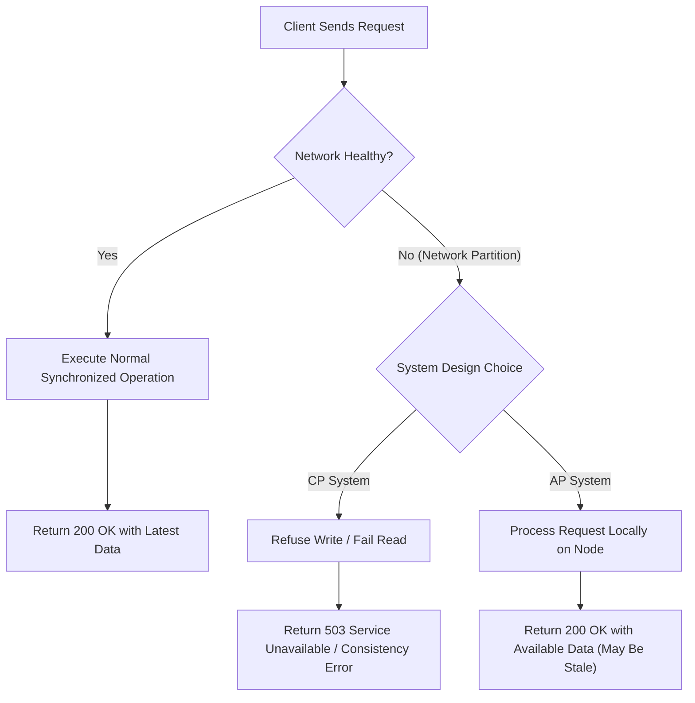

# 🔺 Day 5: The Impossible Triangle

In previous lessons, we learned how to scale applications beyond a single machine and how to replicate data to survive individual server crashes. We added more servers to share the load, and we set up replicas so that if one server drops dead, another can take its place.

Today, we face a much harder and far more unsettling question:

> **What happens when every single server is healthy and running at 100% capacity—but they can no longer talk to each other?**

When communication breaks down between healthy machines, distributed systems force engineers into a corner. There are no perfect solutions. Every choice comes with a cost.

---

## 💥 The Problem: Three Production Scenarios

Before we talk about rules, theorems, or computer science literature, let us look at three real production scenarios unfolding at 3:00 AM.

### Story 1 — The Bank Transfer
A customer opens their mobile banking app and transfers $500 to a friend. 
* Server A (East Coast data center) processes the transfer, immediately deducting $500 from the customer's balance.
* Server A attempts to notify Server B (West Coast data center) so the friend's account can be credited.
* But the communication link between Server A and Server B suddenly fails.

Server B has no idea the transfer ever happened. 

Now a dilemma arises: Should the banking app report the transfer as **successful** right away? If it does, the recipient checks their balance on Server B and sees zero dollars—meaning money vanished into thin air. Or should the bank **reject** the transfer and throw an error, even though both servers are healthy?

### Story 2 — Netflix Video Streaming
A regional network outage isolates a slice of Netflix’s cloud infrastructure in Europe from the main data centers in North America.
* Millions of users in Europe press "Play" on their favorite series.
* The local European servers hold cached video files, but they cannot verify whether a user's subscription was recently canceled or renewed in the central database.

What should Netflix do? Should it **keep serving videos** to all European users—knowing some unsubscribed users might get free content? Or should it **block streaming entirely** for millions of paying subscribers until the global network link is repaired?

### Story 3 — WhatsApp Messaging
You send a critical text message to a coworker: *"The deployment is delayed."*
* Your phone connects to WhatsApp Node 1 and uploads the message.
* Node 1 attempts to forward the message to Node 2, which your coworker's phone is currently connected to.
* The connection between Node 1 and Node 2 fails.

Your screen shows a **single grey check mark**. Has the message been delivered to the server? Is your coworker's phone unreachable? Or is the network between internal servers broken? Should WhatsApp hold the message indefinitely, or inform you that delivery failed?

---

### The Fundamental Question
Ask yourself as an engineer: **What should these systems do when different parts of the system cannot agree on the truth?**

---

## 🔬 Why This Happens: The Unforgiving Physical Network

Why do these dilemmas happen in the first place?

In a single server architecture, memory reads and writes happen over a physical bus on a single motherboard. Connections almost never get "halfway lost." Either the machine works, or it powers off.

In a distributed system, servers are separated by physical distance. They communicate over network cables, routers, switches, and fiber-optic strands spanning cities and oceans. 

```
+-------------------+                      +-------------------+
|   Server Node A   |   x x x x x x x x    |   Server Node B   |
|  (Healthy & Live) |   x FIBER CUT x    |  (Healthy & Live) |
|   State: Bal=$200 |   x x x x x x x x    |   State: Bal=$150 |
+-------------------+                      +-------------------+
```

A **network partition** occurs when network communication between servers breaks or becomes excessively delayed, splitting a cluster into isolated groups.

Real-world causes of network partitions include:
* ✂️ **Physical Fiber Cuts**: An excavator accidentally severs an underground fiber-optic cable between cloud availability zones.
* 🔌 **Top-of-Rack Router Failures**: A hardware failure on a network switch isolates an entire rack of 40 servers.
* 🌐 **Cloud Region Connectivity Loss**: BGP routing table misconfigurations render transatlantic submarine cables unreachable.
* 🏰 **Data Center Isolation**: Firewall misconfigurations silently drop inter-datacenter traffic while internet-facing traffic continues to flow.

### The Critical Realization
**Every server in the cluster may be running at 100% health, executing CPU cycles flawlessly.** The problem is not that a server died. The problem is that **they can no longer communicate reliably**.

---

## ❌ The Wrong Solution: The Naive Developer's Dream

When software engineers first encounter distributed systems, they often try to construct an ideal system that promises all four of the following guarantees:

1. ⏳ **"We will always wait until every server responds before answering the user."**
2. 🎯 **"We will always return the absolute latest, perfectly accurate data."**
3. ⚡ **"We will never reject a user request; every call gets a success response."**
4. 🟢 **"Our service will stay 100% online at all times."**

### Why This Is Physically Impossible
Imagine a network partition strikes between Server A and Server B. A user sends a write request to Server A.

* If Server A **waits until Server B responds** (Guarantee #1 & #2), Server A will wait forever because the network link is broken. The client request times out, violating Guarantee #3 & #4 (Availability & Staying online).
* If Server A **responds immediately to stay online** (Guarantee #3 & #4), it cannot update Server B. The next user reading from Server B will receive stale, incorrect data, violating Guarantee #2 (Perfect accuracy).

During a communication failure, **you cannot guarantee all of these properties simultaneously.** Attempting to pretend that network failures do not exist leads to split-brain states, corrupted database records, and silent failures.

---

## 🤝 The Right Mental Model: The Group Project Analogy

To understand why this choice is unavoidable, think of a group project at school.

```
                  GROUP PROJECT ANALOGY
                  
    [ Student A ] <--- Internet Lost ---> [ Student B ]
    (Working on slides)                 (Working on slides)
             |                                    |
             v                                    v
     Keep editing?                       Stop working?
  (Risk duplicate/conflicting work)   (Risk missing deadline)
```

Three students—Alice, Bob, and Charlie—are assigned to create a single presentation due at midnight. They communicate over a shared online doc.

Suddenly, **the internet goes down** at Bob's home. Bob is completely cut off from Alice and Charlie.

Bob has two options:
1. **Option A (Keep Editing Alone)**: Bob continues editing his slides locally to make sure he finishes his part on time. However, Alice and Charlie are simultaneously editing the exact same slides without Bob. When the internet comes back, their changes will conflict, overlapping text and destroying formatting.
2. **Option B (Stop Working Until Internet Returns)**: Bob freezes his work and refuses to touch the slides until connection is restored. This guarantees no conflicting edits will be made, but if the internet stays down for hours, Bob fails to deliver his section.

Now ask yourself: **Whose version is correct? Should work continue independently, or should everyone halt until communication is restored?**

This is the exact trade-off engineers face in distributed software.

---

## 📐 How It Actually Works: Introducing the CAP Theorem

When systems scale across network boundaries, the sequence of events is always the same:

1. **Systems become distributed** (we add multiple servers for performance and redundancy).
2. **Multiple copies of data exist** across different nodes.
3. **Communication eventually fails** (cables get cut, networks partition).
4. **Engineers are forced to make a deliberate choice.**

### The Three Desirable Properties

When building distributed systems, we care about three properties:

* 🟢 **Consistency ($C$)**: Every read request receives the most recent write or an error. All nodes see the exact same data at the exact same moment.
* ⚡ **Availability ($A$)**: Every non-failing node returns a non-error response for every request—without guaranteeing that it contains the most recent write.
* 🛡️ **Partition Tolerance ($P$)**: The system continues to operate despite an arbitrary number of messages being dropped or delayed by the network between nodes.

---

### The Big Reveal: CAP Theorem

In 2000, computer scientist **Eric Brewer** formulated this observation into what is known today as the **CAP Theorem**.

```
                         CONSISTENCY (C)
                         /             \
                        /               \
                       /   THE IMPOSSIBLE\
                      /      TRIANGLE     \
                     /                     \
        AVAILABILITY (A) ----------------- PARTITION TOLERANCE (P)
```

> **CAP Theorem Statement:**
> In a network-distributed system during a network partition, you can choose **Consistency ($C$)** OR **Availability ($A$)**—**you cannot have both.**

### Intuitive Proof Without Math
Notice the phrase: *"during a network partition."*

You do **not** choose whether to have Partition Tolerance ($P$). Network partitions are physical realities of networking hardware; they *will* happen whether you like it or not. 

Therefore, when a network partition occurs ($P$), you are left with only two real choices:

1. **CP (Consistency + Partition Tolerance)**: You choose to prioritize data correctness. You cancel or reject requests that cannot be synchronized across the partition. You sacrifice **Availability**.
2. **AP (Availability + Partition Tolerance)**: You choose to stay online and respond to every client request immediately using local node data. You sacrifice **Consistency** (nodes may temporarily return conflicting or stale data).

---

## 🎨 Visual Explanation

### 1. The ASCII Decision Triangle

```
                 =================================
                 THE CAP DECISION DURING PARTITION
                 =================================

                              [ C ]
                           Consistency
                           /         \
                          /           \
                         /  PARTITION  \
                        /   OCCURRED    \
                       /                 \
                     [ CP ]             [ AP ]
                     /                     \
                    /                       \
             [ Cancel Request ]        [ Serve Local Data ]
           (Sacrifice Availability)   (Sacrifice Consistency)
                  /                           \
                 /                             \
             [ A ] --------------------------- [ P ]
          Availability                    Partition Tolerance
```

---

### 2. Mermaid Flow Diagram: Handling Client Requests During a Split



---

### 3. Visual Failure Illustration & Image Asset Descriptions

To further illustrate these concepts visually in future diagrams, the following assets are designated inside `assets/`:

1. ``  
   *Asset Description*: A split-screen diagram showing Server A on the East Coast processing a balance deduction of $500, while a lightning bolt representing a fiber cut blocks communication to Server B on the West Coast, where the balance remains unchanged.
2. ``  
   *Asset Description*: An architectural diagram of a 4-node cluster divided into two isolated sub-clusters (Nodes 1 & 2 vs Nodes 3 & 4) by a red dotted partition barrier, illustrating dropping network packets.
3. ``  
   *Asset Description*: A high-contrast graphic of the CAP triangle with Consistency, Availability, and Partition Tolerance at the vertices, highlighting the mandatory CP vs AP trade-off axis when Partition Tolerance is triggered.
4. ``  
   *Asset Description*: A comic-strip style vector illustration depicting student Bob offline with his laptop disconnected from Wi-Fi while Alice and Charlie continue editing their shared presentation.

---

## 🏢 Real-World Example: Netflix Regional Isolations

Let us examine how **Netflix** applies CAP trade-offs in practice.

When Netflix streams movies to over 200 million subscribers worldwide, it relies on microservices distributed across multiple AWS cloud regions.

```
+-----------------------------------------------------------------------+
|                       NETFLIX ARCHITECTURE                            |
|                                                                       |
|   [ EU Region Node ] <--- Network Isolation ---> [ US Region Node ]   |
|   (User clicks Play)                              (Primary DB)        |
|            |                                                          |
|            v                                                          |
|   Prioritize Availability:                                            |
|   "Stream video anyway!" (AP Choice)                                  |
+-----------------------------------------------------------------------+
```

Suppose a major transatlantic fiber outage isolates the European cloud region from the primary subscriber database in the US.

Netflix engineers ask: *If a user in Paris hits "Play", but the European server cannot verify if their credit card payment cleared this morning, what should happen?*

### The Netflix Engineering Decision (AP Choice)
Netflix prioritizes **Availability over Consistency** for playback services:
* **The AP Choice**: The European server assumes the user is valid and starts streaming the video immediately from local edge caches.
* **The Trade-off**: A tiny fraction of users whose subscriptions were canceled an hour ago might get to watch a movie for free during the network outage.
* **The Rationale**: Blocking millions of paying customers from watching movies creates massive user frustration and brand damage. Accepting temporary consistency divergence (a few unbilled views) is vastly better than going offline.

However, for billing and user account management, Netflix switches strategy to **CP (Consistency)**: if you attempt to change your billing credit card details during an outage, the system will politely ask you to try again later rather than risk corrupting financial records.

---

## 🛠️ Build It Yourself: Simulating CAP Trade-offs in Python

Let us implement a hands-on Python simulation to demonstrate CP and AP behaviors during a network partition.

All code files are located inside [code/](file:///d:/30_Days_of_Distributed_Systems/days/Day-05-The-Impossible-Triangle/code).

### 1. Run the Network Partition Simulation
This script simulates a fiber cable cut between two node servers and shows data divergence.

Run in your terminal:
```bash
python code/partition_simulation.py
```

### 2. Run the CP vs AP Trade-off Demo
This script demonstrates how a CP cluster rejects requests to preserve consistency, whereas an AP cluster accepts local writes at the cost of stale data.

Run in your terminal:
```bash
python code/cap_tradeoff_demo.py
```

---

### Code Highlights: `cap_tradeoff_demo.py`

```python
# Excerpt from code/cap_tradeoff_demo.py
def process_write_request(self, target_node_name: str, key: str, value: Any) -> Tuple[bool, str]:
    target_node = self.node_1 if target_node_name == "Node-1" else self.node_2
    peer_node = self.node_2 if target_node_name == "Node-1" else self.node_1

    if not self.is_partitioned:
        # Normal state: write locally and sync with peer
        target_node.set_data(key, value)
        peer_node.set_data(key, value)
        return True, "HTTP 200 OK: Data synchronized to all nodes."

    # Network is partitioned!
    if self.mode == "CP":
        # Consistency Choice: Refuse write because peer cannot acknowledge
        return False, f"HTTP 503 Error: Network partition active. Cannot reach {peer_node.name}."

    elif self.mode == "AP":
        # Availability Choice: Write locally to stay online
        target_node.set_data(key, value)
        return True, f"HTTP 200 OK: Written locally to {target_node.name}. Peer is out-of-sync."
```

---

## ⚠️ Common Misconceptions About CAP

### 1. ❌ Myth: "CAP means you can pick any 2 out of 3 forever."
* **Fact**: You do **not** choose Partition Tolerance ($P$). Network partitions are physical failures that occur unexpectedly. CAP only dictates what happens **during** a partition. When the network is healthy, systems can be both Consistent and Available!

### 2. ❌ Myth: "Partition Tolerance is optional in modern networks."
* **Fact**: You cannot opt out of partition tolerance unless all your code runs on a single physical machine with no network connection. Hardware networks will fail eventually.

### 3. ❌ Myth: "CAP Theorem applies only to relational databases."
* **Fact**: CAP applies to **any distributed system** that stores state across multiple nodes—including microservices, caches, distributed file systems, and messaging queues.

### 4. ❌ Myth: "High Availability means data is always correct."
* **Fact**: High availability in an AP system explicitly means returning a response even if the data is stale, old, or temporarily incorrect.

### 5. ❌ Myth: "CP systems are always superior because consistency is better."
* **Fact**: If a CP database experiences a network partition, it will reject user writes and throw errors. For a social media feed or video platform, throwing errors is far worse than showing slightly stale posts.

---

## ⚖️ Production Trade-offs Matrix

| Architectural Choice | Primary Goal | Key Advantages | Key Disadvantages | Ideal Use Cases |
| :--- | :--- | :--- | :--- | :--- |
| **Prioritizing Consistency (CP)** | Data correctness & unified state | • Predictable read data<br>• Zero stale reads<br>• Strong correctness guarantees | • High latency during verification<br>• Request failures (503s) during network splits | Financial ledgers, stock trading, bank account balances, inventory reservation |
| **Prioritizing Availability (AP)** | Maximum uptime & responsiveness | • Low latency reads/writes<br>• 100% continuous user uptime<br>• High fault tolerance | • Temporary data disagreement<br>• Complex conflict resolution (CRDTs, reconciliation) | Social media feeds, video streaming, analytics collection, shopping cart drafts |

---

## 🧠 Key Takeaways

1. **Distributed systems have no perfect solutions**; engineering is the art of choosing the right trade-offs.
2. **Network partitions are physical inevitabilities**, caused by fiber cuts, hardware router crashes, and cloud region drops.
3. **Servers can be 100% healthy** while still being completely unable to talk to one another.
4. **CAP Theorem states** that during a network partition, you must choose between Consistency ($C$) and Availability ($A$).
5. **Partition Tolerance ($P$) is non-negotiable** in networked environments.
6. **CP systems choose correctness over uptime**, returning errors when data cannot be verified.
7. **AP systems choose uptime over correctness**, returning local data even if it might be stale.
8. **CAP applies only during network partitions**; when the network is healthy, systems strive for both consistency and availability.
9. **Different subsystems in the same company** (e.g., Netflix streaming vs. Netflix billing) make different CAP choices.
10. **The ultimate goal** of a distributed engineer is to align system trade-offs with business priorities.

---

## ❓ Production Interview Questions

### Q1: Why does the CAP Theorem only apply during a network partition?
> **Answer**: When the network is healthy, messages travel between nodes with negligible latency. Nodes can synchronize writes instantly and return responses to users, achieving both Consistency and Availability. CAP only forces a strict trade-off when network messages between nodes are lost or infinitely delayed.

### Q2: Is Partition Tolerance optional in distributed system design?
> **Answer**: No. In any network of multiple physical or virtual machines, network packets can be dropped or delayed. Unless you run a single-node system, partition tolerance must be assumed. Therefore, the architectural choice is always between CP and AP during failure modes.

### Q3: When should a banking application choose CP over AP?
> **Answer**: A banking application managing core account balances must choose CP because double-spending or money disappearing due to stale reads is unacceptable. It is better to reject a transaction with a "System temporarily unavailable, please try again" error than to approve a transaction on a stale balance.

### Q4: When should a social media app choose AP over CP?
> **Answer**: A social media platform loading a user's comment feed should choose AP. If a user posts a comment during a minor cloud partition, it is far better for their friends to see the comment 5 seconds late than for the app to crash with a `500 Server Error` modal.

### Q5: Is CAP Theorem a hardware design rule or an observation about physical realities?
> **Answer**: CAP is an observation about physical trade-offs in distributed state machine communication. Because information cannot travel faster than light and network wires can fail, independent state nodes cannot guarantee identical consensus without communicating.

---

## 📖 Further Reading

For deep-dives, academic papers, and engineering blog posts on CAP Theorem and network partitions, explore our curated list in [references.md](file:///d:/30_Days_of_Distributed_Systems/days/Day-05-The-Impossible-Triangle/references.md).

---

## 🔮 What You'll Build Intuition for Tomorrow

Now that we understand the brutal trade-offs forced upon us when servers cannot talk to each other...

Imagine a scenario where **thousands of healthy servers exist** across the globe, each ready to handle user requests. 

When a user opens their browser and requests a web page:

> **How does the user's request know exactly which server to go to without overwhelming any single machine?**

Tomorrow, we dive into how traffic flows through massive distributed systems.
