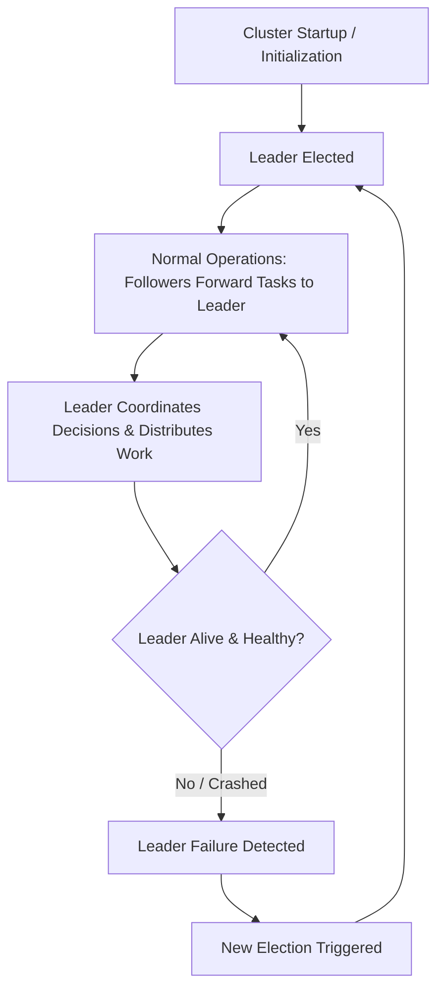

# 👑 Day 6 — Leader Election: How Does a Cluster Decide Who's in Charge?

Once many machines cooperate to build a distributed system, a fundamental physical problem emerges: **someone has to coordinate important decisions.** 

When five or fifty servers are running concurrently, they cannot all make independent, uncoordinated changes to global system state. If every machine attempts to allocate resources, assign jobs, or update database schemas on its own, chaos quickly follows.

The core challenge in a distributed cluster isn't authority or hierarchy for its own sake—**it's coordination.**

---

## 💥 The Problem: A Production Chaos Story

Imagine a distributed job scheduler managing a pool of 100 worker machines. To keep the scheduler resilient against physical server hardware failures, the system runs on a cluster of five scheduler nodes (`Node-A`, `Node-B`, `Node-C`, `Node-D`, `Node-E`).

At 3:14 AM, Worker Machine #42 suffers a power supply failure and abruptly drops offline.

```
       [Worker Machine #42 FAILS]
                   |
   +---------------+---------------+---------------+---------------+
   |               |               |               |               |
[Node-A]        [Node-B]        [Node-C]        [Node-D]        [Node-E]
(Detects Failure) (Detects Failure) (Detects Failure) (Detects Failure) (Detects Failure)
```

All five scheduler nodes periodically monitor Worker Machine #42. Within seconds, all five detect that Worker #42 has stopped responding.

Because there is no designated coordinator, every scheduler node acts independently:
* `Node-A` sees the failure and immediately assigns the lost tasks to Worker #80.
* `Node-B` sees the failure at the exact same instant and assigns the lost tasks to Worker #91.
* `Node-C` attempts to mark the jobs as failed in the database, while `Node-D` re-queues them.
* `Node-E` sends a billing alert indicating that the work was canceled.

### The Consequences
1. **Duplicate Work**: Two different workers execute the exact same payment processing batch. Customers get charged twice.
2. **Missing Work**: Conflicting database updates overwrite each other, leaving half the tasks dropped entirely.
3. **Confusing Logs & Wasted Resources**: Debugging central system logs becomes nearly impossible because five nodes emitted contradictory decisions at the exact same timestamp.

### ❓ Ask Yourself
> **What happens if every server believes it's the leader?**

If every machine in a cluster independently assumes it has the authority to make global decisions, the system degrades into chaotic, conflicting actions.

---

## 🔬 Why This Happens: Independent Observations Without Coordination

Why do distributed servers clash so easily?

In a distributed environment, every server observes similar metric streams and network signals:
* Every node sees that Worker #42 timed out.
* Every node sees that the disk on Database-1 is 95% full.
* Every node sees that traffic is spiking on the API gateway.

Without central coordination:
* 🔄 **Duplicate Work Happens**: Multiple nodes execute redundant operations, wasting compute, memory, and bandwidth.
* ⚡ **Conflicting Updates Occur**: Concurrent writes to shared storage collide, causing data loss or corrupted state.
* 🌪️ **Cluster State Becomes Unpredictable**: Different nodes hold different views of what work has been completed and what is pending.
* 🩹 **Recovery Becomes Difficult**: Cleaning up after multiple conflicting operations requires complex manual intervention.

### The Critical Realization
**"Everyone deciding" is often far worse than "one coordinator deciding."**

Even if individual nodes are 100% healthy and intelligent, having five independent actors make uncoordinated decisions creates anarchy. A cluster needs a single, unified point of decision-making for critical cluster-wide operations.

---

## ❌ The Wrong Solution: The Naive Approaches

When engineers first face this challenge, they usually propose one of three quick fixes. Here is why each naive approach fails in production.

```
+-----------------------------------------------------------------------------------+
| NAIVE ATTEMPT 1: Hardcode One Leader                                              |
| "Server-A is always the leader!"                                                  |
| 💥 FAILURE MODE: What happens when Server-A crashes or loses power?               |
|    The entire cluster becomes uncoordinated and halts.                            |
+-----------------------------------------------------------------------------------+
| NAIVE ATTEMPT 2: Always Pick the First IP / Machine                               |
| "Node with IP 10.0.0.1 is the leader!"                                            |
| 💥 FAILURE MODE: What happens during a network partition or router restart?       |
|    IPs become unreachable, creating orphan nodes that cannot operate.             |
+-----------------------------------------------------------------------------------+
| NAIVE ATTEMPT 3: Let Everyone Decide Independently                               |
| "Each node manages whichever job it sees first!"                                  |
| 💥 FAILURE MODE: Race conditions, duplicate execution, and split state.           |
+-----------------------------------------------------------------------------------+
```

### Why Static Approaches Fail
1. **Machines Fail**: Server hardware dies, power supplies fail, and memory modules experience uncorrectable bit flips.
2. **Networks Fail**: Routers drop packets, switches lose power, and cloud availability zones experience latency spikes.
3. **Servers Restart**: Software updates and kernel patches force servers to reboot.

A hardcoded or static leader turns the designated machine into a permanent **Single Point of Failure (SPOF)**. If that single machine goes down, the entire cluster loses its ability to make decisions.

---

## 🎼 The Right Mental Model: The Orchestra Analogy

To understand how a cluster should coordinate, picture a **symphony orchestra**.

```
             +---------------------+
             |    THE CONDUCTOR    |
             |  (Elected Leader)   |
             +----------+----------+
                        |
        +---------------+---------------+
        |               |               |
        v               v               v
  [Violin Section] [Brass Section] [Percussion]
   (Follower Node) (Follower Node) (Follower Node)
```

In an orchestra:
* Every musician is highly skilled and capable of playing their instrument masterfully.
* However, without a **conductor**:
  * The tempo drifts apart.
  * Different sections start playing at slightly different speeds.
  * What should be a beautiful symphony turns into painful noise.

### The Role of the Conductor
* The conductor **does not play every instrument**. The conductor isn't doing the work of the violinists or the drummers.
* The conductor's sole job is **coordination**—keeping everyone synchronized on time, tempo, and transitions.

### Connecting to Distributed Systems
In a distributed cluster:
* **The Leader** is the conductor. It coordinates global decisions, schedules tasks, and maintains order.
* **The Followers** are the musicians. They perform heavy work (processing client queries, storing data, running tasks) while relying on the leader for coordination.
* **Leader Election** is the process where the cluster dynamic chooses one node to act as the conductor.

---

## ⚙️ How It Actually Works: Roles and Responsibilities

When multiple machines form a cluster, they don't operate as a chaotic mob. Instead, they organize themselves into distinct operational roles.

```
+-----------------------------------------------------------------------------------+
|                                DISTRIBUTED CLUSTER                                |
|                                                                                   |
|  +-------------------+        Coordinating Decisions       +-------------------+  |
|  |     FOLLOWER      | <---------------------------------- |      LEADER       |  |
|  |     (Node-2)      | ----------------------------------> |     (Node-1)      |  |
|  +-------------------+       Forward Client Tasks          +-------------------+  |
|                                                                      ^            |
|  +-------------------+                                               |            |
|  |     FOLLOWER      | ----------------------------------------------+            |
|  |     (Node-3)      |                                                            |
|  +-------------------+                                                            |
+-----------------------------------------------------------------------------------+
```

### 1. Cluster Startup
When five machines boot up, none of them assume they own the cluster. They form a cluster group and initiate a process to elect **one machine as the Leader**.

### 2. The Elected Leader
* Exactly **one machine** becomes the Leader.
* The Leader accepts global coordination tasks (e.g., "Assign Worker #80 to replace Worker #42").
* The Leader ensures that decisions are made sequentially and authoritatively.

### 3. The Followers
* The remaining machines become **Followers**.
* Followers accept incoming client requests.
* If a request requires cluster-wide coordination or state changes, the Follower **forwards the request to the Leader**.
* Followers execute the actual workloads assigned to them by the Leader.

### 4. Dynamic Leadership
If the active Leader disappears (due to a crash, network cut, or restart), the Followers recognize that the conductor is gone and initiate a process to **choose a new Leader**.

---

## 🎨 Visual Explanation

### ASCII Diagram — Cluster Leadership Architecture

```
[Client Request]
       |
       v
  +----------+         Forward Request          +-------------------+
  | Follower | -------------------------------> |   Elected Leader  |
  |  Node 2  |                                  |      Node 1       |
  +----------+                                  +---------+---------+
                                                          |
                                          Decisions & Task Assignments
                                                          |
                                      +-------------------+-------------------+
                                      |                                       |
                                      v                                       v
                                +----------+                            +----------+
                                | Follower |                            | Follower |
                                |  Node 3  |                            |  Node 4  |
                                +----------+                            +----------+
```

### Mermaid Diagram — Cluster Lifecycle & Decision Flow



### ASCII Diagram — Centrally Coordinated Decision Flow

```
                      +-------------------+
                      |   Follower Node   |
                      |     (Node-B)      |
                      +---------+---------+
                                ^
                                |  Assign Work
                                v
+-------------------+   Authoritative    +-------------------+
|   Follower Node   | <----------------> |   ELECTED LEADER  |
|     (Node-C)      |     Decisions      |     (Node-A)      |
+-------------------+                    +---------+---------+
                                ^
                                |  Assign Work
                                v
                      +-------------------+
                      |   Follower Node   |
                      |     (Node-D)      |
                      +-------------------+
```

### 🖼️ Key Architectural Asset Specifications

Below are descriptions of the visual assets specified for this chapter (located in [assets/](file:///d:/30_Days_of_Distributed_Systems/days/Day-06-Leader-Election/assets)):

* 📄 **[leader-election-overview.png](file:///d:/30_Days_of_Distributed_Systems/days/Day-06-Leader-Election/assets/leader-election-overview.png)**: High-level architectural diagram showcasing five nodes forming a cluster, highlighting the transition from uncoordinated state to an elected leader coordinating state.
* 📄 **[cluster-coordination.png](file:///d:/30_Days_of_Distributed_Systems/days/Day-06-Leader-Election/assets/cluster-coordination.png)**: Sequence diagram showing a client submitting a task to a Follower, the Follower forwarding it to the Leader, and the Leader broadcasting the authoritative decision.
* 📄 **[leader-follower-model.png](file:///d:/30_Days_of_Distributed_Systems/days/Day-06-Leader-Election/assets/leader-follower-model.png)**: Detailed structural view highlighting the distinction between the Leader's coordination responsibilities and the Followers' task execution responsibilities.
* 📄 **[orchestra-analogy.png](file:///d:/30_Days_of_Distributed_Systems/days/Day-06-Leader-Election/assets/orchestra-analogy.png)**: Conceptual visual comparing an uncoordinated orchestra playing out-of-sync against a coordinated orchestra synchronized by a conductor.

---

## 🌍 Real World Example: Kubernetes & ZooKeeper

How do real production systems utilize leader election?

### 1. Kubernetes Control Plane
In a production **Kubernetes** cluster, control plane components such as `kube-scheduler` and `kube-controller-manager` run in multi-replica configurations for high availability (e.g., three instances spanning different cloud zones).

```
   [Active Leader Instance]           [Standby Instance 1]           [Standby Instance 2]
    kube-controller-manager          kube-controller-manager        kube-controller-manager
   (Actively Executing Loops)         (Waiting in Standby)           (Waiting in Standby)
               |
               +------------------------------+
                                              v
                                      +---------------+
                                      |  etcd Cluster |
                                      | (State Store) |
                                      +---------------+
```

* **The Problem**: If three instances of `kube-scheduler` ran simultaneously, all three would attempt to schedule the same newly created Pod onto different worker nodes.
* **The Leader Solution**: Kubernetes elects **one active leader instance** to run the scheduling loops. The other instances remain in a standby follower mode. If the active leader crashes, a standby instance takes over leadership.
* **The Role of etcd**: `etcd` serves as the strongly consistent storage layer where cluster state and leadership lease locks are reliably stored.

### 2. Apache ZooKeeper
**Apache ZooKeeper** is a centralized service used by distributed systems (such as Kafka, Hadoop, and HBase) for maintaining configuration information, naming, and distributed synchronization.
* ZooKeeper uses an elected leader node to order state updates across the cluster.
* Followers accept read queries locally but forward all write and coordination operations to the leader node.

---

## 💻 Build It Yourself: Python Cluster Role Simulation

Let us build an educational Python simulation demonstrating how nodes operate in Leader vs. Follower roles and how task forwarding prevents uncoordinated execution.

The implementation is split into two files inside [code/](file:///d:/30_Days_of_Distributed_Systems/days/Day-06-Leader-Election/code):
1. 📄 **[simple_cluster.py](file:///d:/30_Days_of_Distributed_Systems/days/Day-06-Leader-Election/code/simple_cluster.py)**: Core primitives defining `ClusterRole`, `Task`, `Node`, and `Cluster`.
2. 📄 **[leader_demo.py](file:///d:/30_Days_of_Distributed_Systems/days/Day-06-Leader-Election/code/leader_demo.py)**: Runnable demo simulating 5 nodes, leader assignment, follower task forwarding, and leader crash behavior.

### 1. Core Cluster Primitives (`simple_cluster.py`)

```python
"""
simple_cluster.py - Educational Simulation of Cluster Roles (Leader & Followers)
"""
from enum import Enum, auto
from typing import List, Dict, Optional

class ClusterRole(Enum):
    LEADER = auto()
    FOLLOWER = auto()

class Task:
    def __init__(self, task_id: str, description: str):
        self.task_id = task_id
        self.description = description
        self.assigned_node_id: Optional[str] = None
        self.completed: bool = False

class Node:
    def __init__(self, node_id: str):
        self.node_id = node_id
        self.role: ClusterRole = ClusterRole.FOLLOWER
        self.is_alive: bool = True
        self.known_leader_id: Optional[str] = None

    def set_role(self, role: ClusterRole, leader_id: Optional[str] = None) -> None:
        self.role = role
        self.known_leader_id = self.node_id if role == ClusterRole.LEADER else leader_id

    def handle_request(self, task: Task, cluster_nodes: Dict[str, "Node"]) -> bool:
        if not self.is_alive:
            print(f"[DEAD] [{self.node_id}] Node is dead and cannot accept tasks.")
            return False

        if self.role == ClusterRole.LEADER:
            print(f"[LEADER] [{self.node_id}] Coordinating task '{task.task_id}': {task.description}")
            task.assigned_node_id = self.node_id
            task.completed = True
            print(f"[SUCCESS] [{self.node_id}] Successfully coordinated task '{task.task_id}'.")
            return True
        else:
            print(f"[FOLLOWER] [{self.node_id}] Received task '{task.task_id}'. Forwarding to Leader ({self.known_leader_id})...")
            if not self.known_leader_id or self.known_leader_id not in cluster_nodes:
                print(f"[WARNING] [{self.node_id}] Cannot process task! No leader available.")
                return False

            leader_node = cluster_nodes[self.known_leader_id]
            if not leader_node.is_alive:
                print(f"[FORWARD FAILED] [{self.node_id}] Forwarding failed! Leader '{leader_node.node_id}' is dead.")
                return False
                
            return leader_node.handle_request(task, cluster_nodes)

    def stop(self) -> None:
        self.is_alive = False
        print(f"[STOPPED] [{self.node_id}] Server stopped / crashed!")
```

### 2. Execution Demo (`leader_demo.py`)

```python
"""
leader_demo.py - Leader Election Role & Coordination Simulation
"""
from simple_cluster import Cluster, Node, Task

def main():
    cluster = Cluster()
    for nid in ["Node-1", "Node-2", "Node-3", "Node-4", "Node-5"]:
        cluster.add_node(Node(nid))

    # Appoint Node-1 as initial leader
    cluster.set_leader("Node-1")

    # Follower forwards request to Leader
    task1 = Task("JOB-101", "Reschedule failed batch ETL worker #4")
    cluster.send_task_to_node("Node-3", task1)

    # Leader crashes
    print("\n[LEADER CRASH] Node-1 dies unexpectedly!")
    cluster.nodes["Node-1"].stop()

    # Attempt task while leader is dead
    task2 = Task("JOB-104", "Provision replacement worker instance")
    success = cluster.send_task_to_node("Node-2", task2)
    if not success:
        print("\n[CRITICAL FAILURE] Task could not be coordinated because the Leader is down!")

if __name__ == "__main__":
    main()
```

### Running the Code

To execute the simulation on your machine:

```bash
python days/Day-06-Leader-Election/code/leader_demo.py
```

---

## ⚠️ Common Misconceptions

When learning about leader election, engineers often fall into several common traps.

| Misconception | Why It Is Incomplete / Incorrect |
| :--- | :--- |
| **"The leader does all the work in the cluster."** | **False.** The leader coordinates state and decisions. Followers execute bulk read/write operations, process worker payloads, and store data shards. |
| **"Followers are idle standby nodes doing nothing."** | **False.** Followers serve traffic, process assigned workloads, execute local reads, and actively maintain cluster health status. |
| **"Leader election happens only once when the system starts."** | **False.** Leader election is dynamic. Whenever a leader crashes, loses network connectivity, or undergoes maintenance, an election must occur. |
| **"The leader is always the machine with the fastest CPU."** | **False.** Leadership is about reachability and agreement, not raw clock frequency. Any healthy, connected node with up-to-date state can be elected leader. |
| **"Every distributed system requires a single permanent leader."** | **False.** Some systems use leaderless architectures (like Cassandra Dynamo-style quorums). However, systems requiring strict sequential coordination prefer leader models. |

---

## ⚖️ Production Trade-offs

Using a leader-based architecture brings significant engineering advantages, but also introduces real-world operational trade-offs.

```
+----------------------------------------+----------------------------------------+
|              ADVANTAGES                |             DISADVANTAGES              |
+----------------------------------------+----------------------------------------+
| 🎯 Coordinated Decisions               | 🐢 Bottleneck Risk                      |
| Eliminates duplicate executions and    | Heavy traffic routed through a single  |
| race conditions across nodes.          | coordinator can choke throughput.      |
|                                        |                                        |
| 🧹 Reduced Conflicts                   | ⚡ Failure Disruption                   |
| Writes are ordered sequentially by a   | When a leader dies, the cluster suffers |
| single authoritative coordinator.      | a temporary pause during re-election.  |
|                                        |                                        |
| 🛠️ Simpler Cluster Management         | 📡 Coordination Overhead               |
| Operational state logic is centralized | Maintaining leader heartbeats consumes |
| rather than scattered across nodes.    | continuous network and CPU cycles.     |
+----------------------------------------+----------------------------------------+
```

### Operational Considerations
1. **Leader Health Monitoring**: Clusters must continuously monitor leader responsiveness (via heartbeats) to detect failures quickly.
2. **Minimizing Downtime**: Re-election windows must be tuned—too short leads to false elections during minor network blips; too long causes extended service freezes.

---

## 🔑 Key Takeaways

1. **Coordination Over Authority**: Leader election is not about hierarchy; it is about preventing chaos in shared cluster state.
2. **The Conductor Mental Model**: Like an orchestra conductor, the leader keeps all nodes operating in sync without playing every instrument.
3. **Avoid Hardcoded Leaders**: Static leaders create Single Points of Failure (SPOFs) that break when machines fail.
4. **Single Source of Decision Truth**: Having one leader ensures tasks are assigned once and execution order is unambiguous.
5. **Followers Play Active Roles**: Followers execute workloads and forward client coordination requests to the leader.
6. **Leadership Is Dynamic**: When a leader drops offline, the remaining cluster must elect a replacement.
7. **Real-World Ubiquity**: Control plane architectures like Kubernetes and ZooKeeper rely on leadership to coordinate cluster operations.
8. **Preventing Split Decision Chaos**: Uncoordinated nodes acting on identical event streams inevitably collide and duplicate effort.
9. **Performance Bottleneck Awareness**: Concentrating decision authority on one node requires careful design so the leader does not choke under load.
10. **Intuition Before Protocol**: Understanding *why* a cluster needs a leader is essential before diving into election algorithms.

---

## 🙋 Interview Questions

### Q1: Why do distributed systems elect leaders instead of letting all nodes make decisions?
**Answer**: When all nodes make independent decisions based on local views of network events, race conditions and duplicate executions occur (e.g., multiple nodes assigning replacement workers for the same failure). Electing a leader establishes a single authoritative coordinator that orders operations sequentially and maintains consistent cluster state.

### Q2: What serious production problems occur if two nodes simultaneously believe they are the leader?
**Answer**: This scenario (known as split-brain) leads to conflicting updates, data corruption, duplicate task execution, and contradictory log histories. For instance, two scheduler leaders might allocate the same compute resources to different tenants simultaneously.

### Q3: Why is hardcoding a leader server IP address a bad architectural practice?
**Answer**: Hardcoding a static leader IP creates a Single Point of Failure (SPOF). Physical servers inevitably experience hardware failures, network cuts, and maintenance reboots. If the hardcoded leader dies, the entire cluster loses its coordination capability and halts.

### Q4: Does the leader node execute all client work in a distributed cluster?
**Answer**: No. The leader is primarily responsible for coordination, decision ordering, and state management. Followers perform the actual heavy lifting—such as processing data shards, executing compute tasks, and handling read traffic.

### Q5: What operational impact occurs during the brief window when a leader fails and a new one hasn't been chosen yet?
**Answer**: During this transition window, the cluster cannot make new coordinated decisions or accept state-modifying requests. Existing work handled by followers may continue, but cluster-wide operations are temporarily paused until a new leader is elected.

---

## 📚 Further Reading

For detailed book chapters, research papers, engineering blogs, and conference talks on leader election and cluster coordination, see the accompanying references document:

📄 **[references.md](file:///d:/30_Days_of_Distributed_Systems/days/Day-06-Leader-Election/references.md)**

---

## 🔮 What You'll Build Intuition for Tomorrow

Electing a leader is only the beginning.

Now that we understand **why** a cluster needs a leader to stay coordinated, a critical and dangerous question arises:

> **What happens if the active leader suddenly crashes while the cluster is running at full capacity? How do the remaining followers detect the failure and agree on who should take over—without creating two leaders at the same time?**

Tomorrow, in **Day 7: Consensus**, we will discover how clusters reach unshakeable agreement in the face of machine failures!
