# 🤝 Day 7 — Consensus: Why Voting Is Harder Than Elections

In yesterday's lesson, we solved **leadership**. We established how a distributed cluster dynamically elects a single node—a conductor—to act as the primary coordinator for global decisions.

Today, we solve **agreement**.

Having an elected leader is only half the battle. Just because a leader exists does not mean every node in the cluster instantly knows, agrees with, or executes the leader's decisions. A leader can issue commands, but in a world of physical networks and independent machines, getting every server to safely agree on the exact same state is an entirely different problem.

> **The Core Realization**  
> *Electing a leader is easy. Getting everyone to agree is the real challenge.*

---

## 💥 The Problem: A Production Story

Imagine a 5-node Kubernetes control plane cluster (`Node-1`, `Node-2`, `Node-3`, `Node-4`, `Node-5`). 

Through a successful election, **`Node-1`** has been chosen as the active leader. 

```
                       [ Client: kubectl apply ]
                                   |
                                   v
                       +-----------------------+
                       |    LEADER (Node-1)    |
                       +-----------+-----------+
                                   |
           +-----------------------+-----------------------+
           |                       |                       |
           v                       v                       v
    [Follower Node-2]       [Follower Node-3]       [Follower Node-4]   ... [Follower Node-5]
    (Receives Request)      (Receives Request)      (NETWORK LAG)           (NETWORK LAG)
```

At 10:15:00 AM, an engineer runs:
```bash
kubectl create deployment payment-processor --image=payment:v2.1
```

`Node-1` (the leader) receives the instruction. To update cluster state, `Node-1` immediately sends a message to all four followers: *"Add deployment `payment-processor` to the cluster state."*

* `Node-2` and `Node-3` are on fast rack switches. They receive the message instantly and prepare to store it.
* `Node-4` and `Node-5` experience a sudden, temporary network switch buffer drop. Their network packets are delayed by several seconds.

At 10:15:01 AM, `Node-1`, `Node-2`, and `Node-3` believe `payment-processor` is running. Meanwhile, `Node-4` and `Node-5` still hold the old cluster state where no such deployment exists.

Now, different machines in the same cluster believe different things about reality.

### ❓ Ask Yourself
> **Should the cluster move forward and confirm the deployment to the engineer, or should it wait?**  
> If the leader acts immediately, what happens if `Node-4` and `Node-5` never get the update? If the leader waits forever for `Node-4` and `Node-5`, what happens if those two servers have physically crashed?

---

## 🔬 Why This Happens: The Reality of Distributed Environments

Why isn't having a leader enough to guarantee order?

In a monolithic single-server system, memory is shared. When a CPU core updates a memory address, all other cores see the update according to strict hardware cache coherence protocols.

In a distributed system, servers are isolated islands connected by non-deterministic networks:
1. **Machines operate independently**: Every server has its own CPU, memory, and local clock. No server can directly read another server's internal memory.
2. **Networks introduce latency**: Packet delivery times are unpredictable. A packet might take 1 millisecond or 10 seconds, or get dropped entirely without warning.
3. **Servers crash silently**: A follower might fail mid-operation without notifying the leader.
4. **Messages arrive out of order**: Network paths can route packet B before packet A.

Because of these physical constraints, **even with a single designated leader, followers might temporarily or permanently disagree.**

The engineering challenge is no longer about finding out *who is in charge* (leadership). The challenge is ensuring that *every healthy node reaches identical agreement before any action becomes permanent* (**consensus**).

---

## ❌ The Wrong Solution: Common Naive Assumptions

When developers first encounter state disagreement, they often propose simple shortcuts. Every naive approach breaks down catastrophically in production.

```
+-----------------------------------------------------------------------------------+
| NAIVE APPROACH 1: Trust the Leader Completely                                    |
| "The leader changes its state immediately and tells followers whenever!"         |
| 💥 PRODUCTION FAILURE: If the leader crashes immediately after updating itself,   |
|    no follower has the data. The newly elected leader loses the deployment!      |
+-----------------------------------------------------------------------------------+
| NAIVE APPROACH 2: Let Every Machine Decide Independently                        |
| "Followers only update state when clients talk to them directly."                |
| 💥 PRODUCTION FAILURE: Mass data divergence. Node-A processes payments, Node-B   |
|    rejects payments as invalid because it lacks the updated deployment schema.    |
+-----------------------------------------------------------------------------------+
| NAIVE APPROACH 3: Assume Every Message Is Delivered Instantly                     |
| "Networks are fast! We don't need acknowledgement packets."                        |
| 💥 PRODUCTION FAILURE: Silent packet loss leaves half the cluster out of sync     |
|    without anyone realizing it until data corruption occurs.                     |
+-----------------------------------------------------------------------------------+
| NAIVE APPROACH 4: Require 100% Unanimous Agreement Every Time                      |
| "Wait until EVERY SINGLE NODE in the cluster sends back an ACK!"                  |
| 💥 PRODUCTION FAILURE: If 1 out of 100 nodes reboots for a patch, the entire    |
|    cluster freezes and rejects all writes until that single node wakes up.        |
+-----------------------------------------------------------------------------------+
```

---

## 🏢 The Right Mental Model: The Corporate Board Meeting

To understand how distributed systems achieve safety without freezing, picture an executive **board meeting**.

```
                   +----------------------------+
                   |   BOARD CHAIRPERSON        |
                   |   (Elected Leader)         |
                   +--------------+-------------+
                                  |
                        PROPOSES A MOTION
           "Acquire TechCorp for $50M. Do we agree?"
                                  |
          +-----------------------+-----------------------+
          |                       |                       |
          v                       v                       v
   [Board Member 1]        [Board Member 2]        [Board Member 3]
      (Votes YES)             (Votes YES)         (Out of Room / Absent)
          |                       |                       |
          +-----------------------+-----------------------+
                                  |
                       MAJORITY (2/3) ACHIEVED!
                   "Motion Passes. Contract Signed."
```

### The Analogy Breakdown
1. **Electing the Chair is Simple**: The board votes once at the start of the year to pick a Chairperson (Leader Election).
2. **Executing Business Requires Quorums**: When the Chair wants to sign a $50 Million acquisition contract, the Chair cannot simply declare *"I am the Chair, so the deal is done!"*
3. **Handling Absence**: If 1 member is absent (network latency/crash), should the company halt forever? No! As long as a **quorum** (a majority of members) is present and votes YES, the motion legally passes.
4. **Binding Agreement**: Once the motion passes majority vote, it becomes official company policy. Even the absent member must abide by the decision upon returning.

### Connecting Back to Distributed Systems
* **The Leader** proposes state changes.
* **The Followers** act as voting board members.
* **Consensus** is the process where a proposal becomes permanent (**committed**) only after a majority of nodes explicitly confirm agreement.

---

## ⚙️ How It Actually Works: The Agreement Lifecycle

Engineers solved this problem by structuring agreement into explicit, sequential phases.

```
[Client Request] ──> [1. Leader Proposes] ──> [2. Followers Vote] ──> [3. Majority Quorum Check] ──> [4. Commit & Apply]
```

1. **Proposal**: The leader receives a command and sends a *proposal* to all followers.
2. **Follower Receipt & Validation**: Followers receive the proposal, verify its validity, store it in transient memory, and send back a positive response (ACK).
3. **Majority Quorum**: The leader counts the responses. If a **majority quorum** ($N/2 + 1$) responds positively, the proposal passes.
4. **Commitment**: The leader marks the decision as **committed** and instructs all followers to apply the change permanently to their state.
5. **State Synchronization**: Every healthy node applies the exact same decision in the exact same sequence.

### Enter Raft: Consensus Made Practical

Only now do we introduce **Raft**.

In the past, distributed consensus was considered notoriously difficult to understand and implement (primarily due to early formulations like Paxos). 

**Raft** was designed by Diego Ongaro and John Ousterhout at Stanford with a single primary goal: **understandability**. Raft decomposes consensus into clear, independent sub-problems—Leader Election, Log Replication (which we will explore tomorrow!), and Safety.

At its core, **Raft is the practical algorithm that enables distributed clusters to reach safe majority consensus without risking state corruption or split-brain scenarios.**

---

## 🖼️ Visual Explanation

### 1. ASCII Conceptual Flow
```
   Client
     |
     v
 +--------+     Proposal      +------------+
 | Leader | ----------------> | Follower 1 | (ACK) \
 +--------+                   +------------+        \
     |                                               ==> [ Majority (2/3) Achieved ] ==> [ COMMIT ]
     |          Proposal      +------------+        /
     +----------------------> | Follower 2 | (ACK) /
     |                        +------------+
     |          Proposal      +------------+
     +----------------------> | Follower 3 | (NETWORK DROPPED / NO VOTE)
                              +------------+
```

---

### 2. Mermaid Sequence Diagram

```mermaid
sequenceDiagram
    autonumber
    actor Client
    participant Leader as Leader (Node-1)
    participant F1 as Follower (Node-2)
    participant F2 as Follower (Node-3)
    participant F3 as Follower (Node-4 [Slow])

    Client->>Leader: 1. Command (Create Deployment)
    Note over Leader: Leader creates Proposal
    Leader->>F1: 2. Broadcast Proposal
    Leader->>F2: 2. Broadcast Proposal
    Leader->>F3: 2. Broadcast Proposal (Delayed)

    F1-->>Leader: 3. Vote YES (ACK)
    F2-->>Leader: 3. Vote YES (ACK)
    Note over Leader: 4. Quorum Reached (3/4 nodes agreed)

    Leader->>Client: 5. Success Confirmation
    Leader->>F1: 6. Broadcast Commit Command
    Leader->>F2: 6. Broadcast Commit Command
    
    Note over F1,F2: Apply decision to local state
    
    F3-->>Leader: 7. Late Vote YES (Ignored, already committed)
```


---

### 3. Raft Overview Diagram
```mermaid
graph TD
    subgraph Client Layer
        A[Client Request / API]
    end

    subgraph Raft Consensus Layer
        B[Leader Node]
        C[Follower Node A]
        D[Follower Node B]
        E[Follower Node C]
    end

    subgraph State Machine Layer
        F[(State Store A)]
        G[(State Store B)]
        H[(State Store C)]
    end

    A -->|1. Propose Action| B
    B -->|2. Replicate Proposal| C
    B -->|2. Replicate Proposal| D
    B -->|2. Replicate Proposal| E
    C --|3. Confirm ACK| B
    D --|3. Confirm ACK| B
    B -->|4. Majority Reached -> Commit| F
    B -->|4. Commit Instruction| C
    B -->|4. Commit Instruction| D
    C --> G
    D --> H
```

---

### 📷 Specified Image Assets

The following visual artifacts located in [assets/](file:///d:/30_Days_of_Distributed_Systems/days/Day-07-Consensus/assets/) illustrate these core concepts:

1. **`board-meeting-analogy.png`**: Communicates the corporate board meeting visual analogy. It contrasts leader election (picking a Chairperson) with voting quorums (requiring majority approval to bind company decisions).
2. **`consensus-overview.png`**: Illustrates the end-to-end lifecycle of a client command—from leader proposal to follower voting, majority confirmation, and final state commitment.
3. **`majority-voting.png`**: Visualizes partition resiliency. It demonstrates why a 5-node cluster split into 3-node and 2-node partitions allows the 3-node side to continue making progress while blocking the 2-node side.
4. **`raft-visual.png`**: Shows the high-level architecture of Raft acting as a safety middleware between incoming client API calls and underlying node state machines.

---

## ☸️ Real-World Example: Kubernetes & etcd

Where does consensus run in modern cloud infrastructure?

If you use **Kubernetes**, you rely on distributed consensus every single second.

```
 +-----------------------------------------------------------------------+
 |                      KUBERNETES CONTROL PLANE                         |
 |                                                                       |
 |   +-------------------+    +-------------------+    +-------------+   |
 |   |  kube-apiserver   |    |  kube-apiserver   |    | kube-sched  |   |
 |   +---------+---------+    +---------+---------+    +------+------+   |
 |             |                        |                     |          |
 |             +--------------------+   |   +-----------------+          |
 |                                  v   v   v                            |
 |  +-----------------------------------------------------------------+  |
 |  |                       ETCD CLUSTER                              |  |
 |  |                                                                 |  |
 |  |   [etcd Node-1]  <=======>  [etcd Node-2]  <=======> [etcd Node-3]|  |
 |  |    (Raft Leader)           (Raft Follower)          (Raft Follower)|  |
 |  +-----------------------------------------------------------------+  |
 +-----------------------------------------------------------------------+
```

### Architectural High-Level Role
1. **The Source of Truth**: Kubernetes stores its entire cluster state (Pods, Services, Secrets, ConfigMaps, CRDs) inside **`etcd`**, a strongly consistent distributed key-value store.
2. **etcd Uses Raft**: Under the hood, `etcd` implements the Raft consensus algorithm across 3 or 5 node instances.
3. **Guaranteeing State Consistency**: When `kube-apiserver` receives a request to scale a deployment from 3 to 10 replicas:
   * The API server sends the state update to the `etcd` Raft leader.
   * `etcd` does **not** instantly acknowledge the write.
   * The `etcd` leader replicates the change across the `etcd` followers via Raft consensus.
   * Once a majority of `etcd` nodes acknowledge the proposal, the write is committed.
   * Only then does Kubernetes guarantee that the cluster view is safe, durable, and immune to single-node failures.

---

## 💻 Build It Yourself: Python Majority Consensus Simulation

To solidify this mental model, we have built a runnable Python educational simulation located in [code/](file:///d:/30_Days_of_Distributed_Systems/days/Day-07-Consensus/code/).

### Included Files
* **[simple_consensus.py](file:///d:/30_Days_of_Distributed_Systems/days/Day-07-Consensus/code/simple_consensus.py)**: Defines core primitives (`Node`, `Proposal`, `ConsensusCluster`) demonstrating 2-phase majority voting.
* **[majority_vote_demo.py](file:///d:/30_Days_of_Distributed_Systems/days/Day-07-Consensus/code/majority_vote_demo.py)**: Simulates two concrete production scenarios:
  1. **Successful Consensus**: 4 out of 5 nodes active $\rightarrow$ Majority reached ($4 \ge 3$) $\rightarrow$ Action Committed.
  2. **Failed Consensus (Partition)**: 3 nodes disconnected $\rightarrow$ Only 2 nodes vote $\rightarrow$ Majority missed ($2 < 3$) $\rightarrow$ Action Safely Rejected.

### Code Highlights from `simple_consensus.py`

```python
# Calculating Majority Threshold Quorum
self.total_nodes = len(node_ids)
self.majority_threshold = (self.total_nodes // 2) + 1  # e.g., 3 for a 5-node cluster

def propose_action(self, proposal_id: str, action: str) -> bool:
    proposal = Proposal(proposal_id, action)
    
    # Phase 1: Collect votes from reachable nodes
    proposal.votes_received.append(self.leader_id) # Leader votes YES
    for node_id, node in self.nodes.items():
        if node_id != self.leader_id and node.receive_proposal(proposal):
            proposal.votes_received.append(node_id)

    # Phase 2: Quorum Check
    if len(proposal.votes_received) >= self.majority_threshold:
        proposal.is_committed = True
        # Apply decision to state across active cluster
        for node in self.nodes.values():
            node.apply_decision(action)
        return True
    else:
        # Reject proposal to safeguard state consistency
        proposal.is_rejected = True
        return False
```

### Running the Demo
Execute the script from your terminal:
```bash
python code/majority_vote_demo.py
```

---

## 💡 Common Misconceptions

| Misconception | Engineering Reality |
| :--- | :--- |
| **"Consensus is the exact same thing as leader election."** | **Leader election** picks *who* coordinates (selecting a Chair). **Consensus** is the protocol used *after* election to agree on state updates (passing a resolution). |
| **"Every node in a cluster must agree before a write is committed."** | Requiring 100% agreement makes a system fragile—a single rebooting server halts the cluster. Consensus requires only a **majority quorum** ($N/2 + 1$). |
| **"The leader makes every decision completely alone."** | The leader *proposes* decisions, but cannot unilaterally enforce them. It must gain majority confirmation before committing any state change. |
| **"Consensus is only useful for traditional relational databases."** | Consensus powers distributed job schedulers, service discovery systems (Consul), distributed file systems, and container orchestrators (Kubernetes/etcd). |
| **"Voting means every node must participate in every vote."** | Unreachable or slow nodes simply miss the vote. As long as a majority responds, consensus is reached without waiting for tail-latency nodes. |

---

## ⚖️ Production Trade-offs

Implementing consensus involves explicit architectural trade-offs:

```
+---------------------------------------+---------------------------------------+
| ADVANTAGES                            | DISADVANTAGES                         |
+---------------------------------------+---------------------------------------+
| 🟢 Strong Consistency                 | 🔴 Higher Write Latency               |
| Prevents split-brain and state drift. | Network round-trips required for ACKs.|
| 🟢 Predictable Fault Tolerance        | 🔴 Communication Overhead             |
| Tolerates (N-1)/2 node failures.      | O(N) message exchanges per write.     |
| 🟢 Safe Automated Recovery            | 🔴 Majority Availability Constraint   |
| No manual data repair after crashes.  | Cluster halts writes if majority lost.|
+---------------------------------------+---------------------------------------+
```

### Operational Considerations
* **Cluster Sizing (Odd Numbers)**: Production consensus clusters always use odd node counts (3, 5, or 7).
  * A **3-node cluster** tolerates **1** failure ($3/2 + 1 = 2$ quorum needed).
  * A **4-node cluster** still tolerates only **1** failure ($4/2 + 1 = 3$ quorum needed), offering no extra resilience while adding network overhead!
  * A **5-node cluster** tolerates **2** failures ($5/2 + 1 = 3$ quorum needed).
* **Network Latency Impact**: Because writes require a majority round-trip, placing consensus nodes across wide geographic regions increases write latency.

---

## 📌 Key Takeaways

1. **Leader election is not enough**: Having a leader does not automatically guarantee that all followers agree on state changes.
2. **Consensus solves agreement**: It ensures a distributed cluster safely agrees on a single decision even amidst network delays and node crashes.
3. **The Board Meeting Analogy**: Electing a Chair is easy; passing resolutions requires a voting quorum of members.
4. **Majority Quorum ($N/2 + 1$)**: Allows clusters to remain available and fault-tolerant without requiring 100% unanimity.
5. **Decoupled Safety**: Unreachable nodes cannot block cluster progress as long as a majority quorum exists.
6. **Raft makes consensus practical**: Raft provides an understandable protocol for proposal, voting, and commitment.
7. **Kubernetes relies on Raft**: `etcd` uses Raft consensus to guarantee consistent cluster state for Kubernetes control planes.
8. **Odd Cluster Numbers (3, 5, 7)**: Always deploy odd node counts to maximize failure tolerance relative to quorum size.
9. **Safety Over Availability**: If a network partition leaves a segment without a majority, that segment safely rejects writes rather than risking data corruption.
10. **Two-Phase Agreement**: Proposals are sent first, verified by followers, and only committed after majority confirmation.

---

## ❓ Interview Questions

### 1. Why isn't leader election alone enough to guarantee consistency in a distributed system?
**Answer**: Leader election only selects *who* coordinates requests. It does not ensure that followers receive, validate, or apply state updates in identical order. If a leader unilaterally commits writes without follower confirmation and subsequently crashes, data updated on the leader is lost, leading to state divergence across the cluster.

### 2. Why do distributed consensus protocols rely on a majority quorum rather than unanimity?
**Answer**: Unanimity ($100\%$ agreement) creates extreme fragility: if a single node crashes, restarts, or experiences network lag, the entire cluster becomes unable to process writes. A majority quorum ($N/2 + 1$) guarantees that at least one healthy node in the quorum holds the latest committed state while allowing the cluster to survive up to $(N-1)/2$ node failures.

### 3. What happens if a Raft leader attempts to propose a write but loses network connectivity to a majority of followers?
**Answer**: The leader broadcasts the proposal but fails to collect the required majority of ACKs ($N/2 + 1$). Consequently, the proposal is never committed. The leader safely rejects or aborts the client request, preserving cluster state integrity and preventing inconsistent writes on a partitioned minority network.

### 4. Why does Kubernetes store its state in etcd rather than a standard relational database like PostgreSQL?
**Answer**: Kubernetes requires strong, serialized consistency for cluster metadata to prevent race conditions (e.g., two nodes claiming the same IP or persistent volume). `etcd` embeds Raft consensus natively, guaranteeing that state updates are replicated across a majority of nodes before confirmation, regardless of hardware failures.

### 5. Why are etcd and Raft clusters almost always deployed with an odd number of nodes (3 or 5)?
**Answer**: Adding an even node does not increase fault tolerance. A 3-node cluster needs 2 nodes for a quorum and tolerates 1 failure. A 4-node cluster needs 3 nodes for a quorum and still tolerates only 1 failure ($4 - 3 = 1$). Adding the 4th node adds network overhead without increasing failure tolerance. Thus, odd numbers (3, 5, 7) are optimal.

---

## 📚 Further Reading

For detailed research papers, official documentation, books, and conference presentations on consensus, explore **[references.md](file:///d:/30_Days_of_Distributed_Systems/days/Day-07-Consensus/references.md)**.

---

### What you'll build intuition for tomorrow

Understanding consensus is only the beginning. 

How does Raft actually move from one leader's idea to a safely committed decision across the entire cluster?
