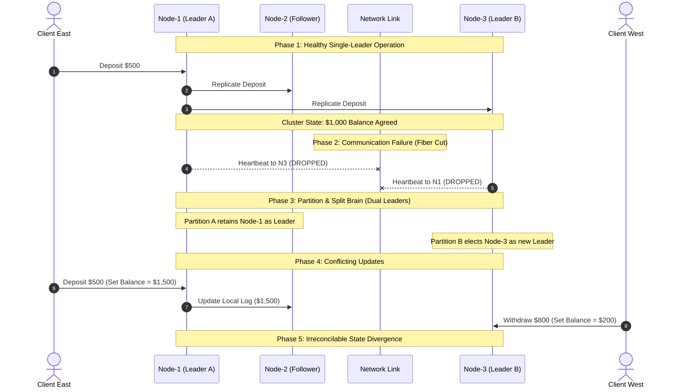

# 🧠 Day 8 — Split Brain: The Most Terrifying Failure

Yesterday, we learned how distributed clusters reach consensus—how a single leader proposes changes and relies on nodes to vote and agree before committing state updates.

Today, we explore what happens when they stop agreeing entirely. 

What happens when a cluster does not just lose a leader, but fractures into isolated pieces that can no longer speak to one another—yet remain completely healthy, operational, and eager to accept user traffic?

---

## 💥 The Problem

Imagine a global financial institution operating a high-availability distributed payment platform across two major data centers: `DC-East` in New York and `DC-West` in London.

```
+-----------------------------------+         +-----------------------------------+
|         DATA CENTER EAST          |         |         DATA CENTER WEST          |
|            (New York)             |         |             (London)              |
|                                   |         |                                   |
|   [ Server 1 ]     [ Server 2 ]   |         |   [ Server 3 ]     [ Server 4 ]   |
|   (Leader A)       (Follower)     |         |   (Leader B)       (Follower)     |
|                                   |         |                                   |
|   Balance State: $1,000           |         |   Balance State: $1,000           |
+-----------------+-----------------+         +-----------------+-----------------+
                  |                                             |
                  +========= Transatlantic Fiber Link ==========+
                                  (CUT / DISCONNECTED)
```

At 02:14:00 UTC, a construction crew in the Atlantic cuts the primary undersea fiber optic cable connecting the two data centers. Backup network routes fail to converge.

Suddenly, communication between `DC-East` and `DC-West` is severed completely.

Here is the critical detail: **Neither data center has suffered a hardware crash.**
* Power is on in both New York and London.
* All CPUs, SSD storage arrays, and local rack switches are running at peak performance.
* Customers in the US can still connect to `DC-East`.
* Customers in Europe can still connect to `DC-West`.

Because both sites are fully functional, both data centers continue to accept transaction requests:
1. **At 02:15:00 UTC**, a user in New York deposits **$500** into Account #4092 at `DC-East`. `DC-East` updates its local database record: *Balance = $1,500*.
2. **At 02:15:05 UTC**, the same user's shared business partner in London withdraws **$800** from Account #4092 at `DC-West`. `DC-West` reads its local state ($1,000 initial balance), approves the withdrawal, and updates its local record: *Balance = $200*.

Hours later, the fiber link is repaired, and the two data centers reconnect.

`DC-East` claims Account #4092 has **$1,500**.  
`DC-West` claims Account #4092 has **$200**.

### ❓ Ask Yourself
> **How can two healthy systems both believe they're correct?**  
> Which balance is real? Was $500 deposited, or was $800 withdrawn? Or both? How do you reconcile two completely valid, conflicting histories when neither side committed an error?

---

## 🔬 Why This Happens

To understand why this scenario occurs, we must look at what is—and isn't—failing inside the cluster.

When a server crashes (e.g., power supply dies or motherboard shorts), it stops processing instructions. It drops off the network, stops responding to pings, and accepts zero writes. While losing a server is inconvenient, it is **safe**: dead machines do not write corrupted data.

In our multi-datacenter story, however:
* **Machines are still running.**
* **Disks are healthy.**
* **CPU is fine.**
* **Memory is fine.**

The **only** thing that failed is **communication**.

```
+-------------------------------------------------------------------------------+
|                        THE DANGEROUS MISUNDERSTANDING                         |
|                                                                               |
|  [ Partition A: DC-East ]                          [ Partition B: DC-West ]   |
|  "I haven't heard from West.                       "I haven't heard from East.  |
|   They must have burned down.                       They must have crashed.   |
|   I will stay active and                           I will step up and become  |
|   process all traffic alone!"                      the new leader!"           |
+-------------------------------------------------------------------------------+
```

Without an active communication link, each side has **incomplete information**. 

Because `DC-East` cannot ping `DC-West`, `DC-East` assumes `DC-West` might be offline. Likewise, `DC-West` cannot ping `DC-East`, so it assumes `DC-East` has crashed. 

With no way to verify the remote state, **each side assumes responsibility for keeping the business online.** Each side elects or maintains its own leader, accepts writes, and operates as if it were the sole surviving portion of the infrastructure.

This fundamental misunderstanding—where two healthy sub-clusters operate independently under the assumption that the other is dead—creates catastrophic consequences.

---

## ❌ The Wrong Solution

When engineers first encounter network isolation, their immediate instinct is to prioritize system availability above all else. They propose several common beginner assumptions:

```
+-----------------------------------------------------------------------------------+
| NAIVE ASSUMPTION 1: Keep both sides accepting writes                             |
| "We shouldn't drop customer traffic just because of a network glitch! Let both   |
|  sides accept updates and we'll sync them later."                                |
| 💥 PRODUCTION CONSEQUENCE: Irreversible data corruption. Non-commutative         |
|    operations (like bank balances or inventory counters) diverge into impossible |
|    states that cannot be unraveled automatically.                                |
+-----------------------------------------------------------------------------------+
| NAIVE ASSUMPTION 2: Assume synchronization can happen later                       |
| "When the network comes back, we'll just merge the database tables."             |
| 💥 PRODUCTION CONSEQUENCE: Which record wins? Overwriting Partition A with       |
|    Partition B erases legitimate deposits. Overwriting B with A erases real       |
|    withdrawals. Merging creates duplicate operations or lost updates.            |
+-----------------------------------------------------------------------------------+
| NAIVE ASSUMPTION 3: Trust whichever server responds first                         |
| "Clients will just query both servers and pick whichever one answers fastest."   |
| 💥 PRODUCTION CONSEQUENCE: Race conditions. Clients get flip-flopping answers     |
|    depending on network routing, causing phantom data glitches.                   |
+-----------------------------------------------------------------------------------+
| NAIVE ASSUMPTION 4: Automatically merge everything afterward                      |
| "Just take the maximum timestamp or average the balances!"                        |
| 💥 PRODUCTION CONSEQUENCE: Averaging $1,500 and $200 gives $850—a balance that   |
|    NEVER existed in physical reality, corrupting audit trails permanently.        |
+-----------------------------------------------------------------------------------+
```

Allowing both isolated halves to process writes destroys the single source of truth. The system enters a state where two divergent realities exist simultaneously.

---

## 💡 The Right Mental Model

To build intuition for this failure, consider a real-world human analogy: **A company with two CEOs.**

```
                           +------------------------+
                           |   GLOBAL HEADQUARTERS  |
                           |    (Single Company)    |
                           +-----------+------------+
                                       |
                   +-------------------+-------------------+
                   |                                       |
                   v                                       v
         [ New York Office ]                     [ London Office ]
         - 50 Employees                          - 50 Employees
         - Full Autonomy                         - Full Autonomy
```

Imagine a international firm with main offices in New York and London. Normally, executive decisions are coordinated over daily phone calls by the chief executive.

One morning, transatlantic telecommunications collapse completely. No emails, calls, or messages can cross the ocean.

1. **In New York**, the executive board waits 24 hours. Hearing nothing from London, they assume a catastrophic event destroyed the London branch. To keep the enterprise alive, New York appoints **CEO Alice** and resumes operations.
2. **In London**, the local board also waits 24 hours. Hearing nothing from New York, they assume the New York branch has collapsed. To preserve the enterprise, London appoints **CEO Bob** and resumes operations.

For the next three weeks:
* **CEO Alice** (New York) hires 20 new engineers, signs a $2M office lease, and pivots the company strategy to Cloud Software.
* **CEO Bob** (London) hires 15 sales directors, signs a $3M lease, and pivots the company strategy to Hardware Manufacturing.

Three weeks later, telecommunications are restored.

```
                  +------------------------------------------+
                  |           TELECOM RESTORED               |
                  |                                          |
                  |  New York: CEO Alice (Cloud Software)    |
                  |  London:   CEO Bob   (Hardware Mfg)      |
                  +--------------------+---------------------+
                                       |
                                       v
                  [ THE REAL CHALLENGE IS NOT COMMUNICATION ]
                  [ IT IS DECIDING WHICH REALITY SURVIVES   ]
```

Now the company has two legal CEOs, two conflicting hiring plans, two incompatible product strategies, and two legally binding leases that exceed total corporate cash reserves.

Notice the key insight: **The challenge isn't restoring communication. The challenge is deciding which decisions should survive—and dealing with the collateral damage of the decisions that cannot.**

### Connecting Back to Distributed Systems

This exact condition in computing is called **Split Brain**.

> **Split Brain**  
> *A state in a distributed system where a network partition isolates nodes into two or more independent groups, causing multiple nodes to simultaneously assume leadership and process conflicting updates without mutual awareness.*

Split Brain occurs not because systems are broken, but because **healthy systems make independent, reasonable decisions based on incomplete information.**

---

## ⚙️ How It Actually Works

Let's trace the progressive engineering sequence that leads to a Split Brain disaster:

```
[1. Healthy Cluster] ----> [2. Network Link Fails] ----> [3. Isolation Occurs]
                                                                  |
                                                                  v
[6. Data Corruption] <---- [5. Conflicting Writes] <---- [4. Dual Leaders Emerge]
```

1. **Cluster starts healthy**: All nodes are interconnected. A single elected leader coordinates all state mutations across the cluster.
2. **Communication link fails**: A network switch fails, a router misconfigures, or a fiber link cuts, creating a network boundary between groups of nodes.
3. **Nodes become isolated**: The cluster is severed into two or more isolated subnets. Neither partition can send or receive packets across the partition line.
4. **Each side believes it's alone**: Nodes in Partition A receive no heartbeats from Partition B. Nodes in Partition B receive no heartbeats from Partition A. Both sides infer that the other side must have crashed.
5. **Independent leaders emerge**: Partition A continues relying on its existing leader. Partition B holds a local election and promotes a new leader. **Two active leaders now exist simultaneously.**
6. **Conflicting writes occur**: Unaware of each other, both leaders accept write operations from clients, mutating local states in contradictory ways.
7. **Data becomes difficult to reconcile**: When the partition heals, the system holds two divergent, non-mergeable write logs. 

Production systems work extremely hard to prevent Split Brain because once data is silently corrupted across dual leaders, **no automated algorithm can fix the state without losing real user data.**

---

## 📊 Visual Explanation

### ASCII Architecture Diagram

```
                       +-------------------------------+
                       |        HEALTHY CLUSTER        |
                       |  [N1-Leader] <-> [N2] <-> [N3]|
                       +---------------+---------------+
                                       |
                                       v (Network Fiber Severed)
                       +---------------+---------------+
                       |       NETWORK PARTITION       |
                       |  [Subnet A]   X   [Subnet B]  |
                       +---------------+---------------+
                                       |
                                       v
                       +---------------+---------------+
                       |         CLUSTER SPLIT         |
                       | [N1, N2]             [N3, N4] |
                       +---------------+---------------+
                                       |
                                       v
                       +---------------+---------------+
                       |     TWO INDEPENDENT LEADERS   |
                       | (Leader: N1)       (Leader: N3)|
                       +---------------+---------------+
                                       |
                                       v
                       +---------------+---------------+
                       |     CONFLICTING DECISIONS     |
                       | (Balance=$1500)   (Balance=$200)|
                       +-------------------------------+
```

---

### Mermaid Sequence Diagram



---

### Timeline Diagram

```
TIME --------------------------------------------------------------------------------------->

00:00        01:00                      02:00                    03:00              04:00
  |------------|--------------------------|------------------------|------------------|
  |            |                          |                        |                  |
[Healthy Cluster]                   [Network Failure]    [Independent Decisions]  [Conflict Unveiled]
Single Leader (N1)                   Link severs DC1      N1 accepts Deposit +$500 Network Heals;
Balance = $1,000                     from DC2             N3 accepts Withdraw -$800 Balance Divergence
All nodes in sync                    Dual Leaders Active  DC1=$1,500 vs DC2=$200   State Corrupted!
```

---

### Architectural Image Assets

The following visual artifacts illustrate the Split Brain state inside `assets/`:

```
assets/
├── split-brain-overview.png
├── cluster-partition.png
├── dual-leaders.png
└── two-ceos-analogy.png
```

1. **`split-brain-overview.png`**  
   *What it communicates*: High-level systemic overview comparing a healthy unified cluster against a fractured cluster experiencing split-brain data divergence.
2. **`cluster-partition.png`**  
   *What it communicates*: Detailed network-layer view showing how router table drops or physical link failures sever packet transmission while node hardware metrics (CPU, RAM, Disk) remain green.
3. **`dual-leaders.png`**  
   *What it communicates*: Concrete node-state diagram highlighting two isolated leaders issuing contradictory write commands to their local state stores.
4. **`two-ceos-analogy.png`**  
   *What it communicates*: Conceptual organizational diagram illustrating two isolated corporate headquarters appointing separate CEOs and making opposing business commitments.

---

## 🌍 Real World Example: Kubernetes Control Plane & etcd

To appreciate the gravity of Split Brain, look at **`etcd`**, the distributed key-value store that acts as the single source of truth for **Kubernetes**.

```
+-------------------------------------------------------------------+
|                  KUBERNETES CONTROL PLANE ARCHITECTURE            |
|                                                                   |
|   [ kubectl apply ] -> [ API Server ] -> [ etcd Cluster Engine ]  |
|                                                  |                |
|                                        +---------+---------+      |
|                                        |                   |      |
|                                   [ etcd-Node1 ]     [ etcd-Node2 ]|
|                                     (Leader)           (Follower) |
+-------------------------------------------------------------------+
```

`etcd` stores the location, status, and IP configuration of every container running across a cloud cluster.

If `etcd` were to suffer a Split Brain failure:
1. **Partition A (Leader 1)** might receive a command to launch 50 instances of an API gateway on Node Subnet 1, assigning them IP block `10.240.0.0/24`.
2. **Partition B (Leader 2)**, isolated by a network flaw, might simultaneously receive a request to launch a database cluster, assigning them the **exact same** IP block `10.240.0.0/24` and mounting the same cloud storage volume.
3. When communication recovers, two completely different application workloads would attempt to attach to the same physical disk volumes and bind to identical IP addresses.

The resulting state would trigger catastrophic pod crashes, corrupted persistent volumes, and cluster-wide outages.

For this architectural reason, systems like `etcd` are specifically designed to **refuse client operations** whenever they cannot confirm full single-leader authority. Protecting the system from Split Brain is deemed far more critical than remaining 100% available during a network partition.

---

## 🛠️ Build It Yourself

To develop a hands-on intuition for how network partitions create dual leaders and data corruption, explore the educational simulations in Python located in the `code/` directory:

1. **[network_partition_demo.py](code/network_partition_demo.py)**  
   *Simulates network-layer isolation across a 5-node cluster. Demonstrates how physical link failures block cross-boundary traffic while internal subnet traffic and node health remain 100% functional.*
2. **[split_brain_simulation.py](code/split_brain_simulation.py)**  
   *Simulates the full Split Brain crisis: network partitioning, dual-leader election, concurrent client writes (deposits vs withdrawals), state divergence, and the resulting reconciliation failure upon network restoration.*

### Running the Simulations

Run the scripts directly from your terminal:

```bash
# 1. Run the Network Partition Topology Simulation
python code/network_partition_demo.py

# 2. Run the Full Split Brain & Data Divergence Simulation
python code/split_brain_simulation.py
```

### Key Highlights from the Code

In [split_brain_simulation.py](code/split_brain_simulation.py), observe how simple node logic leads to catastrophic state divergence:

```python
# Partition A Leader (Node-1) accepts deposit:
nodes["Node-1"].process_transaction("Client-1", "DEPOSIT", 500.0)
# Result: Partition A Balance = $1,500.00

# Partition B Leader (Node-3) accepts withdrawal:
nodes["Node-3"].process_transaction("Client-2", "WITHDRAWAL", 800.0)
# Result: Partition B Balance = $200.00

# Upon network restoration:
# Node-1 Log: ['INITIAL: $1000', 'DEPOSIT: +$500']
# Node-3 Log: ['INITIAL: $1000', 'WITHDRAWAL: -$800']
# IRRECONCILABLE CONFLICT: Neither log can overwrite the other without destroying valid data!
```

---

## ⚠️ Common Misconceptions

```
+-----------------------------------------------------------------------------------+
| MISCONCEPTION 1: "Split Brain means the servers crashed."                         |
| REALITY: False! Split Brain ONLY happens when servers ARE healthy. If the servers |
| had crashed, they wouldn't process writes and no split brain would occur.         |
+-----------------------------------------------------------------------------------+
| MISCONCEPTION 2: "Split Brain only affects relational databases."                |
| REALITY: False. Split Brain impacts distributed file systems, message queues,     |
| Kubernetes clusters, service discovery engines, and cache clusters equally.       |
+-----------------------------------------------------------------------------------+
| MISCONCEPTION 3: "Network failures always bring down the entire system."         |
| REALITY: Incorrect. Network partitions often isolate segments of a cluster while  |
| leaving local connectivity fully intact, allowing nodes to continue running.     |
+-----------------------------------------------------------------------------------+
| MISCONCEPTION 4: "Reconnecting the network automatically fixes data conflicts."   |
| REALITY: Restoring the network only restores packet delivery. It exposes the      |
| conflicting states created while disconnected—making manual cleanup necessary.   |
+-----------------------------------------------------------------------------------+
| MISCONCEPTION 5: "Having two active leaders improves cluster availability."      |
| REALITY: Having two leaders creates illusionary availability at the cost of       |
| silent data corruption. It is the most dangerous state in distributed systems.   |
+-----------------------------------------------------------------------------------+
```

---

## ⚖️ Production Trade-offs

Engineering a distributed system requires balancing availability against consistency during network failures.

```
                  +-------------------------------------------+
                  |         THE HARD PRODUCTION CHOICE        |
                  |                                           |
                  |   ALLOW WRITES         REJECT WRITES      |
                  |   (Risk Split Brain)   (Sacrifice Availability)
                  +-------------------------------------------+
```

### Production Risks of Split Brain
* **Data Corruption**: Overwriting valid transaction logs with contradictory records.
* **Duplicate Operations**: Executing payment payouts, order dispatches, or email sends twice.
* **Conflicting Writes**: Creating two different records with identical primary keys or IP bindings.
* **Operational Recovery Complexity**: Requiring engineers to perform manual database forensic patches during late-night incident responses.

### Critical Engineering Considerations
* **Detecting Partitions Quickly**: Nodes must recognize missing heartbeats without prematurely panicking over transient network jitter.
* **Preventing Multiple Leaders**: Systems must enforce rules that forbid isolated node groups from assuming leadership unless safety criteria are met.
* **Prioritizing Correctness Over Availability**: Choosing to return an error to a client is vastly preferable to accepting a write that corrupts the database.
* **Recovery Planning**: Designing explicit operational runbooks for resolving state mismatches when catastrophic partitions occur.

---

## 📌 Key Takeaways

1. **Split Brain is a network failure, not a hardware crash**: Disks, CPUs, and memory remain fully operational while communication breaks down.
2. **Two healthy systems are far more dangerous than one dead system**: A dead node stops executing; an isolated healthy node creates corrupted data.
3. **Incomplete information drives bad decisions**: Nodes cannot distinguish between a crashed remote server and a cut network cable.
4. **Dual leaders emerge naturally**: Isolated subnets assume the remote leader is dead and elect local leaders to maintain uptime.
5. **Divergent writes destroy consistency**: Accepting writes across isolated leaders creates non-mergeable transaction histories.
6. **Restoring the network does not restore order**: Reconnection merely reveals the irreconcilable data conflicts created during the outage.
7. **The Two CEOs analogy is the core mental model**: Restoring corporate calls doesn't fix having signed two opposing business contracts.
8. **Automated resolution is often impossible**: You cannot automatically merge non-commutative operations like bank withdrawals and deposits without losing data.
9. **Correctness must supersede availability**: In critical state stores, refusing client writes during a partition is safer than accepting uncoordinated updates.
10. **Split Brain prevention is the top priority for coordination engines**: Distributed infrastructure works tirelessly to ensure only ONE leader can ever exist.

---

## ❓ Interview Questions

### 1. What is Split Brain in a distributed system?
**Answer:** Split Brain is a failure state caused by a network partition where a cluster fractures into isolated groups of nodes. Lacking communication, each isolated group presumes the others have failed and independently elects its own leader. This leads to multiple active leaders accepting conflicting writes simultaneously.

### 2. Why is Split Brain considered more dangerous than a complete node crash?
**Answer:** When a node crashes, it stops executing instructions and accepts no writes, preserving data safety. During Split Brain, all nodes remain healthy and active. Dual leaders accept contradictory client updates, causing silent, permanent data corruption that is extremely difficult to detect and repair.

### 3. How can two completely healthy data centers produce incorrect data?
**Answer:** If the network link between two data centers breaks, neither data center can communicate with the other. Operating under incomplete information, both data centers assume leadership to maintain service availability. When clients send writes to both sites, each processes the requests locally, producing divergent, incompatible data histories.

### 4. Why is recovering from conflicting data harder than recovering from system downtime?
**Answer:** Recovering from downtime simply requires restoring servers and processing queued requests in order. Recovering from conflicting data requires untangling two valid, overlapping transaction histories (e.g., matching deposits vs withdrawals), deciding which operations to discard, and dealing with real-world financial or business side-effects.

### 5. Why do production coordination engines (like etcd) refuse writes when disconnected from the cluster?
**Answer:** Coordination engines prioritize consistency over availability. If an etcd node loses contact with the rest of the cluster, it cannot guarantee that it is part of the authoritative leader group. Refusing client writes prevents the system from accepting updates that would lead to Split Brain corruption.

---

## 📚 Further Reading

For deeper research papers, engineering post-mortems, and architectural guides on network partitions and split brain failures, consult **[references.md](references.md)**.

---

## 🔮 What you'll build intuition for tomorrow

Preventing Split Brain requires systems to detect failures quickly and make a fundamental decision: **Is a missing machine truly dead—or simply unreachable?**

Tomorrow, in **Day 9 — Heartbeats**, we will build intuition for how nodes signal life across network boundaries, how timers determine when a leader is gone, and why timing a heart's beat in a distributed world is harder than it sounds.
