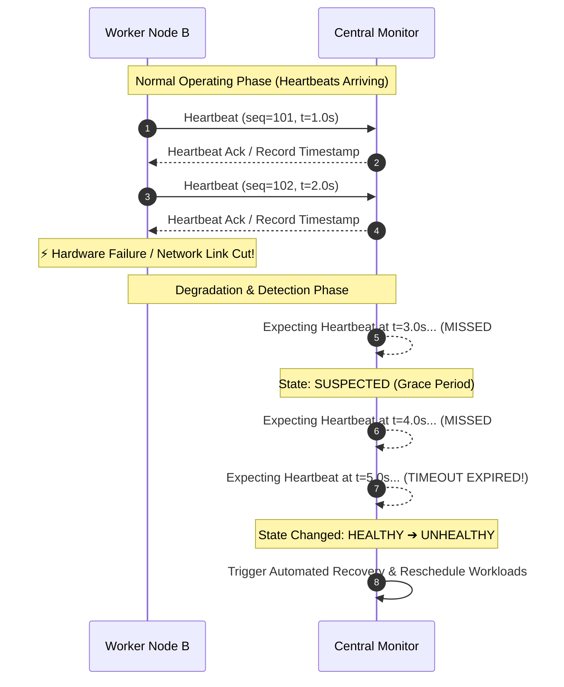

# 💓 Day 9 — Heartbeats: How Clusters Know Who's Alive

Every distributed system operating at scale must continuously answer one simple, fundamental question:

**Which machines can I still trust?**

Before a cluster can route customer traffic, replicate database writes, or assign critical jobs to a node, it must know whether that node is alive and healthy. If a machine crashes or becomes disconnected while the cluster assumes it is healthy, data gets lost, requests time out, and users experience outages. 

However, answering whether a node is alive in a network of independent computers is far harder than it sounds.

---

## 💥 The Problem

Imagine running a critical production Kubernetes cluster backing an e-commerce platform. At 03:00 AM, a worker node hosting 50 customer checkout microservices suddenly stops acknowledging traffic.

```
                  +-----------------------------------+
                  |      KUBERNETES CONTROL PLANE     |
                  |        (Cluster Orchestrator)     |
                  +-----------------+-----------------+
                                    |
          +-------------------------+-------------------------+
          |                         |                         |
          v                         v                         v
  +---------------+         +---------------+         +---------------+
  | Worker Node 1 |         | Worker Node 2 |         | Worker Node 3 |
  |  [ HEALTHY ]  |         |  [ SILENT? ]  |         |  [ HEALTHY ]  |
  +---------------+         +---------------+         +---------------+
```

The control plane orchestrator detects that `Worker Node 2` hasn't responded to its latest network ping. 

The control plane must immediately make a decision:
* **Is the node temporarily overloaded** with high CPU usage or garbage collection pauses, meaning it will respond in a few seconds?
* **Is the network link slow** or experiencing transient packet drops between racks?
* **Has the physical machine crashed**, suffered power loss, or Kernel panic?
* **Should workloads be moved elsewhere** by terminating pods and rescheduling them onto `Worker Node 1` and `Worker Node 3`?

If the control plane acts too quickly and reschedules pods while `Worker Node 2` is still running, it risks running duplicate instances, causing database lock contention or double-billing transactions. If it waits too long, users trying to checkout will experience broken screens and timeout errors.

### ❓ Ask Yourself
> **How long should the cluster wait before declaring a machine dead?**  
> If you wait 50 milliseconds, a tiny network jitter marks healthy nodes dead. If you wait 10 minutes, your service remains broken for 10 minutes. How can a cluster distinguish a dead node from a slow one when all it observes is silence?

---

## 🔬 Why This Happens

In the physical world, if a car crashes into a wall, the crash produces noise, smoke, and visible damage. In software running on a single computer, if a thread throws an exception, the operating system catches it and prints a stack trace.

In distributed systems, however, **machines don't send a message saying:**

> *"Attention cluster: I just lost power and my memory hardware burned out. Please stop sending me traffic!"*

Instead, when a failure occurs:
* **Messages simply stop arriving.**
* **Network cables get unplugged or routers drop packets.**
* **Operating system kernels hang or freeze.**
* **Power cables are tripped, turning off the motherboard instantly.**
* **Long Garbage Collection (GC) pauses freeze application execution.**

```
+-------------------------------------------------------------------------------+
|                       THE SILENCE OF DISTRIBUTED FAILURE                      |
|                                                                               |
|   HEALTHY NODE                              CRASHED OR NETWORK-CUT NODE       |
|   +-----------------------+                 +-----------------------+         |
|   |  Node A               |                 |  Node B               |         |
|   |  "I am sending data!" |                 |  (Power Disconnected) |         |
|   +-----------+-----------+                 +-----------+-----------+         |
|               |                                         |                     |
|               v                                         v                     |
|     [ Packets Transmitted ]                    [ Total Silence ]              |
|                                                                               |
|   The cluster hears regular messages.       The cluster hears nothing.        |
+-------------------------------------------------------------------------------+
```

Because a dead server cannot announce its own death, **the cluster must infer failure strictly from missing communication.**

---

## ❌ The Wrong Solution

When engineers first attempt to monitor cluster health, they usually propose several naive solutions. Each creates severe operational failures in production:

```
+-----------------------------------------------------------------------------------+
| NAIVE IDEA 1: Declare failure after ONE missed message                            |
| "If a node misses a single request, assume it crashed immediately."               |
| 💥 PRODUCTION CONSEQUENCE: Massive false positives. A minor 10ms network jitter  |
| triggers unnecessary failovers, thrashing the cluster and cascading outages.      |
+-----------------------------------------------------------------------------------+
| NAIVE IDEA 2: Wait forever until the node comes back                              |
| "Never declare a node dead unless we get explicit confirmation."                  |
| 💥 PRODUCTION CONSEQUENCE: Infinite hangs. If a node actually burned out, tasks   |
| assigned to it stall forever, leaving users stranded on frozen loading screens.   |
+-----------------------------------------------------------------------------------+
| NAIVE IDEA 3: Every node continuously pings every other node every millisecond    |
| "Maximum awareness! Have all 1,000 servers check each other non-stop."            |
| 💥 PRODUCTION CONSEQUENCE: Network congestion (N² complexity). Traffic monitoring |
| consumes more bandwidth than the actual application workload.                     |
+-----------------------------------------------------------------------------------+
| NAIVE IDEA 4: Instantly restart servers the moment a response is delayed         |
| "If a server is slow, reboot it right away."                                      |
| 💥 PRODUCTION CONSEQUENCE: Thundering herd and reboot loops. Overloaded servers   |
| are forced into reboot cycles, making cluster congestion far worse.               |
+-----------------------------------------------------------------------------------+
```

---

## 🏔️ The Right Mental Model: The Mountain Climbers in the Fog

To build intuition for how distributed systems solve this problem, imagine a team of five mountain climbers navigating a narrow ridge in thick, dense fog.

```
       Climber 1          Climber 2          Climber 3          Climber 4
        (Leader)          (Follower)         (Follower)         (Follower)
         [🗣️]              [🗣️]              [🗣️]              [🗣️]
          |                  |                  |                  |
   "I'm here!" (t=0s)  "I'm here!" (t=0s) "I'm here!" (t=0s) "I'm here!" (t=0s)
          |                  |                  |                  |
   ~~~~~~~~~~~~~~~~~~~~ DENSE FOG / VISIBILITY: ZERO ~~~~~~~~~~~~~~~~~~~~
```

Because the fog is pitch black, climbers cannot see each other. To stay safe and verify that no one has fallen off the cliff, they establish a standard protocol:

> **Every 5 seconds, every climber must shout across the fog: *"I'm here!"***

Now, trace what happens when someone stops shouting:

1. **At t = 5s**: Climber 3 shouts *"I'm here!"*. Everyone hears it and stays calm.
2. **At t = 10s**: A sudden gust of wind blows. Climber 3 shouts, but the wind muffles the sound. The team misses Climber 3's call out.  
   *Do they immediately panic and stop the expedition, assuming Climber 3 fell into a ravine?* **No.** They know wind or temporary noise can block a single call.
3. **At t = 15s**: Climber 3 misses a second consecutive call out. Now, eyebrows raise. The team shifts from normal operation to a state of **suspicion**.
4. **At t = 20s**: Climber 3 misses a third consecutive call out. The time window has expired. The team stops, marks Climber 3 as **missing**, and initiates safety search and recovery protocols.

### 💡 Connecting the Analogy to Distributed Systems

This simple protocol is precisely how distributed systems monitor node health:

| Mountain Climber Concept | Distributed Systems Primitive |
| :--- | :--- |
| **Shouting *"I'm here!"*** | Periodic **Heartbeat** message sent across the network. |
| **5-second shout frequency** | **Heartbeat Interval** ($T_{\text{interval}}$). |
| **Missing 1 call due to wind** | Transient network packet drop or GC pause. |
| **Growing concerned after 2 calls** | Transitioning node status from `HEALTHY` to `SUSPECTED`. |
| **Stopping after 3 missed calls** | Reaching the **Heartbeat Timeout** ($T_{\text{timeout}}$) threshold. |
| **Starting recovery search** | Declaring node `UNHEALTHY` and initiating automated failover. |

---

## ⚙️ How It Actually Works

Now that we have the mental model, let's step through the engineering implementation of a heartbeat system.

```
 +-------------+                                +------------------+
 |  Worker B   | ---- Periodic Heartbeat ---->  | Cluster Leader   |
 |  (Sender)   |      (seq=1, t=01:00:01)       |   or Monitor     |
 +-------------+                                +------------------+
                                                         |
                                                         v
                                                [ Reset Timer ]
                                                State: HEALTHY
```

1. **Periodic Transmission**: Every node in the cluster runs a lightweight background timer thread. At configured intervals (e.g., every 1 second), it sends a small network packet—a **heartbeat**—to a designated monitor or leader node.
2. **Lightweight Design**: A heartbeat contains minimal data (such as `node_id`, `timestamp`, and `sequence_number`). Because it travels across the network continuously, keeping it tiny ensures it consumes negligible network bandwidth.
3. **Tracking Expectation Window**: The monitoring node maintains a record of when it last received a heartbeat from each node. It expects a new heartbeat within a defined window.
4. **Grace Period for Jitter**: Networks are naturally noisy. A heartbeat might be delayed by a few milliseconds due to queueing. Therefore, monitors do not react to a single missing beat.
5. **Threshold Expiration & State Transition**: If heartbeats stop arriving for a specified duration exceeding the timeout threshold (e.g., 3 missed heartbeats = 3.0 seconds):
   * The monitor marks the node as **UNHEALTHY** (or `DEAD`).
   * The cluster controller revokes the node's permissions and begins recovery procedures.

> [!NOTE]
> The fundamental takeaway of heartbeating is that **the hardest part isn't sending or receiving messages—it is deciding when a missing heartbeat really means a machine is dead.**

---

## 📐 Visual Explanation

### 1. ASCII Structural Flow

```
+-----------------------------------------------------------------------------------+
|                           HEARTBEAT MONITORING LIFECYCLE                          |
|                                                                                   |
|   +------------+        Heartbeat (seq=1)        +------------------+             |
|   |  Follower  | ------------------------------> |  Cluster Leader  |             |
|   |   Node A   | <--- Ack / Heartbeat (seq=1) -- |   / Monitor      |             |
|   +------------+                                 +------------------+             |
|          |                                                |                       |
|          | (Power Loss / Failure Occurs)                  |                       |
|          x                                                |                       |
|          |  [ Heartbeat Missing ]                         v                       |
|          + - - - - - - - - - - - - - - - - - - -> [ Timer Running ]               |
|                                                           |                       |
|                                                           v                       |
|                                                   [ Timeout Reached ]             |
|                                                           |                       |
|                                                           v                       |
|                                                [ Node Marked UNHEALTHY ]          |
+-----------------------------------------------------------------------------------+
```

---

### 2. Mermaid Sequence Diagram



---

### 3. Timeline Diagram

```
Timeline (Seconds)
t=0s       t=1s       t=2s       t=3s       t=4s       t=5s       t=6s
|----------|----------|----------|----------|----------|----------|
   [HB 1]     [HB 2]     [HB 3]     [MISSED]   [MISSED]   [TIMEOUT]
     |          |          |           |          |          |
  HEALTHY    HEALTHY    HEALTHY    SUSPECTED  SUSPECTED   UNHEALTHY
                                                          (DECLARED DEAD)
```

---

### 📐 Asset Specifications (inside `assets/`)

To visually reinforce these concepts, four static architectural diagram specs are defined under `assets/`:

1. **[heartbeat-overview.png](file:///d:/30_Days_of_Distributed_Systems/days/Day-09-Heartbeats/assets/heartbeat-overview.png)**
   * **What it communicates**: A high-level topology diagram illustrating a 5-node cluster with four nodes regularly emitting lightweight heartbeat packets to a central monitor, while one isolated node's packets fail to cross a severed network link.
2. **[heartbeat-timeline.png](file:///d:/30_Days_of_Distributed_Systems/days/Day-09-Heartbeats/assets/heartbeat-timeline.png)**
   * **What it communicates**: A linear timeline contrasting a healthy node (steady heartbeat pulses every 1s) with a failing node (pulse stops at t=3s, grace period elapses, timeout limit breaches at t=6s, triggering failure declaration).
3. **[node-health-monitoring.png](file:///d:/30_Days_of_Distributed_Systems/days/Day-09-Heartbeats/assets/node-health-monitoring.png)**
   * **What it communicates**: A state machine diagram showing valid node state transitions: `HEALTHY` $\xrightarrow{\text{missed heartbeat}}$ `SUSPECTED` $\xrightarrow{\text{timeout exceeded}}$ `UNHEALTHY`, as well as the recovery transition `SUSPECTED` $\xrightarrow{\text{heartbeat received}}$ `HEALTHY`.
4. **[mountain-climbers-analogy.png](file:///d:/30_Days_of_Distributed_Systems/days/Day-09-Heartbeats/assets/mountain-climbers-analogy.png)**
   * **What it communicates**: An conceptual illustration depicting mountain climbers shouting across fog at fixed intervals, mapping team communication directly to heartbeat signals, grace periods, and timeout limits.

---

## 🌐 Real World Example: Kubernetes Node Health

In production Kubernetes clusters, thousands of worker nodes host critical containerized applications. Kubernetes relies on heartbeats to maintain cluster topology awareness.

```
+-------------------------------------------------------------------------------+
|                        KUBERNETES NODE HEARTBEAT ARCHITECTURE                 |
|                                                                               |
|   +-------------------+                           +-----------------------+   |
|   |   Worker Node     |   Periodic Node Lease     |  Kubernetes Control   |   |
|   |  (kubelet process)| ------------------------> |  Plane (API Server)   |   |
|   +-------------------+   (Heartbeat every 10s)   +-----------------------+   |
|                                                               |               |
|                                                               v               |
|                                                   [ Node Lifecycle Controller]|
|                                                               |               |
|                                          Is Lease updated within 40s?         |
|                                            /                     \            |
|                                          YES                      NO          |
|                                          /                         \          |
|                                   Keep Node               Mark Node           |
|                                   Ready                   Ready=Unknown       |
|                                                           & Reschedule Pods   |
+-------------------------------------------------------------------------------+
```

* **The Heartbeat Sender**: Every Kubernetes worker node runs a background agent called `kubelet`. Periodically (by default every 10 seconds), `kubelet` updates a lightweight `Lease` resource in the Kubernetes API server as a heartbeat.
* **The Heartbeat Monitor**: The Kubernetes Control Plane runs a component called the `Node Lifecycle Controller`. It monitors node Leases across the cluster.
* **Failure Handling**: If a worker node fails to update its `Lease` heartbeat for a configured threshold (such as 40 seconds), the control plane transitions the node's status to `Ready=Unknown`. If heartbeats remain missing, Kubernetes marks the node unavailable and reschedules its workloads to healthy nodes elsewhere in the cluster.

---

## 🛠️ Build It Yourself: Python Heartbeat Simulation

We have provided a complete educational simulation inside the [`code/`](file:///d:/30_Days_of_Distributed_Systems/days/Day-09-Heartbeats/code) directory:

1. **[node_monitor.py](file:///d:/30_Days_of_Distributed_Systems/days/Day-09-Heartbeats/code/node_monitor.py)**: Implements the central heartbeat monitor, node state transitions (`HEALTHY`, `SUSPECTED`, `UNHEALTHY`), and timeout evaluation logic.
2. **[heartbeat_simulation.py](file:///d:/30_Days_of_Distributed_Systems/days/Day-09-Heartbeats/code/heartbeat_simulation.py)**: Runs a 5-node cluster simulation over discrete time steps where `node-3` crashes at $t = 3.0\text{s}$, illustrating missed beats and timeout detection.

### Running the Code

Execute the simulation directly using Python:

```bash
python days/Day-09-Heartbeats/code/heartbeat_simulation.py
```

### Key Implementation Snippets

#### 1. Evaluating Node Health against Timeout Thresholds ([node_monitor.py](file:///d:/30_Days_of_Distributed_Systems/days/Day-09-Heartbeats/code/node_monitor.py#L77-L114))

```python
def evaluate_node_health(self, node_id: str, current_time: float) -> NodeState:
    """
    Evaluates the health of a node by comparing elapsed time since its last
    heartbeat against configured timeout thresholds.
    """
    elapsed = current_time - self.last_heartbeat_time[node_id]
    missed = int(elapsed // self.heartbeat_interval)
    previous_state = self.node_states[node_id]

    # Threshold Check: Has elapsed time breached failure timeout?
    if elapsed >= self.timeout_threshold:
        new_state = NodeState.UNHEALTHY
    elif missed >= self.max_missed_heartbeats:
        new_state = NodeState.SUSPECTED
    else:
        new_state = NodeState.HEALTHY

    if new_state != previous_state:
        print(f"  [STATE CHANGE] Node '{node_id}': {previous_state.name} -> {new_state.name} "
              f"(Elapsed: {elapsed:.2f}s, Missed Beats: {missed})")
        self.node_states[node_id] = new_state

    return new_state
```

#### 2. Simulating Discrete Cluster Time Ticks ([heartbeat_simulation.py](file:///d:/30_Days_of_Distributed_Systems/days/Day-09-Heartbeats/code/heartbeat_simulation.py#L73-L105))

```python
# Execute discrete time step ticks (0.0s to 7.0s)
for tick in range(1, 8):
    simulated_clock = float(tick)

    # Inject Failure: node-3 stops sending heartbeats at t >= 3.0s
    if simulated_clock >= 3.0:
        nodes["node-3"].is_alive = False

    # Alive nodes dispatch heartbeats; failed nodes remain silent
    for nid, node in nodes.items():
        if node.is_alive:
            hb = node.produce_heartbeat(simulated_clock)
            monitor.receive_heartbeat(hb)

    # Monitor evaluates health across all registered nodes
    states = monitor.check_all_nodes(current_time=simulated_clock)
```

---

## ⚠️ Common Misconceptions

> [!CAUTION]
> Avoid these 5 dangerous operational misconceptions when designing heartbeat monitoring systems:

### 1. "One missed heartbeat means the server has crashed."
**Reality**: Networks experience temporary packet jitter, OS scheduler delays, and garbage collection pauses. A single missed heartbeat is almost never proof of server death. Treating one missed beat as a crash leads to severe false positives.

### 2. "Heartbeats guarantee a machine is fully healthy."
**Reality**: A heartbeat only proves that the node's background heartbeat thread and network interface are working. The server's disk could be full, its database corrupted, or its application code deadlocked.

### 3. "Heartbeats consume significant network bandwidth."
**Reality**: Heartbeats are intentionally designed as minimal payloads (a few dozen bytes). Sending 1 heartbeat per second consumes a fraction of a kilobit per second—negligible compared to application traffic.

### 4. "Every heartbeat failure requires immediate failover."
**Reality**: Executing a failover (re-electing leaders, re-routing traffic, rescheduling containers) is expensive and disruptive. Systems usually observe multiple missed heartbeats before incurring the cost of failover.

### 5. "A slow server is the same as a failed server."
**Reality**: A slow server is still executing instructions and holding locks; a failed server is inert. Confusing the two can trigger split-brain states where two nodes perform conflicting actions simultaneously.

---

## ⚖️ Production Trade-offs

Designing heartbeat parameters involves a perpetual trade-off between **detection speed** and **cluster stability**.

```
+-------------------------------------------------------------------------------+
|                       THE HEARTBEAT TUNING BALANCE                            |
|                                                                               |
|   SHORT TIMEOUT (e.g., 500ms)                  LONG TIMEOUT (e.g., 30s)       |
|   +-----------------------+                    +-----------------------+      |
|   |  Fast Failure Detection|                   |  High Stability       |      |
|   |  High False Positives  |                   |  Slow Failure Detection|     |
|   +-----------------------+                    +-----------------------+      |
|              \                                              /                 |
|               \--->   OPTIMAL TUNING WINDOW (2s - 10s)   <---/                |
+-------------------------------------------------------------------------------+
```

### Advantages of Heartbeats
* **Automated Failure Detection**: Monitors observe node silence without requiring human operators to check servers manually.
* **Predictable Recovery**: Enables automated orchestrators (like Kubernetes or Raft consensus groups) to initiate failover promptly.
* **Improved Availability**: Limits the blast radius of hardware crashes by rapidly routing traffic away from dead nodes.

### Challenges & Tuning Realities
* **Choosing Timeout Values**: Setting timeouts too short causes false positives (triggering unnecessary failovers during minor network spikes). Setting timeouts too long delays disaster recovery.
* **Network Instability**: In unstable networks, heartbeat traffic itself can get delayed, causing the monitor to declare healthy nodes dead.
* **Asymmetric Network Cuts**: A node might be able to send heartbeats to the leader, but unable to receive client requests, or vice versa.

---

## 📊 Key Takeaways

1. **Distributed nodes never announce their own crash**; the cluster must infer failure strictly from missing communication.
2. **Heartbeats are periodic, lightweight health signals** sent between nodes to prove liveness.
3. **The core challenge isn't detecting failures**—it's deciding when silence truly means a node is dead versus temporarily slow.
4. **Never react to a single missing heartbeat**; transient network jitter makes 100% immediate accuracy impossible.
5. **Node states transition gradually**: from `HEALTHY` $\rightarrow$ `SUSPECTED` (grace period) $\rightarrow$ `UNHEALTHY` (timeout breached).
6. **Heartbeat intervals ($T_{\text{interval}}$)** determine how frequently signals are sent (e.g., every 1s).
7. **Failure timeouts ($T_{\text{timeout}}$)** determine how long a cluster waits before taking automated recovery actions (e.g., 3s–10s).
8. **Heartbeats prove liveness, not total application health**; a thread can heartbeat while application logic is broken.
9. **Kubernetes uses node Leases** as heartbeats to scale health monitoring across large clusters.
10. **Tuning heartbeat parameters is a trade-off** between fast detection (low timeout) and cluster stability (high timeout).

---

## 👔 Interview Questions

### Q1: Why can't a distributed cluster instantly assume a node has failed after missing one heartbeat?
**Answer**: Because network latency in distributed systems is unpredictable. Microsecond network packet drops, transient rack switch queueing, or a brief 50ms garbage collection pause in the node's JVM can delay a heartbeat message. Instantly assuming failure on a single missed beat creates massive false positives, triggering unnecessary cluster re-elections and service thrashing.

### Q2: What happens if a cluster's heartbeat timeout ($T_{\text{timeout}}$) is set too short versus too long?
**Answer**: 
* **If set too short**: The cluster becomes hyper-sensitive to minor network jitter. Healthy nodes will frequently be declared dead, causing constant false alarms, premature failovers, and severe performance degradation.
* **If set too long**: The cluster takes a long time to detect actual node crashes. Applications assigned to dead nodes remain unresponsive for extended periods, causing poor customer availability and timeout errors.

### Q3: How do heartbeats enable automatic recovery in orchestrators like Kubernetes?
**Answer**: Heartbeats provide a continuous, real-time health signal to the control plane. When a node's heartbeat stops arriving beyond the configured Lease timeout, the control plane automatically updates the node state to unavailable, revokes task assignments, and reschedules pods onto healthy nodes without waiting for manual human engineer intervention.

### Q4: Does a successful heartbeat guarantee that a database node is processing user queries correctly?
**Answer**: No. A heartbeat only confirms that the network path and the background heartbeat transmitter thread are functional. It does not verify that the database process hasn't deadlocked, that disk I/O isn't stalling, or that local database tables aren't corrupted. Deep health verification requires application-level health checks in addition to network heartbeats.

---

## 📖 Further Reading

For detailed citations, book chapters, research papers, and technical blogs on heartbeats and liveness monitoring, refer to [references.md](file:///d:/30_Days_of_Distributed_Systems/days/Day-09-Heartbeats/references.md).

---

## 🚀 What you'll build intuition for tomorrow

Now that we understand how clusters continuously monitor node health using heartbeats and timeouts to detect when a node goes missing...

**Once a failure is detected reliably, how does a distributed system recover automatically without waiting for a human engineer?**

Tomorrow, in **Day 10: Failure Detection**, we will explore how clusters transition from simple heartbeat timers to robust failure detection systems that handle complex network conditions and coordinate automated cluster recovery!
