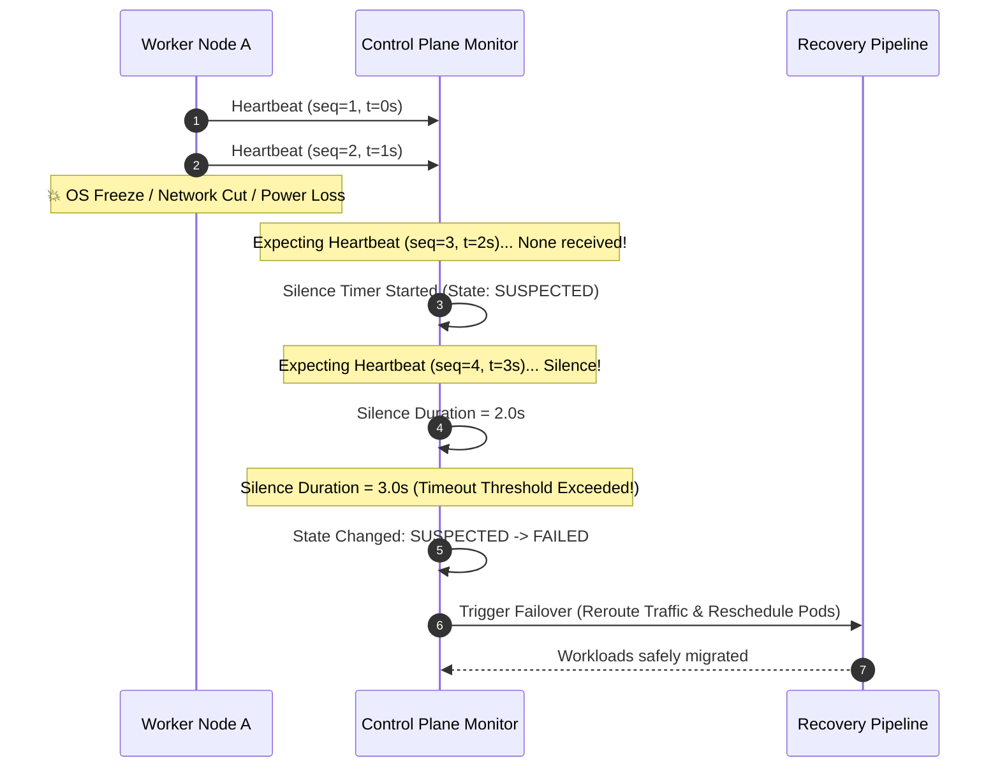

# 📡 Day 10 — Failure Detection: Servers Don't Actually Know If Another Server Died

Yesterday, we explored **heartbeats**—the periodic signal nodes send to announce *"I am still here."* We saw how clusters transmit ping packets across the network to establish basic liveness.

Today, we ask a deeper, far more fundamental question:

**How does a cluster know whether a missing heartbeat means a machine has actually crashed—or just that the network is slow?**

The surprising reality is that a distributed system can **never know with absolute certainty** whether another machine has failed. Failure detection is not about achieving 100% truth. It is about making the best operational decision with incomplete, ambiguous information.

---

## 💥 The Problem

Imagine running a production Kubernetes cluster backing an online payments platform.

At 02:15 AM, a worker node hosting 40 payment-processing containers suddenly stops sending heartbeat messages to the Kubernetes control plane.

```
                           +-------------------------------------+
                           |      KUBERNETES CONTROL PLANE       |
                           |       (Cluster Orchestrator)        |
                           +------------------+------------------+
                                              |
                     +------------------------+------------------------+
                     |                        |                        |
                     v                        v                        v
             +---------------+        +---------------+        +---------------+
             | Worker Node 1 |        | Worker Node 2 |        | Worker Node 3 |
             |  [ HEALTHY ]  |        |  [ SILENT? ]  |        |  [ HEALTHY ]  |
             +---------------+        +---------------+        +---------------+
                                              |
                                      No Heartbeat Received!
```

- **02:15:00 AM:** Heartbeat expected. Nothing arrives.
- **02:15:05 AM:** The control plane waits. Still silence.
- **02:15:10 AM:** 10 full seconds pass. No response.

Now, the control plane is forced to make a critical, high-stakes decision:
* **Should it restart the workloads** on Worker Node 1 and Worker Node 3?
* **Should it elect a replacement** for any master/leader tasks hosted on Node 2?
* **Should it continue waiting** in hope that Node 2 responds soon?

### ❓ Ask Yourself
> **What if Worker Node 2 was never dead at all?**  
> What if Node 2 is perfectly healthy, but a temporary spike in network traffic delayed its packet? If the control plane assumes Node 2 is dead and starts payment pods elsewhere while Node 2 is still processing transactions, customer credit cards could be charged twice! But if the control plane waits indefinitely, payment processing stalls completely. How can a cluster decide when to act when silence is its only clue?

---

## 🔬 Why This Happens

In a single physical server, if a program crashes or encounters a fatal error, the operating system kernel immediately catches it, cleans up resources, and logs an explicit error message.

Distributed systems do not have this luxury. Servers cannot open up another machine's chassis or inspect its memory directly. **They can only communicate through a network.**

When network messages stop arriving from a remote node, any of the following scenarios could be happening:

```
+---------------------------------------------------------------------------------+
|                       WHAT DOES SILENCE ACTUALLY MEAN?                          |
+---------------------------------------------------------------------------------+
| 1. Physical Crash     : The machine lost power or experienced a kernel panic.   |
| 2. Operating System   : A long Stop-The-World Garbage Collection (GC) pause frozen|
|                         the OS process for 15 seconds.                          |
| 3. Network Congestion : Routers are saturated; the heartbeat packet is queued.  |
| 4. Packet Loss        : The heartbeat packet was dropped by a faulty switch.    |
| 5. Network Partition  : The network link between Node A and Node B was cut.     |
+---------------------------------------------------------------------------------+
```

From the perspective of the observing cluster...

### **Every single one of these situations looks identical: total silence.**

The observing node receives no error code, no warning, and no confirmation. It only receives silence. Because a dead machine cannot send a packet announcing *"I have died,"* failure can never be directly observed—it can only be inferred.

---

## ❌ The Wrong Solution

When engineers first encounter this problem, they often propose naive rules. Each of these assumptions breaks down catastrophically in production:

```
+-----------------------------------------------------------------------------------+
| NAIVE IDEA 1: Declare failure immediately after ONE missed heartbeat              |
| "If a node misses a single 1-second ping, assume it has crashed."                |
| 💥 CONSEQUENCE: Massive false positives. A minor 5ms network jitter triggers     |
| constant false alarms, thrashing the cluster with unnecessary failovers.          |
+-----------------------------------------------------------------------------------+
| NAIVE IDEA 2: Wait forever until explicit confirmation arrives                    |
| "Never declare a node dead until we can guarantee 100% certainty."                |
| 💥 CONSEQUENCE: Infinite hangs. If a node actually burned out, all tasks assigned |
| to it remain stuck forever. The cluster freezes, causing a permanent outage.      |
+-----------------------------------------------------------------------------------+
| NAIVE IDEA 3: Ask another server to confirm immediately                           |
| "If Node A misses Node B's ping, Node A asks Node C if Node B is dead."           |
| 💥 CONSEQUENCE: Cascade delay. If the network link to Node B is down for everyone,|
| asking Node C just adds extra network traffic and delays the inevitable decision. |
+-----------------------------------------------------------------------------------+
| NAIVE IDEA 4: Restart everything as soon as communication stops                   |
| "Kill the node's tasks instantly and launch substitutes everywhere."              |
| 💥 CONSEQUENCE: Split-brain and duplicate execution. The "dead" node might still  |
| be running and writing to databases, corrupting state across the system.          |
+-----------------------------------------------------------------------------------+
```

None of these naive strategies work because they assume a binary world of absolute certainty. Production distributed systems require a fundamentally different mental model.

---

## ⚓ The Right Mental Model: A Lighthouse in Heavy Fog

To understand how distributed failure detection really works, step away from computers for a moment and imagine a coastal lighthouse standing near a rocky shore during a dense ocean storm.

```
                           LIGHTHOUSE IN DENSE FOG
                           
        +---------------+                          ~~~~~~~~~~~~~~~~~~
        |  LIGHTHOUSE   |    * flash *             ~   HEAVY FOG    ~
        |  (Observer)   |  --------------------->  ~ (Uncertainty)  ~
        +---------------+                          ~~~~~~~~~~~~~~~~~~
                |                                           |
                | Sees no light for 30 seconds...           v
                |                                   +---------------+
                +---------------------------------> |     SHIP      |
                                                    | (Remote Node) |
                                                    +---------------+
```

- Ships at sea periodically flash their lights toward the lighthouse to signal their location.
- Suddenly, one ship's light disappears.
- The light does not return for 30 seconds.

**Did the ship sink?** Or is a bank of heavy fog temporarily blocking your vision?

The lighthouse operator standing on shore **cannot know**. You cannot swim out into the storm to verify. You have no direct line of sight through the fog.

Yet, the lighthouse operator must make a decision:
* If you wait 3 hours to be 100% certain, a stranded ship might drift onto the rocks and destroy itself.
* If you launch a life-saving rescue boat after 2 seconds of darkness, you will send rescue crews out for every passing cloud of fog.

The lighthouse operator does not act because they are *certain* the ship sank. They act because **the silence has lasted so long that the probability of survival without intervention has dropped too low.**

### **This is Failure Detection in Distributed Systems.**

A monitoring node is the lighthouse. The network is the fog. Heartbeats are the periodic flashes of light. 

**Failure detection is never about acquiring absolute truth. It is about taking the best operational action under incomplete information.**

---

## ⚙️ How It Actually Works

Now that we have the right mental model, let's translate the lighthouse operator's reasoning into distributed systems engineering logic.

Instead of hunting for absolute certainty, engineering teams design failure detectors around **bounded confidence levels**:

```
+-----------------------------------------------------------------------------------+
|                   THE ENGINEERING THINKING BEHIND DETECTION                        |
|                                                                                   |
|  1. Heartbeat Exchange  : Nodes send periodic signals at interval 'T'.            |
|  2. Silence Observed    : Expected heartbeat does not arrive.                      |
|  3. Timeout Timer Start : Silence timer starts counting elapsed time.             |
|  4. Suspected Phase     : Node enters SUSPECTED state (warning level).           |
|  5. Timeout Exceeded    : Elapsed time crosses configured threshold 'TIMEOUT'.   |
|  6. Declared Unavailable: Node declared FAILED (confidence is high enough).       |
|  7. Recovery Triggered  : Cluster starts failover and rescheduling.               |
+-----------------------------------------------------------------------------------+
```

1. **Periodic Heartbeats:** Nodes exchange light-weight ping/heartbeat packets at a fixed interval (e.g., every 1 second).
2. **Missing Signal:** A heartbeat misses its arrival window. The observing node notes the gap.
3. **Timeout Countdown:** A timer begins tracking elapsed silence. The node state changes from `HEALTHY` to `SUSPECTED`.
4. **Confidence Accumulation:** As seconds tick by (1s, 2s, 3s), the probability that the issue is merely transient network jitter decreases.
5. **Threshold Crossed:** Once silence reaches the configured timeout threshold (e.g., 3.0 seconds), the system's confidence that the node cannot fulfill its duties is high enough to justify action.
6. **State Transition & Recovery:** The node is marked `FAILED`, traffic is diverted, and recovery procedures begin.

The cluster never receives a final message confirming hardware death. **It simply reaches a level of statistical confidence high enough to act.**

---

## 🎨 Visual Explanation

To reinforce how silence transitions into failure decisions, study the diagrams below.

### 1. ASCII State Flow

```
+---------------+      Missing       +---------------+      Silence >=      +---------------+
|  HEALTHY NODE |   Heartbeat Ping   |   SUSPECTED   |   Timeout Threshold  | DECLARED DEAD |
|               |  ----------------> |    FAILURE    |  ------------------> |   (FAILED)    |
| (Sending Pings)|                   | (Timer Ticking|                      |               |
+---------------+                    +---------------+                      +---------------+
        ^                                    |                                      |
        |          Heartbeat Resumes         |                                      v
        +------------------------------------+                             +-----------------+
               (Transient Delay Cleared)                                   |    RECOVERY     |
                                                                           |    DECISION     |
                                                                           |  (Reroute/Move) |
                                                                           +-----------------+
```

### 2. Mermaid Sequence Diagram



### 3. Timeline Diagram

```
Timeline (Seconds)
t=0s       t=1s       t=2s       t=3s       t=4s       t=5s
 |----------|----------|----------|----------|----------|
[HB 1]     [HB 2]   [SILENCE]  [SILENCE]  [SILENCE]  [DECLARED FAILED]
                      |          |          |          |
                      v          v          v          v
                  Heartbeat   State:     Silence     Timeout (3s)
                   Missing   SUSPECTED  Ticking...   Crossed -> Action!
```

---

### 🖼️ Architecture Diagrams To Be Rendered

The following image assets belong in the `assets/` directory to visually support this chapter:

1. **`assets/failure-detection-overview.png`**
   * *Description:* Overview diagram depicting a multi-node cluster with one node going silent behind a foggy cloud symbolizing network uncertainty, while the central monitor evaluates state transitions from HEALTHY to SUSPECTED to FAILED.
2. **`assets/heartbeat-timeout.png`**
   * *Description:* A step-by-step timeline graphic demonstrating heartbeat pings arriving at regular 1-second intervals followed by missing pings, a ticking timeout counter, and the exact moment the threshold is crossed to trigger failover.
3. **`assets/network-uncertainty.png`**
   * *Description:* An architectural breakdown comparing 4 identical symptoms of silence (hardware power failure, kernel freeze, packet drop, and network partition) to illustrate why an observer cannot distinguish root cause from network observations alone.
4. **`assets/lighthouse-fog-analogy.png`**
   * *Description:* An illustrative memory anchor showing a lighthouse attempting to observe a ship through dense ocean fog, comparing light flashes to heartbeats and fog density to network latency.

*(Note: Image files will be created in visual asset production).*

---

## 🏢 Real-World Example: Kubernetes Node Lifecycle Controller

Let's look at how these principles operate in **Kubernetes**, the world's most widely deployed container orchestrator.

```
+-----------------------------------------------------------------------------------+
|               KUBERNETES REAL-WORLD NODE HEALTH MONITORING                        |
+-----------------------------------------------------------------------------------+
|                                                                                   |
|   Worker Node (Kubelet)                       Control Plane (Node Controller)     |
|   +-------------------+                       +-------------------------------+   |
|   | Heartbeat Lease   | -- Periodic Update -> |  Node Lifecycle Controller    |   |
|   | (Every 10 seconds)|                       |  (Monitors Lease Timestamps)  |   |
|   +-------------------+                       +-------------------------------+   |
|                                                               |                   |
|                                                If Silent > node-monitor-grace-period|
|                                                               v                   |
|                                               +-------------------------------+   |
|                                               | Mark Node 'NotReady' &        |   |
|                                               | Reschedule Pods onto Workers  |   |
|                                               +-------------------------------+   |
+-----------------------------------------------------------------------------------+
```

### High-Level Conceptual Flow:
1. Every worker node runs a background agent called **Kubelet**, which periodically updates a lightweight status heartbeat (a `Lease` object) in the control plane every 10 seconds.
2. The Kubernetes **Node Lifecycle Controller** continuously checks the last update timestamp of every registered node.
3. If a node fails to update its lease within a configured grace period (e.g., 40 seconds), Kubernetes marks the node condition as `NotReady`.
4. If silence continues beyond the eviction threshold, Kubernetes initiates **pod eviction**, scheduling replacement containers onto surviving healthy worker nodes.

Notice what Kubernetes does **NOT** do:
- It does not attempt to log into the physical motherboard to prove it has melted.
- It does not wait infinitely for the node to wake up.

Kubernetes simply relies on **configured timeout thresholds** to balance fast recovery against false alarms.

---

## 💻 Build It Yourself: Educational Python Simulation

Let's ground our intuition by building a working simulation in Python.

We will create two files inside [`code/`](file:///d:/30_Days_of_Distributed_Systems/days/Day-10-Failure-Detection/code/):
1. [`heartbeat_timeout.py`](file:///d:/30_Days_of_Distributed_Systems/days/Day-10-Failure-Detection/code/heartbeat_timeout.py) — Defines the failure detector data structures and timeout evaluation logic.
2. [`failure_detector_demo.py`](file:///d:/30_Days_of_Distributed_Systems/days/Day-10-Failure-Detection/code/failure_detector_demo.py) — Runs an interactive simulation showing nodes going silent, silence counters ticking, state transitions, and recovery execution.

### Code Overview

#### 1. Core Detector Module: [`heartbeat_timeout.py`](file:///d:/30_Days_of_Distributed_Systems/days/Day-10-Failure-Detection/code/heartbeat_timeout.py)

```python
# code/heartbeat_timeout.py
import time
from enum import Enum
from typing import Dict, Optional, Callable


class NodeStatus(Enum):
    HEALTHY = "HEALTHY"        # Heartbeats arriving on time
    SUSPECTED = "SUSPECTED"    # Missed heartbeat; timeout counter ticking
    FAILED = "FAILED"          # Timeout threshold crossed; declared dead


class Heartbeat:
    def __init__(self, node_id: str, timestamp: float, sequence_number: int):
        self.node_id = node_id
        self.timestamp = timestamp
        self.sequence_number = sequence_number

    def __repr__(self) -> str:
        return f"Heartbeat(node={self.node_id}, seq={self.sequence_number}, ts={self.timestamp:.2f}s)"


class FailureDetector:
    """
    Evaluates node health based on elapsed time since last heartbeat.
    """
    def __init__(
        self,
        heartbeat_interval: float = 1.0,
        timeout_threshold: float = 3.0,
        on_failure_callback: Optional[Callable[[str], None]] = None
    ):
        self.heartbeat_interval = heartbeat_interval
        self.timeout_threshold = timeout_threshold
        self.on_failure_callback = on_failure_callback
        self.last_heartbeat: Dict[str, float] = {}
        self.node_states: Dict[str, NodeStatus] = {}
        self.silence_duration: Dict[str, float] = {}

    def register_node(self, node_id: str, current_time: float) -> None:
        self.last_heartbeat[node_id] = current_time
        self.node_states[node_id] = NodeStatus.HEALTHY
        self.silence_duration[node_id] = 0.0

    def receive_heartbeat(self, heartbeat: Heartbeat) -> None:
        node_id = heartbeat.node_id
        self.last_heartbeat[node_id] = heartbeat.timestamp
        self.silence_duration[node_id] = 0.0
        self.node_states[node_id] = NodeStatus.HEALTHY

    def evaluate_nodes(self, current_time: float) -> Dict[str, NodeStatus]:
        for node_id, last_ts in list(self.last_heartbeat.items()):
            if self.node_states[node_id] == NodeStatus.FAILED:
                continue

            elapsed = current_time - last_ts
            self.silence_duration[node_id] = elapsed

            if elapsed >= self.timeout_threshold:
                self.node_states[node_id] = NodeStatus.FAILED
                print(f"  [TIMEOUT EXCEEDED] Node '{node_id}' silent for {elapsed:.1f}s (>= {self.timeout_threshold:.1f}s).")
                if self.on_failure_callback:
                    self.on_failure_callback(node_id)

            elif elapsed > self.heartbeat_interval:
                if self.node_states[node_id] == NodeStatus.HEALTHY:
                    self.node_states[node_id] = NodeStatus.SUSPECTED
                    print(f"  [WARNING] Node '{node_id}' missed expected heartbeat. Silent for {elapsed:.1f}s.")

        return self.node_states
```

#### 2. Interactive Simulation: [`failure_detector_demo.py`](file:///d:/30_Days_of_Distributed_Systems/days/Day-10-Failure-Detection/code/failure_detector_demo.py)

Run the simulation from your terminal:

```bash
python days/Day-10-Failure-Detection/code/failure_detector_demo.py
```

#### Expected Terminal Output:

```
================================================================================
DAY 10 SIMULATION: FAILURE DETECTION & UNCERTAINTY IN DISTRIBUTED SYSTEMS
================================================================================
Configuration:
  - Cluster Nodes:        node-1, node-2, node-3, node-4
  - Heartbeat Interval:   1.0 second
  - Timeout Threshold:    3.0 seconds
  - Scheduled Event:      node-2 suddenly stops sending heartbeats at t = 2.0s
================================================================================

--- TICK 0: Time = 0.0s ---
  [RECEIVED] Heartbeat(node=node-1, seq=1, ts=0.00s)
  [RECEIVED] Heartbeat(node=node-2, seq=1, ts=0.00s)
  [RECEIVED] Heartbeat(node=node-3, seq=1, ts=0.00s)
  [RECEIVED] Heartbeat(node=node-4, seq=1, ts=0.00s)

--- TICK 2: Time = 2.0s ---
  [EVENT] node-2 has stopped responding! (Simulating OS Hang / Network Partition / Crash)
  [RECEIVED] Heartbeat(node=node-1, seq=3, ts=2.00s)
  [SILENCE] No heartbeat received from node-2
  ...

--- TICK 3: Time = 3.0s ---
  [WARNING] Node 'node-2' missed expected heartbeat. Silent for 2.0s.
  [STATE CHANGE] Node 'node-2': HEALTHY -> SUSPECTED

--- TICK 4: Time = 4.0s ---
  [TIMEOUT EXCEEDED] Node 'node-2' silent for 3.0s (>= 3.0s threshold).
  [STATE CHANGE] Node 'node-2': SUSPECTED -> FAILED

  [ACTION REQUIRED] RECOVERY PIPELINE TRIGGERED
     1. Removing 'node-2' from active load balancer pool.
     2. Rescheduling pods/tasks from 'node-2' to active healthy nodes.
     3. Cluster state updated: Operating safely with remaining healthy nodes.
```

---

## ⚠️ Common Misconceptions

Let's dismantle five dangerous myths commonly believed by developers building distributed systems:

```
+-----------------------------------------------------------------------------------+
| MISCONCEPTION 1: "Distributed systems always know when a server dies."            |
| REALITY: No. Servers only observe silence. They never receive a guaranteed        |
| notification of hardware failure. Death is inferred, never confirmed.            |
+-----------------------------------------------------------------------------------+
| MISCONCEPTION 2: "A missing heartbeat guarantees that the server crashed."        |
| REALITY: False. A missing heartbeat often means network congestion, packet loss,  |
| or a Garbage Collection (GC) pause. The server may be perfectly healthy.          |
+-----------------------------------------------------------------------------------+
| MISCONCEPTION 3: "Networks deliver messages reliably if TCP is used."             |
| REALITY: False. TCP retries packets, but if switches fail or cables are cut,      |
| TCP connections hang indefinitely or time out. Networks are inherently lossy.      |
+-----------------------------------------------------------------------------------+
| MISCONCEPTION 4: "Failure detection can be 100% accurate."                       |
| REALITY: Mathematically impossible in asynchronous networks. You can optimize for |
| speed (fast timeout) or accuracy (long timeout), but never both simultaneously.   |
+-----------------------------------------------------------------------------------+
| MISCONCEPTION 5: "Recovery should begin only after absolute certainty."           |
| REALITY: Waiting for certainty means waiting forever. Systems must trigger        |
| recovery as soon as confidence crosses an acceptable operational threshold.      |
+-----------------------------------------------------------------------------------+
```

---

## ⚖️ Production Trade-offs

Every system designer must choose where to tune their failure detector along a spectrum between **Speed** and **Accuracy**.

```
  FAST DETECTION                                                       ACCURATE DETECTION
  (Short Timeouts: e.g., 500ms)                                        (Long Timeouts: e.g., 60s)
  <========================================================================================>
  * Fast failover & low recovery latency                              * Zero false alarms during jitter
  💥 RISK: High false positives & thundering herds                     💥 RISK: Slow recovery & stuck users
```

### Comparison Matrix:

| Strategy Aspect | Aggressive Timeout (Short) | Conservative Timeout (Long) | Balanced Production Choice |
| :--- | :--- | :--- | :--- |
| **Timeout Window** | 500ms – 1.0 second | 30 seconds – 2 minutes | 3.0 – 10.0 seconds |
| **Detection Speed** | Extremely fast failover | Very slow failover | Moderate, safe failover |
| **False Positive Rate** | **High** (Jitter triggers false alarms) | **Near zero** | **Low** |
| **Best Use Case** | High-availability real-time trading | Batch processing background jobs | General microservices & K8s |

### Operational Takeaway:
Production engineering is not about eliminating trade-offs; it is about **deliberately choosing which risk your application can afford.**

---

## 🎯 Key Takeaways

1. **Absolute certainty is impossible** in an asynchronous distributed system over unreliable networks.
2. **Failure cannot be directly observed**—it can only be inferred from missing messages (silence).
3. Silence is ambiguous: it can mean a machine crash, OS freeze, GC pause, packet loss, or network partition.
4. **Failure detection is an estimation process** that evaluates confidence against a timeout threshold.
5. Setting timeouts too short causes **false positives** and thundering herd failovers.
6. Setting timeouts too long causes **extended outages** and hanging requests for users.
7. The **lighthouse in the fog** is the fundamental mental model: act on probability when silence exceeds safety bounds.
8. Nodes transition through intermediate states: `HEALTHY` $\rightarrow$ `SUSPECTED` $\rightarrow$ `FAILED`.
9. Systems never wait for 100% proof before starting recovery; they act when confidence is high enough.
10. Production failure detection is a deliberate balance between **speed of recovery** and **avoidance of false alarms**.

---

## ❓ Interview Questions

Test your conceptual understanding with these production-focused architectural questions:

1. **Why can't a distributed system ever know with 100% certainty that a remote server has failed?**
   * *Answer Hint:* Because servers communicate strictly over unreliable networks. Silence from a remote server looks identical whether caused by hardware crash, network partition, packet loss, or OS garbage collection pause.

2. **What is a "false positive" in failure detection, and what operational problems does it cause?**
   * *Answer Hint:* A false positive occurs when a healthy server is declared dead due to a transient network delay. It causes unnecessary failovers, thundering herd traffic spikes, and risks running duplicate workload instances.

3. **Why is "waiting forever for absolute certainty" an unacceptable strategy in production?**
   * *Answer Hint:* If a machine has actually crashed or lost power, it will never send a response. Waiting forever stalls user requests indefinitely, leading to total service availability collapse.

4. **How does setting a 500ms timeout threshold compare to setting a 30-second threshold?**
   * *Answer Hint:* A 500ms threshold recovers very quickly from true crashes but risks frequent false alarms from minor network jitter. A 30-second threshold avoids false alarms but leaves users waiting 30 seconds during real outages.

5. **In the lighthouse in heavy fog analogy, what do the lighthouse, fog, and light flashes represent in a distributed cluster?**
   * *Answer Hint:* The lighthouse is the monitoring cluster node, the fog is network latency/uncertainty, and the light flashes are heartbeat signals sent by remote worker nodes.

---

## 📚 Further Reading

For curated books, research papers, engineering blogs, and videos on failure detection, explore [`references.md`](file:///d:/30_Days_of_Distributed_Systems/days/Day-10-Failure-Detection/references.md).

---

## 🔮 What You'll Build Intuition For Tomorrow

Now that our cluster knows **who is alive** and **who has failed**... a new challenge arises:

When a user sends an HTTP request or database query into a cluster of 50 active machines...

**How does that request actually find the right machine in a distributed system?**

Tomorrow, in **Day 11**, we step into request routing, sharding, and how clusters direct traffic without a single point of failure!
