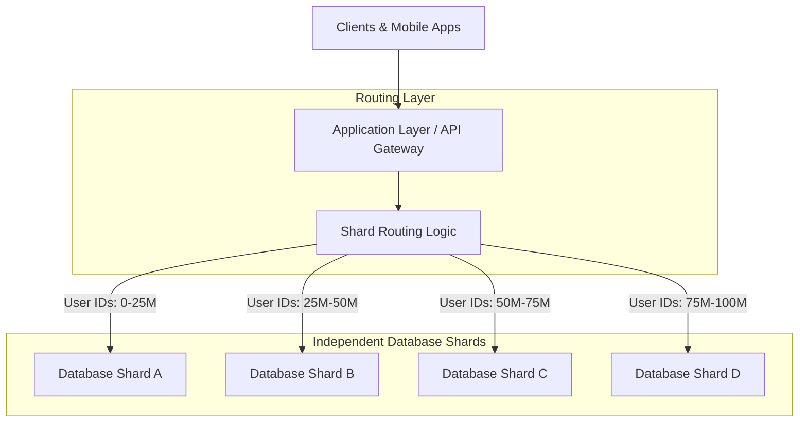
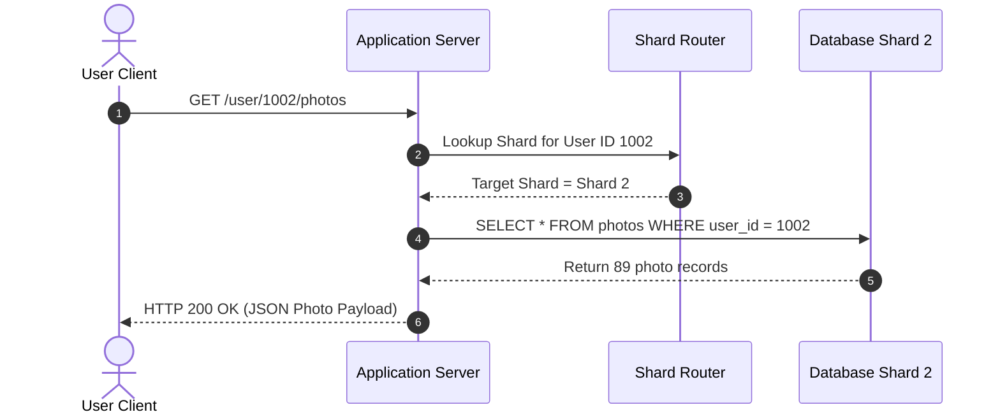

# 🚀 Day 12: Sharding — How Instagram Stores Billions of Photos

Yesterday, in Day 11, we learned a fundamental truth about distributed systems: **one database eventually becomes the absolute bottleneck**. No matter how efficiently you index tables or tune buffer pools, a single database server inevitably hits physical hardware limits.

Today, we answer the natural next question:

> **If one database isn't enough to hold and serve our data, what do we do instead?**

---

## 💥 The Problem

Let's start with a production story from the real world.

Imagine Instagram during its explosive growth phase. Millions of active users are opening the app every single minute of the day:

* 📸 **Millions of photos** are uploaded daily, generating huge volumes of photo metadata, tags, and timestamps.
* 👤 **Every user profile** requires fast lookups for bios, follower counts, and settings.
* 📰 **Every user feed** requires frequent read queries to render recent activity.
* 💬 **Every comment and like** generates continuous write transactions.

In the early days, all of this user data lived inside a single, beautifully managed central relational database. But as the user base scaled from thousands to hundreds of millions, traffic mounted exponentially.

> **Ask yourself:** Can one single database server realistically store and serve all of this data forever?

What happens when your dataset grows from gigabytes to terabytes, and eventually to petabytes?

---

## 🔬 Why This Happens

Why can't a single database machine handle endless growth? Because physical hardware has unavoidable ceilings.

A single database server running on one physical machine eventually runs out of:

1. 💾 **Storage Capacity**: Physical hard drives and SSD arrays have finite byte capacities. Once a disk is 100% full, the database cannot write a single new row.
2. ⚡ **CPU Processing**: Parsing queries, maintaining index trees, and executing transactions consume CPU cycles. Thousands of concurrent queries saturate core threads.
3. 🧠 **Memory (RAM)**: Databases rely on RAM to keep active index structures and table pages warm. When the dataset vastly outgrows RAM, the database engine spends all its time swapping data to and from disk.
4. 💽 **Disk Throughput (IOPS)**: Physical drives can only perform a maximum number of read/write operations per second before write-ahead logs (WAL) and data flushing become congested.
5. 🌐 **Network Capacity**: Network Interface Cards (NICs) have fixed throughput limits (e.g., 10 Gbps). Returning large query payloads to hundreds of application servers saturates the database's network pipe.

Even if you scale your application tier to **1,000 stateless app servers**, adding more compute does not fix the bottleneck. The app servers simply stand in line, waiting for the single database server to process their queries. The data itself has simply grown too large for one machine.

---

## ❌ The Wrong Solution

When a database begins crashing under heavy load, engineers often default to a familiar pattern: **Vertical Scaling** (or *Scaling Up*).

The idea is intuitive:
* ↗️ Buy an even bigger, more expensive database server.
* ⚡ Upgrade to a 128-core CPU.
* 🧠 Add 1 TB of high-speed RAM.
* 💽 Install enterprise NVMe SSD arrays with maximum IOPS.

### Why Vertical Scaling Only Delays the Inevitable

Vertical scaling feels like a quick fix, but it fails for three critical reasons:

> [!WARNING]
> 1. **Hardware Ceilings**: You cannot buy a machine with infinite RAM or infinite CPU cores. Motherboard architectures have physical hardware limits.
> 2. **Exponential Costs**: High-end enterprise hardware follows a curve of diminishing returns. Scaling from 16 cores to 32 cores might cost twice as much, but scaling to 128 top-tier cores can cost 20x more.
> 3. **Single Point of Failure**: Even the world's largest server is still a single machine. If a hardware fault, motherboard failure, or power glitch strikes that server, your entire application goes completely offline.

Vertical scaling buys you time, but it cannot solve exponential data growth. Hardware limits are real and unforgiving.

---

## 🏛️ The Right Mental Model

To understand how high-scale systems solve this problem, consider a real-world analogy: **A Public Library**.

> [!NOTE]
> ### 📚 The Library Analogy
> * Imagine a **small neighborhood library**. It fits all its books inside a single room. A single librarian manages the front desk, retrieves books, and places returned items back on shelves.
> * Now imagine this library expands to hold **50 million books** (like the U.S. Library of Congress). 
> * Can all 50 million books fit in one room? **No.**
> * Can a single librarian handle thousands of visitors standing in line at one desk? **No.**
> 
> What does the library do instead?
> * The library divides its books across **multiple floors, rooms, and separate buildings**.
> * Books starting with letters **A–G** go to Building 1.
> * Books starting with letters **H–N** go to Building 2.
> * Books starting with letters **O–Z** go to Building 3.
> 
> Visitors check the category at the entrance, walk directly to the designated building, and ask the librarian assigned to that specific section.

Large-scale database architectures do the exact same thing with data. 

Instead of storing all user data on one massive database server, the platform breaks the dataset into smaller, manageable chunks and distributes them across multiple independent database machines.

Only after this mental model is established do we introduce the technical term:

Each of these independent database instances holding a piece of the overall dataset is called a **Shard**.

> **Mental Model:** One database stores everything. A sharded database shares the work across many databases.

---

## ⚙️ How It Actually Works

Let's walk through the architectural transformation step by step as a system scales out:

```
Step 1: Single Database (Small Scale)
┌────────────────────────────────────────────────────────┐
│               SINGLE DATABASE SERVER                   │
│   Stores: User 1, User 2, User 3 ... User 1,000,000    │
└────────────────────────────────────────────────────────┘

                        │ Data grows exponentially
                        ▼

Step 2: Database Saturated (Hardware Limits Reached)
┌────────────────────────────────────────────────────────┐
│             SINGLE DATABASE BOTTLENECK                 │
│   CPU: 100% | RAM: Full | Disk IOPS: Maxed Out         │
└────────────────────────────────────────────────────────┘

                        │ Split dataset into independent pieces
                        ▼

Step 3: Sharded Database Fleet (Horizontal Scale)
┌──────────────┐  ┌──────────────┐  ┌──────────────┐  ┌──────────────┐
│   SHARD 0    │  │   SHARD 1    │  │   SHARD 2    │  │   SHARD 3    │
│  (Database)  │  │  (Database)  │  │  (Database)  │  │  (Database)  │
│ Stores Users │  │ Stores Users │  │ Stores Users │  │ Stores Users │
│  0, 4, 8...  │  │  1, 5, 9...  │  │  2, 6, 10... │  │  3, 7, 11... │
└──────────────┘  └──────────────┘  └──────────────┘  └──────────────┘
```

1. **Initial State**: A single database stores all application records.
2. **Growth Threshold**: Data volume and query throughput exceed what one machine can store or process.
3. **Partitioning Data**: The application team divides the dataset into multiple independent database servers (shards).
4. **Independent Ownership**: Each database shard owns only a subset of the total data. Shard A knows nothing about Shard B's data.
5. **Request Routing**: When a client requests profile information, the application determines which shard holds that user's record and routes the request directly to that specific database.

---

## 🎨 Visual Explanation

### 1. ASCII Diagram: Growth from Monolith to Sharded Database

```
               +-----------------------+
               |     CLIENT USERS      |
               +-----------------------+
                           |
                           v
               +-----------------------+
               |     ONE DATABASE      |
               | (Stores All Data)     |
               +-----------------------+
                           |
            [ Severe Traffic Growth & Storage Outage ]
                           |
                           v
    +-----------------------------------------------------+
    |                 ROUTER / APP LAYER                  |
    +-----------------------------------------------------+
       |               |               |               |
       v               v               v               v
+--------------+ +--------------+ +--------------+ +--------------+
| DATABASE A   | | DATABASE B   | | DATABASE C   | | DATABASE D   |
|  (Shard 1)   | |  (Shard 2)   | |  (Shard 3)   | |  (Shard 4)   |
+--------------+ +--------------+ +--------------+ +--------------+
```

---

### 2. Mermaid Architecture Diagram



---

### 3. Request Flow Diagram



---

### 4. Required Visual Assets (`assets/`)

The following asset specifications describe visual diagrams designated under [assets/](file:///d:/30_Days_of_Distributed_Systems/days/Day-12-Sharding/assets) for future rendering:

* 📄 **[single-vs-sharded-database.png](file:///d:/30_Days_of_Distributed_Systems/days/Day-12-Sharding/assets/single-vs-sharded-database.png)**: High-resolution architectural diagram side-by-side comparing a single saturated database server (showing red CPU/Disk/IOPS overload meters) against a clean multi-shard fleet splitting user records horizontally.
* 📄 **[library-analogy.png](file:///d:/30_Days_of_Distributed_Systems/days/Day-12-Sharding/assets/library-analogy.png)**: Conceptual illustration depicting a massive public library with visitors checking an index board at the entrance and being directed to separate buildings (A–G, H–N, O–Z) housing distinct book collections.
* 📄 **[request-routing.png](file:///d:/30_Days_of_Distributed_Systems/days/Day-12-Sharding/assets/request-routing.png)**: Detailed sequence flowchart demonstrating how an incoming HTTP request payload containing a `user_id` key is processed by an application router to select a target database socket connection.
* 📄 **[instagram-data-growth.png](file:///d:/30_Days_of_Distributed_Systems/days/Day-12-Sharding/assets/instagram-data-growth.png)**: Infographic showing Instagram's timeline of photo storage growth, detailing how data volume transitioned from a single PostgreSQL instance to thousands of autonomous database shards.

---

## 📸 Real-World Example: Instagram

Consider Instagram's core storage requirements:
* Billions of uploaded photos.
* Hundreds of millions of daily active users.
* Billions of likes, comments, and follower relationships.

Can all of Instagram's user records and photo metadata live on a single PostgreSQL server instance? 

**Practically and physically, no.** A single relational database server cannot store hundreds of terabytes of relational data on one disk array, nor can its single network card handle millions of concurrent queries per second from global mobile applications.

To solve this, Instagram distributes user data across a fleet of independent PostgreSQL databases. 

At a high architectural level:
* When a user creates an account, Instagram assigns their account to one specific database shard out of thousands in their data centers.
* When that user posts a photo, updates their bio, or receives likes, all associated data is written directly to their assigned database shard.
* When friends view that user's profile, the app queries only the specific shard that owns that user's data.

By spreading user records across a large cluster of smaller, independent storage systems, Instagram can scale storage capacity and query performance horizontally as the platform grows.

---

## 🛠️ Build It Yourself: Simple Educational Simulation

Let's build a practical Python simulation to understand how sharding works programmatically.

We have created two executable modules inside [code/](file:///d:/30_Days_of_Distributed_Systems/days/Day-12-Sharding/code):
1. [user_router.py](file:///d:/30_Days_of_Distributed_Systems/days/Day-12-Sharding/code/user_router.py): Encapsulates deterministic shard assignment (`user_id % total_shards`) and query routing.
2. [simple_sharding_demo.py](file:///d:/30_Days_of_Distributed_Systems/days/Day-12-Sharding/code/simple_sharding_demo.py): Initializes 4 dictionary shards, routes user writes, inspects database states, and executes targeted reads.

### Code Walkthrough: `user_router.py`

```python
from typing import Dict, Any, Optional, List

class UserRouter:
    """
    Directs read and write requests across multiple independent database shards.
    """
    def __init__(self, shards: List[Dict[int, Dict[str, Any]]]):
        self.shards = shards
        self.num_shards = len(shards)

    def get_shard_index(self, user_id: int) -> int:
        # Simple deterministic rule: user_id % num_shards
        return user_id % self.num_shards

    def write_user(self, user_id: int, name: str, email: str, photo_count: int = 0) -> int:
        shard_idx = self.get_shard_index(user_id)
        target_shard = self.shards[shard_idx]
        target_shard[user_id] = {
            "user_id": user_id,
            "name": name,
            "email": email,
            "photo_count": photo_count
        }
        return shard_idx

    def read_user(self, user_id: int) -> Optional[Dict[str, Any]]:
        shard_idx = self.get_shard_index(user_id)
        target_shard = self.shards[shard_idx]
        return target_shard.get(user_id)
```

### Running the Simulation

Run the complete simulation script from your terminal:

```bash
python days/Day-12-Sharding/code/simple_sharding_demo.py
```

### Expected Terminal Output

```text
======================================================================
DAY 12 SIMULATION: SHARDING BILLIONS OF USER RECORDS
======================================================================
Mental Model: 1 database stores everything -> Sharded DB shares the work.
----------------------------------------------------------------------

[SYSTEM SETUP] Initialized 4 independent database shards:
  * Database Shard 0: Ready (0 records)
  * Database Shard 1: Ready (0 records)
  * Database Shard 2: Ready (0 records)
  * Database Shard 3: Ready (0 records)

======================================================================
WRITE OPERATIONS: ROUTING NEW USER REGISTRATIONS
======================================================================
User ID 1001 (Alice  ) -> Routed to [Shard 1] via rule (1001 % 4 = 1)
User ID 1002 (Bob    ) -> Routed to [Shard 2] via rule (1002 % 4 = 2)
User ID 1003 (Charlie) -> Routed to [Shard 3] via rule (1003 % 4 = 3)
User ID 1004 (Diana  ) -> Routed to [Shard 0] via rule (1004 % 4 = 0)
User ID 1005 (Eve    ) -> Routed to [Shard 1] via rule (1005 % 4 = 1)
User ID 1006 (Frank  ) -> Routed to [Shard 2] via rule (1006 % 4 = 2)
User ID 1007 (Grace  ) -> Routed to [Shard 3] via rule (1007 % 4 = 3)
User ID 1008 (Heidi  ) -> Routed to [Shard 0] via rule (1008 % 4 = 0)

======================================================================
DATABASE SHARD STORAGE INSPECTION
======================================================================

Database Shard 0 (Contains 2 user records):
    - Record [User ID 1004]: Diana | Email: diana@example.com | Photos: 56
    - Record [User ID 1008]: Heidi | Email: heidi@example.com | Photos: 94

Database Shard 1 (Contains 2 user records):
    - Record [User ID 1001]: Alice | Email: alice@example.com | Photos: 142
    - Record [User ID 1005]: Eve | Email: eve@example.com | Photos: 215

Database Shard 2 (Contains 2 user records):
    - Record [User ID 1002]: Bob | Email: bob@example.com | Photos: 89
    - Record [User ID 1006]: Frank | Email: frank@example.com | Photos: 18

Database Shard 3 (Contains 2 user records):
    - Record [User ID 1003]: Charlie | Email: charlie@example.com | Photos: 310
    - Record [User ID 1007]: Grace | Email: grace@example.com | Photos: 430

======================================================================
READ OPERATIONS: DIRECT QUERY ROUTING
======================================================================
Querying Profile for User ID 1003:
  1. Router maps User ID 1003 directly to Shard 3
  2. Fetching from Shard 3... Result: Charlie (310 photos uploaded)
  3. Note: Shards 0, 1, 2 were NEVER queried for this request!
```

---

## 🧠 Common Misconceptions

When learning about sharding for the first time, developers often fall into several common misunderstandings:

| Misconception | Why It Is Misleading | Real-World Reality |
| :--- | :--- | :--- |
| **"Sharding automatically makes database queries faster."** | Sharding distributes data to increase overall capacity and throughput, but individual query speed inside a single shard depends on local indexes. | A poorly indexed SQL query will still run slowly even if executed on a sharded database. |
| **"Every database shard contains a copy of all the data."** | This confuses **sharding** with **replication**. Sharding divides data into non-overlapping partitions. | Shard 1 holds User A; Shard 2 holds User B. Neither shard holds a copy of the other's user data. |
| **"Sharding completely removes the need for scaling."** | Sharding is an architectural pattern for horizontal scaling, not a magic replacement for overall capacity planning. | As user traffic grows, you must continue adding new shards or managing shard capacities over time. |
| **"One huge monolithic database is always simpler."** | While a single database is operationally simpler initially, at scale it becomes an extreme operational risk and performance bottleneck. | Sharding introduces setup complexity to unlock scales that a single machine physically cannot handle. |
| **"Sharding is only useful for giant social media platforms."** | Any application with rapidly growing tabular data (e.g., e-commerce orders, IoT metrics, financial logs) hits single-node storage limits. | SaaS applications, payment networks, and gaming backends rely heavily on sharding. |

---

## ⚖️ Production Trade-offs

Sharding is a powerful pattern, but it introduces significant architectural trade-offs.

```
+-----------------------------------------------------------------------------+
|                       SHARDING PRODUCTION TRADE-OFFS                        |
|                                                                             |
|  [ ADVANTAGES ]                                 [ DISADVANTAGES ]           |
|  ✔ Horizontal Scalability                      ✖ Operational Complexity     |
|  ✔ Storage Beyond Single Disk Limits           ✖ Difficult Cross-Shard Join |
|  ✔ Higher Aggregate Write Throughput           ✖ Data Skew & Balancing      |
|  ✔ Isolated Blast Radii                        ✖ Complex Backups & Migrations|
+-----------------------------------------------------------------------------+
```

### Advantages

* 📈 **Horizontal Scalability**: Add more database machines as dataset size grows without hitting single-machine hardware ceilings.
* 💾 **Massive Storage Capacity**: Aggregate storage capacity scales linearly across dozens or hundreds of independent servers.
* ⚡ **Higher Overall Throughput**: Read and write queries are distributed across multiple CPU cores, memory pools, and network interfaces.
* 🛡️ **Isolated Blast Radius**: If a hardware failure crashes Shard 2, users assigned to Shards 0, 1, and 3 remain operational.

### Disadvantages

* 🔧 **Increased Operational Complexity**: Managing 16 or 64 independent database instances is vastly more complex than managing one.
* 🔗 **Difficult Cross-Shard Queries**: Querying data spanning multiple shards (e.g., `JOIN` operations across users on different shards) requires scatter-gather application logic.
* ⚖️ **Data Balancing Challenges**: If celebrity users generate 100x more traffic on Shard 1 than normal users on Shard 0, Shard 1 becomes a hot spot.
* 🗄️ **Harder Maintenance**: Database schema migrations, index updates, and backups must be safely coordinated across every shard in the fleet.

> [!IMPORTANT]
> ### When is Sharding Worth Introducing?
> * **Do NOT shard prematurely**: If your dataset fits comfortably on a single database instance with index optimization and read-replicas, keep it on a single database.
> * **Shard when**: Storage requirements exceed single-disk physical capacity, write throughput saturates single-node IOPS, or single-database connection limits choke application fleets.

---

## 🎯 Key Takeaways

1. **The Core Bottleneck**: Stateless compute scales easily by adding app servers, but stateful single databases hit physical ceilings.
2. **Central Mental Model**: *One database stores everything. A sharded database shares the work across many databases.*
3. **The Library Analogy**: Just as a national library splits books across separate buildings by letter or topic, a sharded database splits data across separate servers.
4. **Independent Instances**: A shard is an autonomous database instance owning a distinct, non-overlapping subset of the overall dataset.
5. **Horizontal Scaling for Data**: Sharding enables data storage and throughput to scale horizontally rather than vertically.
6. **Deterministic Routing**: Applications use routing logic (such as user ID calculations) to direct reads and writes to the correct shard.
7. **Sharding vs. Replication**: Sharding divides data into distinct subsets; replication duplicates data copies for fault tolerance.
8. **Isolated Blast Radius**: A failure on one shard only impacts a fraction of users, keeping the rest of the application online.
9. **Trade-off Awareness**: Sharding provides scale at the cost of operational complexity and difficult cross-shard queries.
10. **Timing Matters**: Never shard until single-node optimizations, caching, and read replicas are exhausted.

---

## ❓ Production Interview Questions

### 1. Why does sharding become necessary in high-scale systems?
> **Answer:** Sharding becomes necessary when a single database server hits physical hardware limits across storage disk capacity, CPU thread processing, memory buffer pools, or disk write IOPS. When adding more application servers only increases connection contention against a single database, dividing the data horizontally across multiple database servers is the only way to continue scaling storage and write throughput.

### 2. What fundamental problem does sharding solve that scaling compute cannot?
> **Answer:** Scaling compute adds more stateless processing capacity, but all app servers still read and write state from a central datastore. Sharding solves the stateful bottleneck by distributing the actual data storage and query execution workloads across multiple independent database instances.

### 3. Why can't vertical scaling (upgrading DB server hardware) replace sharding forever?
> **Answer:** Vertical scaling runs into hard physical hardware ceilings (maximum RAM, motherboard socket limits, disk bus bandwidth) and diminishing economic returns. Top-tier enterprise servers quickly become exponentially expensive while remaining a single point of failure.

### 4. How does sharding divide data across multiple database instances?
> **Answer:** Sharding divides data by partitioning records based on a key (such as `user_id`). The system applies a deterministic rule (e.g., key ranges or modulo math) so that each record belongs to exactly one shard instance, ensuring non-overlapping data ownership.

### 5. What new architectural challenges does introducing sharding create?
> **Answer:** Sharding increases operational overhead (managing multiple database nodes, schema migrations, and backups), complicates cross-shard queries and joins (which cannot be performed natively in single SQL statements), and introduces potential data imbalance (hot spots) if traffic is unevenly distributed across shards.

---

## 📚 Further Reading

For curated books, research papers, original engineering posts from Instagram and Meta, and official documentation, see [references.md](file:///d:/30_Days_of_Distributed_Systems/days/Day-12-Sharding/references.md).

---

## 🔮 What You'll Build Intuition for Tomorrow

Dividing data across multiple independent database machines allows a system to scale beyond single-node limits, but it creates a fundamental new challenge:

> **If data is spread across many machines, how does every request instantly know exactly where to go?**

