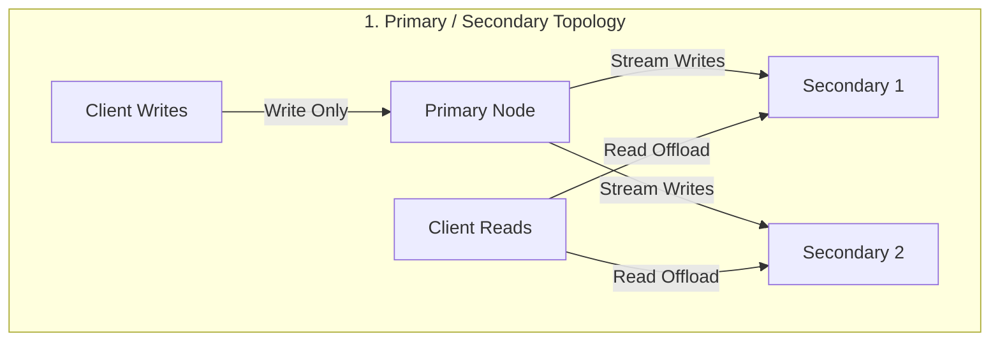
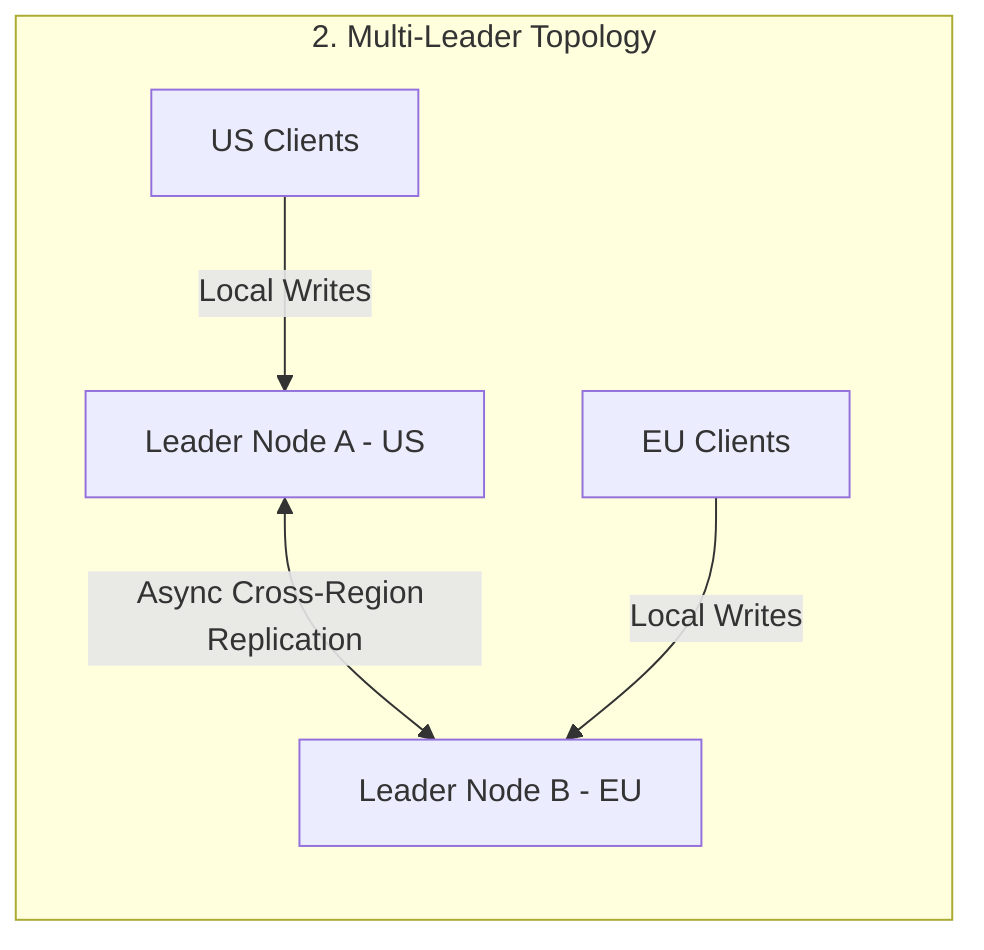
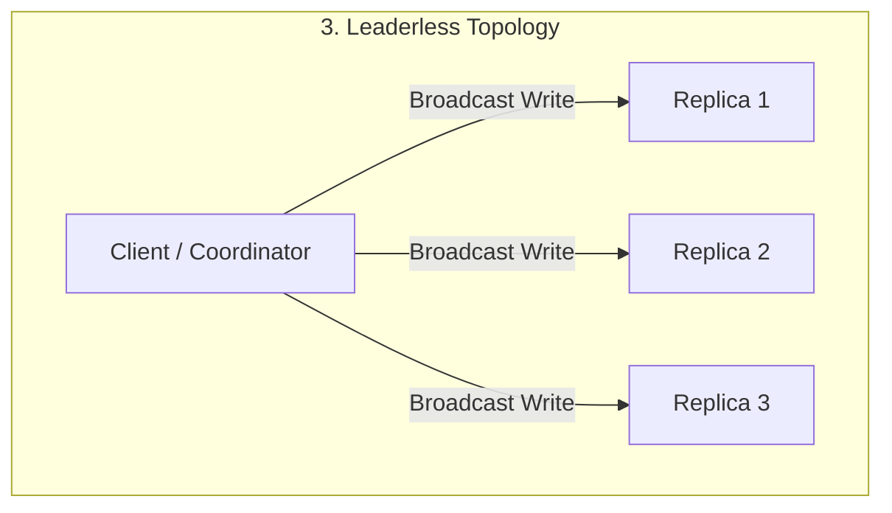

# 🚀 Day 13: Replication — Primary, Secondary, Multi-Leader, and Leaderless

Yesterday, in **Day 12**, we introduced **sharding**: distributing different pieces of data across multiple machines so a database isn't constrained by a single physical disk or memory boundary.

Today, we confront the inevitable follow-up question:

> **What happens when one of those database machines fails?**

Sharding splits a dataset across machines. But if a shard lives on only one server and that server suffers a hardware crash, that slice of your data instantly disappears. A single copy of data—no matter how cleanly sharded—is a single point of failure.

This brings us to **Replication**: creating and maintaining multiple copies of the exact same data across different machines.

At first glance, copying data sounds trivial. But replication introduces a fundamental engineering challenge:

> **How do multiple copies of data stay useful when they receive updates at different times across an unreliable network?**

---

## 💥 The Production Scenario: Replication — When One Copy Isn't Enough

Imagine you operate a global customer portal serving millions of users. 

Your customer records live on a dedicated database node. A user logs in, updates their primary billing address and email preference, and clicks **Save**. 

Minutes later, a disk controller on that database server experiences a silent hardware failure. The machine kernel panics, and the server goes completely offline.

```
       [USER UPDATE] 
             │
             ▼
  ┌─────────────────────┐
  │  DATABASE SERVER    │  💥 HARDWARE CRASH!
  │ (Single Data Copy)  │  (Data Unavailable & Vulnerable)
  └─────────────────────┘
```

If that machine held the **only copy** of the user's data:
1. 🛑 **Availability is destroyed**: No user can read or modify their profile until the server is restored.
2. ⚠️ **Durability is threatened**: If the drive suffers permanent magnetic damage, unbacked-up customer updates are lost forever.

To eliminate this single point of failure, backend engineers deploy **additional database nodes** and copy the data to all of them.

Then comes the surprising discovery:

> **The copies do not automatically become identical at the exact same instant.**

Because physical networks have latency, nodes can lag, and messages can be delayed, creating multiple copies introduces a new class of distributed systems problems.

---

## 🔬 The Problem

Let's trace a realistic story of replica divergence.

Imagine your cluster has three database nodes holding user profiles: Node 1, Node 2, and Node 3.

1. **Step 1**: A customer updates their profile city to `"Tokyo"`.
2. **Step 2**: Node 1 receives the write request and updates its local disk immediately.
3. **Step 3**: Node 2 receives the update packet over the internal network 50 milliseconds later and updates its local disk.
4. **Step 4**: Node 3 is experiencing a temporary garbage collection pause or network delay, so the update packet is delayed in a buffer queue. Node 3 still holds the old city value: `"New York"`.

```
                    [WRITE: city = "Tokyo"]
                              │
                              ▼
  ┌──────────────────┐┌──────────────────┐┌──────────────────┐
  │      NODE 1      ││      NODE 2      ││      NODE 3      │
  │  city: "Tokyo"   ││  city: "Tokyo"   ││city: "New York"  │
  └──────────────────┘└──────────────────┘└──────────────────┘
       (Updated)          (Updated)         (Lagging/Stale)
```

Now, a second user (or the customer refreshing their screen) executes a read query for that profile.

> **Which copy should the reader trust?**

If the read request is routed to Node 1 or Node 2, the user sees `"Tokyo"`. If the request happens to land on Node 3, the user sees `"New York"`. The user thinks their profile update failed!

Simply creating more copies of data does not solve your data availability problem—it trades a hardware availability problem for the complexity of keeping multiple copies coordinated.

---

## 🌐 Why This Happens

Why can't replicas stay perfectly identical at every millisecond? Because distributed systems rarely get instantaneous global agreement for free.

In real-world networks, replicas temporarily differ due to several physical factors:

* 🌐 **Network Delay**: Data packets travelling across physical fiber optic lines experience variable latency.
* ⚡ **Asynchronous Replication**: To keep write responses fast for clients, primaries often acknowledge a write before all background replicas finish writing.
* 💀 **Node Failures & Pauses**: Long OS garbage collection pauses, disk write stalls, or temporary server restarts delay incoming updates.
* ⏳ **Replication Lag**: The measurable time window between when a write is committed on one node and when it is applied on another node.
* 🔀 **Concurrent Writes**: Two users updating the same database record at the exact same millisecond on different servers.
* 📍 **Regional Latency**: Replicas located in different continents (e.g., US-East vs. EU-West) face physical speed-of-light delays (100ms+ round trips).
* 🔌 **Temporary Network Partitions**: A switch failure temporarily isolates a subset of database nodes from receiving updates.

---

## ❌ The Wrong Solution

When engineers first encounter replication lag, they often propose intuitive, quick-fix assumptions.

### Wrong Assumption 1: "Just copy every write to every server synchronously before responding."

```
Client ──► Primary ───Synchronous Write───► Secondary 1 (Fast: 2ms ACK)
                      ───Synchronous Write───► Secondary 2 (Lagging/Offline: ⏳ WAITING...)
```

In this model, the primary accepts a write, sends it to *every* secondary replica, and **blocks the client** until every single replica returns a success acknowledgment.

**Why this fails:**
* 🐢 **Latency blowup**: Your write speed is bottlenecked by the slowest replica in the entire world.
* 🚫 **Total availability collapse**: If even **one** replica goes offline or experiences a temporary network hiccup, **all writes fail globally**. A single server crash brings down write availability for the entire company.

### Wrong Assumption 2: "Just always read from the newest-looking server."

Another common suggestion is: "When reading, query all servers and pick the one with the newest timestamp."

**Why this fails:**
* ⏱️ **Clock Drift**: Computer physical clocks (NTP) drift constantly. Server A's clock might be 200ms behind Server B's clock, causing you to overwrite or prefer older data.
* 🔍 **Coordination Overhead**: Reading from every server on every request defeats the entire purpose of having read replicas to offload traffic.

A distributed system must explicitly define how write operations route to nodes, how data propagates, and how replicas recover from divergence.

---

## 🏛️ The Right Mental Model: The Hospital Branches

To build intuition for how database replication topologies work, consider a real-world analogy: **A Network of Hospital Branches**.

Imagine a patient whose medical record must be accessible across three regional hospital branches: Branch A, Branch B, and Branch C.

```
┌────────────────────────────────────────────────────────────────────────┐
│                        HOSPITAL BRANCH ANALOGY                         │
├────────────────────────────────────────────────────────────────────────┤
│ 1. Primary / Secondary:                                                │
│    Branch A is the Main Headquarters. All official medical history      │
│    updates must be submitted to Branch A. Branch B and C receive       │
│    daily fax copies for local viewing.                                 │
│                                                                        │
│ 2. Multi-Leader:                                                       │
│    Branch A and Branch B are both regional hubs. A doctor in Branch A  │
│    updates allergies; simultaneously, a doctor in Branch B updates    │
│    medications. Both hubs must sync and resolve conflicts later.       │
│                                                                        │
│ 3. Leaderless:                                                         │
│    No branch is "Headquarters". A doctor files a report by sending it  │
│    to any 3 available branches. As long as at least 2 branches         │
│    confirm receipt, the file is considered safely recorded.            │
└────────────────────────────────────────────────────────────────────────┘
```

Now let's translate this intuition directly into the three fundamental database replication models.

---

## ⚙️ How It Actually Works: The Three Replication Models

Database architectures handle write routing and data synchronization using three core patterns:

1. **Primary / Secondary** (Leader / Follower)
2. **Multi-Leader** (Multi-Master)
3. **Leaderless** (Dynamo-style)

---

### 1. Primary / Secondary (Leader / Follower)

In a **Primary / Secondary** architecture, exactly **one** designated node is assigned as the **Primary** (Leader). All other nodes operate as **Secondaries** (Followers or Standbys).

```
              WRITE (Only to Primary)
                │
                ▼
          ┌───────────┐
          │  PRIMARY  │
          └───────────┘
           /         \
          v           v  Replication Stream
   ┌───────────┐ ┌───────────┐
   │ SECONDARY │ │ SECONDARY │  (Reads Allowed)
   └───────────┘ └───────────┘
```

#### How Write and Read Operations Flow:
* ✍️ **Writes**: All client `INSERT`, `UPDATE`, and `DELETE` queries **must** be sent directly to the Primary.
* 🔄 **Replication**: The Primary writes changes to its local storage/Write-Ahead Log (WAL) and streams these state updates to all Secondaries.
* 📖 **Reads**: Clients can read from the Primary or any of the Secondaries. Reading from Secondaries allows horizontal scaling of read traffic.

#### Synchronous vs. Asynchronous Replication:
Replication from Primary to Secondaries can be configured as:

```
  Primary ──► [Write Local WAL]
     │
     ├──► Secondary 1 (Synchronous)  ──► Block Primary until ACK received
     │
     └──► Secondary 2 (Asynchronous) ──► Stream in background (Non-blocking)
```

* **Synchronous**: The primary waits for the secondary to confirm it wrote the data before telling the client "Success". Guarantees zero data loss on that secondary, but increases write latency.
* **Asynchronous**: The primary returns "Success" immediately after writing locally. Replicas catch up in the background. Extremely fast, but if the primary crashes before streaming an update, that update may be lost.
* **Semi-Synchronous**: A common production compromise (e.g., 1 synchronous secondary + 2 asynchronous secondaries).

#### Failure Handling:
If a Secondary dies, it simply reconnects and catches up from the Primary's log when restored. If the Primary dies, failover procedures promote one of the Secondaries to become the new Primary.

---

### 2. Multi-Leader (Multi-Primary)

In a **Multi-Leader** architecture, **multiple nodes** act as leaders and can independently accept write operations from clients.

This topology is widely used across multi-region datacenters to eliminate cross-continent network latency for writes.

```
  [US Clients Write]              [EU Clients Write]
          │                              │
          ▼                              ▼
    ┌──────────┐   Replication Link   ┌──────────┐
    │ LEADER A │ <──────────────────> │ LEADER B │
    │ (US East)│                      │ (EU West)│
    └──────────┘                      └──────────┘
          │                              │
          ▼                              ▼
   Replicated Data                Replicated Data
```

#### How Write Operations Flow:
* ✍️ A client in North America writes to **Leader A** (US-East) with ultra-low latency.
* ✍️ A client in Europe writes to **Leader B** (EU-West) with ultra-low latency.
* 🔄 Leaders process writes locally and asynchronously replicate updates across datacenter links to each other.

#### The Big Challenge: Write Conflicts

Because two leaders accept writes independently, they can accept **conflicting modifications** for the exact same data record before cross-leader replication takes place.

Consider this concrete example:

```
                  Record: user:101:city

    Leader A (US East)              Leader B (EU West)
  ┌────────────────────┐          ┌────────────────────┐
  │ Set city = "Delhi" │          │Set city="Bangalore"│
  └────────────────────┘          └────────────────────┘
            │                               │
            └────────── Replicate ──────────┘
                            │
                            ▼
              ⚠️ WRITE CONFLICT DETECTED!
            Which value wins? "Delhi" or "Bangalore"?
```

#### Conflict Detection & Resolution Strategies:
Unlike Primary/Secondary, Multi-Leader systems **must** incorporate a conflict resolution policy:

1. **Last-Write-Wins (LWW)**: Discard older writes based on physical or logical timestamps (e.g., higher timestamp wins).
2. **Lexicographical / Deterministic Priority**: Compare values (e.g., `"Delhi"` vs `"Bangalore"`) deterministically.
3. **Conflict Avoidance**: Structure application routing so all writes for a given user always route to the same regional leader.
4. **Custom Resolution Logic / CRDTs**: Allow application code to resolve conflicts (e.g., merging cart items).

> **Key Rule:** Conflict resolution is an application and system design decision. There is no magic default that fits every business domain.

---

### 3. Leaderless (Dynamo-Style)

In a **Leaderless** architecture, there is **no designated primary or leader node** for a key. Any node in the cluster can accept write requests and read requests directly from clients.

This approach was popularized by Amazon's landmark **Dynamo** research paper and is used in systems like Apache Cassandra.

```
                     CLIENT WRITE
                    /     │     \
                   /      │      \
                  ▼       ▼       ▼
             ┌───────┐ ┌───────┐ ┌───────┐
             │NODE A │ │NODE B │ │NODE C │
             └───────┘ └───────┘ └───────┘
              Replica   Replica   Replica
```

#### How Write & Read Operations Flow:
* ✍️ **Writes**: The client (or a coordinator node) broadcasts a write request to **all $N$ replicas** simultaneously.
* 📥 **Acknowledgments**: The write is considered successful as soon as a designated number of replicas—called the **Write Quorum ($W$)**—return a success acknowledgment.
* 📖 **Reads**: The client sends a read query to **multiple replicas** simultaneously, receiving data versions along with timestamps or version vectors.

```
Client Write Broadcast ──► Replica 1: ACK ✅
                       ──► Replica 2: ACK ✅  ──► 2 ACKs >= Quorum (W=2) -> Write Succeeded!
                       ──► Replica 3: Slow ⏳
```

If Replica 3 was temporarily offline during the write, it misses the update. Later, when a client reads from Replica 3 and Replica 1, the client notices Replica 3 has an older version and triggers **Read Repair** to bring Replica 3 up to date.

> **Note:** Leaderless replication uses quorum-style techniques to achieve high availability, but exact read/write guarantees depend heavily on cluster configuration.

---

## 🔀 Replication vs Sharding

Beginners frequently confuse **Sharding** with **Replication**. They solve entirely different operational problems:

| Concept | Primary Purpose | How Data Moves | Primary Benefit |
| :--- | :--- | :--- | :--- |
| **Sharding** | **Divide** dataset across machines | Breaks dataset into independent slices (shards) | Solves **Capacity & Storage Limits** |
| **Replication** | **Copy** dataset across machines | Duplicates the same data onto multiple nodes | Solves **Fault Tolerance & Read Availability** |

### Combining Both in Real-World Systems

Production distributed databases do not choose between sharding and replication; **they combine both**.

First, the dataset is **sharded** across different node groups to scale storage. Then, each individual shard is **replicated** across multiple nodes to ensure fault tolerance.

```
                              DATASET
                                 │
             ┌───────────────────┴───────────────────┐
             ▼                                       ▼
          SHARD A                                 SHARD B
      (Users 1 - 1000)                       (Users 1001 - 2000)
         │       │                               │       │
    ┌────┴───┐ ┌─┴──────┐                   ┌────┴───┐ ┌─┴──────┐
    │  Copy  │ │  Copy  │                   │  Copy  │ │  Copy  │
    │(Node 1)│ │(Node 2)│                   │(Node 3)│ │(Node 4)│
    └────────┘ └────────┘                   └────────┘ └────────┘
```

> **Mental Model Summary:**
> * **Sharding**: Cuts the database cake into slices.
> * **Replication**: Bakes duplicate slices so no one goes hungry if a slice drops on the floor.

---

## 🎨 Visual Explanation & Asset Specifications

Below are visual diagrams illustrating the core replication topologies and concepts.







### 🖼️ Asset Specifications (Inside `assets/`)

The following visual diagram assets are documented inside [`assets/README.md`](file:///d:/30_Days_of_Distributed_Systems/days/Day-13-Replication/assets/README.md):

1. 📄 **`assets/replication-models.png`**: Side-by-side comparative architecture diagram showing Primary/Secondary, Multi-Leader, and Leaderless node structures.
2. 📄 **`assets/primary-secondary.png`**: Primary node accepting client write traffic and propagating state via WAL streaming to synchronous and asynchronous secondaries.
3. 📄 **`assets/multi-leader.png`**: Multi-region setup demonstrating concurrent local writes in US and EU regional leaders with cross-datacenter conflict resolution.
4. 📄 **`assets/leaderless.png`**: Quorum write broadcast across 3 peer nodes showing write acknowledgment thresholds ($W=2$).
5. 📄 **`assets/replication-vs-sharding.png`**: Visual contrast showing data division (Sharding) vs data duplication (Replication) and their combined hybrid architecture.
6. 📄 **`assets/replication-lag.png`**: Timeline sequence diagram depicting client write execution on a Primary followed by temporal read lag on a Secondary.

---

## 🏢 Real-World Case Study: Amazon's Dynamo (Historical Context)

In the mid-2000s, Amazon operated a massive global e-commerce infrastructure. During peak holiday shopping periods (like Black Friday), database downtime cost millions of dollars per minute.

```
                 AMAZON SHOPPING CART REQUIREMENT:
           "A customer MUST ALWAYS be able to add an item 
                to their cart, even during node failures."
```

Traditional single-primary databases could not fulfill this availability requirement: if the primary went down or experienced a network partition, customer checkout writes were blocked.

### The Dynamo Breakthrough (SOSP 2007 Paper)

To solve this, Amazon engineers published the landmark research paper:  
*[Dynamo: Amazon's Highly Available Key-value Store (SOSP 2007)](https://www.allthingsdistributed.com/files/amazon-dynamo-sosp2007.pdf)*.

Dynamo pioneered a **leaderless, highly available key-value store** designed specifically for high write availability:

* 🌐 **No Single Point of Failure**: Eliminating the central primary node meant writes could target any healthy node in the ring.
* ⚡ **Always Writable**: Prioritized write availability over immediate consistency.
* 🔀 **Client-Side Conflict Resolution**: Allowed concurrent updates to be saved and resolved later during reads (e.g., merging shopping cart items).

> [!IMPORTANT]
> **Historical Distinction vs Modern Architecture**:
> Amazon's 2007 Dynamo paper was a foundational research milestone that influenced modern databases like Apache Cassandra and AWS DynamoDB. However, modern Amazon AWS infrastructure uses a vast array of specialized datastores (including Aurora, DynamoDB, and internal services). Today's AWS services evolved significantly beyond the original 2007 paper's implementation details.

---

## 💻 Build It Yourself: Educational Python Simulations

To solidify your intuition, we built three self-contained Python simulations inside [`code/`](file:///d:/30_Days_of_Distributed_Systems/days/Day-13-Replication/code/).

### 1. Primary/Secondary Replication & Lag Simulation

File: [`code/primary_secondary_replication.py`](file:///d:/30_Days_of_Distributed_Systems/days/Day-13-Replication/code/primary_secondary_replication.py)

Simulates a primary accepting writes, updating a synchronous secondary immediately, and demonstrating a read lag window on an asynchronous secondary:

```python
# Run the simulation:
python days/Day-13-Replication/code/primary_secondary_replication.py
```

```
[CLIENT WRITE REQUEST] -> Set 'user:101:email' = 'alice@example.com' on Primary
  [Primary] Write accepted and written to storage.
  [Replication] Synchronous replication completed for Node-1 (Secondary).

--- State Immediately After Client Write Acknowledgment ---
  Primary   : [Primary Node-0 (Primary)] Data: {'user:101:email': 'alice@example.com'}
  Secondary : [Secondary Node-1 (Secondary)] Data: {'user:101:email': 'alice@example.com'}
  Secondary : [Secondary Node-2 (Secondary)] Data: {}
  [!] [CLIENT READ] Querying Node-2 (Secondary) for key 'user:101:email' -> Result: '<Not Present>' (REPLICATION LAG!)
```

### 2. Multi-Leader Conflict Simulation

File: [`code/multi_leader_conflict.py`](file:///d:/30_Days_of_Distributed_Systems/days/Day-13-Replication/code/multi_leader_conflict.py)

Simulates two regional leaders receiving concurrent writes for `user:101:city` (`"Delhi"` vs `"Bangalore"`) and applying Last-Write-Wins (LWW) conflict resolution during replication:

```python
# Run the simulation:
python days/Day-13-Replication/code/multi_leader_conflict.py
```

```
--- Concurrent Writes Arrive at Different Leaders ---
  [Leader A (US East)] Accepted Client Write: key='user:101:city', val='Delhi', ts=100.0
  [Leader B (EU West)] Accepted Client Write: key='user:101:city', val='Bangalore', ts=100.5

--- Cross-Leader Replication & Conflict Resolution ---
  [Replication A -> B] Leader B processed update: CONFLICT_RESOLVED_LOCAL_WON ('Bangalore' > 'Delhi')
  [Replication B -> A] Leader A processed update: CONFLICT_RESOLVED_INCOMING_WON ('Bangalore' > 'Delhi')
```

### 3. Leaderless Quorum Simulation

File: [`code/leaderless_quorum.py`](file:///d:/30_Days_of_Distributed_Systems/days/Day-13-Replication/code/leaderless_quorum.py)

Simulates broadcasting a write to 3 replicas with a Write Quorum threshold ($W=2$) under healthy and degraded node conditions:

```python
# Run the simulation:
python days/Day-13-Replication/code/leaderless_quorum.py
```

```
--- Scenario 2: Cluster with Partial Node Failure (N=3, W=2) ---
[CLIENT BROADCAST WRITE] -> Key: 'user:202:status', Value: 'SUSPENDED'
  [OK]   [Replica-1] Write Acknowledged.
  [OK]   [Replica-2] Write Acknowledged.
  [FAIL] [Replica-3] Write Failed (Node Unavailable).
  [SUCCESS] Received 2/3 ACKs. Write Quorum (W=2) MET!
```

---

## 🚫 Common Misconceptions

> [!WARNING]
> ### 1. "Replication means every copy is always identical."
> **Reality**: Replicas are only guaranteed to be eventually consistent in asynchronous systems. Network delay and replication lag mean secondaries temporarily lag behind the primary.

> [!WARNING]
> ### 2. "Replication and sharding are the same thing."
> **Reality**: Sharding divides different pieces of data across nodes to scale capacity. Replication copies the exact same data across nodes to ensure fault tolerance.

> [!WARNING]
> ### 3. "Having a primary makes replication completely reliable."
> **Reality**: A primary simplifies write coordination, but it creates a single point of write failure unless failover mechanisms promote a secondary when the primary dies.

> [!WARNING]
> ### 4. "Leaderless means there is no coordination required."
> **Reality**: Leaderless systems still require coordination rules—such as read/write quorums, timestamp ordering, and anti-entropy background processes—to resolve replica divergence.

> [!WARNING]
> ### 5. "More replicas automatically mean better system performance."
> **Reality**: Adding replicas increases read throughput, but it also increases network traffic, storage cost, operational overhead, and synchronous write latency.

> [!WARNING]
> ### 6. "Asynchronous replication means data is lost."
> **Reality**: Asynchronous replication does not mean data loss is guaranteed; it creates a temporary temporal window where data committed to the primary has not yet reached secondaries if the primary crashes immediately.

---

## ⚖️ Production Trade-offs

Selecting a replication model requires balancing fundamental engineering trade-offs:

| Metric / Dimension | Primary / Secondary | Multi-Leader | Leaderless |
| :--- | :--- | :--- | :--- |
| **Write Latency** | Low to Medium (must route to Primary) | Ultra Low (local regional leader) | Low to Medium (depends on Quorum $W$) |
| **Write Availability** | Single bottleneck (Primary down = writes block) | High (any regional leader accepts writes) | Very High (succeeds if $W$ replicas respond) |
| **Write Complexity** | Simple & straightforward | High (conflict detection & resolution required) | Moderate (quorum routing & read repair) |
| **Consistency Risk** | Low (reads on primary always fresh; secondaries lag) | High (concurrent cross-region conflict windows) | Configurable (depends on $R + W > N$) |
| **Operational Overhead** | Low to Moderate (standard database pattern) | High (complex multi-region synchronization) | High (anti-entropy maintenance & tuning) |

---

## 🎯 Key Takeaways

1. **Why Replication Exists**: Replication creates multiple copies of data to eliminate single points of failure, guarantee durability, and offload read traffic.
2. **Replication vs Sharding**: Sharding splits a dataset into distinct pieces; replication duplicates those pieces across machines.
3. **Primary / Secondary**: A single primary node processes all writes and streams updates to read-only secondaries.
4. **Replication Lag**: Asynchronous secondaries temporarily lag behind the primary, creating a window where reads may return stale data.
5. **Multi-Leader Topology**: Multiple leaders accept writes concurrently across regions, drastically reducing write latency but introducing write conflicts.
6. **Conflict Resolution**: Multi-leader systems must implement deterministic conflict resolution (such as Last-Write-Wins or custom merging).
7. **Leaderless Replication**: Peer nodes accept reads and writes using quorum thresholds ($W$ and $R$) without requiring a designated primary node.
8. **Real-World Amazon Dynamo**: Amazon pioneered leaderless replication to ensure shopping cart write availability during node failures.
9. **No Silver Bullet**: Synchronous replication guarantees durability at the cost of write availability; asynchronous replication maximizes speed at the cost of replication lag.
10. **Combined Architectures**: Modern production datastores combine sharding and replication to scale both storage capacity and availability.

---

## ❓ Production Interview Questions

### Q1: Why is replication necessary in distributed systems?
**Answer**: Replication provides fault tolerance and durability by ensuring that if a single machine crashes, duplicate copies of data exist on surviving nodes. It also enables horizontal read scaling by allowing read queries to be offloaded to secondary replicas.

### Q2: What is the primary difference between replication and sharding?
**Answer**: Sharding partitions a dataset into smaller, non-overlapping slices across machines to overcome storage and memory limits. Replication duplicates identical copies of data across machines to ensure high availability and disaster recovery.

### Q3: What happens when a secondary replica falls behind the primary?
**Answer**: The secondary experiences replication lag. Read queries routed to that lagging secondary will temporarily return stale (outdated) values until the secondary processes the primary's update log.

### Q4: What are the advantages and disadvantages of synchronous vs. asynchronous replication?
**Answer**: Synchronous replication guarantees zero data loss on synchronized replicas before acknowledging writes to clients, but it increases write latency and fails if a synchronous secondary goes offline. Asynchronous replication provides fast write responses and resilience against replica outages, but creates a window of replication lag where primary crashes could cause data loss.

### Q5: Why does multi-leader replication introduce write conflicts?
**Answer**: Because multiple leaders independently accept write operations for the same data record at the same time. Until cross-leader replication occurs asynchronously, each leader remains unaware of concurrent modifications made by other leaders.

### Q6: When would an engineering team choose multi-leader replication?
**Answer**: Multi-leader replication makes sense for applications operating across multiple geographic datacenters where users need local low-latency write performance, or for collaborative offline-first applications (like mobile calendar or document editing apps) that sync when reconnected.

### Q7: What does leaderless replication mean?
**Answer**: Leaderless replication means there is no single primary node responsible for write coordination. A client can issue read or write requests to any node in the cluster, using quorum thresholds to determine operation success.

### Q8: How does replication affect latency and availability?
**Answer**: Asynchronous replication improves write latency and read availability by allowing local nodes to serve requests immediately. However, synchronous replication reduces write availability because all required nodes must be online to acknowledge the write.

---

## 📚 Further Reading

For curated research papers, books, engineering blogs, and conference talks on replication architectures, visit [`references.md`](file:///d:/30_Days_of_Distributed_Systems/days/Day-13-Replication/references.md).

---

## What you'll build intuition for tomorrow

Today, we learned that having multiple copies of data prevents total system collapse when a database node dies. But we also discovered a troubling reality: **asynchronous replicas temporarily lag behind**.

Tomorrow, in **Day 14**, we explore what happens when a user updates their password or posts a comment, and immediately refreshes the page—only for their read request to land on a lagging secondary node that hasn't received the update yet.

*How do distributed systems ensure that users always see their own updates, even when reading from lagging replicas?*
