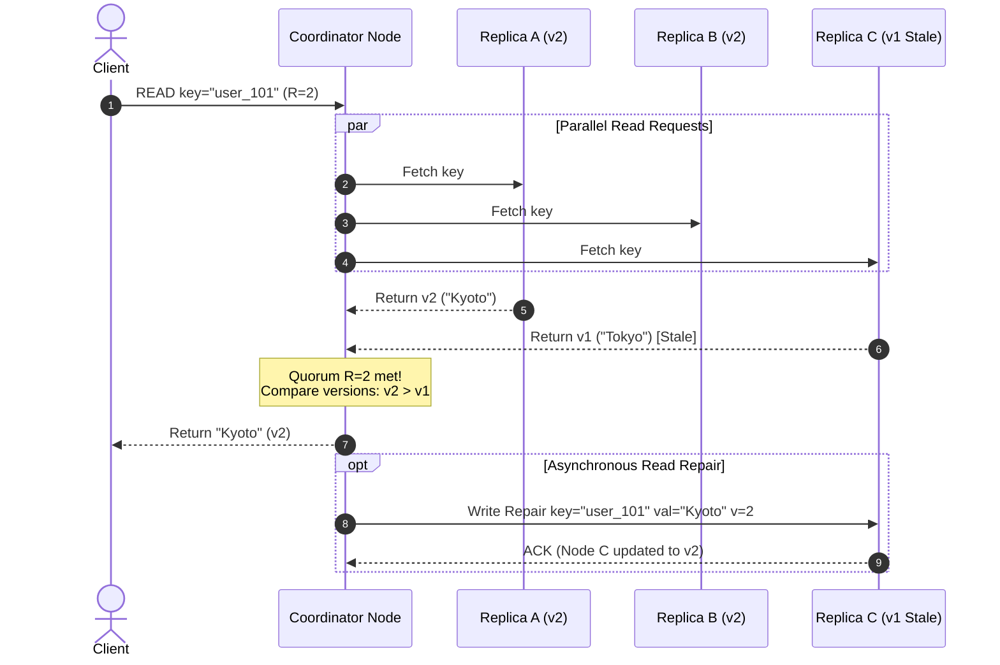

# 🚀 Day 14 — Quorums: Why 2 of 3 Votes Matter

Yesterday, in **Day 13**, we explored **Replication**: duplicating data across multiple database nodes so that a single disk failure does not wipe out your application state.

However, replicating data immediately raises a fundamental coordination dilemma:

> **When a client writes or reads data across multiple database replicas, how many nodes must respond before the operation is declared successful?**

If you wait for every replica, a single slow server can freeze your entire platform. If you only wait for one, a single node crash can destroy un-replicated data or return stale results. 

Today, we unpack the standard solution used by world-class distributed storage systems: **Quorums**.

---

## 🔬 The Problem

Imagine three separate database replicas holding the exact same customer profile: **Replica A**, **Replica B**, and **Replica C**.

A user submits an urgent profile update: `UPDATE user SET status = 'PREMIUM'`.

Your system dispatches the write request to all three replicas over the internal network. Here is what happens simultaneously across the cluster:

* ⚡ **Replica A** is idle and responds immediately: `"ACK — Updated!"`
* 🐢 **Replica B** is undergoing a heavy Java Garbage Collection pause or disk flush and takes 450ms to process the packet.
* 💥 **Replica C** suffered a switch port failure and is completely unreachable.

```
                  [CLIENT WRITE: status = 'PREMIUM']
                                │
          ┌─────────────────────┼─────────────────────┐
          │                     │                     │
          ▼                     ▼                     ▼
  ┌──────────────┐      ┌──────────────┐      ┌──────────────┐
  │  REPLICA A   │      │  REPLICA B   │      │  REPLICA C   │
  │  (Responded) │      │ (GC Pause/   │      │  (Hardware   │
  │  "ACK — OK"  │      │  450ms Slow) │      │  Crash/Dead) │
  └──────────────┘      └──────────────┘      └──────────────┘
```

Now, step into the shoes of the lead backend engineer:

> **Should the application server report success to the user immediately after Replica A responds, or should it wait? If it waits, how long? What if Replica C never responds at all?**

If your system makes the wrong choice:
1. **If you declare success too quickly**: A second read request landing on Replica B or Replica C will return the old status (`'FREE'`). The user sees their payment succeeded but their profile didn't upgrade!
2. **If you wait for all nodes**: The write stalls for half a second because of Replica B, and fails entirely because Replica C is dead—rendering your multi-node cluster *less* available than a single database server!

---

## 🌐 Why This Happens

Replication turns a simple local storage operation into a distributed coordination problem. Because networks experience variable latency, hardware crashes, and packet loss, replicas do not apply writes at the exact same physical microsecond.

When coordinating reads and writes across multiple nodes, distributed software faces three naive design choices:

### 1. Wait for Everyone ($N$ of $N$)
The coordinator node sends every request to all $N$ replicas and blocks until **100% of replicas** acknowledge completion.
* **Advantage**: Absolute maximum durability and guarantee that all active replicas hold the identical state.
* **Fatal Flaw**: Total loss of availability. If 1 out of 100 replicas experiences a temporary network hiccup, **100% of client writes fail**. Furthermore, overall operation latency is anchored to the *slowest single node in the cluster* (the $P_{99}$ tail latency bottleneck).

### 2. Trust One Replica ($1$ of $N$)
The coordinator node sends the request to all replicas but returns success to the client as soon as **any single replica** responds.
* **Advantage**: Ultra-low latency and high write availability. The operation finishes at the speed of the fastest node.
* **Fatal Flaw**: Severe consistency and durability risks. If Replica A acknowledges a write and immediately suffers a power failure before syncing to Replica B and C, that committed write is permanently lost. Furthermore, concurrent reads landing on Replica B will return stale data.

### 3. Pick "Enough" Replicas (Quorum)
Instead of requiring total consensus ($N$) or accepting extreme risk ($1$), the system requires a **strictly defined threshold of node acknowledgements** before declaring success. 

This threshold is called a **Quorum**.

---

## ❌ The Wrong Solution

When engineers first encounter multi-replica clusters, they frequently fall into two opposite architectural traps:

### Trap 1: "3 Replicas Mean 3 Must Agree"
Beginners assume that having three replicas implies every operation must receive three ACKs.

```
  CLIENT WRITE ──► [REPLICA A: ACK]
               ──► [REPLICA B: ACK]
               ──► [REPLICA C: TIMEOUT / DEAD] ──► 💥 WRITE REJECTED!
```
* **Why it fails**: Requiring $N=3$ ACKs converts a redundant system into a fragile chain. If any single replica dies for maintenance, your database goes completely read-only or offline.

### Trap 2: "Just Accept the First Response"
To maximize throughput, teams configure writes to succeed on $1$ ACK and reads to return on $1$ response.

```
  WRITE (1 ACK) ──► [REPLICA A: 'PREMIUM']
  READ  (1 ACK) ◄── [REPLICA C: 'FREE']     ──► ⚠️ STALE DATA RETURNED!
```
* **Why it fails**: Because the read set ($1$) and write set ($1$) do not overlap ($1 + 1 = 2 \le 3$), reads can easily query a replica that missed the latest write.

---

## 🧠 The Right Mental Model

To understand why quorum works, imagine a **3-person board of directors**: Alice, Bob, and Charlie.

If the board needs to pass a resolution, do all three directors need to attend every single vote?

No. If **two out of three** directors vote "YES", a majority decision is established. 

Even if Charlie is stranded on a flight without Wi-Fi, Alice and Bob hold enough voting power ($2$ out of $3$) to make binding decisions for the organization. Furthermore, if a second vote takes place later, any group of two directors is **guaranteed to include at least one director who attended the previous vote**.

```
  FIRST VOTE  (Write) : [Alice, Bob]
  SECOND VOTE (Read)  : [Bob, Charlie]
                         ▲▲▲▲▲▲▲
               OVERLAP: Bob participated in BOTH votes!
```

Because **Bob** was present for both the write vote and the read vote, Bob can tell Charlie: *"We already updated the policy in the last vote."*

This is the core insight of **Quorum Intersection**.

### The Generalized Quorum Relationship

In distributed storage systems, quorums are governed by three numbers:
* $N$ = Total number of replicas storing the data (Replica Set Size).
* $W$ = Number of replica acknowledgements required for a **Write** to succeed.
* $R$ = Number of replica responses required for a **Read** to succeed.

To guarantee that a read operation will **always** encounter the latest write, you must configure $W$ and $R$ such that their combined sum is strictly greater than the total number of replicas:

$$\mathbf{W + R > N}$$

```
  WRITE QUORUM (W = 2)      READ QUORUM (R = 2)
  ┌──────────────────┐      ┌──────────────────┐
  │   REPLICA A  ✓   │      │   REPLICA A  ✓   │ ◄─── OVERLAPPING NODE!
  │   REPLICA B  ✓   │      │   REPLICA B      │
  │   REPLICA C      │      │   REPLICA C  ✓   │
  └──────────────────┘      └──────────────────┘
```

Because $W = 2$ and $R = 2$ in an $N = 3$ system:

$$W + R = 2 + 2 = 4 > 3$$

By the **Pigeonhole Principle**, any subset of $2$ write nodes and any subset of $2$ read nodes **must share at least one common replica**. That shared replica acts as the bridge of truth between the past write and the present read.

---

## ⚙️ How It Actually Works

Let's examine how a 3-node cluster ($N=3, W=2, R=2$) handles real-world operational scenarios.

### Scenario 1 — Successful Write ($W=2$)
1. Client issues `Set user_101 status = 'ACTIVE'`.
2. Coordinator node broadcasts write to Nodes A, B, and C.
3. Node A and Node B log the write to disk and return `ACK`.
4. Coordinator receives $2$ ACKs. Since $2 \ge W$, it instantly returns `200 OK` to the client. Node C receives the packet a few milliseconds later asynchronously.

### Scenario 2 — One Replica Is Down ($W=2$)
1. Node C crashes due to a power failure.
2. Client writes `Set user_101 status = 'INACTIVE'`.
3. Node A and Node B process the write and acknowledge.
4. $2$ ACKs are collected. The write **succeeds cleanly** despite Node C being completely dead.

### Scenario 3 — Read and Write Overlap ($W=2, R=2$)
1. A reader queries `user_101 status` with read quorum $R=2$.
2. The read request fetches data from **Node B** and **Node C**.
3. Node B returns `v2 ('INACTIVE')`. Node C returns `v1 ('ACTIVE')`.
4. The coordinator compares version numbers, identifies that Node B holds the newest value (`v2`), returns `'INACTIVE'` to the client, and optionally fires a **Read Repair** to update Node C.

```
  READ QUORUM (R=2) ──► Node B (v2: 'INACTIVE')  ──┐
                    ──► Node C (v1: 'ACTIVE')    ──┴─► Coordinator picks v2!
```

### Scenario 4 — Larger Replica Set ($N=5, W=3, R=3$)
Scaling to $N=5$ replicas increases failure tolerance:
* Majority Quorum threshold: $\lfloor N/2 \rfloor + 1 = 3$.
* Setting $W=3$ and $R=3$ satisfies $3 + 3 = 6 > 5$.
* **Fault Tolerance**: The system can survive **2 simultaneous node failures** without losing read freshness or write capability!

### Scenario 5 — Quorum Is Not Free
Configuring higher quorums introduces explicit trade-offs:

| Configuration | Latency Impact | Availability Impact | Consistency Guarantee |
| :--- | :--- | :--- | :--- |
| **$W=1, R=1$** ($W+R \le N$) | 🚀 Ultra Low ($P_{50}$ speed) | 🟢 High (Survives $N-1$ crashes) | 🔴 Weak (Stale reads & loss risk) |
| **$W=2, R=2$** ($W+R > N$) | ⚡ Balanced ($P_{90}$ speed) | 🟢 High (Survives $1$ failure) | 🟢 Strong Quorum Overlap |
| **$W=3, R=3$** ($N=3$) | 🐢 High ($P_{99}$ tail speed) | 🔴 Low (0 node failures allowed) | 🔒 Strict Synchronous Consistency |

---

## 🎨 Visual Explanation

### 1. ASCII Architecture Diagrams

#### 3-Replica Quorum Write ($N=3, W=2$)
```
                     ┌──────────────────┐
                     │   CLIENT WRITE   │
                     └────────┬─────────┘
                              │
                    ┌─────────┴─────────┐
                    ▼                   ▼
           ┌────────────────┐  ┌────────────────┐  ┌────────────────┐
           │   REPLICA A    │  │   REPLICA B    │  │   REPLICA C    │
           │  (ACK Recv 1)  │  │  (ACK Recv 2)  │  │ (Slow/Pending) │
           └───────┬────────┘  └───────┬────────┘  └────────────────┘
                   │                   │
                   └─────────┬─────────┘
                             ▼
               ┌───────────────────────────┐
               │  WRITE SUCCESSFUL (2/2)   │
               └───────────────────────────┘
```

#### Read/Write Quorum Overlap ($W+R > N$)
```
   ALL NODES:       [ REPLICA A ]    [ REPLICA B ]    [ REPLICA C ]
   
   WRITE SET (W=2): █▀▀▀▀▀▀▀▀▀▀▀█    █▀▀▀▀▀▀▀▀▀▀▀█
                    █ REPLICA A █    █ REPLICA B █
                    ▀▀▀▀▀▀▀▀▀▀▀▀     ▀▀▀▀▀▀▀▀▀▀▀▀
   READ SET (R=2):  █▀▀▀▀▀▀▀▀▀▀▀█                     █▀▀▀▀▀▀▀▀▀▀▀█
                    █ REPLICA A █                     █ REPLICA C █
                    ▀▀▀▀▀▀▀▀▀▀▀▀                      ▀▀▀▀▀▀▀▀▀▀▀▀
                    ▲▲▲▲▲▲▲▲▲▲▲▲▲
                    │ INTERSECTION │ ◄── Replica A guarantees freshness!
                    └──────────────┘
```

#### Failed Replica Quorum Execution
```
                    ┌──────────────────┐
                    │   CLIENT WRITE   │
                    └────────┬─────────┘
                             │
            ┌────────────────┴────────────────┐
            ▼                                 ▼
   ┌────────────────┐                ┌────────────────┐
   │   REPLICA A    │                │   REPLICA B    │
   │   [ONLINE]     │                │   [ONLINE]     │
   │  ACK 1 Received│                │  ACK 2 Received│
   └───────┬────────┘                └───────┬────────┘
           │                                 │
           └────────────────┬────────────────┘
                            ▼
              ┌───────────────────────────┐
              │ QUORUM MET (2 ACKs >= W=2)│ ──► Operation Succeeds!
              └───────────────────────────┘
                            
   ┌────────────────┐
   │   REPLICA C    │
   │   [CRASHED]    │ 💥 (Node failure isolated; system continues!)
   └────────────────┘
```

#### N=5 Majority Quorum Comparison
```
   N = 5 REPLICA CLUSTER  (W = 3, R = 3)
   
   ┌──────────┐ ┌──────────┐ ┌──────────┐ ┌──────────┐ ┌──────────┐
   │ REPLICA  │ │ REPLICA  │ │ REPLICA  │ │ REPLICA  │ │ REPLICA  │
   │    1     │ │    2     │ │    3     │ │    4     │ │    5     │
   └────┬─────┘ └────┬─────┘ └────┬─────┘ └────┬─────┘ └────┬─────┘
        │            │            │            │            │
        └────────────┼────────────┘            ❌           ❌
                     ▼                     (CRASHED)    (CRASHED)
         [3 ACKs Received >= W=3]
                     │
                     ▼
         🟢 WRITE SUCCEEDS! (Tolerates up to 2 failures)
```

### 2. Mermaid Sequence Diagram: Quorum Read & Read Repair



---

## 🏢 Real World Example: Amazon Dynamo & Dynamo-Style Systems

When Amazon engineers designed **Dynamo** (the landmark key-value store powering Amazon's shopping cart and order systems), they faced strict availability SLAs: **the checkout pipeline could never reject a write, even during datacenter network partitions.**

Dynamo pioneered the commercial application of **tunable quorum replication** ($N, W, R$):
* **Configurable Trade-offs**: Teams could tune consistency per workload. For shopping carts where writes must never fail, teams set $W=1$ for instant writes. For payment processing where accuracy is paramount, teams set $W=2, R=2$ ($N=3$).
* **Sloppy Quorums & Hinted Handoff**: If designated primary nodes for a key were unreachable, Dynamo accepted writes on alternate healthy nodes ("sloppy quorum") and held temporary "hints" until primary nodes recovered.
* **Read Repair & Anti-Entropy**: When a quorum read detected diverging versions across nodes, Dynamo returned the latest version to the client while firing background **Read Repair** tasks to bring lagging replicas up to speed.

> **Production Context**: Systems like Apache Cassandra and Riak directly inherited Dynamo's $N, W, R$ leaderless quorum model, enabling cloud architectures to tune durability and latency per query.

---

## 🛠️ Build It Yourself: Mini Quorum Simulator

Let's inspect a complete Python simulation of a 3-replica quorum cluster demonstrating read/write quorums, node failure isolation, and read repair.

The full code is located inside [quorum_simulator.py](file:///d:/30_Days_of_Distributed_Systems/days/Day-14-Quorums/code/quorum_simulator.py).

### Core Mechanics Code Highlight

```python
class QuorumCluster:
    def __init__(self, node_ids: List[str]):
        self.nodes = {nid: ReplicaNode(nid) for nid in node_ids}
        self.N = len(node_ids)

    def write(self, key: str, value: Any, W: int) -> Tuple[bool, int]:
        """Broadcasts write to replicas and checks if ACKs satisfy Write Quorum W."""
        next_version = self.key_versions.get(key, 0) + 1
        now = time.time()

        acks = 0
        for node in self.nodes.values():
            if node.write(key, value, now, next_version):
                acks += 1

        is_success = acks >= W
        if is_success:
            self.key_versions[key] = next_version
        return is_success, acks

    def read(self, key: str, R: int) -> Tuple[bool, Optional[Any]]:
        """Reads from replicas, enforces Read Quorum R, and triggers Read Repair."""
        responses = {}
        for nid, node in self.nodes.items():
            rec = node.read(key)
            if rec is not None or node.is_online:
                responses[nid] = rec

        online_acks = len([nid for nid, rec in responses.items() if self.nodes[nid].is_online])
        if online_acks < R:
            return False, None  # Read Quorum Failed!

        # Resolve latest version
        latest = max((r for r in responses.values() if r), key=lambda r: r.version, default=None)
        
        # Trigger Read Repair on stale nodes
        if latest:
            for nid, rec in responses.items():
                if self.nodes[nid].is_online and (rec is None or rec.version < latest.version):
                    self.nodes[nid].write(key, latest.value, latest.timestamp, latest.version)

        return True, latest.value if latest else None
```

To run the interactive simulator locally:

```bash
python days/Day-14-Quorums/code/quorum_simulator.py
```

---

## ⚠️ Common Misconceptions

### 1. "Quorum means everyone must agree."
**Fact**: Quorum does not mean unanimous consensus. In a 3-replica cluster with $W=2$, only $2$ nodes need to acknowledge. The third node can be slow or dead without affecting the outcome.

### 2. "A majority always guarantees strong linearizable consistency."
**Fact**: Quorum intersection ($W+R > N$) guarantees that a read set contains at least one node with the latest write. However, without lock managers, consensus protocols (like Paxos/Raft), or clock synchronization, concurrent writes can still cause race conditions or conflicting versions.

### 3. "More replicas automatically mean stronger consistency."
**Fact**: Increasing $N$ from $3$ to $5$ increases fault tolerance (can lose $2$ nodes instead of $1$), but consistency is determined by your choice of $W$ and $R$. Setting $N=5, W=1, R=1$ produces weaker consistency than $N=3, W=2, R=2$.

### 4. "A quorum eliminates node failures."
**Fact**: Quorums isolate and tolerate individual node crashes up to $F = \lfloor (N-1)/2 \rfloor$. If more than $F$ nodes crash simultaneously, the quorum fails and operations are rejected.

### 5. "Quorum always means exactly half plus one."
**Fact**: While majority quorum ($\lfloor N/2 \rfloor + 1$) is the most common, quorums are configurable. You can set asymmetric quorums such as $W=1, R=3$ ($N=3$) for workloads with heavy reads and rare writes.

### 6. "Read quorum and write quorum must be identical."
**Fact**: $W$ and $R$ can be tuned independently based on application traffic. A write-heavy logging service might use $W=1, R=3$, while a read-heavy catalog service uses $W=3, R=1$.

### 7. "Quorum eliminates stale reads in every system."
**Fact**: If $W + R \le N$ (e.g., $N=3, W=1, R=1$), stale reads are frequent. Furthermore, during background repair or partial write failures, stale reads can briefly occur in systems without strict transactional coordination.

### 8. "If one replica is down, the system must stop."
**Fact**: The primary motivation for quorum is continuous operation. A 3-replica cluster with $W=2$ continues serving reads and writes seamlessly when 1 replica is completely offline.

---

## 📊 Production Trade-offs

### Advantages
* 🟢 **High Availability & Fault Tolerance**: Systems remain operational during node hardware failures or maintenance restarts without manual intervention.
* ⚡ **Tail Latency Reduction**: A quorum write of $W=2$ ($N=3$) completes as soon as the fastest 2 nodes acknowledge, ignoring tail latency spikes on the 3rd node.
* 🎛️ **Configurable Consistency & Latency**: System administrators can adjust $W$ and $R$ parameters dynamically per table or query workload.
* 🛡️ **Prevents Split-Brain**: Requiring strict majority quorums prevents isolated network partitions from independently committing conflicting writes.

### Disadvantages
* 🔴 **Network Coordination Overhead**: The coordinator node must execute multiple network RPC calls per client operation.
* ⚠️ **Handling Partial Write Failures**: If a write succeeds on Node A but times out on Node B (failing to reach $W=2$), rollbacks or background repairs are required.
* 🌀 **Conflicting Versions**: Concurrent updates to the same record key across replicas require conflict resolution techniques (e.g., Last-Write-Wins or Vector Clocks).

---

## 💥 Failure Cases

1. **Unavailable Replicas**: If $2$ out of $3$ nodes crash ($N=3, W=2$), the cluster cannot form a quorum. Writes are rejected with `QuorumException` to preserve data durability.
2. **Network Partitions**: In a 5-node cluster split into a 3-node partition and a 2-node partition, only the 3-node partition can satisfy majority quorum ($W=3$). The 2-node partition rejects writes, preventing split-brain corruption.
3. **Delayed Acknowledgements**: Heavy disk I/O or garbage collection pauses can cause node ACK responses to exceed RPC timeouts, causing the coordinator to falsely declare quorum failure.
4. **Conflicting Concurrent Writes**: Two clients writing to different replicas simultaneously can result in disjoint quorum responses, requiring conflict resolution strategies.
5. **Replication Lag**: Replicas that fall significantly behind require active anti-entropy background scanning (Merkle trees) to recover missing historical ranges.

---

## 📈 Performance Implications

As quorum size increases, operation latency shifts from average node speed ($P_{50}$) to higher tail percentiles ($P_{90}$ or $P_{99}$):

$$\text{Latency}(W) = \text{max}(\text{Latency}_{\text{node}_1}, \text{Latency}_{\text{node}_2}, \dots, \text{Latency}_{\text{node}_W})$$

* For $W=1$: Latency equals the **fastest single replica**.
* For $W=N$: Latency equals the **slowest single replica** in the entire cluster.
* For Majority Quorum ($W=2, N=3$): Latency reflects typical $P_{90}$ node response times, effectively filtering out single-node outlier spikes.

---

## 📐 Scaling Implications

When increasing cluster replica count ($N$):

```
  N = 3  ──► Quorum W = 2  (Can lose 1 node)  ──► 2 RPCs per operation
  N = 5  ──► Quorum W = 3  (Can lose 2 nodes) ──► 3 RPCs per operation
  N = 7  ──► Quorum W = 4  (Can lose 3 nodes) ──► 4 RPCs per operation
```

* **Network Bandwidth**: Larger quorums generate higher internal fan-out bandwidth on coordinator nodes.
* **Storage Cost**: Replicating data $N=5$ times increases storage expenditure by $66\%$ compared to $N=3$.
* **Rule of Thumb**: Most production key-value and NoSQL stores standardize on **$N=3, W=2, R=2$** as the sweet spot balancing fault tolerance, network overhead, and storage cost.

---

## 🔍 Operational Considerations

Production operations teams must track five critical quorum metrics:

1. 📊 **Quorum Failure Rate**: Spikes in `WriteQuorumException` indicate cluster-wide infrastructure failure or network partitioning.
2. 🩺 **Replica Node Health**: Continuous background heartbeats to detect failing storage drives before quorums break.
3. ⏱️ **Replication Lag**: Measuring the millisecond gap between node version timestamps to detect lagging background sync.
4. 🌐 **Coordinator Fan-out Latency**: Monitoring network latency between coordinator nodes and storage replicas across availability zones.
5. 🛠️ **Read Repair Frequency**: High read repair rates signal that background replication streams are lagging or failing.

---

## 🎯 Key Takeaways

1. **Quorum is not about getting everyone to agree. It is about getting enough replicas to guarantee useful overlap.**
2. Simple replication without quorums forces a dangerous choice between fragile dependencies ($N$ of $N$) and data loss ($1$ of $N$).
3. The quorum overlap rule is $\mathbf{W + R > N}$.
4. In an $N=3$ cluster, setting $W=2$ and $R=2$ guarantees that reads and writes intersect on at least one common replica.
5. The shared overlapping replica carries the latest version timestamp or vector clock to the read operation.
6. A 3-replica majority quorum ($W=2$) survives any single node failure without downtime or data loss.
7. Quorum latency is governed by the $W$-th fastest replica, protecting applications from single-node latency spikes.
8. Quorums alone do not solve concurrent write race conditions—they must be paired with versioning or consensus mechanisms.
9. Tuning $W$ and $R$ allows backend engineers to trade consistency guarantees for speed per workload.
10. Most production distributed databases standardize on $N=3, W=2, R=2$.

---

## ❓ Interview Questions

### 1. Why is 2 of 3 a useful quorum?
**Answer**: In a 3-replica cluster ($N=3$), requiring 2 acknowledgements ($W=2, R=2$) establishes a majority threshold. It guarantees that any read set and write set overlap on at least one node ($2+2=4 > 3$), ensuring read freshness while allowing the system to seamlessly survive any single node crash.

### 2. Why can waiting for all replicas reduce availability?
**Answer**: Waiting for all $N$ replicas creates a strict dependency on every single machine in the cluster. If 1 out of 100 servers crashes or experiences a network pause, 100% of client requests fail. The overall cluster availability becomes the product of individual node availabilities ($A^N$), which rapidly decreases as $N$ grows.

### 3. What does $W + R > N$ achieve?
**Answer**: $W + R > N$ satisfies the Pigeonhole Principle. It mathematically guarantees that the set of nodes acknowledging a write and the set of nodes responding to a read will contain at least one overlapping replica, preventing the reader from querying a set composed entirely of stale nodes.

### 4. What happens when one replica is unavailable in an $N=3, W=2, R=2$ system?
**Answer**: The system continues operating at 100% capacity. When a client executes a write or read, 2 out of the 3 nodes respond, fulfilling the quorum requirement ($2 \ge W, 2 \ge R$). The offline replica's absence is isolated, and missing updates are synchronized later via Read Repair or anti-entropy background sync.

### 5. Can quorum systems still return stale data?
**Answer**: Yes. If configured with weak quorums where $W + R \le N$ (e.g., $W=1, R=1$), stale reads occur regularly. Additionally, during active network partitions, sloppy quorums, or in-flight concurrent writes, a read query may return a stale version unless strict linearizable consensus or read-repair completion is enforced.

### 6. What is the relationship between quorum and replication?
**Answer**: Replication is the mechanism of copying data across multiple physical machines to prevent data loss. Quorum is the coordination protocol that defines how many of those replicated machines must participate in a read or write operation to guarantee data consistency and fault isolation.

### 7. How would you choose R and W for a latency-sensitive system?
**Answer**: For a system prioritizing write speed and low latency over strict immediate consistency, you can set $W=1$ and $R=N$ (or rely on background eventual consistency). Writes return instantly after hitting 1 node, while read-heavy operations absorb the coordination cost. Alternatively, setting $W=2, R=2$ on $N=3$ offers an optimal balance.

### 8. What changes when moving from 3 replicas to 5?
**Answer**: Moving from $N=3$ to $N=5$ increases fault tolerance from surviving $1$ node failure to surviving $2$ simultaneous node failures ($F = \lfloor (5-1)/2 \rfloor = 2$). However, majority quorum increases from $2$ to $3$ ACKs ($W=3, R=3$), slightly increasing network RPC fan-out and tail latency.

---

## 📚 Further Reading

For curated research papers, engineering blogs, and book chapters on quorum mechanics, explore today's dedicated reference guide:

👉 **[Day 14 References & Deep Dive Resources](file:///d:/30_Days_of_Distributed_Systems/days/Day-14-Quorums/references.md)**

---

## 🔮 What You'll Build Intuition for Tomorrow

Now that we understand how majority quorums allow distributed systems to agree on reads and writes even when nodes fail, a troubling new question emerges:

> **What happens when replicas accept concurrent writes from different clients at the exact same millisecond—and their stored values diverge without a single leader to settle the tie?**

Tomorrow, in **Day 15**, we enter the world of **Eventual Consistency**: discovering how distributed systems resolve conflicting data versions when absolute real-time lockstep agreement is impossible.
