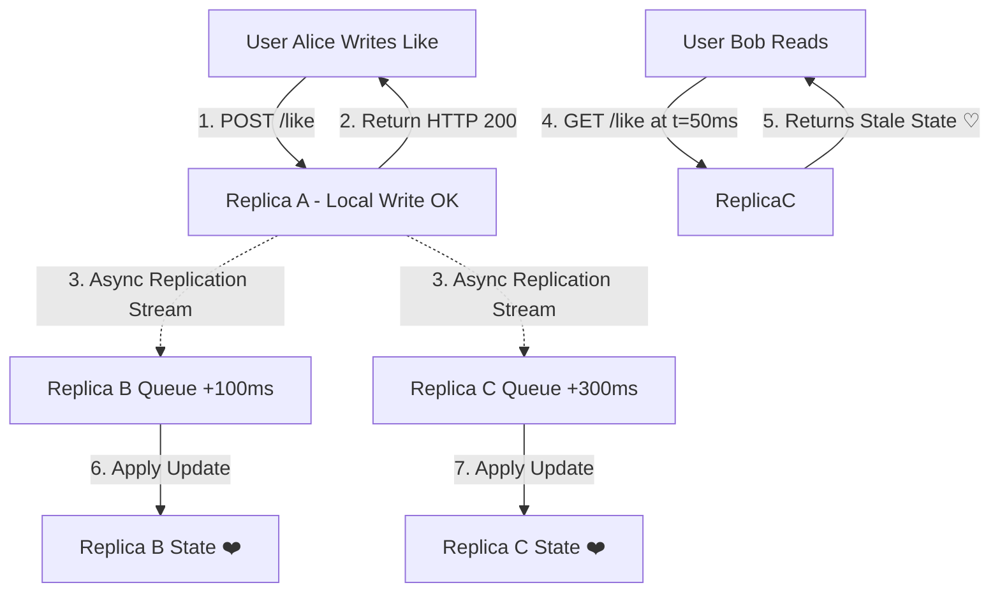

# Day 15 — Eventual Consistency: Why Your Instagram Like Appears Later

Yesterday, in **Day 14**, we explored **Quorums**: how requiring agreement from a subset ($W + R > N$) of database replicas guarantees that read operations intersect with recent write operations.

However, once data is replicated across multiple independent database nodes, replicas rarely receive and apply updates at the exact same physical instant. If a write is acknowledged after updating one or two replicas, the remaining replicas across the world will lag behind until background network synchronization catches up.

This leads us to a central question that defines modern high-scale software engineering:

> **Do all replicas in a distributed system need to agree immediately?**

---

## The Problem

Imagine two friends sitting across from each other at a coffee shop: **Alice** and **Bob**. Both have their smartphones open to the same post on a social media feed.

Alice taps the heart icon to like the post.

```
User clicks ❤️
        ↓
Replica A receives update
        ↓
Replica B receives update later
        ↓
Replica C receives update later
```

Here is what happens inside the distributed infrastructure under the hood:

1. Alice's client sends an HTTP `POST /like` request. The API gateway routes her request to **Replica A**, located in a primary data center nearby. **Replica A** records the like immediately.
2. Alice's feed UI instantly updates to show **❤️ 1 Like**.
3. Meanwhile, Bob refreshes his screen 50 milliseconds later. His HTTP request is routed to **Replica B**, located in a secondary data center that has not received the replicated update yet.
4. Bob's screen displays **♡ 0 Likes**.

Bob looks over at Alice’s phone, sees the red heart on her screen, and asks:

> **“Is the system broken?”**

If you evaluate this system through the lens of a single-node SQL database, the answer seems to be *yes*. The system holds two conflicting truths at the exact same moment in time.

However, in a high-scale distributed system, the answer can be a deliberate **no**.

The system is behaving exactly as engineered. It is operating under an intentional engineering trade-off: **Eventual Consistency**.

---

## Why This Happens

Replicas temporarily disagree because physical reality imposes constraints on distributed networks:

* **Replication takes time**: Signals traveling over fiber-optic cables are bounded by the speed of light. Transmitting data across data centers takes tens to hundreds of milliseconds.
* **Networks have latency**: Packet jitter, network congestion, and routing delays introduce unpredictable arrival times across nodes.
* **Replicas process requests at different speeds**: Individual database instances may be handling background I/O, vacuuming tables, or undergoing CPU spikes, causing updates to process at varying speeds.
* **Queues can build up**: Asynchronous replication streams rely on memory buffers and message queues. If write throughput spikes, queues back up temporarily.
* **Failures and retries delay propagation**: Transient packet drops cause network retry timeouts, temporarily delaying propagation to specific replicas.
* **Distributed systems cannot make every machine instantly share state**: Without locking every machine on Earth simultaneously, instant worldwide state synchronization is physically impossible.

Crucially, **“not yet updated” does not mean “wrong forever.”** Replicas are simply processing the stream of reality at slightly different timestamps.

---

## The Wrong Solution

A developer encountering this behavior for the first time might offer a simple fix:

> *“Just update every single replica across the globe before returning success to the user!”*

This approach is known as **synchronous strong replication**. While it eliminates temporary divergence, it introduces severe production penalties:

```
[Client Write Request]
         │
         ▼
 ┌──────────────┐   (Sync Write)   ┌──────────────┐
 │  REPLICA A   │ ───────────────► │  REPLICA B   │ (Normal: 15ms)
 └──────────────┘                  └──────────────┘
         │
         │          (Sync Write)   ┌──────────────┐
         └───────────────────────► │  REPLICA C   │ (SLOW / GC Pause: 1200ms!)
                                   └──────────────┘
                                           │
 ◄─────────────────────────────────────────┘
 (Client STALLS for 1200ms waiting for Replica C!)
```

Enforcing synchronous updates across all replicas introduces:

1. **Higher Latency**: Every write request is throttled by the response time of the slowest replica in the entire network.
2. **Heavy Coordination**: Nodes must execute multi-phase locking protocols to block concurrent reads while updates commit.
3. **Dependence on Slow Replicas**: A single node experiencing a Garbage Collection (GC) pause or disk bottleneck stalls all global user writes.
4. **Reduced Availability During Failures**: If even one replica suffers a network partition or hardware crash, write operations fail across the platform.
5. **Increased Operational Complexity**: Handling deadlocks, distributed rollbacks, and quorum timeouts overhead balloons rapidly.

### Is Strong Consistency Bad?

No. Strong consistency is **not** universally bad. Strong consistency is critical for workloads where staleness results in business corruption—such as financial ledger balances, stock trading engines, or seat reservations during flight booking.

However, forcing a global social media platform to wait for full synchronous consensus just to increment a like button would destroy its scale and availability.

---

## The Right Mental Model

**Eventual consistency** is a consistency model that makes a relaxed guarantee:

> **If no new updates are made to a given data item, all replicas will eventually converge and return the exact same value.**

```
UPDATE (t=0)
  ↓
Replica A ──→ updated (t=0)
Replica B ──→ catching up (t=1)
Replica C ──→ catching up (t=2)
  ↓
Eventually (t=3)
  ↓
A = B = C
```

### The Newspaper Analogy

Consider how daily newspapers are published and distributed:

* The morning edition is printed at a central printing press at 3:00 AM.
* Delivery trucks transport physical copies to different cities across the region.
* **City A** receives its newspapers at 5:00 AM. Residents reading the news in City A learn about an event immediately.
* **City B** receives its shipment at 7:00 AM due to highway traffic. Between 5:00 AM and 7:00 AM, residents in City B are reading yesterday's edition.
* Temporarily, people in City A and City B observe different versions of the truth.
* By 8:00 AM, all deliveries have finished, and distribution has **converged**.

#### Distinguishing Analogy from Distributed Systems

While the newspaper analogy illustrates delayed delivery, physical print runs are immutable static snapshots. In a distributed database:
1. Writes arrive continuously from millions of independent clients.
2. Data updates occur concurrently on active instances.
3. Background algorithms (such as vector clocks or last-write-wins timestamps) must resolve conflicting concurrent edits during convergence.

---

## How It Actually Works

Let's trace the lifecycle of an eventually consistent write and read flow step-by-step.

```
Step 1: Write  ──►  Step 2: Local Apply  ──►  Step 3: Async Propagate  ──►  Step 4: Divergence  ──►  Step 5: Convergence
 (POST /like)        (Replica A ❤️)             (Replication Queue)         (A=❤️, B=♡, C=♡)       (A=❤️, B=❤️, C=❤️)
```

### Step 1 — A Write Happens
A user clicks the like button on a post. The client sends an HTTP request: `POST /posts/101/like`.

### Step 2 — One Replica Receives It
The API load balancer forwards the request to **Replica A**. Replica A applies the write locally to its storage engine, sets `liked = True`, and immediately returns `HTTP 200 OK` to the user.

### Step 3 — Replication Begins
Replica A places a change data capture (CDC) event or replication log entry into an asynchronous message queue. Background replication threads pull this entry to forward it to Replica B and Replica C.

### Step 4 — Temporary Divergence
During the propagation window, the replicas hold divergent state:

```
Replica A → ❤️  (Liked)
Replica B → ♡  (Not Liked - queue in flight)
Replica C → ♡  (Not Liked - queue in flight)
```

If User 1 reads from **Replica A**, they observe `❤️`.  
If User 2 reads from **Replica B**, they observe `♡`.

### Step 5 — Convergence
After 100 milliseconds, background replication jobs deliver the update to Replica B and Replica C.

```
Replica A → ❤️
Replica B → ❤️
Replica C → ❤️
```

Once updates cease, all replicas hold identical values (`A = B = C`).

> ⚠️ **Key Distinction**: Eventual consistency describes a **convergence property**, not a fixed deadline. It promises that state will converge *eventually*, but does not specify a hard guarantee on how many milliseconds that window will last.

---

## Consistency Is a Spectrum

Distributed consistency is not a binary choice between "perfect synchronization" and "total chaos." It exists along a continuous spectrum balancing **Correctness vs. Performance**:

```
Strong Consistency  ◄────────────────────────────────────────►  Eventual Consistency
 (Synchronous, Low Latency, High Coordination)                  (Asynchronous, High Scale, Low Latency)
```

| Use Case | Temporary Staleness? | Typical Priority | Engineering Rationale |
| :--- | :--- | :--- | :--- |
| **Social Likes / View Counts** | Often acceptable | Scale / Latency | Seeing 4,102 likes instead of 4,105 for 200ms has zero business impact. |
| **Product Recommendations** | Usually acceptable | Availability / Freshness | Recommending an item based on a 5-minute-old view history is completely safe. |
| **Search Indexing** | Often acceptable | Throughput | Search results updating a few seconds after a document edit is standard. |
| **Bank Account Balance** | Usually unacceptable | Correctness | Overdrawing funds due to a stale read causes financial loss. |
| **Inventory during Checkout** | Much stricter | Correctness | Overselling reserved physical inventory leads to order cancellations. |

*Note: These represent general architectural trade-offs, not rigid rules. Specific domain requirements dictate exact implementation choices.*

---

## Visual Explanation

### 1. Replication Delay Architecture (`replication-delay.png`)

```
                  [USER WRITE: POST /like]
                             │
                             ▼
                    ┌─────────────────┐
                    │    REPLICA A    │ (Updated Instantly: t=0ms)
                    └────────┬────────┘
                             │
            ┌────────────────┴────────────────┐
            │ Async Replication               │ Async Replication
            ▼ (+120ms Latency)                ▼ (+340ms Latency)
   ┌─────────────────┐               ┌─────────────────┐
   │    REPLICA B    │               │    REPLICA C    │
   │ (In Queue... )  │               │ (In Queue... )  │
   └─────────────────┘               └─────────────────┘
```

### 2. Temporary Divergence Matrix (`temporary-divergence.png`)

```
State Divergence Window (t = 50ms):
┌───────────────────────────────┬───────────────────────────────┬───────────────────────────────┐
│           REPLICA A           │           REPLICA B           │           REPLICA C           │
│           [ ❤️  ]             │           [ ♡   ]             │           [ ♡   ]             │
│        Status: True           │        Status: False          │        Status: False          │
└───────────────────────────────┴───────────────────────────────┴───────────────────────────────┘
  ⚠️ System is temporarily divergent. Requests served by B or C observe stale state.
```

### 3. Eventual Convergence (`eventual-convergence.png`)

```
Converged Cluster Matrix (t = 400ms):
┌───────────────────────────────┬───────────────────────────────┬───────────────────────────────┐
│           REPLICA A           │           REPLICA B           │           REPLICA C           │
│           [ ❤️  ]             │           [ ❤️  ]             │           [ ❤️  ]             │
│        Status: True           │        Status: True           │        Status: True           │
└───────────────────────────────┴───────────────────────────────┴───────────────────────────────┘
  🟢 Replicas fully converged: A = B = C.
```

### 4. Dual-User Observation (`user-observation.png`)

```
 👥 User Alice                                                           👥 User Bob
 (Connected to Replica A)                                               (Connected to Replica C)
         │                                                                       │
         │ GET /post/101                                                         │ GET /post/101
         ▼                                                                       ▼
 ┌──────────────┐         Async Replication Packet In-Flight          ┌──────────────┐
 │  REPLICA A   │ ══════════════════════════════════════════════════► │  REPLICA C   │
 │  (State: ❤️) │                                                         │  (State: ♡)  │
 └──────────────┘                                                         └──────────────┘
         │                                                                       │
         ▼                                                                       ▼
   Sees: "❤️ Liked"                                                        Sees: "♡ Unliked"
```

### 5. Consistency Spectrum Map (`consistency-spectrum.png`)

```
   STRICT CORRECTNESS                                              MAXIMUM SCALABILITY
   Low Availability                                                 High Availability
   High Latency                                                     Low Latency
        │                                                                │
  ──────┴────────────────────────────────────────────────────────────────┴──────
  Bank Balances     Flight Seats     Shopping Carts    Search Index    Social Likes
  [Linearizable]    [Sequential]     [Read-Your-Own]   [Bounded Lag]   [Eventual]
```



---

## Real World Example

Consider how massive social media feeds manage graph interactions (likes, follower counts, and comment threads) across global data centers.

```
User A (New York) ──► Creates Like ──► NY Replica (Updated)
                                            │
                                            ▼ (Async Ocean Cable Replication)
                                     London Replica (Converges +150ms)
                                            │
                                            ▼
User B (London) ◄──────────────────── Reads Like
```

1. **User A in New York** likes a post. The write touches the East Coast entry replica.
2. The East Coast data center immediately returns success to User A. User A's local device updates UI Optimistically.
3. Background replication pipes stream the write event across transoceanic fiber-optic cables to European and Asian edge replicas.
4. **User B in London** views the feed 50ms later from a local European replica. For a fraction of a second, the counter does not include User A's like.
5. Within 150ms, the replication packet arrives in London, the database updates, and subsequent reads by User B show the updated count.

*Note: This flow represents a simplified educational model of asynchronous graph replication.*

---

## Build It Yourself

We have built a deterministic, runnable Python simulation of eventual consistency in [`code/eventual_consistency_simulator.py`](file:///d:/30_Days_of_Distributed_Systems/days/Day-15-Eventual-Consistency/code/eventual_consistency_simulator.py).

### Running the Simulator

Execute the simulation directly using Python:

```bash
python days/Day-15-Eventual-Consistency/code/eventual_consistency_simulator.py
```

### Trace of Simulation Output

```text
==================================================================
 Day 15 Simulation: Eventual Consistency & Replica Divergence
==================================================================

--- TICK t=0 ---
  [INFO] Initial cluster state before any action.

[CLUSTER STATE at t=0]
   * Replica A: [EMPTY HEART] (False)
   * Replica B: [EMPTY HEART] (False)
   * Replica C: [EMPTY HEART] (False)

[CLIENT READ OBSERVATIONS]
   * User 'Alice' reading from Replica A -> sees Not Liked (False)
   * User 'Bob' reading from Replica B -> sees Not Liked (False)
   * User 'Charlie' reading from Replica C -> sees Not Liked (False)
  ==> STATUS: EVENTUAL CONVERGENCE ACHIEVED (All replicas agree)

[EVENT] User clicks LIKE on post 'post_101' -> Served by Replica A

--- TICK t=1 ---
  [UPDATE] Replica B applied update: post_101 = True

[CLUSTER STATE at t=1]
   * Replica A: [LIKE HEART] (True)
   * Replica B: [LIKE HEART] (True)
   * Replica C: [EMPTY HEART] (False)

[CLIENT READ OBSERVATIONS]
   * User 'Alice' reading from Replica A -> sees Liked (True)
   * User 'Bob' reading from Replica B -> sees Liked (True)
   * User 'Charlie' reading from Replica C -> sees Not Liked (False)
  ==> STATUS: TEMPORARY DIVERGENCE (Replicas disagree due to propagation delay)

--- TICK t=2 ---
  [UPDATE] Replica C applied update: post_101 = True

[CLUSTER STATE at t=2]
   * Replica A: [LIKE HEART] (True)
   * Replica B: [LIKE HEART] (True)
   * Replica C: [LIKE HEART] (True)

[CLIENT READ OBSERVATIONS]
   * User 'Alice' reading from Replica A -> sees Liked (True)
   * User 'Bob' reading from Replica B -> sees Liked (True)
   * User 'Charlie' reading from Replica C -> sees Liked (True)
  ==> STATUS: EVENTUAL CONVERGENCE ACHIEVED (All replicas agree)

--- TICK t=3 ---
  [INFO] No network packets arrived in this tick.

[CLUSTER STATE at t=3]
   * Replica A: [LIKE HEART] (True)
   * Replica B: [LIKE HEART] (True)
   * Replica C: [LIKE HEART] (True)

[CLIENT READ OBSERVATIONS]
   * User 'Alice' reading from Replica A -> sees Liked (True)
   * User 'Bob' reading from Replica B -> sees Liked (True)
   * User 'Charlie' reading from Replica C -> sees Liked (True)
  ==> STATUS: EVENTUAL CONVERGENCE ACHIEVED (All replicas agree)
```

### Code Structure Walkthrough

The simulator implements three core classes:

1. `Replica`: Maintains local key-value state and an incoming replication queue sorted by delivery tick.
2. `DistributedLikeService`: Coordinates writes to an entry replica and schedules delayed background propagation packets to secondary nodes.
3. `run_simulation()`: Advances the discrete clock tick by tick, printing cluster state matrices and client observation views.

---

## Common Misconceptions

| Misconception | Engineering Reality |
| :--- | :--- |
| **“Eventual consistency means the system is always inconsistent.”** | **False.** The system is consistent most of the time. Divergence only occurs during active replication lag windows after writes occur. |
| **“Eventually means within a fixed number of seconds.”** | **False.** "Eventually" is a mathematical guarantee of convergence if updates stop; it does not promise a fixed upper bound without SLA enforcement. |
| **“Eventual consistency means data can be permanently wrong.”** | **False.** Permanent data corruption is a bug or unhandled conflict, not a property of eventual consistency. |
| **“Strong consistency is always better.”** | **False.** Strong consistency trades off availability and latency. For high-scale read/write workloads, it creates massive bottlenecks. |
| **“Eventual consistency is only useful for social media.”** | **False.** It is heavily used in search indexing, DNS resolution, distributed caches, domain name propagation, and telemetry pipelines. |
| **“Replication automatically makes data consistent.”** | **False.** Replication introduces multiple copies. Without synchronous locks or quorum protocols, replication creates divergence by default. |
| **“If two users see different values, the database is broken.”** | **False.** Disagreement during propagation is an intentional, architected trade-off to maximize availability and throughput. |
| **“Eventual consistency means there are no correctness guarantees.”** | **False.** Eventual consistency guarantees safety against permanent divergence and can be augmented with Read-Your-Own-Writes session consistency. |

### Temporary Staleness vs. Permanent Inconsistency

* **Temporary Staleness**: Node A has value $V_2$ at $t_1$, while Node B still holds $V_1$. At $t_2$, Node B receives the update and converges to $V_2$. (Expected behavior).
* **Permanent Inconsistency**: Node A and Node B receive conflicting concurrent writes ($V_A$ and $V_B$) without a deterministic conflict resolution rule. The nodes remain on different values indefinitely. (System flaw).

---

## Production Trade-offs

### Advantages

* ⚡ **Lower Latency**: Write requests return immediately after updating the entry replica without blocking on cross-datacenter round trips.
* 🛡️ **Improved Availability**: Writes succeed even if 90% of global secondary replicas are down or unreachable due to network partitions.
* 🌐 **Easier Geographic Distribution**: Datacenters around the world can serve local client reads at sub-millisecond speeds.
* 📈 **High Scalability**: Removing synchronous lock coordination allows systems to handle millions of writes per second seamlessly.

### Disadvantages

* 👁️ **Stale Reads**: Clients may read outdated values immediately after submitting writes.
* 🔀 **Complex Application Logic**: Application layers must handle out-of-order updates, UI retries, and optimistic rendering.
* ⚔️ **Conflict Handling**: Concurrent writes to the same key on different replicas require resolution strategies (Last-Write-Wins, CRDTs, or Vector Clocks).
* 🧪 **Harder Debugging & Testing**: Non-deterministic replication timing makes reproduction of concurrency bugs challenging.

---

## Failure Cases

Distributed systems relying on eventual consistency face specific operational failure modes:

1. **Prolonged Replication Lag**: High write volume or network congestion can cause replication queues to back up for minutes or hours, extending the staleness window.
2. **Network Partitions (Split-Brain Risk)**: If a network link snaps between datacenters, replicas continue accepting writes independently, causing deep divergence until reconnection.
3. **Replica Failures & Dropped Messages**: If a secondary replica crashes while a replication message is in flight, the update may be lost unless persistent WAL or retry queues exist.
4. **Conflicting Concurrent Updates**: Two users updating the same user profile simultaneously on different replicas can result in lost updates if conflict resolution is naive.

---

## Performance Implications

By decoupling write execution from replica synchronization, system latency profile shifts dramatically:

* **Synchronous Replication Write Latency**:
  $$\text{Latency}_{\text{write}} = \max(\text{Latency}_{\text{Replica } A}, \text{Latency}_{\text{Replica } B}, \text{Latency}_{\text{Replica } C}) + \text{Network Roundtrip}$$
* **Asynchronous Eventual Write Latency**:
  $$\text{Latency}_{\text{write}} = \text{Latency}_{\text{Local Replica } A}$$

Asynchronous propagation yields sub-10ms write responses, unlocking massive user throughput.

---

## Scaling Implications

When application infrastructure expands across continents (e.g., North America, Europe, Asia):

* Transoceanic ping latency averages $100\text{ms} - 250\text{ms}$.
* Requiring synchronous confirmation across regions means every single database write takes a minimum of $250\text{ms}$.
* Eventual consistency allows local edge datacenters to acknowledge writes in $5\text{ms}$, propagating data asynchronously in the background.

---

## Operational Considerations

Production systems implementing eventual consistency require specialized telemetry and monitoring metrics:

* **Replication Lag (Seconds / Bytes)**: Measuring the delta between the primary write offset and secondary applied offset.
* **Convergence Time (p95 / p99)**: Tracking how many milliseconds it takes for $99\%$ of replicas to catch up to a write.
* **Retry Queue Health**: Monitoring dead-letter queues (DLQs) for failed replication payloads.
* **Stale-Read Frequency**: Telemetry measuring how often clients observe outdated data states in production.

---

## Key Takeaways

1. **Replication creates copies** across independent servers to guarantee durability and scale.
2. **Copies do not update simultaneously** due to network latency, queues, and processing variance.
3. **Temporary divergence can be intentional**—it is a conscious engineering choice trading instant agreement for high availability and low latency.
4. **Eventual consistency means replicas converge** to identical values once write operations pause.
5. **"Eventually" is not a fixed SLA**; convergence depends on network health, queue depth, and workload velocity.
6. **Staleness is not corruption**; temporary read lag is distinct from permanent data divergence.
7. **Strong consistency carries a steep performance tax**, forcing writes to stall on the slowest node.
8. **Application UIs hide lag** using optimistic UI updates (e.g., highlighting a heart locally before server confirmation).
9. **Conflict resolution rules matter** (e.g., Last-Write-Wins or CRDTs) when concurrent writes land on different replicas.
10. **The right consistency model depends on the business requirement**—likes tolerate staleness, bank accounts do not.

---

## Interview Questions

### 1. What is eventual consistency?
**Answer**: Eventual consistency is a weak consistency model in distributed systems guaranteeing that if no new updates are made to a data item, all replicas will eventually converge and return the exact same value when queried.

### 2. Why can database replicas temporarily disagree?
**Answer**: Replicas disagree because updates propagate asynchronously across network channels. Factors like physical light speed limits, network latency, message queuing, node processing loads, and retries prevent updates from being applied simultaneously on all machines.

### 3. What does "eventually" actually mean in eventual consistency?
**Answer**: "Eventually" means there is a mathematical guarantee of convergence in the absence of new writes, but it specifies no fixed upper bound on time. Real-world convergence usually takes milliseconds, but can stretch to minutes during heavy lag or network partitions.

### 4. Why might a system prefer eventual consistency over strong consistency?
**Answer**: Eventual consistency drastically reduces write latency, eliminates coordination bottlenecks, isolates workloads from slow or crashed nodes, and enables seamless global multi-datacenter geographic scaling.

### 5. How does eventual consistency improve system availability?
**Answer**: Under CAP theorem, when a network partition occurs, an eventually consistent system allows replicas to continue accepting local read and write requests independently, maintaining $100\%$ availability at the cost of temporary state divergence.

### 6. What is replica lag and how is it measured?
**Answer**: Replica lag is the time or log-offset delay between when a write is committed on an entry replica and when it is applied on a secondary replica. It is measured using timestamp deltas or write-ahead log (WAL) sequence offset differences.

### 7. When would eventual consistency be inappropriate?
**Answer**: It is inappropriate for financial transactions, inventory reservation during checkout, authorization/permission revocation systems, or any domain where reading stale data violates core business correctness or safety.

### 8. How would you debug a production system where users report seeing stale values?
**Answer**: Check replication lag telemetry across secondary replicas, inspect queue depth and dead-letter queues, verify network latency between datacenters, check for long GC pauses on database nodes, and ensure client routing sticky-sessions or Read-Your-Own-Writes mechanisms are functioning.

---

## Further Reading

For a deeper dive into research papers, architectural blog posts, and database documentation on eventual consistency, visit today's references guide:

* 📚 [references.md](references.md)

---

## What you'll build intuition for tomorrow

We have spent several days exploring how data is stored, sharded, replicated, and synchronized across distributed databases. But how do these independent servers actually talk to one another over bare network sockets?

Tomorrow, in **Day 16**, we transition from data storage to distributed communication: **RPC (Remote Procedure Calls) — Making Remote Servers Feel Local**.
