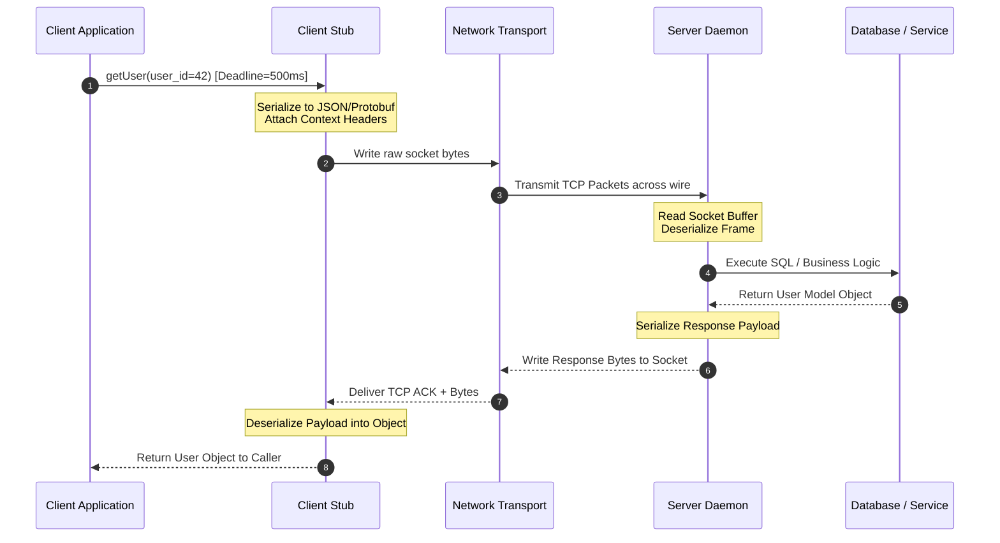

# RPC — Why Calling Another Server Feels Like Calling a Function

In **Day 15**, we explored **Eventual Consistency**: how replicas in a distributed system temporarily diverge in state because physical network propagation takes time. We saw that distributed data stores choose to trade immediate global synchronization for lower latency and continuous availability.

So far, we have looked closely at how data is stored, sharded, replicated, and kept consistent across multiple machines. But that brings us to an equally fundamental question about how distributed systems actually work in practice:

> **How do independent services talk to one another across the network?**

When you write software on a single computer, calling code in another file is trivial. You write `user = get_user(42)`, the CPU jumps to a memory address, executes the instructions, and returns the result in a few nanoseconds.

In a modern microservices architecture, `get_user(42)` might look like the exact same function call in your IDE. But behind that single line of code, your application is serializing data into raw bytes, opening a TCP socket, traversing routers and switches, waiting for a remote CPU miles away to compute a response, and reading bytes back off the wire.

This is the magic—and the trap—of **Remote Procedure Call (RPC)**.

---

## The Problem

Imagine building an e-commerce platform. When the application started, it was a single monolithic codebase. Every function call was a local call within the same operating system process:

```python
# Monolithic Architecture (In-Memory Function Call)
user = get_user(user_id=42)
inventory = check_inventory(item_id=9001)
payment = process_payment(user_id=42, amount=49.99)
```

As the business scales, this monolith is split into independent services owned by separate engineering teams:

```text
Frontend Gateway
       │
       ├──► Order Service
       │        │
       │        ├──► Inventory Service
       │        └──► Payment Service
       │
       └──► User Service
```

The engineering team wants to keep application code clean, readable, and simple. Developers do not want to manually write hundreds of lines of HTTP socket boilerplate, construct raw request headers, manage network buffers, parse JSON strings, and handle raw socket errors every single time one service needs data from another.

They want to keep writing clean function calls:

```python
user = get_user(42)
```

However, the data and execution logic no longer live in the application's local process memory. They live on another physical machine in a data center hundreds of miles away.

This introduces a fundamental **abstraction problem**:

> **Syntactically**, calling a remote service looks like a local function call.
> **Semantically and physically**, it is a network operation subject to latency, packet loss, server crashes, and partial failure.

---

## Why This Happens

As software systems scale, splitting monolithic applications into distributed services becomes inevitable for several reasons:

* **Independent Scaling**: The Payment Service may handle 1,000 requests per second while the User Service handles 100,000 requests per second. Scaling them independently saves immense compute resources.
* **Process Separation & Fault Isolation**: A memory leak or CPU spike in a recommendation engine should not crash the core checkout pipeline.
* **Domain Ownership**: Separate teams maintain independent codebases, databases, and deployment schedules without stepping on each other's code.
* **Data Ownership**: Service boundaries enforce strict data hiding—the User Service directly owns the user database; no other service is permitted to issue direct SQL queries to it.

Because these services run in separate processes on separate physical servers, **communication must cross physical network boundaries**.

### The Desk vs. The Across-Town Coworker Analogy

Think of a local function call as opening your desk drawer to retrieve a paper file. It is instantaneous, completely under your control, and if the file is in the drawer, you get it immediately.

An RPC is like telephoning a coworker across town and asking them to find a file in *their* desk drawer, read it aloud over a noisy phone line, and fax a copy back to you. 

* The coworker might be away from their desk (server down).
* The phone line might drop mid-sentence (network partition).
* The fax machine might run out of ink (response lost).
* The request might take 20 minutes instead of 2 seconds (latency).

The network is no longer an invisible implementation detail—it becomes a primary governor of application behavior.

---

## The Wrong Solution

The beginner intuition when encountering RPC for the first time is:

> *"It looks like a function call, so I can treat it exactly like a local function call."*

This mental model fails catastrophically in production because local calls and remote calls operate under fundamentally different physical laws:

### Local Call vs. Remote Call

#### Local Function Call

```text
┌────────────────────────────────────────────────────────┐
│ Process Memory Boundary                                │
│                                                        │
│  Application Code ──────► function(arg)                │
│                                │                       │
│                                ▼                       │
│                           RAM / Registers              │
└────────────────────────────────────────────────────────┘
```

#### Remote Procedure Call

```text
┌────────────────┐     Network Boundary     ┌────────────────┐
│ Client Process │                          │ Server Process │
│                │  (Latency, Packet Loss,  │                │
│  App Code      │   Connection Failures)   │   Handler Code │
│     │          │    ──────────────────►   │        ▲       │
│     ▼          │                          │        │       │
│ Client Stub ───┼──► Socket ──► Network ──┼─► Server Stub   │
└────────────────┘                          └────────────────┘
```

### Why the Local Assumption Fails

When you call a local function `add(2, 3)`, only three outcomes are possible:
1. It returns `5`.
2. It raises an explicit local exception (e.g., `TypeError`).
3. It loops infinitely / crashes the entire process.

When you invoke a Remote Procedure Call, an entirely new dimension of failure modes emerges:

| Phenomenon | Local Function Call | Remote Procedure Call (RPC) |
| :--- | :--- | :--- |
| **Execution Latency** | Nanoseconds ($\sim 1 - 10 \text{ ns}$) | Milliseconds ($\sim 5 - 500 \text{ ms}$) — $100,000\times$ slower! |
| **Memory Access** | Shared direct address space (pointers) | Separated process memory (must copy & serialize) |
| **Failure Modes** | Program crash or local exception | Network drop, server crash, GC pause, packet corruption |
| **Execution Guarantee** | Exactly-once (if it runs, it runs) | At-least-once, At-most-once, or Unknown (Partial Failure) |
| **Concurrency** | Thread context switches | Socket connections, thread pools, network I/O multiplexing |
| **Schema Evolution** | Uniformly compiled in single binary | Client and Server can run different software versions |

> **Crucial Insight**: RPC hides the underlying network mechanics from your application syntax, but it **cannot eliminate network physics**.

---

## The Right Mental Model

To design resilient distributed systems, engineers must adopt the correct mental model:

> **RPC makes remote communication look like a function call; it does not make remote communication behave like a local function call.**

An RPC is a network request disguised as a method call. 

When you write `user = user_service.getUser(42)`, you are not jumping to a memory address. You are instructing a local client component to serialize parameters into bytes, transmit those bytes across a fragile physical network, wait for a remote server to process them, and deserialize the returned byte payload back into an object.

```text
Application Code
      │
      │ 1. Invokes function-like API: getUser(42)
      ▼
RPC Client Stub
      │
      │ 2. Serializes arguments into structured payload (JSON / Protobuf)
      ▼
Network Socket Layer
      │
      │ 3. Transmits bytes across TCP network boundary
      ▼
Physical Network (Routers / Switches / Latency)
      │
      │ 4. Receives raw byte stream from socket
      ▼
RPC Server Stub
      │
      │ 5. Deserializes byte payload into language objects
      ▼
Server Target Handler
      │
      │ 6. Executes actual business logic in server memory
      ▼
Returns Result (Flows back through the inverse pipeline)
```

---

## How It Actually Works

Let me walk you step-by-step through what happens when an application executes a remote procedure call like `getUser(42)`.

```text
  CLIENT SIDE                                              SERVER SIDE
┌──────────────┐                                        ┌──────────────┐
│ Application  │                                        │ Handler Code │
└──────┬───────┘                                        └──────▲───────┘
       │ (1) Call getUser(42)                                  │ (7) Execute getUser(42)
       ▼                                                       │
┌──────────────┐                                        ┌──────┴───────┐
│ Client Stub  │                                        │ Server Stub  │
└──────┬───────┘                                        └──────▲───────┘
       │ (2) Pack args & Serialize                             │ (6) Unpack args & Deserialize
       ▼                                                       │
┌──────────────┐    (4) Send over wire    ┌─────────┐   (5) Receive bytes   ┌──────────────┐
│ Client Socket├─────────────────────────►│ Network ├──────────────────────►│ Server Socket│
└──────────────┘                          └─────────┘                       └──────────────┘
```

### The 12 Steps of an RPC Call

1. **Application Call**: The client application code calls the local interface provided by the client stub: `client.getUser(42)`.
2. **Argument Packing**: The Client Stub collects the method name (`"getUser"`) and arguments (`user_id = 42`).
3. **Serialization (Marshaling)**: The stub converts native memory objects (integers, strings, structs) into a byte payload (e.g., JSON string or binary Protocol Buffers).
4. **Transport Transmission**: The client transport layer writes the payload to a network socket over TCP/IP or HTTP/2.
5. **Network Propagation**: Data packets traverse physical switches, routers, and fiber lines to reach the destination IP.
6. **Server Socket Receive**: The RPC server daemon accepts raw bytes off its network interface socket buffer.
7. **Deserialization (Unmarshaling)**: The Server Stub parses raw bytes back into server-native data structures.
8. **Method Dispatch**: The Server Stub matches the method name `"getUser"` against its internal handler lookup table.
9. **Handler Execution**: The server executes the actual local function against its database or business logic.
10. **Response Serialization**: The handler's return object is marshaled into a response byte frame by the server stub.
11. **Return Transmission**: Serialized response bytes are written back across the network socket to the client.
12. **Client Unpacking & Return**: The Client Stub deserializes the response byte frame and returns the resulting object back to the caller application.

---

### Serialization

Machines do not exchange native Python objects or Java class pointers over the wire. Bytes cross the wire.

**Serialization** (or Marshaling) is the process of translating in-memory data structures into a flat format suitable for transmission.

```text
In-Memory Object                 Serialized Byte Payload
┌──────────────────┐             ┌────────────────────────────────┐
│ User {           │             │ JSON:                          │
│   id: 42,        │ ──────────► │ {"id":42,"name":"Alice"}       │
│   name: "Alice"  │ Serialization│                               │
│ }                │             │ Protobuf (Binary):             │
└──────────────────┘             │ 08 2a 12 05 41 6c 69 63 65     │
                                 └────────────────────────────────┘
```

Common serialization approaches include:

* **Text Formats (JSON / XML)**: Human-readable, schema-less or loosely typed, larger payload size, higher CPU parsing overhead.
* **Binary Formats (Protocol Buffers / Thrift / Avro)**: Strongly typed, schema-driven, highly compact, extremely fast CPU encoding/decoding.

---

### Stubs and Interfaces

The key magic trick of RPC is the **Stub**.

* **Client Stub**: Presents the exact same interface as a local function, hiding socket creation, parameter serialization, network writing, and error parsing.
* **Server Stub (Skeleton)**: Listens on a socket, parses incoming byte frames, maps requested method strings to real function pointers, and returns output.

Modern RPC frameworks (like gRPC) generate client and server stubs automatically from Interface Definition Language (IDL) files.

---

### Timeouts and Deadlines

In a local function call, if a function takes time, the CPU is simply executing instructions. In an RPC, if a response doesn't return, **why are you waiting?**

* Is the server slow?
* Is the network dropping packets?
* Did the server crash mid-execution?
* Is a switch dead?

Without a **Timeout**, your client thread will block forever, hogging memory, connection sockets, and thread pools until the entire client application exhausts resources and crashes.

```text
UNBOUNDED WAITING (DANGEROUS)

Client Thread  ──────────────► Request ──────────────► Server (Hanging / Deadlock)
(Blocked Forever)                                      X (Never responds)
```

```text
BOUNDED DEADLINE (SAFE)

Client Thread  ──────────────► Request ──────────────► Server (Slow)
(Timer: 500ms)                                         │
     │                                                 │ (Processing...)
     ▼ (t = 500ms)                                     │
Raises TimeoutError! ◄─────────────────────────────────┘ (Too late!)
```

* **Timeout**: A relative duration (e.g., *"Wait at most 500 milliseconds for this call"*).
* **Deadline**: An absolute point in time passed down a multi-tier call chain (e.g., *"This entire user request must finish by 14:32:01.050 GMT"*).

---

### Retries

When an RPC call fails due to a network glitch or timeout, developers are tempted to automatically retry:

```python
# Naive Client Retry
try:
    payment = rpc_client.charge_card(user_id=42, amount=100)
except TimeoutError:
    payment = rpc_client.charge_card(user_id=42, amount=100) # RETRY!
```

Now consider this nightmare scenario:

```text
Client                       Server                      Database
  │                            │                            │
  ├─── charge_card($100) ─────►│                            │
  │                            ├─── Process Payment ───────►│ (Card Charged $100!)
  │                            │                            │
  │    ◄── Response Lost! ─────X (Network Drop)             │
  │                            │                            │
  ▼ (Timeout Triggered)        │                            │
"Did it fail or succeed?"      │                            │
  │                            │                            │
  ├─── RETRY charge_card()────►│                            │
  │                            ├─── Process Payment ───────►│ (CARD CHARGED AGAIN $100!)
```

If the original request reached the server and executed, but the response was lost over the network, **retrying the request executes duplicate work**.

This is why retries are only safe if the remote function is **Idempotent**—meaning executing the request multiple times produces the exact same side-effect as executing it once.

---

### Partial Failure

In single-machine software, either the machine works or it doesn't.

In distributed systems, you face **Partial Failure**: part of the system is working perfectly while another part has failed, and you cannot tell which is which.

```text
PARTIAL FAILURE STATE

Client (Alive & Healthy) ──────► Network (Broken) ──────► Server (Alive & Healthy)
```

* The client is healthy.
* The server is healthy.
* The network link between them is broken.

The client cannot distinguish between a dead server, a congested network, or a lost response packet. **Partial failure is the defining characteristic of distributed computing.**

---

## Visual Explanation

### 1. Local vs Remote Function Call Architecture

```text
LOCAL EXECUTION MODEL

  ┌────────────────────────────────────────────────────────┐
  │ Client Application                                     │
  │                                                        │
  │   user = get_user(42)  ───► Direct Jump to Memory    │
  │                                 │                      │
  │                                 ▼                      │
  │                            [RAM / CPU]                 │
  └────────────────────────────────────────────────────────┘

REMOTE EXECUTION MODEL

  ┌────────────────────────────────────────────────────────┐
  │ Client Node                                            │
  │   user = get_user(42)                                  │
  │             │                                          │
  │             ▼                                          │
  │       [Client Stub] ──► (Serialize JSON/Protobuf)      │
  └─────────────┬──────────────────────────────────────────┘
                │
         NETWORK BOUNDARY (Latency, Dropped Packets, Retries)
                │
  ┌─────────────▼──────────────────────────────────────────┐
  │ Server Node                                            │
  │       [Server Stub] ──► (Deserialize Byte Frame)       │
  │             │                                          │
  │             ▼                                          │
  │   get_user(42) Handler ──► [Database Query]            │
  └────────────────────────────────────────────────────────┘
```

---

### 2. Full RPC Request Lifecycle

```text
Client App         Client Stub        Network Transport     Server Stub        Server Handler
    │                   │                     │                  │                   │
    │──1. getUser(42)──►│                     │                  │                   │
    │                   │──2. Pack Args──────►│                  │                   │
    │                   │──3. Serialize──────►│                  │                   │
    │                   │                     │──4. Socket Write►│                   │
    │                   │                     │                  │──5. Socket Read──►│
    │                   │                     │                  │──6. Deserialize──►│
    │                   │                     │                  │──7. Dispatch─────►│
    │                   │                     │                  │                   │──8. ExecuteDB
    │                   │                     │                  │◄─9. Return Result─│
    │                   │                     │◄─10. Serialize───│                   │
    │                   │◄─11. Socket Read────│                  │                   │
    │◄─12. Return User──│                     │                  │                   │
```

---

### 3. Failure Scenario: Lost Response Ambiguity

```text
Client Application              RPC Server               Backend Database
        │                           │                           │
        │─── 1. ChargeCard($100)───►│                           │
        │    (Req ID: 9012)         │─── 2. Deduct $100 ────────►│
        │                           │    (Successfully Committed│
        │                           │                           │
        │      X ◄── 3. ACK Lost ───│                           │
        │  (Network Drop)           │                           │
        │                           │                           │
        ▼                           │                           │
  4. Timeout Triggered!             │                           │
  State: UNCERTAIN                  │                           │
  Did payment process?              │                           │
```

---

### 4. Sequence View of RPC Execution & Deadline Propagation



---

## Real World Example

### How Google Scaled Internal Service Communication

In the early 2000s, **Google** transitioned from monolithic server binaries to thousands of microservices running across global data centers. To connect these services, Google engineers built **Stubby**, an internal, unified RPC infrastructure. 

Later, Google open-sourced the core principles of Stubby as **gRPC**, which is now maintained under the Cloud Native Computing Foundation (CNCF).

```text
Google Internal Microservice Architecture (Conceptual)

Web Search / Maps / YouTube Ingress
                │
                ▼
        [ Frontend Web Servers ]
                │
                │ (Internal Stubby / gRPC Calls)
                ├──► [ Index Serving Infrastructure ]
                ├──► [ User Authentication Service ]
                ├──► [ Ad Selection Engine ]
                └──► [ Knowledge Graph Infrastructure ]
```

At Google's scale (billions of RPC calls per second), treating RPC as naive HTTP/JSON calls would fail due to bandwidth bloat and latency bottlenecks. Their production RPC architecture relies on strict engineering requirements:

1. **Protocol Buffers (Protobuf)**: Instead of verbose JSON strings, Google uses compact binary serialization. Protobuf schemas enforce strict interface contracts across languages (C++, Java, Go, Python).
2. **HTTP/2 Transport Multiplexing**: Multiple concurrent RPC calls share a single long-lived TCP connection, eliminating the overhead of opening new TCP connections for every call.
3. **Deadlines & Context Propagation**: When an ingress request arrives at a frontend server, a deadline (e.g., $300\text{ms}$) is attached to the request context. As child RPC calls fan out across dozens of internal backend services, the remaining deadline budget propagates along every RPC header. If the deadline expires, downstream services immediately abort work, preventing wasted CPU cycles on dead calls.
4. **Service Discovery & Client-Side Load Balancing**: Client stubs query internal service discovery registries to obtain live IP addresses of backend instances and perform load balancing directly at the client layer.
5. **Distributed Tracing & Observability**: Every RPC request injects standardized metadata headers (`trace-id`, `span-id`), allowing engineers to trace a single user click as it travels across hundreds of internal service hops.

---

## Build It Yourself

To build intuition for how RPC works beneath the surface, we created a minimal, zero-dependency RPC implementation in Python standard library (`socket` and `json`).

The full runnable code is located inside the `code/` folder:

* [code/server.py](code/server.py): An RPC server daemon listening on socket port `9999`.
* [code/client.py](code/client.py): An RPC client stub providing a function-like API.
* [code/README.md](code/README.md): Instructions to run the demo.

### Snippet: Client Stub Abstraction (`client.py`)

Notice how the `RPCClientStub` wraps socket creation, parameter serialization, timeout enforcement, and deserialization behind clean local method signatures:

```python
class RPCClientStub:
    def __init__(self, host: str = "127.0.0.1", port: int = 9999, timeout_seconds: float = 2.0):
        self.host = host
        self.port = port
        self.timeout_seconds = timeout_seconds

    def _call_remote_procedure(self, method_name: str, params: dict) -> dict:
        # 1. Construct Request Object
        rpc_request = {"jsonrpc": "2.0", "method": method_name, "params": params, "id": 1}

        # 2. Serialization: Object -> JSON Bytes
        payload = (json.dumps(rpc_request) + "\n").encode("utf-8")

        # 3. Transmit Across Network Socket with Timeout Deadline
        with socket.socket(socket.AF_INET, socket.SOCK_STREAM) as sock:
            sock.settimeout(self.timeout_seconds)
            sock.connect((self.host, self.port))
            sock.sendall(payload)

            # 4. Read Response Frame & Deserialize
            response_bytes = sock.recv(4096).decode("utf-8")
            response = json.loads(response_bytes)

            if response.get("error"):
                raise RuntimeError(f"Remote Error: {response['error']}")
            return response.get("result")

    # --- Public Method Interface (Looks local!) ---
    def getUser(self, user_id: int) -> dict:
        return self._call_remote_procedure("getUser", {"user_id": user_id})
```

### Snippet: Server Dispatcher (`server.py`)

On the server side, raw JSON bytes are unpacked and routed to registered Python procedures:

```python
PROCEDURES = {"getUser": get_user, "getOrder": get_order}

def handle_client_connection(conn):
    data = conn.recv(4096).decode("utf-8")
    request = json.loads(data)

    method_name = request.get("method")
    params = request.get("params", {})

    # Execute target handler function
    if method_name in PROCEDURES:
        result = PROCEDURES[method_name](**params)
        response = {"jsonrpc": "2.0", "result": result, "error": None}
    else:
        response = {"jsonrpc": "2.0", "error": "Method not found"}

    conn.sendall((json.dumps(response) + "\n").encode("utf-8"))
```

Running this code demonstrates the core thesis of this chapter: **The client code looks like a local function call, but socket logs prove that bytes cross a network boundary.**

---

## Common Misconceptions

### 1. “RPC is just a local function call.”
**FALSE**: Syntax is local, but execution is remote across a physical network. RPC introduces network latency, socket errors, serialization costs, and partial failure modes that local calls never experience.

### 2. “If the server is alive, the RPC will succeed.”
**FALSE**: Even if the server CPU is perfectly healthy, intermediate switches can fail, network interfaces can drop packets, response buffers can overflow, or the client connection can drop mid-transmission.

### 3. “A timeout means the operation failed on the server.”
**FALSE**: A timeout only means the *client stopped waiting*. The server may have received the request and successfully committed the work to a database while the response packet was lost.

### 4. “Retries are always safe.”
**FALSE**: Retrying non-idempotent operations (such as charging a credit card or creating a duplicate order) can execute duplicate side-effects if the original request succeeded but the acknowledgment failed to return.

### 5. “RPC removes network complexity.”
**FALSE**: RPC hides wire boilerplate syntax from developers, but it pushes network complexity into operational design (requiring timeouts, circuit breakers, retries, and monitoring).

### 6. “More retries means more reliability.”
**FALSE**: If a server is overloaded, uncoordinated client retries trigger **retry storms**, amplifying traffic and causing catastrophic cascading outages across dependent services.

---

## Production Trade-offs

```text
                     RPC ARCHITECTURE TRADE-OFFS
        ┌──────────────────────────────────────────────────┐
        │                                                  │
        ▼                                                  ▼
 ADVANTAGES                                        DISADVANTAGES
 • Clean, strongly-typed contracts                 • Network latency overhead
 • High developer ergonomics                       • Partial failure uncertainty
 • Automated stub code generation                  • Serialization CPU costs
 • High-performance binary transport               • Operational & schema complexity
```

### Advantages

* **Developer Ergonomics**: Engineers call remote services using familiar function syntax instead of writing manual HTTP routing boilerplate.
* **Strong Interface Contracts**: IDL files (like `.proto`) enforce strict compile-time types across multiple programming languages.
* **Performance**: Binary serialization formats (Protobuf) and transport protocols (HTTP/2) achieve higher throughput and lower payload size than REST/JSON over HTTP/1.1.
* **Code Generation**: Automated tooling creates client stubs and server boilerplate across Java, Go, C++, Python, and Rust.

### Disadvantages

* **Network Latency**: Network round-trips add milliseconds to operations that used to take nanoseconds.
* **Partial Failure Ambiguity**: Distinguishing between network loss, server execution failure, and client timeouts requires careful system design.
* **Tight Coupling Risk**: Naive RPC designs can couple client and server deployment cycles if schema compatibility rules are ignored.
* **Debugging Complexity**: Debugging a distributed stack trace across 5 RPC hops requires centralized logging and distributed tracing.

---

### Failure Cases in Production

1. **Server Unavailable**: Target server instance crashed or is rebooting; socket connection refused (`ECONNREFUSED`).
2. **Network Partition**: Routers split data center racks; requests time out while waiting for TCP ACKs.
3. **Dropped Responses**: Server finishes execution, but return packet is dropped; client times out in uncertainty.
4. **Server Overload**: Thread pool or queue exhaustion on target server causes requests to queue or drop (`HTTP 503 / UNAVAILABLE`).
5. **Schema Mismatch**: Client sends parameters matching v1 schema; updated v2 server fails to deserialize missing fields.

---

### Performance & Scaling Implications

As an architecture grows from 2 services to 50 microservices, RPC calls multiply rapidly across request dependency graphs:

```text
API Gateway
    │
    ├──► User Service (20ms)
    │
    └──► Order Service (30ms)
            │
            ├──► Inventory Service (15ms)
            │
            └──► Payment Service (150ms)
                    │
                    └──► External Fraud API (200ms)
```

In this call graph, a single ingress user request triggers **5 downstream RPC calls**.

* **Sequential Latency Accumulation**: If RPC calls are executed sequentially, the total request latency is the sum of all downstream latencies ($20 + 30 + 15 + 150 + 200 = 415\text{ ms}$).
* **Fan-Out Risk**: If one leaf service (e.g., External Fraud API) experiences a $2\text{s}$ tail latency spike, **the entire top-level API gateway stalls for $2\text{s}$**, holding open client connections.

---

### Operational Considerations

To run RPC safely in production environments, infrastructure teams implement:

* **Deadlines**: Always set explicit deadlines and propagate them down multi-hop service chains.
* **Idempotency Keys**: Attach unique request identifiers (`request-id-uuid`) to safely deduplicate retried operations.
* **Connection Multiplexing / Pooling**: Reuse long-lived TCP connections rather than opening and closing sockets per call.
* **Circuit Breakers**: Stop issuing RPC calls to failing services to allow them to recover.
* **Distributed Tracing**: Pass trace headers (`x-trace-id`) across RPC boundaries for end-to-end latency monitoring.

---

## Key Takeaways

1. **The Fundamental Rule**: RPC can make a remote operation look like a local function call, but engineers must always remember that the network is still there.
2. **Local vs. Remote**: Local function calls are fast, in-memory, and deterministic; remote calls cross network boundaries, incur latency, and suffer partial failure.
3. **Stubs**: Client stubs serialize arguments and manage network I/O; server stubs deserialize payloads and route methods to handler logic.
4. **Serialization Overhead**: Machines transmit raw bytes across sockets. Converting language objects to bytes (and back) costs CPU time and payload bandwidth.
5. **Timeouts & Deadlines**: Never allow an RPC to wait indefinitely. Always bound network calls with relative timeouts and absolute context deadlines.
6. **The Lost ACK Dilemma**: A timed-out RPC call does not mean the server failed; the server may have completed the operation while the response packet was lost.
7. **Idempotency**: Retries are dangerous unless remote operations are explicitly designed to be safe when executed multiple times.
8. **Partial Failure**: In distributed systems, nodes can be healthy while the network between them fails.
9. **Cascading Latency**: Downstream RPC fan-out multiplies request latency; single slow leaf nodes stall parent callers.
10. **Contracts**: Strongly-typed IDLs (like Protocol Buffers) enforce strict interface contracts across heterogeneous microservice languages.

---

## Interview Questions

### 1. Why can't RPC behave exactly like a local function call?
**Answer**: Local function calls execute within a single operating system process memory space, running in nanoseconds with deterministic pass-by-reference/pointer semantics. RPC calls execute across physical network boundaries, introducing network latency ($100,000\times$ slower), data serialization requirements, network partitions, server crashes, and partial failure modes where client and server disagree on execution state.

### 2. What happens internally during an RPC request lifecycle?
**Answer**: 
1. Client app calls client stub method.
2. Client stub packs arguments and serializes them into bytes (JSON/Protobuf).
3. Client transport writes bytes to TCP socket.
4. Network propagates packets to server IP.
5. Server socket receives bytes and passes them to server stub.
6. Server stub deserializes bytes into parameters and dispatches to local handler function.
7. Handler executes and returns output.
8. Response payload is serialized, transmitted back across socket, deserialized by client stub, and returned to calling application code.

### 3. Why are timeouts necessary in RPC systems?
**Answer**: Without timeouts, a client thread making an RPC call will block indefinitely if the server crashes, deadlocks, or drops packets. Unbounded waiting hogs system resources (threads, sockets, memory), eventually causing resource exhaustion and cascading failures throughout the entire client service.

### 4. Why can a timeout leave the client uncertain about the operation's outcome?
**Answer**: A timeout is enforced client-side. If a client times out after $500\text{ms}$, it only knows that it did not receive an acknowledgment. The original request packet may have reached the server and successfully executed, but the response packet was delayed or lost on the return path. Thus, the client cannot tell whether the work failed or completed.

### 5. When are retries dangerous in RPC architectures?
**Answer**: Retries are dangerous when invoked on non-idempotent operations (e.g., `charge_credit_card` or `create_order`). If the original request executed on the server but the response ACK was lost, retrying the call causes the server to execute the operation a second time, resulting in duplicate side-effects (e.g., charging a customer twice).

### 6. What does idempotency mean in the context of RPC?
**Answer**: An operation is idempotent if executing it multiple times produces the exact same system state as executing it once (e.g., `SET status = 'ACTIVE'` vs `INCREMENT balance BY 10`). In RPC, designing endpoints to be idempotent (often using unique idempotency keys) allows clients to safely retry requests after network timeouts without risking duplicate side-effects.

### 7. How would you debug a slow RPC call in a multi-tier microservice architecture?
**Answer**:
1. Check distributed tracing dashboards (Zipkin/Jaeger) using the request's `trace-id` to identify which specific hop or leaf service is contributing to tail latency.
2. Inspect client-side vs. server-side duration metrics to separate network transport/queue time from actual handler execution time.
3. Check serialization overhead, connection pool exhaustion, and garbage collection (GC) pauses on both client and server nodes.

### 8. What factors would make you choose RPC over asynchronous messaging (e.g., Kafka / RabbitMQ)?
**Answer**: Choose RPC when you require **synchronous, request-response semantics** where the caller needs an immediate return value before proceeding (e.g., fetching a user profile or validating a password). Choose asynchronous messaging when calls are **fire-and-forget**, require high decoupling, need broadcast/event-driven distribution, or when processing can be deferred asynchronously without blocking the user.

---

## Further Reading

For authoritative primary research papers, books, engineering blogs, and video lectures on RPC architecture, consult the dedicated references guide:

📖 **[references.md](references.md)**

---

## What you'll build intuition for tomorrow

Now that you understand why calling another server feels like a function call—and why pretending the network doesn't exist is dangerous—we are ready to look at how modern production APIs are actually constructed.

Tomorrow, in **Day 17**, we will explore:

> **gRPC vs REST: Protocol Buffers, HTTP/2 Multiplexing, and the Physics of Modern API Transport**

We will discover why high-scale engineering teams are moving away from JSON over HTTP/1.1 toward binary RPC frameworks for inter-service communication.
