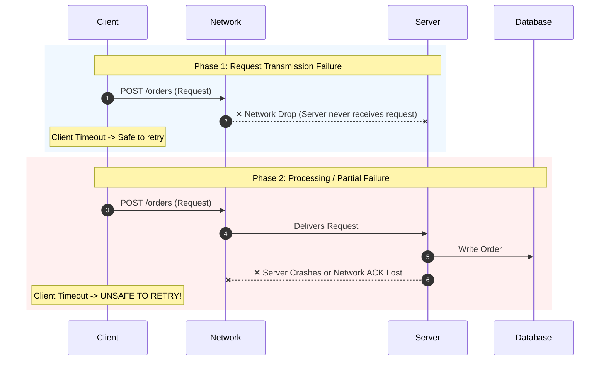

# Day 17 — REST vs gRPC

Imagine a system with dozens or hundreds of independent microservices. An E-Commerce Gateway service needs to fetch customer profiles, verify inventory levels, calculate shipping taxes, and process payment transactions. None of the target data lives in the Gateway's local process memory. Each piece of information resides on a separate physical machine running in a data center miles away.

One service needs information from another.

**How should these machines talk to each other?**

When engineers first face this challenge, it is tempting to focus only on syntax or frameworks. But at its core, service-to-service communication is an architectural decision. How you choose to communicate across process boundaries governs your system's latency, payload overhead, client compatibility, failure modes, contract evolution, and operational complexity.

To understand why an engineer would choose REST in one system and gRPC in another, we must look past marketing claims and examine what actually travels over the physical wire.

```text
Application Code
      ↓
Communication Model
      ↓
Protocol
      ↓
Serialization
      ↓
Network
      ↓
Remote Service
```

The abstraction makes the remote call feel simple. The network underneath is not simple. That distinction is the central mental model for today.

---

## The Problem

Why do distributed services need a explicit communication model in the first place?

In a single monolithic application, when Function A calls Function B:
```python
user = get_user(user_id=42)
```
The CPU executes a local stack frame jump. The memory addresses of inputs are passed via CPU registers or RAM. The execution is deterministic, nanoseconds fast, and guaranteed to either succeed or throw an in-memory exception.

In a distributed architecture, `get_user(42)` involves two entirely separate physical machines separated by routers, switches, network cables, and firewalls:

```text
┌────────────────────────┐                   ┌────────────────────────┐
│   Gateway Service      │                   │      User Service      │
│  (Machine A - Dallas)  │                   │  (Machine B - Chicago) │
│                        │                   │                        │
│   get_user(42) ────────┼─── Network Wire ──┼──► handle_get_user()   │
└────────────────────────┘                   └────────────────────────┘
```

The problem is that physical memory cannot be shared across machine boundaries. To execute this call:
1. Machine A must convert its in-memory data structures into raw binary bytes (**Serialization**).
2. Machine A must wrap those bytes inside network protocol frames (**Transport Framing**).
3. Machine A must push those bytes through a physical socket over the network (**Network Transmission**).
4. Machine B must read bytes off the wire, verify protocol headers, and convert bytes back into memory objects (**Deserialization**).
5. Machine B executes the logic and sends bytes back to Machine A across the same multi-step path.

Without an agreed-upon communication model and protocol, Machine A and Machine B cannot understand each other's byte streams, cannot negotiate data types, and cannot handle network disruptions.

---

## Why This Happens

As systems grow, monolithic codebases are decomposed into distributed services for clear organizational and operational reasons:
* **Independent Scaling**: Scaling a high-traffic User Service on 50 compute nodes without scaling an infrequently used Reporting Service.
* **Fault Isolation**: Preventing a memory leak or crash in a search indexer from taking down checkout transactions.
* **Team Ownership**: Enabling different engineering teams to deploy services on their own schedules.

However, moving from in-memory function calls to distributed service boundaries forces engineers to confront physical network realities:

1. **Networks Introduce Latency**: In-memory function calls take 1–10 nanoseconds ($10^{-9}\text{s}$). Cross-datacenter network calls take 1–50 milliseconds ($10^{-3}\text{s}$)—a performance difference of up to six orders of magnitude.
2. **Networks Can Fail**: Packets get delayed, dropped, duplicated, or corrupted by failing routers and saturated switches.
3. **Services Need Shared Contracts**: A Python client calling a Go service needs an unambiguous agreement on what parameters exist, what data types are valid, and how errors are structured.
4. **Different Clients Have Different Needs**: A web browser running client-side JavaScript has radically different network tooling, security constraints, and debugging requirements than a high-throughput internal microservice communicating inside a private Kubernetes cluster.

Before comparing REST and gRPC, we must first dispel a dangerous assumption that often leads to brittle distributed systems.

---

## The Wrong Solution

The naive assumption in distributed systems engineering is:

```text
callRemoteFunction()
```

> *"Just make the remote server behave exactly like a local function."*

This mental model attempts to treat remote network interaction as if it were location-transparent local code. Developers hide socket connections inside wrapper methods and call `user_service.get_user(42)` as if memory were unified across machines.

This abstraction fails in production because local function calls and remote network calls operate under fundamentally different physical guarantees:

| Characteristic | Local Function Call | Remote Network Call |
| :--- | :--- | :--- |
| **Latency** | $1\text{ to }10\text{ ns}$ | $1\text{ to }100\text{ ms}$ (100,000x slower) |
| **Memory Access** | Direct pointers in shared RAM | Isolated memory spaces; requires serialization |
| **Failure Modes** | Success or total process crash | Partial failure (Timeout, Drop, Retried execution) |
| **Concurrency** | CPU thread safety | Distributed state drift, race conditions, retries |
| **Observability** | Stack trace | Distributed tracing, HTTP status, wire logs |

When engineers pretend remote calls are local calls:
* **Timeouts are ignored**: Unbounded remote calls stall application threads indefinitely when a remote node hangs.
* **Partial Failures cause corruption**: A client sends a `CreatePayment` request. The network drops the *response*. The client assumes the call failed and retries, causing **duplicate credit card charges**.
* **Version incompatibilities crash services**: Changing a field name on the server breaks client deserialization at runtime because there was no static contract validation during compilation.
* **Observability breaks down**: Without explicit tracing headers propagated across network requests, diagnosing a multi-tier latency spike becomes nearly impossible.

---

## The Right Mental Model

To design resilient software, adopt this core mental model:

> **A remote call is not a local function call with extra steps. It is a distributed interaction.**

Because a remote call is a distributed interaction, your system must explicitly account for:
* **Contract Negotiation**: How client and server agree on request and response formats.
* **Serialization Overhead**: The CPU time and wire bytes required to encode and decode payloads.
* **Transport Protocol Efficiency**: How network connections (TCP, HTTP/1.1, HTTP/2) are established, reused, or multiplexed.
* **Failure Semantics**: How timeouts, retries, idempotency keys, and error codes are communicated when the network breaks.

**REST** and **gRPC** are two distinct architectural approaches built to solve this exact distributed interaction problem under different constraints.

---

## An Analogy: Postal Service vs. Internal Courier System

To understand the core trade-off between REST and gRPC, consider a physical world analogy:

* **REST is like sending a standardized letter via the Public Postal Service**.
  * Anyone in the world can write an address on an envelope using standard text rules.
  * The envelope contains human-readable paper (JSON).
  * Any recipient (web browser, mobile app, third-party partner) can open the letter, read the message, and understand standard postal marks (`200 Delivered`, `404 Recipient Unknown`).
  * It is universally compatible, inspectable, and simple, but carrying paper envelopes has physical weight and bulk.

* **gRPC is like a precisely defined Internal Automated Courier System inside a high-security warehouse**.
  * The sender and receiver share a pre-printed, strictly formatted optical template (**Protocol Buffer contract**).
  * Items are packed into compact, coded binary totes (**Protobuf Wire Format**) rather than bulky paper envelopes.
  * High-speed pneumatic tubes (**HTTP/2 multiplexed streams**) keep pathways open continuously, sending dozens of packages back and forth simultaneously without re-opening physical doors for every delivery.
  * It is extraordinarily fast, compact, and automated, but an external stranger without the exact optical template cannot read or process the totes.

---

## How It Actually Works

### 1. REST (Representational State Transfer)

REST is an **architectural style** (introduced by Roy Fielding in 2000) for network-based applications. It is not a single protocol or library.

```text
Client Application
      │
      ├── 1. Construct HTTP GET Request (URL Path: /users/42)
      ├── 2. Serialize Data Object -> JSON String ("{\"user_id\": 42}")
      ├── 3. Send Request Envelope over HTTP/1.1 TCP Connection
      │        ▼
      │     [ Network Wire ]
      │        ▼
      ├── 4. Server receives HTTP Request, parses URI route & headers
      ├── 5. Server executes logic, serializes response dict -> JSON String
      └── 6. Server transmits HTTP 200 OK + JSON payload back over socket
```

#### Key Characteristics of REST:
* **Resource-Centric**: Everything is modeled as a named *resource* identified by a URI (e.g., `/users/42`, `/orders/9001/items`).
* **Standardized HTTP Semantics**: Uses standard HTTP verbs (`GET` for safe retrieval, `POST` for creation, `PUT` for complete replacement, `PATCH` for partial update, `DELETE` for removal).
* **Statelessness**: Every request contains all context needed for the server to fulfill it. The server stores no client session context.
* **Payload Format**: Typically uses JSON (JavaScript Object Notation), which is human-readable, self-describing text.
* **Broad Compatibility**: Native to web browsers. Any HTTP-capable tool (`curl`, Postman, Python `urllib`, browser JavaScript `fetch`) can consume REST APIs natively without special client stubs.

---

### 2. gRPC (gRPC Remote Procedure Calls)

gRPC is an open-source, high-performance **RPC framework** initially developed by Google. It structures service interactions around explicit method calls backed by strongly typed contracts.

```text
Client Application
      │
      ├── 1. Call generated stub method: stub.GetUser(UserRequest(user_id=42))
      ├── 2. Stub validates types & encodes payload -> Compact Protobuf Binary
      ├── 3. Transport Engine writes HTTP/2 DATA frame with Stream ID
      │        ▼
      │     [ Network Wire ]
      │        ▼
      ├── 4. Server HTTP/2 framed parser routes payload directly to Servicer method
      ├── 5. Servicer executes logic & returns typed UserResponse object
      └── 6. Response encoded to binary Protobuf -> HTTP/2 response stream frame
```

#### Key Characteristics of gRPC:
* **Interface Definition Language (IDL)**: Services and messages are defined in a `.proto` file (Protocol Buffers). This file acts as a single source of truth contract.
* **Generated Code (Stubs)**: The Protocol Buffer compiler (`protoc`) generates strongly typed client stubs and server interfaces across multiple languages (Go, Java, Python, C++, Rust).
* **Binary Serialization**: Payload data is encoded using Protocol Buffers, a compact binary format that omits field names from the wire payload (using integer field tags instead), drastically reducing payload byte count and CPU parse time.
* **HTTP/2 Transport**: Uses HTTP/2 exclusively as its transport protocol, leveraging:
  * **Multiplexing**: Multiple concurrent RPC requests and responses traverse a single persistent TCP connection simultaneously without head-of-line blocking.
  * **Header Compression (HPACK)**: Reduces HTTP header overhead on every request.
  * **Streaming Capabilities**: Supports Unary RPCs, Server Streaming, Client Streaming, and Bidirectional Streaming.

---

## Visual Explanation

### REST Request Lifecycle

```text
┌──────────────┐                                                 ┌──────────────┐
│  REST Client │                                                 │ REST Server  │
└──────┬───────┘                                                 └──────┬───────┘
       │                                                                │
       │ 1. Application invokes fetch('/users/42')                      │
       │                                                                │
       │ 2. Serialize Dict -> JSON Text: '{"user_id": 42}'               │
       │                                                                │
       │ 3. Build HTTP Header: GET /users/42 HTTP/1.1                   │
       │    Host: api.example.com | Content-Type: application/json     │
       │                                                                │
       ├───────────────── 4. Send TCP Packets over Wire ───────────────►│
       │                                                                │
       │                                                                │ 5. Parse HTTP Headers
       │                                                                │    & Match URI Route
       │                                                                │ 6. Query DB / Logic
       │                                                                │ 7. Serialize Result
       │                                                                │    -> JSON Text
       │                                                                │
       │◄──────────────── 8. Send HTTP 200 OK + JSON Body ──────────────┤
       │                                                                │
       │ 9. Read Socket Bytes & Execute JSON.parse()                    │
       │ 10. Return dynamic JS Object to Application Code               │
       ▼                                                                ▼
```

### gRPC Request Lifecycle

```text
┌──────────────┐                                                 ┌──────────────┐
│ gRPC Client  │                                                 │ gRPC Server  │
└──────┬───────┘                                                 └──────┬───────┘
       │                                                                │
       │ 1. Application calls stub.GetUser(UserRequest(user_id=42))     │
       │                                                                │
       │ 2. Stub validates static types (int32 user_id)                 │
       │                                                                │
       │ 3. Encode Protobuf -> Compact Wire Bytes [0x08, 0x2A]          │
       │                                                                │
       │ 4. HTTP/2 Transport: Frame Payload into STREAM ID #5           │
       │    HEADERS frame: path=/user.UserService/GetUser               │
       │                                                                │
       ├─────────────── 5. Send HTTP/2 Binary Frames over Wire ─────────►│
       │                                                                │
       │                                                                │ 6. Demux STREAM ID #5
       │                                                                │ 7. Unpack Protobuf bytes
       │                                                                │    directly into struct
       │                                                                │ 8. Execute GetUser()
       │                                                                │
       │◄────────────── 9. HTTP/2 HEADERS + DATA frame (Protobuf) ──────┤
       │                                                                │
       │ 10. Stub decodes binary into typed UserResponse object         │
       │ 11. Return static object to Application Code                   │
       ▼                                                                ▼
```

### REST vs gRPC Architecture Comparison

```text
REST (Resource & JSON over HTTP)                 gRPC (Contract & Binary over HTTP/2)
┌──────────────────────────────┐                 ┌──────────────────────────────┐
│  Client Application Code     │                 │  Client Application Code     │
└──────────────┬───────────────┘                 └──────────────┬───────────────┘
               │                                                │
┌──────────────▼───────────────┐                 ┌──────────────▼───────────────┐
│ Dynamic JSON Serializer      │                 │ Auto-Generated Client Stub   │
│ (Text-based, field keys)     │                 │ (Static Protobuf Compiler)   │
└──────────────┬───────────────┘                 └──────────────┬───────────────┘
               │                                                │
┌──────────────▼───────────────┐                 ┌──────────────▼───────────────┐
│ HTTP/1.1 Transport           │                 │ HTTP/2 Transport Engine      │
│ (Plain text headers/body)    │                 │ (Binary Streams, HPACK)      │
└──────────────┬───────────────┘                 └──────────────┬───────────────┘
               │                                                │
═══════════════▼════════════════════════════════════════════════▼═══════════════
                         PHYSICAL NETWORK BOUNDARY (TCP/IP)
═══════════════╦════════════════════════════════════════════════╦═══════════════
               │                                                │
┌──────────────▼───────────────┐                 ┌──────────────▼───────────────┐
│ REST Controller & Router     │                 │ gRPC Servicer Implementation │
│ (Regex Route Pattern Match)  │                 │ (Direct RPC Method Dispatch) │
└──────────────────────────────┘                 └──────────────────────────────┘
```

### Remote-Call Failure Path & Retry Ambiguity

When a client calls a remote service over a network, failure can happen at three distinct phases:



If the response is dropped on the return path, the client receives a `TimeoutError`. The client **cannot distinguish** whether:
1. The server never received the request (Safe to retry).
2. The server processed the request and updated the database, but the response was dropped (Unsafe to retry without an **Idempotency Key**).

Retries are not automatically safe in REST or gRPC. If an RPC operation modifies state (e.g. charging money or creating an order), repeating the network call upon timeout without an explicit **Idempotency Key** will duplicate side effects.

---

## Real-World Example: Service Ecosystems at Google Scale

To understand how service communication choices scale, consider **Google** as a public case study in infrastructure design.

In the early 2000s, as Google scaled from a search engine to a global infrastructure hosting hundreds of internal systems (Search, Indexing, Ads, Maps, YouTube), engineers realized that standard text-based protocols (like early HTTP/1.1 and JSON/XML) created severe performance and maintenance bottlenecks:

1. **CPU & Payload Overhead**: Parsing text strings (JSON/XML) across tens of billions of internal microservice requests per second consumed unacceptable amounts of CPU cycles and network bandwidth across data centers.
2. **Polyglot Contract Fragmentation**: Internal services were written in C++, Java, Python, and Go. Manually writing client libraries and parsing JSON structures created constant bugs when service schemas evolved.

To solve this, Google developed an internal RPC framework named **Stubby** (which was later redesigned and open-sourced as **gRPC** in 2015), along with **Protocol Buffers**.

### How Google Architected Service Communication:

* **Internal Service-to-Service (gRPC / Stubby)**:
  * Virtually all internal microservices communicate using strongly typed Protocol Buffer contracts over gRPC.
  * Internal RPCs benefit from compact binary payloads, zero-copy serialization, deadline propagation across deep microservice call graphs, and built-in multiplexed HTTP/2 streaming.
* **Public Boundary & Browser Ingress (REST / JSON & gRPC-Web)**:
  * For public-facing APIs and web browsers, Google exposes traditional REST/JSON endpoints (or gRPC-Web proxies) because public third-party developers and web browsers require universal HTTP compatibility, human-readable payloads, and simple debugging.

*Public architectural takeaway*: Google did not declare gRPC "superior" and banish REST. Instead, they applied **gRPC internally** for raw compute efficiency, strict contracts, and microservice velocity, while maintaining **REST/JSON publicly** for broad client accessibility.

---

## Build It Yourself: Hands-On REST vs. gRPC in Python

Let's build a minimal hands-on comparison in Python to experience the developer model of both approaches.

All code files are located in today's `code/` directory:
* [`code/rest_server.py`](file:///d:/30_Days_of_Distributed_Systems/days/Day-17-gRPC-vs-REST/code/rest_server.py)
* [`code/rest_client.py`](file:///d:/30_Days_of_Distributed_Systems/days/Day-17-gRPC-vs-REST/code/rest_client.py)
* [`code/user.proto`](file:///d:/30_Days_of_Distributed_Systems/days/Day-17-gRPC-vs-REST/code/user.proto)
* [`code/grpc_server.py`](file:///d:/30_Days_of_Distributed_Systems/days/Day-17-gRPC-vs-REST/code/grpc_server.py)
* [`code/grpc_client.py`](file:///d:/30_Days_of_Distributed_Systems/days/Day-17-gRPC-vs-REST/code/grpc_client.py)

---

### Example 1 — REST (Minimal HTTP API)

In REST, we route requests by matching HTTP verbs (`GET`) and URI paths (`/users/42`), serializing responses to JSON text.

#### Server Code Excerpt (`code/rest_server.py`):
```python
import json
import re
from http.server import HTTPServer, BaseHTTPRequestHandler

USERS_DB = {
    42: {"user_id": 42, "name": "Alice Smith", "email": "alice@example.com", "role": "SRE"}
}

class RESTUserRequestHandler(BaseHTTPRequestHandler):
    def do_GET(self):
        # 1. Route matching via URI regex
        match = re.match(r"^/users/(\d+)$", self.path)
        if match:
            user_id = int(match.group(1))
            user = USERS_DB.get(user_id)
            if user:
                # 2. Serialize Python dictionary into JSON string bytes
                payload = json.dumps(user).encode('utf-8')
                
                # 3. Write HTTP Response Headers & Body
                self.send_response(200)
                self.send_header("Content-Type", "application/json")
                self.send_header("Content-Length", str(len(payload)))
                self.end_headers()
                self.wfile.write(payload)
                return

        # Handle 404 Not Found
        self.send_response(404)
        self.end_headers()
```

#### Client Code Excerpt (`code/rest_client.py`):
```python
import json
import urllib.request

url = "http://127.0.0.1:8080/users/42"
req = urllib.request.Request(url, headers={"Accept": "application/json"})

with urllib.request.urlopen(req) as response:
    # 1. Read raw byte array off TCP socket
    raw_bytes = response.read()
    # 2. Parse text JSON dynamically into Python dict
    user_data = json.loads(raw_bytes.decode('utf-8'))
    print(f"Retrieved User: {user_data['name']} (Role: {user_data['role']})")
```

---

### Example 2 — gRPC (Protocol Buffer Contract & Generated Stub)

In gRPC, we first define an unambiguous interface contract in a `.proto` file.

#### Contract Definition (`code/user.proto`):
```protobuf
syntax = "proto3";

package user;

service UserService {
  // Unary RPC: Single request, single response
  rpc GetUser (UserRequest) returns (UserResponse);
  
  // Server Streaming RPC: Single request, stream of log messages returned
  rpc StreamUserActivity (UserRequest) returns (stream ActivityLog);
}

message UserRequest {
  int32 user_id = 1;
}

message UserResponse {
  int32 user_id = 1;
  string name = 2;
  string email = 3;
  string role = 4;
}

message ActivityLog {
  string timestamp = 1;
  string action = 2;
  string ip_address = 3;
}
```

#### Client Code Excerpt (`code/grpc_client.py`):
```python
import grpc
import user_pb2
import user_pb2_grpc

# 1. Connect to server over persistent HTTP/2 channel
with grpc.insecure_channel("127.0.0.1:50051") as channel:
    # 2. Instantiate auto-generated client stub
    stub = user_pb2_grpc.UserServiceStub(channel)

    # 3. Call method like a native function with static request object & timeout deadline
    try:
        request = user_pb2.UserRequest(user_id=42)
        response = stub.GetUser(request, timeout=2.0)
        print(f"Retrieved User: {response.name} (Role: {response.role})")
    except grpc.RpcError as e:
        print(f"gRPC Error: {e.code()} - {e.details()}")
```

---

## Common Misconceptions

### 1. "REST is a protocol."
**Correction**: REST is an *architectural style* defined by constraints (statelessness, client-server, uniform interface, cacheability). HTTP is a *protocol* commonly used to implement RESTful architectures.

### 2. "REST always means JSON."
**Correction**: REST resources can be represented in any format negotiable between client and server, including XML, Protocol Buffers, HTML, or raw binary streams. JSON is merely the most popular representation format.

### 3. "gRPC is always faster than REST in every workload."
**Correction**: gRPC payload serialization is significantly faster for structured binary data, but for small payloads or simple local service setups, raw network latency ($L_{\text{net}}$) dominates total time. In network-bound environments, payload encoding differences may be negligible.

### 4. "gRPC replaces HTTP."
**Correction**: gRPC runs *on top of* HTTP/2. It relies directly on HTTP/2 for stream multiplexing, binary framing, HPACK header compression, and connection keep-alives.

### 5. "RPC makes network calls behave exactly like local calls."
**Correction**: RPC abstracts method call *syntax*, but cannot abstract physical network laws. Network calls remain subject to latency, packet drops, partial failures, timeouts, and state drift.

### 6. "Retries make failed requests safe."
**Correction**: Retrying a network request is only safe if the target endpoint is **idempotent** (producing identical side effects regardless of how many times it executes). Retrying non-idempotent operations without an idempotency key causes duplicate state mutations.

### 7. "gRPC is only for Java or Go."
**Correction**: Protocol Buffers and gRPC support auto-compilation across virtually all major production languages, including C++, Java, Go, Python, C#, Rust, Node.js, and Swift.

### 8. "REST is only for public APIs."
**Correction**: Many organizations use REST/JSON successfully for internal service communication when system throughput requirements are modest and human readability/tooling simplicity is prioritized.

### 9. "gRPC cannot be used for streaming."
**Correction**: Streaming is a core strength of gRPC. Supported by HTTP/2 framing, gRPC natively supports Server Streaming, Client Streaming, and Bidirectional Streaming out of the box.

### 10. "HTTP/2 automatically makes every RPC faster."
**Correction**: HTTP/2 multiplexes streams over a single TCP connection. However, if severe packet loss occurs on the underlying IP network, TCP's congestion control will freeze *all* multiplexed streams on that socket (TCP Head-of-Line Blocking), which HTTP/3 (QUIC) addresses.

---

## Production Trade-offs

Choosing between REST and gRPC is an engineering trade-off. Neither protocol is universally superior.

```text
                  PUBLIC INTEGRATION & BROWSERS
                                │
                      Is Client Web/Browser?
                             ├──► YES ──► Choose REST (JSON / HTTP)
                             │
                            NO
                             │
               INTERNAL MICROSERVICE COMMUNICATION
                                │
               Is High Throughput / Strict Contract /
                  Polyglot Code Generation Required?
                             ├──► YES ──► Choose gRPC (Protobuf / HTTP/2)
                             └──► NO  ──► Choose REST (JSON)
```

### REST

#### Advantages:
* **Universal Compatibility**: Works natively in every web browser, mobile platform, and HTTP library without extra compilation tooling.
* **Human Inspectability**: Request payloads (JSON) can be read, written, and debugged easily using `curl`, Postman, or browser developer consoles.
* **Rich Ecosystem & Caching**: Leverages standard HTTP infrastructure natively (reverse proxies, CDNs, HTTP status codes, standard browser caching headers).
* **Low Initial Friction**: No need to maintain `.proto` files or run code generation tools during local development.

#### Disadvantages:
* **Payload & Serialization Overhead**: Verbose text payloads (JSON string keys) increase wire byte size. Text parsing consumes more CPU cycles than binary unpacking.
* **Weaker Contract Enforcement**: JSON schema validation is often optional or checked dynamically at runtime rather than enforced statically at compile time.
* **Lack of Native Streaming**: Implementing real-time streaming over REST usually requires secondary protocols like WebSockets or Server-Sent Events (SSE).

---

### gRPC

#### Advantages:
* **Strong Service Contracts**: `.proto` files enforce strict data types, required fields, and RPC interfaces across all teams before code compiles.
* **Compact Binary Serialization**: Protobuf messages are significantly smaller on the wire and unpack faster, saving bandwidth and CPU memory.
* **Auto-Generated Polyglot Code**: Compiling `.proto` files generates typed client/server stubs in Go, Java, Python, C++, etc., eliminating manual HTTP client wrapper code.
* **High Performance Transport**: HTTP/2 multiplexing enables dozens of concurrent RPCs over a single persistent TCP connection.
* **Native Streaming**: Supports bidirectional real-time data streaming out of the box.

#### Disadvantages:
* **Tooling Complexity**: Requires protoc build pipelines, generated code artifact management, and specialized gRPC debugging tools (`grpcurl`).
* **Browser Limitations**: Web browsers cannot make native gRPC calls directly due to limited HTTP/2 framing access in standard browser JS APIs (requires `gRPC-Web` proxies).
* **Non-Human-Readable Payloads**: Wire frames are binary byte streams, requiring decoding tools to inspect in network packet captures.

---

## Key Takeaways

1. **REST and gRPC are communication choices. The network remains a distributed-system boundary either way.**
2. **REST is an architectural style** centered on resources, standard HTTP verbs, and universal client compatibility.
3. **gRPC is an RPC framework** centered on strongly typed Protocol Buffer contracts, binary serialization, and HTTP/2 transport framing.
4. **Never treat remote calls as local function calls.** Remote calls introduce physical latency, partial failure, and memory isolation.
5. **Protobuf binary encoding** omits text field keys on the wire, resulting in smaller payloads and faster CPU decoding than JSON.
6. **HTTP/2 multiplexing** allows multiple gRPC requests to share a single TCP connection concurrently without head-of-line blocking.
7. **Uncoordinated retries are dangerous.** Retrying a failed remote call without an **Idempotency Key** can duplicate database side effects.
8. **Use REST** for browser-facing web apps, public developer APIs, third-party integrations, and human-friendly debugging.
9. **Use gRPC** for high-throughput internal microservices, polyglot backend systems, strict compile-time contract enforcement, and streaming pipelines.
10. **Engineering decisions depend on constraints.** Choose based on your system's performance requirements, client ecosystem, and operational capacity.

---

## Interview Questions

### 1. When would you choose REST over gRPC?
**Answer**: Choose REST when building public-facing APIs, browser-based applications, third-party partner integrations, or systems where human readability, simplicity, and zero-tooling developer onboarding are primary requirements.

### 2. Why can a gRPC call still fail like any other network request?
**Answer**: Although gRPC syntax makes remote calls look like local programming methods (`stub.GetUser()`), the underlying implementation still serializes data and transmits it across physical network hardware. Packets can be dropped, network links can break, and servers can crash, causing timeouts and partial failures regardless of the RPC abstraction.

### 3. What happens between a gRPC method call and the remote server?
**Answer**: The client stub validates parameter types, serializes the message object into a compact Protocol Buffer binary byte array, wraps the bytes in HTTP/2 DATA frames with a stream ID, and transmits them over a persistent TCP connection. The remote server demultiplexes the HTTP/2 stream, decodes the Protobuf bytes into memory, and dispatches the typed request object to the servicer method.

### 4. Why does serialization matter in distributed systems?
**Answer**: Serialization converts in-memory objects into wire bytes. Text formats like JSON include field key strings repeatedly in every payload and require CPU-intensive string parsing. Binary formats like Protobuf use compact integer tags and varint encoding, reducing payload wire size and drastically cutting CPU encoding/decoding overhead at scale.

### 5. Why is idempotency important when using retries in REST or gRPC?
**Answer**: If a client experiences a network timeout, it cannot determine whether the server failed before executing or succeeded and lost the response. If the operation is not idempotent (e.g. charging a payment), retrying the request will execute the side effect multiple times. Idempotency keys ensure the server executes state changes exactly once regardless of retry attempts.

### 6. When is gRPC streaming useful?
**Answer**: gRPC streaming is useful for long-lived real-time data feeds, such as telemetry monitoring metrics, financial ticker updates, continuous file uploads/downloads, or live chat event streams, where opening individual HTTP requests per message would introduce excessive overhead.

### 7. Why might a public API prefer REST?
**Answer**: Public APIs prioritize broad client accessibility and developer ergonomics. REST over HTTP/JSON allows external developers in any language, browser, or environment to inspect requests with standard tools (`curl`, Postman, browser dev tools) without setting up Protobuf compilers or importing custom client stubs.

### 8. What are the operational trade-offs between REST and gRPC?
**Answer**: REST offers low operational complexity, standard HTTP caching/proxying infrastructure, and simple text debugging, but incurs higher wire payload sizes and looser contract enforcement. gRPC offers superior CPU efficiency, compact payloads, generated polyglot stubs, and native streaming, but requires build-step proto compilation, schema version management, and specialized gRPC proxying infrastructure (`gRPC-Web`, `envoy`).

---

## Further Reading

For authoritative specs, research papers, official documentation, and engineering blogs, refer to today's curated reading list:

* [`references.md`](file:///d:/30_Days_of_Distributed_Systems/days/Day-17-gRPC-vs-REST/references.md)

---

## What You'll Build Intuition For Tomorrow

Now that we understand how services talk synchronously via REST and gRPC, what happens when a service needs to communicate **without waiting for an immediate response**? Tomorrow, in **Day 18 — Messaging & Asynchronous Communication**, we explore what actually happens when services decouple in time using message queues and event brokers.
