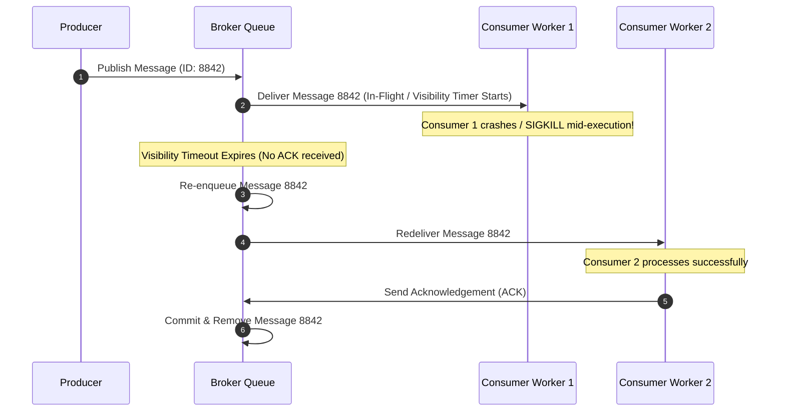
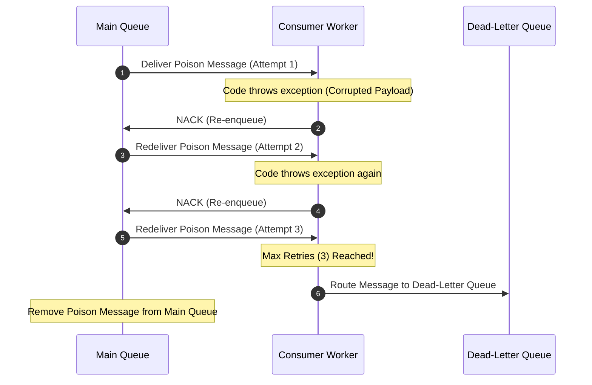

# Day 18 — Messaging: Kafka, RabbitMQ & Queues

Core Question: **How do services communicate without forcing both sides to be available at exactly the same moment?**

In synchronous communication, when Service A makes a remote call to Service B, Service A must halt execution, hold system resources, and wait for Service B to respond over the network. If Service B is slow, overloaded, or crashing, Service A suffers immediately. 

A message broker changes this fundamental dependency. It acts as an intermediate storage and routing layer that accepts messages from producers, stores them durably, and delivers them to consumers asynchronously. 

A message broker isn't just another network hop. It changes the relationship between producers and consumers from **temporal coupling** (both online right now) to **temporal decoupling** (producer publishes now, consumer processes whenever ready).

---

## The Problem

Imagine a modern e-commerce checkout workflow:

```text
Checkout Service
      ↓ (HTTP POST)
Payment Service
      ↓ (HTTP POST)
Inventory Service
      ↓ (HTTP POST)
Email Service
      ↓ (HTTP POST)
Notification Service
```

In a tightly coupled synchronous pipeline:
1. A customer clicks **"Place Order"**.
2. The `Checkout Service` calls the `Payment Service` to charge the credit card.
3. The `Payment Service` calls the `Inventory Service` to reserve stock.
4. The `Inventory Service` calls the `Email Service` to generate an order receipt.
5. The `Email Service` calls the `Notification Service` to push a mobile notification.

Now, consider what happens in real production when:
* **Downstream Slowness**: The `Email Service` encounters a $3\text{-second}$ SMTP socket connection delay. The customer's browser hangs on "Loading...", holding open thread pools and TCP sockets across all 4 upstream services.
* **Partial Outage**: The `Inventory Service` goes down for deployment or suffers a network drop. The entire checkout call tree crashes, rejecting the customer's payment even though credit card authorization succeeded.
* **Traffic Spikes**: Flash sale traffic floods the system with $5,000\text{ requests/sec}$. The `Notification Service` can process at most $500\text{ items/sec}$. Threads pool up, memory exhausts, and the entire stack collapses from cascading exhaustion.

Synchronous chains bind availability multiplicatively:
$$\text{System Availability} = A_{\text{Checkout}} \times A_{\text{Payment}} \times A_{\text{Inventory}} \times A_{\text{Email}}$$
If each service has $99\%$ availability ($0.99$), a 4-service synchronous chain drops total availability to $0.99^4 = 96.05\%$.

---

## Why This Happens

Synchronous service-to-service communication fails at scale due to four structural bottlenecks:

1. **Temporal Coupling**: The producer and consumer must execute simultaneously. If the consumer is offline or restarting, the producer cannot complete its request.
2. **Failure Propagation**: An unhandled timeout or exception in a non-critical downstream service (like sending a marketing email) cascades backward, failing critical upstream operations (like charging a credit card).
3. **Rate Mismatch**: Producers generate events based on human user demand (which spikes unpredictably), while downstream processing systems (like rendering PDFs or writing to disk) have bounded, static throughput.
4. **Resource Locking**: Every waiting request holds open OS threads, memory frames, file descriptors, and database connections while blocked on network responses.

---

## The Wrong Solution

When engineers encounter synchronous fragility, they often reach for naive fixes that make outages worse:

### 1. "Just retry immediately"
If `Inventory Service` is struggling under heavy load, having 500 upstream `Checkout` instances aggressively retrying every $100\text{ms}$ creates a retry storm (thundering herd). This hammers the failing service with exponential traffic, ensuring it can never recover.

### 2. "Just increase the timeout"
Increasing network timeouts from $2\text{s}$ to $30\text{s}$ hides latency problems instead of fixing them. Requests pile up, OS worker threads saturate, and memory consumption explodes until the upstream gateway crashes with Out-Of-Memory (OOM) errors.

### 3. "Just process everything concurrently in background threads"
Spawning raw, unbounded in-memory background threads (`AsyncTask`, `go goroutine`, or Python `Thread`) inside the application process solves latency for the caller, but introduces catastrophic durability risk. If the application server process crashes or restarts, all pending background work in RAM is permanently lost.

### 4. "Just use a database table as a queue"
Inserting rows into a SQL table (e.g., `status = 'PENDING'`) and having worker processes poll `SELECT * FROM tasks WHERE status = 'PENDING' LIMIT 10` works fine for small side-projects. 

However, at scale, database queues create severe performance bottlenecks:
* **Lock Contention**: Multiple worker threads fight for row locks (`SELECT ... FOR UPDATE`), causing database CPU usage to hit $100\%$.
* **Polling Overhead**: Continuous high-frequency polling strains DB connection pools and disk I/O even when no work exists.
* **Table Bloat & Index Degradation**: Rapid row creation and deletion churn indexes and require constant autovacuuming.

> [!NOTE]
> Database queues are not universally wrong. For low-throughput administrative tasks ($< 50\text{ events/sec}$), tools like Postgres `SKIP LOCKED` or transactional outboxes work well. But for high-throughput, latency-sensitive inter-service messaging, dedicated brokers are essential.

---

## The Right Mental Model

To decouple services, we insert a **Message Broker** between them:

```text
Synchronous communication

Service A
   │
   ├──── request ────→ Service B
   │
   └──── waits ───────┘

------------------------------------------------

Asynchronous communication

Service A (Producer)
   │
   └──── message ────→ Broker (Buffer / Store)
                         │
                         └────→ Service B (Consumer)
```

### The Primary Analogy: Restaurant Orders and Kitchen Tickets

Think of an asynchronous message broker as the **ticket printer system in a busy restaurant kitchen**:

```text
Waitstaff (Producer) ──► Order Ticket (Message) ──► Kitchen Wheel (Broker Queue) ──► Cooks (Consumers)
```

1. **Customers & Waitstaff (Producers)**: Waitstaff take customer orders at tables.
2. **Order Tickets (Messages)**: Each order is written down on a standardized ticket payload.
3. **The Kitchen Wheel / Board (Broker Buffer)**: Waitstaff pin tickets onto the kitchen wheel and immediately return to serve other tables. They do **not** stand inside the kitchen waiting for the chef to fry the steak before taking the next customer's order.
4. **Cooks & Stations (Consumers)**: Chefs pull tickets off the wheel one by one, preparing meals at the kitchen's optimal throughput.
5. **Kitchen Slowdown (Buffering)**: If 50 customers walk in simultaneously, order tickets accumulate on the kitchen wheel. Orders are not dropped, customer requests do not crash, and waitstaff keep taking orders.

### Buffering vs Overload

A queue provides **temporal buffering**. It absorbs temporary traffic spikes by converting load into queue backlog:

```text
Producer Rate > Consumer Rate
              ↓
        Backlog Accumulates
              ↓
     Consumer Catches Up Later
```

> [!WARNING]
> **Queues do not fix permanent overload!** A queue smooths out temporary bursts (e.g., a 5-minute surge during a flash sale). If producers permanently generate $1,000\text{ msg/sec}$ while consumers process only $200\text{ msg/sec}$, the backlog will grow infinitely until the queue runs out of disk or RAM storage.

---

## How It Actually Works

To engineer reliable asynchronous systems, we must understand the mechanics governing queues, message brokers, consumer delivery, RabbitMQ, and Apache Kafka.

---

### Core Messaging Primitives

* **Producer (Publisher)**: Application component that creates and emits structured message events.
* **Message (Event)**: The immutable payload container (headers, metadata, binary/JSON/Protobuf payload).
* **Broker**: The intermediate distributed server cluster responsible for ingesting, storing, routing, and delivering messages.
* **Queue / Topic**: The logical buffer destination managed by the broker.
* **Consumer (Subscriber)**: Application service that pulls or receives messages from the broker and executes business logic.
* **Acknowledgement (ACK)**: Signal sent by the consumer back to the broker confirming that a message was successfully processed and can be safely committed or deleted.
* **Negative Acknowledgement (NACK / Reject)**: Signal sent by consumer indicating processing failure, requesting the broker to re-enqueue the message for retry.
* **In-Flight / Visibility Timeout**: The time window during which a delivered message is hidden from other workers while a consumer executes processing. If the consumer crashes before ACK, the timeout expires and the broker re-enqueues the message.

---

### Delivery Semantics & Idempotency

When network failures, broker restarts, or consumer crashes occur, messaging systems exhibit specific delivery guarantees:

| Delivery Semantic | Guarantee | Risk | Production Use Case |
| :--- | :--- | :--- | :--- |
| **At-Most-Once** | Messages are delivered $0$ or $1$ time. Message may be lost, but never duplicated. | High Data Loss Risk | Metrics, telemetry, non-critical logging where losing data is acceptable. |
| **At-Least-Once** | Messages are delivered $1$ or more times. Data loss is prevented, but redelivery can cause duplicates. | Duplicate Processing Risk | Core financial, order processing, and system events (requires idempotent consumers). |
| **Exactly-Once** | End-to-end processing guarantees that each message effect occurs precisely once. | Performance & Operational Complexity | Bank ledger balance updates, stream analytics (requires transactional coordination). |

> [!IMPORTANT]
> **Message Delivery Semantics vs. End-to-End Business Effects**:
> Many engineers hear "Exactly-Once Delivery" and assume the message broker magically prevents duplicate credit card charges. 
> * **Message Delivery Semantics** only govern what happens between the Broker network connection and the Consumer code interface.
> * If a consumer receives a message exactly once, but crashes midway through executing an external DB write or third-party API call, retrying the operation can still execute duplicate external business side-effects!
> * Therefore, **At-Least-Once Delivery combined with Consumer Idempotency** (e.g., unique deduplication keys in Postgres) is the real-world standard for reliable distributed engineering.

---

### RabbitMQ: The Smart Broker Architecture

RabbitMQ follows the traditional **Smart Broker / Dumb Consumer** paradigm specified by the Advanced Message Queuing Protocol (AMQP 0-9-1).

```text
Producer
   ↓
Exchange (Direct / Topic / Fanout)
   ↓ (Binding Rules)
Queue (Durable Buffer)
   ↓ (Push Delivery)
Consumer
```

#### Key Architecture Concepts:
1. **Exchanges**: Producers never publish directly into queues. They send messages to an **Exchange**, which inspects routing keys and routes payloads to bound queues:
   * **Direct Exchange**: Routes messages based on an exact routing key match (`routing_key = 'payment.processed'`).
   * **Topic Exchange**: Routes messages using wildcard routing patterns (`routing_key = 'order.*.europe'`).
   * **Fanout Exchange**: Broadcasts every message to all bound queues (publish-subscribe model).
2. **Queues**: Messages live inside queues until consumed.
3. **Destructive Reads**: Once a consumer processes a message and sends an `ACK`, RabbitMQ **deletes the message from the queue**.
4. **Prefetch Count**: Controls backpressure by specifying the maximum number of unacknowledged messages RabbitMQ will push to a worker at one time.

---

### Apache Kafka: The Distributed Commit Log Architecture

Apache Kafka operates on an entirely different mental model: the **Dumb Broker / Smart Consumer** append-only log model.

```text
                Topic
                  │
        ┌─────────┼─────────┐
        ↓         ↓         ↓
   Partition 0 Partition 1 Partition 2
        │         │         │
        ↓         ↓         ↓
     Consumer  Consumer  Consumer
   (Group A) (Group A) (Group A)
```

#### Key Architecture Concepts:
1. **Topic & Append-Only Log**: A Kafka Topic is an immutable, append-only disk log of records. New messages are sequentially written to the end of the log with incremental numeric IDs called **Offsets**.
2. **Non-Destructive Reads**: Reading a record **does not delete it**. Messages remain stored on disk according to a configurable retention policy (e.g., retain for 7 days or 100 GB). Multiple independent systems can read the same topic at their own pace.
3. **Partitions**: Topics are split into multiple **Partitions** distributed across a cluster of broker nodes. Partitions are Kafka's unit of scalability and parallelism.
4. **Offsets**: Consumers track their own reading position via an **Offset counter**. If a consumer crashes, it resumes reading from its last committed offset. Consumers can even rewind offsets to replay historical events!
5. **Consumer Groups**: A set of consumer workers sharing partition processing load. Kafka guarantees that **each partition within a topic is assigned to exactly one consumer worker within a consumer group**.

---

### Kafka vs. RabbitMQ: Mental Model Comparison

| Characteristic | RabbitMQ (Message Queue) | Apache Kafka (Distributed Log) |
| :--- | :--- | :--- |
| **Core Mental Model** | *"Route this message to a queue and deliver it to a consumer."* | *"Append this event to an immutable log and let consumers track offsets."* |
| **Data Retention** | Destructive: Message deleted upon consumer `ACK`. | Non-Destructive: Retained on disk based on time/size configuration. |
| **Routing Flexibility** | High: Complex routing topology via exchanges, bindings, and keys. | Topic-based partitioning and key-hashing. |
| **Consumer Replay** | No: Messages disappear once processed. | Yes: Consumers can rewind offset pointers and re-process historical log data. |
| **Parallelism Model** | Worker queue model: Multiple workers pull from 1 queue concurrently. | Partition model: Parallelism capped by partition count per consumer group. |
| **Ordering** | FIFO order per queue (disrupted by redeliveries / parallel consumers). | Strict ordering guaranteed **within a partition**, not across partitions. |
| **Ideal Fit** | Task queues, complex message routing, RPC workflows, command processing. | High-throughput event streams, analytics pipelines, event sourcing, log auditing. |

---

### Backpressure Mechanics

**Backpressure** is the set of feedback mechanisms that protect downstream consumers from being overwhelmed when producer velocity exceeds consumer capacity.

```text
Producer Rate: 10,000 msg/sec
Consumer Rate:  2,000 msg/sec
                   │
                   ▼
         Growing Queue Backlog
                   │
                   ▼
          Rising Consumer Lag
```

#### Strategies for Managing Backpressure:
1. **Bounded Queues (Producer Throttling)**: Setting a maximum capacity limit on the queue. When full, the broker blocks or rate-limits producers from publishing.
2. **Prefetch Limits**: Setting consumer prefetch limits (e.g., `prefetch_count = 10`) so consumers only pull work they have active capacity to process.
3. **Horizontal Consumer Scaling**: Scaling out consumer instances up to the maximum partition count (in Kafka) or queue worker count (in RabbitMQ).
4. **Batching**: Grouping multiple messages into a single network transmission or DB bulk insert.

---

### Failure Scenarios & Resilience Patterns

#### 1. Consumer Process Crash
* **What Happens**: A consumer fetches a message, begins processing, but suffers an unexpected process kill (`SIGKILL` or OOM crash) before sending an `ACK`.
* **Resolution**: In RabbitMQ, the message's visibility timeout expires, and the broker re-enqueues the message for another worker. In Kafka, offset commit fails, and partition rebalancing assigns the partition (and uncommitted offset) to another worker.

#### 2. Poison Messages & Dead-Letter Queues (DLQ)
* **What Happens**: A malformed message payload (e.g., invalid JSON or missing key) causes consumer code to crash with an unhandled exception every time it is read. Re-enqueuing it causes infinite crash loops (head-of-line blocking).
* **Resolution**: Implement a **Dead-Letter Queue (DLQ)**. The broker tracks processing attempt counts. When a message fails $N$ consecutive times (e.g., $3$ retries), it is moved to a DLQ for manual inspection and alerting.

```text
Message ──► Main Queue ──► Consumer (Fails 3x) ──► Dead-Letter Queue (DLQ)
```

---

## Visual Explanation

### 1. Synchronous vs. Asynchronous Communication Flow

```text
Synchronous Flow:

Service A ───── HTTP POST request ─────→ Service B
Service A ◄──── HTTP 200 response ───── Service B (Service A waited blocked during execution)


Asynchronous Flow:

Service A ───── Publish Message ──────→ Message Broker
                                              │
                                              └──── Deliver Message ────→ Service B
```

---

### 2. Queue Delivery Model (RabbitMQ)

```text
Producer
   │
   ├── Order 101
   ├── Order 102
   ├── Order 103
   │
   ▼
┌───────────────────────────────┐
│        DURABLE QUEUE          │
│  [103]  |  [102]  |  [101]    │
└───────────────────────────────┘
          │
          ▼ (Pushes payload & deletes upon ACK)
      Consumer Worker
```

---

### 3. Log Partitioning Model (Apache Kafka)

```text
                    TOPIC: order-events
  ┌─────────────────────────────────────────────────────────┐
  │ Partition 0: [Offset 0] [Offset 1] [Offset 2] [Offset 3] │ ──► Consumer A (Group 1)
  ├─────────────────────────────────────────────────────────┤
  │ Partition 1: [Offset 0] [Offset 1] [Offset 2]          │ ──► Consumer B (Group 1)
  └─────────────────────────────────────────────────────────┘
```

---

### 4. Sequence Diagram: Consumer Failure & Redelivery Flow



---

### 5. Sequence Diagram: Backpressure & Dead-Letter Queue (DLQ) Handling



---

## Real World Example

### LinkedIn: Scaling Global Event Streaming with Apache Kafka

LinkedIn is the birthplace of Apache Kafka, created in 2010 to address massive infrastructure scaling challenges.

```text
  User Actions / Site Activity / Service Logs
                     │
                     ▼
        LinkedIn Apache Kafka Clusters
         (Trillions of Events / Day)
                     │
        ┌────────────┼────────────┐
        ↓            ↓            ↓
  Search Index  Real-time    Security &
   Updating     Analytics    Fraud Detection
```

#### Why Synchronous REST Failed LinkedIn:
In the late 2000s, LinkedIn relied on point-to-point synchronous REST calls and custom database queues to move event data between services. As user signups surged, tracking page views, connection updates, search indexing, activity feeds, and ad analytics generated tens of billions of events per day.

Connecting every microservice directly to every analytics and storage engine created a tangled web of $O(N^2)$ network connections. If the search indexing cluster slowed down, page rendering for end-users lagged.

#### The Architectural Solution:
LinkedIn created Kafka as a centralized, highly scalable distributed append-only log. 
* Service applications publish user activity events (like profile views or post likes) to Kafka topics once.
* Independent backend systems (Search Indexer, Security & Fraud Engine, Real-time Analytics, Data Lake pipelines) consume identical event streams asynchronously at their own speed.
* If the search indexing cluster falls behind during peak hours, it simply lags in offset consumption without impacting ad serving or user page rendering.

---

## Build It Yourself

We have implemented four standalone Python scripts demonstrating message broker mechanics, consumer concurrency, dead-letter routing, and backpressure in the [`code/`](file:///d:/30_Days_of_Distributed_Systems/days/Day-18-Messaging/code) directory:

1. **[`simple_queue.py`](file:///d:/30_Days_of_Distributed_Systems/days/Day-18-Messaging/code/simple_queue.py)**: Demonstrates basic FIFO in-memory message enqueue/dequeue mechanics between decoupled producers and consumers.
2. **[`producer_consumer.py`](file:///d:/30_Days_of_Distributed_Systems/days/Day-18-Messaging/code/producer_consumer.py)**: Implements a multi-threaded worker pool with explicit message acknowledgements (`ACK` / `NACK`) and in-flight tracking.
3. **[`retry_and_dead_letter.py`](file:///d:/30_Days_of_Distributed_Systems/days/Day-18-Messaging/code/retry_and_dead_letter.py)**: Simulates transient network failure retries and routes unrecoverable "poison messages" to a Dead-Letter Queue (DLQ).
4. **[`backpressure_demo.py`](file:///d:/30_Days_of_Distributed_Systems/days/Day-18-Messaging/code/backpressure_demo.py)**: Demonstrates producer rate vs consumer velocity imbalance, queue backlog growth, producer rate throttling via bounded queues, and dynamic horizontal worker scaling.

### Executing the Demonstrations

```bash
# Navigate to today's code directory
cd days/Day-18-Messaging/code

# 1. Run basic queue mechanics
python simple_queue.py

# 2. Run multi-worker ACK/NACK worker pool
python producer_consumer.py

# 3. Run retries & Dead-Letter Queue (DLQ) demo
python retry_and_dead_letter.py

# 4. Run backpressure and consumer lag simulation
python backpressure_demo.py
```

---

## Common Misconceptions

### Misconception 1: "Kafka and RabbitMQ are interchangeable drop-in alternatives."
**Correction**: They operate on completely different mental models. RabbitMQ is a smart message router that pushes payloads to queues and deletes them upon `ACK`. Kafka is an append-only distributed log where records persist on disk and smart consumers track their own offset pointers.

### Misconception 2: "Adding a queue magically solves service overload."
**Correction**: Queues smooth out temporary traffic bursts by creating backlog buffer. If producers permanently emit work faster than consumers can process, the queue backlog will grow infinitely until memory/disk runs out.

### Misconception 3: "Database tables should never be used as message queues."
**Correction**: Database queues can introduce lock contention and polling overhead at scale ($> 1,000\text{ msg/sec}$). However, for low-throughput background tasks or transactional outboxes requiring ACID atomic writes with business data, database tables (using `SKIP LOCKED`) are acceptable and operational simple.

### Misconception 4: "Exactly-Once delivery guarantees that external business side-effects happen only once."
**Correction**: Exactly-once delivery semantics only cover message transfer from broker to consumer. If the consumer code crashes during an external API call or database write, retrying execution can still trigger duplicate external business side-effects. End-to-end safety requires consumer idempotency.

### Misconception 5: "In Kafka, messages disappear after a consumer reads them."
**Correction**: Kafka reads are non-destructive. Messages remain in topic log partitions until explicitly purged by time or size retention configurations, regardless of how many consumer groups read them.

### Misconception 6: "Message queues guarantee absolute global ordering at high scale."
**Correction**: Global FIFO ordering requires a single queue processed by a single consumer thread, which severely restricts throughput. Distributed platforms like Kafka provide strict ordering only **within a single partition**, not across all partitions.

### Misconception 7: "Retrying failed messages automatically handles transient errors safely."
**Correction**: Retrying unacknowledged messages without idempotency guards can result in duplicate payments, double inventory deductions, or corrupt record states if the first attempt partially succeeded before network failure.

### Misconception 8: "Dead-Letter Queues (DLQs) fix corrupt data automatically."
**Correction**: A DLQ is an isolation holding zone for unprocessable poison messages. It prevents head-of-line blocking so the queue keeps moving. Human engineers or dedicated remediation scripts must inspect, fix, and re-inject DLQ messages.

---

## Production Trade-offs

```text
                       MESSAGING ARCHITECTURE TRADE-OFFS
                       
          High Throughput & Replayability        Complex Routing & Task Queues
                (Apache Kafka)                         (RabbitMQ)
                       │                                    │
    ┌──────────────────┴──────────────────┐  ┌──────────────┴──────────────────┐
    │ + Immutable log persistence         │  │ + Rich exchange routing keys    │
    │ + Multi-consumer independent replay │  │ + Per-message TTL & priority     │
    │ - Capped parallelism by partitions │  │ - Destructive reads (no replay)  │
    │ - Higher operational overhead       │  │ - Lower raw log throughput       │
    └─────────────────────────────────────┘  └──────────────────────────────────┘
```

| Engineering Dimension | Task Queue Model (e.g., RabbitMQ) | Event Stream Log Model (e.g., Kafka) |
| :--- | :--- | :--- |
| **Latency** | Extremely low latency for individual message delivery ($< 5\text{ms}$). | Optimized for batching and throughput ($10\text{--}50\text{ms}$). |
| **Throughput** | Moderate ($10,000\text{--}50,000\text{ msg/sec}$). | Extremely High ($100,000\text{--}1,000,000+\text{ msg/sec}$). |
| **Durability** | Messages stored in RAM/Disk; deleted immediately after consumption. | Persistent append-only disk logs; retained for days/months. |
| **Ordering** | FIFO per queue, disrupted by multi-worker redeliveries. | Strict FIFO ordering **per log partition**. |
| **Consumer Scaling** | Easy: Add worker threads to drain single queue. | Capped: Max consumers in a group equal max partition count. |
| **Operational Complexity** | Simple single-broker setup, moderate cluster operations. | Higher complexity (requires ZooKeeper / KRaft consensus metadata). |

---

## Key Takeaways

1. **Temporal Decoupling**: Message brokers decouple producers and consumers in time so producers do not block waiting for downstream execution.
2. **Buffer, Not Magic**: Queues absorb temporary traffic bursts into backlog, but do not solve permanent throughput overload.
3. **Smart Broker vs. Smart Consumer**: RabbitMQ routes and deletes messages; Kafka appends records to persistent logs and lets consumers track offsets.
4. **Non-Destructive Kafka Logs**: Kafka log records persist on disk after consumption, enabling multiple independent services to replay data.
5. **At-Least-Once Requires Idempotency**: Network failures produce duplicate deliveries; consumers must implement idempotent deduplication logic.
6. **Partitions Enable Kafka Parallelism**: Kafka partition counts determine maximum consumer concurrency within a consumer group and enforce ordering within each partition.
7. **Dead-Letter Queues (DLQs)**: Poison messages that fail max retry attempts must be moved to a DLQ to prevent head-of-line blocking.
8. **Backpressure Protections**: Use prefetch limits and bounded queues to prevent high-rate producers from exhausting consumer RAM.

---

## Interview Questions

### Q1: When should you introduce a message broker into a system?
**Answer**: Introduce a message broker when services require temporal decoupling, when downstream processing is slow or unreliable (e.g., sending emails, generating PDFs), when traffic spikes need to be buffered, or when multiple independent systems need to react to the same event stream.

### Q2: What is the primary architectural difference between RabbitMQ and Kafka?
**Answer**: RabbitMQ is a smart message broker centered around routing and queue delivery; messages are deleted once consumed. Kafka is a distributed append-only log platform where records persist on disk, and smart consumers track their own offsets to read or replay data independently.

### Q3: What is "Consumer Lag" and why is it monitored in production?
**Answer**: Consumer Lag is the difference between the latest offset published by producers and the offset currently processed by consumers. High or rising consumer lag indicates that downstream consumers are falling behind producer velocity, serving as an early warning for potential backpressure or memory exhaustion.

### Q4: Why does At-Least-Once message delivery cause duplicates, and how do you handle it?
**Answer**: If a consumer receives and processes a message but the network drops the acknowledgement (`ACK`) back to the broker, the broker's visibility timeout will expire and redeliver the message. To prevent duplicate side-effects, consumers must be **idempotent** (e.g., using atomic database inserts with unique constraint message IDs).

### Q5: What is a Poison Message, and how does a Dead-Letter Queue (DLQ) solve it?
**Answer**: A poison message is a corrupted payload that continuously causes consumer worker crashes every time it is processed. Re-enqueuing it indefinitely causes head-of-line queue blocking. A Dead-Letter Queue (DLQ) isolates poison messages after a maximum retry threshold, allowing main queues to keep flowing.

### Q6: How does partitioning in Apache Kafka guarantee ordering while enabling parallelism?
**Answer**: Kafka guarantees strict message ordering only **within a single partition**. Messages with the same partition key (e.g., `user_id = 42`) are routed to the exact same partition in order. Parallelism is achieved by distributing multiple partitions across different consumer workers in a consumer group.

### Q7: Why doesn't Kafka allow more active consumers in a Consumer Group than partitions in a Topic?
**Answer**: Kafka assigns each partition within a topic to at most one consumer worker per consumer group to guarantee strict partition message ordering without locking contention. Any extra consumers beyond partition count remain idle as standby backups.

### Q8: Does "Exactly-Once Processing" in Kafka eliminate the need for idempotent database updates?
**Answer**: No. Kafka's transactional exactly-once guarantees cover read-process-write operations *within* Kafka streams. If your consumer writes to external third-party APIs or SQL databases outside Kafka, you still need idempotency guards to protect against duplicate external side-effects on network retry.

---

## Further Reading

* For primary research papers, books, engineering blogs, and documentation links, see today's curated [`references.md`](file:///d:/30_Days_of_Distributed_Systems/days/Day-18-Messaging/references.md).
* Explore visual asset specifications in [`assets/README.md`](file:///d:/30_Days_of_Distributed_Systems/days/Day-18-Messaging/assets/README.md).
* Review hands-on Python scripts in [`code/README.md`](file:///d:/30_Days_of_Distributed_Systems/days/Day-18-Messaging/code/README.md).

---

## What You'll Build Intuition For Tomorrow

Tomorrow in **Day 19 — Exactly-Once Processing**, we will confront one of the most misunderstood guarantees in distributed systems: **How do we achieve true end-to-end atomic state updates when network packets can drop, duplicate, or re-order at any millisecond?**
