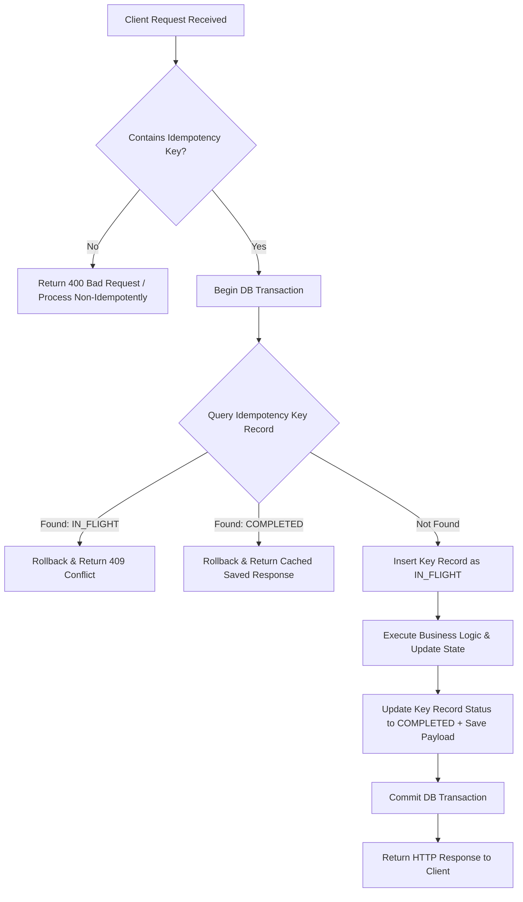
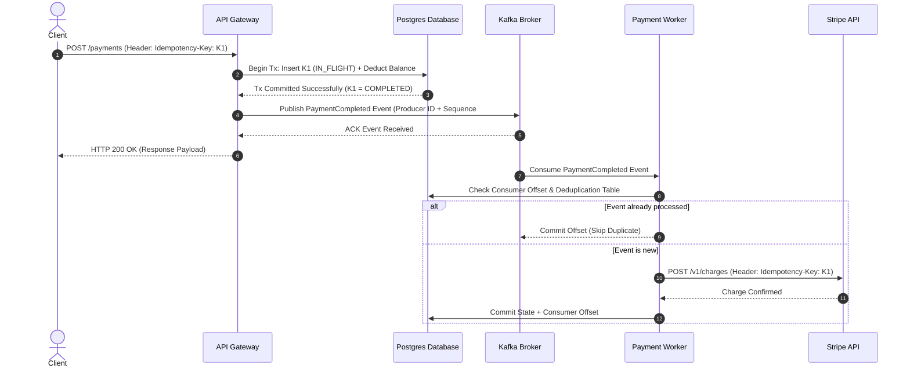

# Day 19 — Exactly Once

In distributed software architecture, **"exactly-once" processing is one of the most widely misunderstood guarantees**. Beginners often assume that achieving exactly-once execution is simply a matter of instructing a message broker or client library to "send the message once." 

In reality, networks drop packets, servers crash mid-execution, database writes time out, and microservices restart unpredictably. Once physical networks and asynchronous nodes enter the equation, **delivering a network message exactly once is physically impossible across an unreliable channel** (a truth rooted in the Two Generals' Problem).

To build reliable systems, senior engineers stop chasing the illusion of "exactly-once network delivery" and instead construct **end-to-end effectively-once semantics**. Correctness is never a feature of a single isolated component—it requires coordinating client identity, network retries, transactional storage, and idempotent consumer logic across the entire request pipeline.

---

## The Problem

Consider a standard payment processing workflow in an e-commerce microservices platform:

```text
Client (Browser / Mobile App)
   │
   │  1. "Process Payment (₹1,000)"
   ▼
Payment Gateway Service
   │
   │  2. Debit Account & Commit DB Transaction (Success)
   │
   X ── 3. HTTP 200 Response LOST due to network drop!
   │
Client sees HTTP Timeout (504)
   │
   │  4. Client Retries "Process Payment (₹1,000)"
   ▼
Payment Gateway Service
```

### The Fundamental Distributed Dilemma

When the Client encounters a network timeout after sending step 1, the client faces an **irreducible state of uncertainty**. The client cannot distinguish between two fundamentally opposite server states:

1. **Failure State A (Network Drop Before Processing)**: The request packet was lost on the wire before reaching the Payment Gateway. The server performed **no work** and no money was deducted.
2. **Failure State B (Network Drop After Processing)**: The request reached the Payment Gateway, the server successfully debited ₹1,000 from the user's account, but the HTTP `200 OK` response was destroyed by a router drop on the return path.

```text
               CLIENT PERSPECTIVE ON TIMEOUT
               
                     ┌──────────────────┐
                     │ Timeout Occurred │
                     └────────┬─────────┘
                              │
               ┌──────────────┴──────────────┐
               ▼                             ▼
       [ Scenario A ]                 [ Scenario B ]
  Request never arrived.         Request arrived & committed.
  Server state: UNCHANGED.       Server state: MUTATED (₹1,000 debited).
  Safe to retry? YES.            Safe to retry? NO (Will double charge!).
               │                             │
               └──────────────┬──────────────┘
                              ▼
                CLIENT CANNOT DISTINGUISH!
```

This absolute asymmetry of information is the heart of the distributed correctness problem. The client *must* take action, but without further coordination, any naive choice leads to catastrophic system failure.

---

## Why This Happens

In a single-process application running on a single CPU core, state transitions are predictable: a function call either executes or throws an exception. In a distributed system, operations span multiple independent failure domains separated by noisy physical networks.

Uncertainty and duplicate executions are introduced by seven structural realities:

1. **Unreliable Network Channels**: Routers drop TCP segments, switches drop packets under buffer congestion, and Wi-Fi networks disconnect transiently.
2. **Asynchronous Timeouts**: A client timeout threshold ($1,000\text{ms}$) is an arbitrary guess. If the server takes $1,050\text{ms}$ due to garbage collection (GC) pauses, the client declares failure while the server is still executing.
3. **Lost ACKs / Responses**: Network links fail symmetrically and asymmetrically. A request can arrive cleanly while its acknowledgement (`ACK`) or HTTP response payload is permanently lost.
4. **Server & Process Crashes**: A server process can crash after writing data to RAM or disk, but before transmitting the network response back to the caller.
5. **Client-Side Retries**: To achieve high availability, automated clients (SDKs, background workers, frontends) automatically retry unacknowledged requests.
6. **Broker Message Redelivery**: Distributed brokers (such as Kafka, RabbitMQ, or SQS) redeliver messages whenever consumer visibility timeouts expire before explicit acknowledgements are received.
7. **Partial Workflow Failures**: In a multi-step microservice pipeline, Service A may update its local database successfully but crash before notifying Service B.

> [!WARNING]
> **Dangerous Engineering Intuition**: Assuming that `Timeout = Operation Failed` is one of the leading causes of production data corruption. In distributed systems, a timeout means **"Status Unknown"**—never "Failed."

---

## The Wrong Solution

When engineers first encounter network timeouts, they typically adopt one of two naive extremes—both of which break production correctness.

### Naive Solution 1: Blind Retries

```python
# Naive approach: Retry on network timeout
try:
    response = payment_client.charge(account_id="acc_99", amount=1000)
except TimeoutError:
    # Blind retry assuming the previous attempt failed
    response = payment_client.charge(account_id="acc_99", amount=1000)
```

**Why it fails**: If the first request reached the server and debited ₹1,000 (Failure State B), the blind retry issues a second independent debit operation. The customer is charged **₹2,000 total** for a single ₹1,000 purchase.

```text
Attempt 1: Charge ₹1,000 ──► Server Debits ₹1,000 ──► Response Lost
Attempt 2: Charge ₹1,000 ──► Server Debits ₹1,000 ──► Response Received
---------------------------------------------------------------------
TOTAL USER LOSS: ₹2,000 (Double Deduction!)
```

### Naive Solution 2: Never Retry

```python
# Naive approach: Never retry on timeout
try:
    response = payment_client.charge(account_id="acc_99", amount=1000)
except TimeoutError:
    # Abandon request to prevent double charges
    log.error("Payment timed out. Assuming failed.")
    show_user_error("Payment failed. Please try again manually.")
```

**Why it fails**: If the first request was dropped on the inbound network path (Failure State A), abandoning the request leaves legitimate business transactions unfulfilled. If the customer manually clicks "Pay Now" again, they generate an entirely new unlinked request, resurrecting the exact same duplicate risk.

---

## The Right Mental Model

To solve the distributed uncertainty dilemma, we must align our architecture around three fundamental truths:

$$\text{Retries create duplicates.}$$
$$\text{No retries create data loss.}$$
$$\text{System correctness requires making retries safe.}$$

Instead of trying to prevent duplicate network packets (which is physically impossible), we must ensure that **processing a duplicate request produces the exact same logical state as processing it once**.

```text
                                  IDEMPOTENCY MENTAL MODEL
                                  
                                    Incoming Request
                                           │
                                           ▼
                                 Extract Idempotency Key
                                           │
                                           ▼
                                  Has Key Been Processed?
                                           │
                        ┌──────────────────┴──────────────────┐
                        │                                     │
                    [ YES ]                                 [ NO ]
                        │                                     │
                        ▼                                     ▼
             Fetch Cached Response                    Execute Business Logic
                        │                                     │
                        │                             Persist Result + Mark Key
                        │                                     │
                        └──────────────────┬──────────────────┘
                                           │
                                           ▼
                                    Return Response
```

### The Primary Analogy: The Bank Teller and Transaction Slips

Imagine a bank teller operating at a branch window:

* If a customer hands the teller a raw cash request saying *"Withdraw ₹1,000"*, handing over the verbal request twice results in two independent withdrawals (₹2,000 total). This is **non-idempotent**.
* Now imagine the customer hands the teller a pre-printed transaction slip stamped with a unique serial number: `SLIP-TX-98765`. 
* The teller takes `SLIP-TX-98765`, checks their ledger, sees it has not been processed, debits ₹1,000, and files the slip in the ledger log.
* If the customer gets confused, comes back 5 minutes later, and hands the teller the **exact same slip `SLIP-TX-98765`**, the teller inspects the slip number, sees it is already recorded in the ledger, skips the cash vault, and simply hands back the original receipt.

The slip's unique identity converts a dangerous retry into a **safe, idempotent replay**.

---

## How It Actually Works

Building an end-to-end effectively-once pipeline requires breaking down message processing into distinct structural layers.

---

### 1. At-Most-Once Delivery

* **Mechanism**: The sender transmits a request over the network once. If a timeout or error occurs, the sender does **not** retry.
* **Guarantees**: $0$ or $1$ executions. Duplicates are impossible.
* **Trade-off**: High risk of message/data loss during network blips or server restarts.
* **Use Cases**: Telemetry collection, video streaming metrics, metrics logging where dropping $1\%$ of samples is acceptable.

```text
Client ──[ Request ]──► Server (No Retries) ──► Executed 0 or 1 Times
```

---

### 2. At-Least-Once Delivery

* **Mechanism**: The sender transmits a request and waits for an explicit acknowledgement (`ACK`). If no `ACK` arrives before a timeout, the sender retries continuously until an `ACK` is received.
* **Guarantees**: $1$ or more executions. Data loss is eliminated (assuming persistent storage).
* **Trade-off**: Duplicate processing is **guaranteed** over time whenever network responses are delayed or lost.
* **Use Cases**: Standard message queues (RabbitMQ, SQS), email notifications, analytics ingestion.

```text
Client ──[ Request ]──► Server ──► [ ACK Lost ]
Client ──[ Retry   ]──► Server ──► Executed 2+ Times (Duplicates!)
```

---

### 3. Exactly-Once Semantics (EOS)

To move from at-least-once to **exactly-once processing**, we must carefully distinguish between three distinct boundaries:

```text
┌─────────────────────────┐     ┌─────────────────────────┐     ┌─────────────────────────┐
│  Exactly-Once Delivery  │ ──► │ Exactly-Once Processing │ ──► │ Exactly-Once Business   │
│  (Network Transport)    │     │ (System State Update)   │     │ (External Side Effect)  │
└─────────────────────────┘     └─────────────────────────┘     └─────────────────────────┘
       IMPOSSIBLE                      POSSIBLE                      REQUIRES
  across raw networks              via DB transactions         end-to-end idempotency
```

* **Exactly-Once Delivery**: The physical network delivers the packet across the wire exactly once. **Impossible** in distributed systems.
* **Exactly-Once Processing**: The internal system state changes exactly once in response to a request, even if the network packet is delivered multiple times. **Achievable** using deterministic state machines and transactional logs.
* **Exactly-Once Business Outcome (Effectively-Once)**: The user experiences the logical result of the operation exactly once (e.g., charged once, shipped once). **Achievable** by combining client-side retry tokens with server-side deduplication.

---

### 4. Idempotency

An operation is **idempotent** if performing it once produces the exact same system state as performing it multiple times with the same parameters:

$$f(f(x)) = f(x)$$

In HTTP REST API design:
* `GET`, `PUT`, `DELETE` are semantically idempotent by specification. Replacing a database row with `PUT /users/42 { "name": "Alice" }` 10 times leaves the database in the exact same state as running it once.
* `POST` is non-idempotent by default (`POST /payments` creates a new resource on every invocation). We make `POST` idempotent by embedding an **Idempotency Key** in the request headers:

```http
POST /v1/payments HTTP/1.1
Host: api.paymentservice.com
Idempotency-Key: pay_req_uuid_987654321
Content-Type: application/json

{
  "account_id": "acc_101",
  "amount": 1000,
  "currency": "INR"
}
```

---

### 5. Deduplication

**Deduplication** is the mechanism by which a server tracks previously processed operation keys.

When a request with `Idempotency-Key: pay_req_uuid_987654321` arrives:
1. The server queries a high-speed deduplication store (e.g., Redis or PostgreSQL table).
2. If the key exists and is marked `COMPLETED`, the server bypasses business logic processing and immediately returns the stored JSON response payload.
3. If the key does not exist, the server proceeds with execution.

---

### 6. Atomicity & The State Transition Problem

A common architectural vulnerability occurs when processing the business logic and recording the idempotency key are performed as **two separate, uncoordinated operations**:

```python
# VULNERABLE IMPLEMENTATION: Non-atomic idempotency
def process_payment_vulnerable(idempotency_key, account, amount):
    # Step 1: Check deduplication table
    if db.has_key(idempotency_key):
        return db.get_saved_response(idempotency_key)
    
    # Step 2: Execute payment
    response = balance_service.deduct(account, amount)
    
    # 💥 CRASH WINDOW: Server process killed HERE before Step 3!
    
    # Step 3: Record idempotency key
    db.save_key(idempotency_key, response)
    return response
```

If the server process crashes or loses power between Step 2 and Step 3:
* The money has been debited from the account.
* The idempotency key was **never recorded**.
* When the client retries after the crash, the server inspects Step 1, finds no key record, and **debits the customer a second time!**

> [!IMPORTANT]
> **The Golden Rule of Idempotency**: Modifying business state and saving the idempotency record **MUST be executed atomically inside a single ACID database transaction**.

```sql
BEGIN TRANSACTION;

-- 1. Deduct account balance
UPDATE accounts 
SET balance = balance - 1000 
WHERE account_id = 'acc_101' AND balance >= 1000;

-- 2. Persist idempotency record in the SAME transaction
INSERT INTO idempotency_records (idempotency_key, status, response_payload, created_at)
VALUES ('pay_req_uuid_987654321', 'COMPLETED', '{"status":"SUCCESS"}', NOW());

COMMIT;
```

---

### 7. Transactions and Where They Stop Helping

Local database transactions (ACID) provide atomic state transitions **on a single database instance**. However, local transactions do not provide universal distributed correctness across multi-service boundaries:

```text
Client ──► API Service ──► Local DB Transaction (ACID) ──► Message Broker (Kafka) ──► Consumer ──► External API
                            └─────────────────────────┘
                                  Local Boundary
```

If the API Service commits its local database transaction but crashes before publishing an event to Apache Kafka, downstream microservices will never hear about the payment. 

Conversely, if the message broker redelivers a message to a downstream consumer, that consumer cannot rely on the upstream database's local transaction—it must execute its own local deduplication check.

---

### 8. End-to-End Correctness

True end-to-end correctness requires applying the **End-to-End Argument** across every stage of the request pipeline:

```text
┌──────────┐      ┌─────────────┐      ┌─────────────┐      ┌──────────────┐      ┌──────────────┐
│  Client  │ ──►  │ API Gateway │ ──►  │ Database    │ ──►  │ Message      │ ──►  │ External     │
│          │      │             │      │ Transaction │      │ Broker       │      │ Payment API  │
└──────────┘      └─────────────┘      └─────────────┘      └──────────────┘      └──────────────┘
  Generates           Validates          Atomically           Deduplicates          Enforces API
Idempotency          Key Header          Persists State        Consumer             Idempotency
   Key                                    + Key Record          Offsets                 Keys
```

1. **Client**: Generates a cryptographically unique `idempotency_key` (UUIDv4) *before* issuing the initial request. Holds the key constant across all retries.
2. **API Gateway**: Validates key format and enforces rate limits.
3. **Database**: Atomically commits business updates and idempotency records inside single-instance transactions.
4. **Message Broker**: Uses transactional producers (`acks=all`, idempotent producer configs) and idempotent consumers tracking committed offsets.
5. **External Services**: Passes external idempotency tokens to third-party endpoints (e.g., Stripe, AWS S3) to make third-party side effects safe.

---

## Visual Explanation

### 1. Failure Window Diagram

```text
                               THE DISTRIBUTED FAILURE WINDOW
                               
Client                              Network                             Server / DB
  │                                    │                                    │
  │ ─── 1. POST /payment (Key: X) ───► │ ─────────────────────────────────► │
  │                                    │                                    │ 2. Deduct Balance
  │                                    │                                    │ 3. Save Key Record
  │                                    │                                    │ 4. Commit Transaction
  │                                    │ ◄── 5. HTTP 200 OK (Response) ──── │
  │                                    │                  │                 │
  │                                    │                  │ (DROP!)         │
  │                                    │                  X                 │
  │                                    │                                    │
  │ ─── 6. Client Timeout (504) ─────  │                                    │
  │                                    │                                    │
  │ ─── 7. RETRY (Same Key: X) ──────► │ ─────────────────────────────────► │
  │                                    │                                    │ 8. Key X Found!
  │                                    │                                    │ 9. Skip Processing
  │ ◄── 10. Replayed HTTP 200 OK ────── │ ◄───────────────────────────────── │
  │                                    │                                    │
```

---

### 2. Delivery Semantics Visual Matrix

```text
AT-MOST-ONCE
Client ──────► [ Request ] ──────► Server (No Retries)
Result: 0 or 1 delivery (Message loss possible on network drop)


AT-LEAST-ONCE
Client ──────► [ Request ] ──────► Server ──► (ACK Lost)
Client ──────► [ Retry 1  ] ──────► Server ──► Processed Duplicate!
Result: 1+ deliveries (Duplicates guaranteed over time)


EXACTLY-ONCE EFFECT (At-Least-Once Delivery + Server Deduplication)
Client ──────► [ Key: 101 ] ─────► Server ──► Processed & Recorded
Client ──────► [ Key: 101 ] ─────► Server ──► Key Found ──► Replay Saved Result
Result: Exactly 1 logical state transition!
```

---

### 3. Idempotency Key Flow



---

### 4. End-to-End Processing Architecture



---

### Visual Assets Specifications

For high-resolution architectural diagram representations, refer to the visual asset specifications inside [`assets/`](file:///d:/30_Days_of_Distributed_Systems/days/Day-19-Exactly-Once/assets/README.md):

* [`assets/failure-window.png`](file:///d:/30_Days_of_Distributed_Systems/days/Day-19-Exactly-Once/assets/README.md#1-failure-windowpng): Complete timeline breakdown of the distributed uncertainty window during response drops.
* [`assets/delivery-semantics.png`](file:///d:/30_Days_of_Distributed_Systems/days/Day-19-Exactly-Once/assets/README.md#2-delivery-semanticspng): Visual comparative matrix of At-Most-Once, At-Least-Once, and Exactly-Once delivery spectrums.
* [`assets/idempotency-flow.png`](file:///d:/30_Days_of_Distributed_Systems/days/Day-19-Exactly-Once/assets/README.md#3-idempotency-flowpng): Flowchart mapping atomic transactional state checks for idempotency key storage.
* [`assets/end-to-end-processing.png`](file:///d:/30_Days_of_Distributed_Systems/days/Day-19-Exactly-Once/assets/README.md#4-end-to-end-processingpng): End-to-end microservice architecture showing identity tracking from Client frontend down to external APIs.

---

## Real World Example: Stripe API Idempotency Keys

To understand how high-scale production systems solve network retries safely, look at **Stripe's payment infrastructure**.

Stripe does not claim to possess magic network hardware that prevents packet loss or delivers HTTP requests exactly once. Instead, Stripe exposes a publicly documented **Idempotency Key API contract**:

```bash
curl https://api.stripe.com/v1/charges \
  -u sk_test_BQokCorrelationKey: \
  -H "Idempotency-Key: 2b6201b0-449e-4c76-a05e-5037d8481358" \
  -d amount=2000 \
  -d currency=usd \
  -d customer=cus_12345
```

### How Stripe Enforces Safe Retries

1. **Client Identity Ownership**: The caller (e.g., an e-commerce backend) generates a unique string (typically a UUIDv4) attached to a specific customer intent (e.g., Checkout Session #9941).
2. **Key Retention Window**: Stripe stores idempotency keys and their corresponding response payloads in a distributed storage layer for **24 hours**.
3. **Atomic Execution & Replay**:
   * If a initial network call times out, the e-commerce backend retries the exact same HTTP POST with the same `Idempotency-Key` header.
   * If Stripe completed the charge on attempt 1, Stripe's API layer detects the key, skips credit card processing, and returns the cached HTTP 200 payload.
   * The customer is charged **exactly once**, and the merchant's backend receives a valid confirmation response.
4. **Concurrent Request Protection**: If two identical requests with the same idempotency key arrive simultaneously (e.g., due to a client-side race condition), Stripe's gateway locks the key and returns HTTP `409 Conflict` for the second request until the first completes.

> [!NOTE]
> Stripe does not provide "universal distributed exactly-once execution" across your database. Stripe provides **an idempotent API contract** that empowers your caller to safely retry without fear of double charging.

---

## Build It Yourself

To ground this theory in working code, we have implemented an educational Python payment processor and failure simulator inside the [`code/`](file:///d:/30_Days_of_Distributed_Systems/days/Day-19-Exactly-Once/code/README.md) directory.

### Code Overview

1. [`idempotent_payment.py`](file:///d:/30_Days_of_Distributed_Systems/days/Day-19-Exactly-Once/code/idempotent_payment.py): Contains the core `Database` and `IdempotentPaymentService` classes. Demonstrates atomic state locking, `IN_FLIGHT` key tracking, and cached response replay.
2. [`retry_simulation.py`](file:///d:/30_Days_of_Distributed_Systems/days/Day-19-Exactly-Once/code/retry_simulation.py): Simulates a faulty network dropped response scenario comparing a naive payment service with an idempotent payment service.

### Hands-on Snippet: Idempotent Payment Processor

```python
# Simplified snippet from code/idempotent_payment.py
class Database:
    def process_idempotent_payment(self, idempotency_key: str, account_id: str, amount: float):
        with self._lock: # Simulating atomic database transaction block
            # 1. Deduplication lookup
            record = self.idempotency_records.get(idempotency_key)
            if record is not None:
                if record["status"] == "IN_FLIGHT":
                    return False, {"error": "Concurrent request in progress"}, True
                # Key already completed; return cached response!
                return True, record["response"], True

            # 2. Mark key IN_FLIGHT
            self.idempotency_records[idempotency_key] = {"status": "IN_FLIGHT", "response": None}

            # 3. Perform business state update (Deduct balance)
            current_balance = self.balances.get(account_id, 0.0)
            if current_balance < amount:
                error_res = {"status": "FAILED", "reason": "Insufficient funds"}
                self.idempotency_records[idempotency_key] = {"status": "COMPLETED", "response": error_res}
                return False, error_res, False

            new_balance = current_balance - amount
            self.balances[account_id] = new_balance

            # 4. Save response atomically alongside state update
            success_res = {
                "status": "SUCCESS",
                "transaction_id": f"tx_{uuid.uuid4().hex[:8]}",
                "account_id": account_id,
                "amount_charged": amount,
                "remaining_balance": new_balance
            }
            self.idempotency_records[idempotency_key] = {"status": "COMPLETED", "response": success_res}
            return True, success_res, False
```

### Running the Failure Simulation

Run the simulation directly using standard Python 3:

```bash
python code/retry_simulation.py
```

```text
======================================================================
 EXPERIMENT 1: NAIVE NON-IDEMPOTENT PAYMENT SERVICE (RETRIES CAUSE DUPLICATES)
======================================================================
Initial Account Balance: INR 5,000.00
[Client] Sending payment request: Charge INR 1,000...
[Server] Processing payment... Transferred INR 1000.0.
❌ [Network Failure] Response dropped before reaching client!
⏳ [Client] Request timed out after 1000ms waiting for ACK.

[Client] Retrying payment request: Charge INR 1,000 (Blind retry)...
[Server] Processing retry request... Transferred INR 1000.0.
✅ [Network Success] Response received by client.

--- NON-IDEMPOTENT RESULT ---
Expected Deduction: INR 1,000.00
Actual Total Deducted: INR 2,000.00
🚨 CRITICAL BUG: Customer was DOUBLE-CHARGED due to blind network retries!

======================================================================
 EXPERIMENT 2: IDEMPOTENT PAYMENT SERVICE (SAFE RETRIES & DEDUPLICATION)
======================================================================
Initial Account Balance: INR 5,000.00
Generated Idempotency Key: 'req_pay_unique_99812'
[Client] Sending payment request (Key: req_pay_unique_99812)...
[Server] First-time key detected. Processed payment. Duplicate: False
❌ [Network Failure] Response dropped before reaching client!
⏳ [Client] Request timed out after 1000ms waiting for ACK.

[Client] Retrying payment request with SAME Idempotency Key 'req_pay_unique_99812'...
[Server] Inspecting Idempotency Key...
[Server] Duplicate key detected! Replaying cached response. Duplicate: True
✅ [Network Success] Response received by client.

--- IDEMPOTENT RESULT ---
Expected Deduction: INR 1,000.00
Actual Total Deducted: INR 1,000.00
🎉 SUCCESS: Retry was executed safely. Exactly-once logical effect achieved!
```

---

## Common Misconceptions

### Misconception 1: "Exactly-once means the network delivers a packet exactly once."
**Correction**: Physical networks cannot guarantee single packet delivery over unreliable channels (Two Generals' Problem). Exactly-once in distributed systems refers to **effectively-once state modification**, achieved by combining at-least-once network delivery with server-side deduplication.

### Misconception 2: "A network timeout means the remote operation failed."
**Correction**: A network timeout indicates **zero information about remote state**. The operation may have failed before execution, crashed during execution, or succeeded fully with a dropped response payload.

### Misconception 3: "Retries automatically improve system reliability."
**Correction**: Retrying non-idempotent operations amplifies corruption, causing duplicate charges, double inventory deductions, and system overload (retry storms). Retries improve reliability **only when paired with idempotency guards**.

### Misconception 4: "Idempotency means the server code only runs once."
**Correction**: The server code (HTTP handler, database queries, logic validation) may execute multiple times across retries. Idempotency guarantees that the **side effects on system state** happen only once.

### Misconception 5: "Local database transactions automatically provide distributed exactly-once semantics."
**Correction**: An ACID database transaction only guarantees atomicity within its local storage engine. If a service writes to a local database and then sends a message over the network to another service, the network call can fail independently of the database transaction.

### Misconception 6: "Enabling Kafka Exactly-Once Processing (EOS) makes external API calls exactly-once."
**Correction**: Kafka's transactional semantics (`processing guarantee = exactly_once_v2`) cover atomic read-process-write operations *within Kafka topics*. If your Kafka consumer makes HTTP calls to external third-party APIs (like Stripe or SendGrid), those external calls fall outside Kafka's transaction boundary and require custom idempotency keys.

### Misconception 7: "Deduplication tables completely eliminate all distributed failures."
**Correction**: Deduplication tables solve duplicate processing for retried keys. They do not prevent crash windows, network partitions, or downstream cascade failures. Deduplication is one layer in a defense-in-depth architecture.

### Misconception 8: "Exactly-once processing is always superior to at-least-once processing."
**Correction**: Exactly-once processing introduces significant storage overhead (storing idempotency keys), coordination latency (distributed locking/transactions), and operational complexity. High-volume, loss-tolerant systems (e.g., telemetry counters, clickstream logs) perform much better on lightweight at-least-once or at-most-once semantics.

### Misconception 9: "A unique request ID alone solves every duplicate-processing problem."
**Correction**: Passing a unique ID is useless unless the server **atomically checks and records** that ID inside the same state transition transaction. If the ID is checked in Redis but written to Postgres non-atomically, race conditions and crash windows will still create duplicate side effects.

---

## Production Trade-offs

Choosing a delivery and processing semantic involves inherent technical trade-offs across latency, throughput, storage overhead, and operational complexity.

```text
                        PROCESSING SEMANTICS TRADE-OFF MATRIX
                        
     At-Most-Once                 At-Least-Once               Exactly-Once (Effectively-Once)
   (Low Latency/Loss)           (Reliable/Duplicates)          (High Correctness/Overhead)
          │                             │                                  │
┌─────────────────────────┐   ┌──────────────────────────┐   ┌───────────────────────────┐
│ + Minimal latency       │   │ + High availability      │   │ + Maximum data integrity  │
│ + Zero state overhead   │   │ + Zero data loss         │   │ + Safe automated retries  │
│ - Message data loss     │   │ - Duplicate side effects │   │ - Higher storage overhead │
│ - Poor correctness      │   │ - Complex downstream code│   │ - Increased API latency   │
└─────────────────────────┘   └──────────────────────────┘   └───────────────────────────┘
```

| Engineering Dimension | At-Most-Once | At-Least-Once | Exactly-Once / Effectively-Once |
| :--- | :--- | :--- | :--- |
| **Delivery Reliability** | Low ($0\text{--}1$ deliveries; messages dropped on error). | High ($1+$ deliveries; guaranteed delivery). | High ($1$ logical execution; duplicates filtered). |
| **Duplicate Risk** | Zero duplicates. | High (Duplicates occur on retries/rebalances). | Zero duplicate business side-effects. |
| **Latency Overhead** | Lowest (No waiting for ACKs or key lookups). | Low (Standard ACK network round-trips). | Moderate to High (Key table lookups, atomic locks). |
| **Storage Overhead** | None. | Low (Standard message buffering). | High (Requires storing idempotency keys for $24\text{--}72\text{ hours}$). |
| **Race Conditions** | None. | High (Parallel workers processing duplicate messages). | Requires distributed locking / atomic DB constraints. |
| **Implementation Complexity** | Minimal. | Moderate (Handling redeliveries). | High (Requires client keys, atomic DB tx, deduplication). |

### Key Production Engineering Challenges

1. **Idempotency Key TTL Retention**: How long should a system store idempotency keys? Storing keys forever leads to infinite database table bloat. Production systems (like Stripe) enforce a sliding retention window (e.g., **24 hours**). Requests with expired keys are rejected or treated as new.
2. **Concurrent Duplicate Requests (Thundering Herd)**: If a client issues 5 identical concurrent HTTP requests in parallel due to a frontend bug, all 5 requests can hit different API servers simultaneously. Servers must use **atomic unique database index constraints** or **distributed locks (Redis Redlock)** to force 4 of the requests into a `409 Conflict` state.
3. **Multi-Service Workflow Coordination**: In complex sagas or microservice orchestrations, every intermediate service must propagate the original client-generated `idempotency_key` down the entire service graph.

---

## Key Takeaways

1. **End-to-End Correctness Problem**: Exactly-once processing is rarely a property of one isolated component; it requires coordination across the client, API, database, message broker, and external APIs.
2. **Physical Impossibility of EOS Delivery**: You cannot guarantee exact single-packet delivery over an unreliable network. You can only achieve **effectively-once logical state updates**.
3. **Timeouts Mean "Status Unknown"**: A network timeout never implies operation failure. Assuming timeout equals failure causes double charging and data corruption.
4. **Retries Require Idempotency**: Automated client retries are essential for high availability, but retries are dangerous unless the server logic is idempotent.
5. **Idempotency Equation**: An operation is idempotent if executing it multiple times produces the exact same system state as executing it once: $f(f(x)) = f(x)$.
6. **Atomic Key Persistence**: Business state updates and idempotency key persistence **must occur inside a single atomic ACID database transaction**.
7. **Client Identity Ownership**: Idempotency keys must be generated by the client *before* the first network call, keeping the key constant across all retries.
8. **Kafka EOS Scope**: Kafka's transactional semantics guarantee exactly-once processing within Kafka topics, but do not automatically cover external HTTP side effects.
9. **Deduplication Storage TTL**: Idempotency keys require explicit Time-To-Live (TTL) retention policies (e.g., 24 hours) to prevent unbounded table growth.
10. **Central Architectural Truth**: Retries create duplicates, no retries create losses, and correctness requires making retries safe.

---

## Interview Questions

### Q1: Why is exactly-once message delivery physically impossible over an unreliable distributed network?
**Answer**: Physical networks are subject to packet drops, router delays, and node crashes (as formalized in the Two Generals' Problem). To verify that a message was received, the receiver must send an acknowledgement (`ACK`). If the `ACK` is lost in transit, the sender cannot distinguish between "message never arrived" and "acknowledgement was lost." The sender is forced to either abandon delivery (causing data loss) or retry (causing duplicate delivery). Thus, raw network delivery can only ever achieve at-most-once or at-least-once semantics.

### Q2: Why can't a client rely on a network timeout to determine if a server operation failed?
**Answer**: A timeout is a local client-side clock boundary, not a signal of remote state. A timeout occurs when the client's waiting window expires before receiving a network response. The remote server may have crashed before receiving the request, executed the request successfully and lost the response, or still be actively executing the request during a garbage collection pause. Because the client receives zero remote state information during a timeout, it must treat the remote operation state as **unknown**.

### Q3: What is the difference between At-Least-Once delivery and Exactly-Once processing semantics?
**Answer**: At-least-once delivery guarantees that a message will be retransmitted until acknowledged, ensuring zero data loss but allowing duplicate message deliveries. Exactly-once processing accepts that duplicate messages *will* arrive over the network, but uses server-side deduplication keys and atomic database updates to ensure that the internal system state is updated exactly once.

### Q4: How does an Idempotency Key make client retries safe?
**Answer**: An Idempotency Key is a unique identifier (e.g., UUIDv4) generated by the client for a specific operation intent. The client attaches this key to the request header. The server records processed keys in an atomic database table. When a retried request arrives with a previously recorded key, the server skips re-executing the business logic and simply replays the original cached response payload, preventing duplicate side-effects.

### Q5: Where should an Idempotency Key be generated, and why?
**Answer**: An Idempotency Key **must be generated by the caller (client)** prior to making the initial network attempt. If the API gateway or server generates the key upon receiving the request, a network drop on the inbound path forces the client to send a new request without a key, causing the server to generate a second distinct key and process a duplicate operation.

### Q6: What happens if a server crashes after executing a payment but before saving the idempotency record?
**Answer**: This represents a non-atomic idempotency vulnerability. If the payment balance update and idempotency key write are uncoordinated, a crash in between leaves the account debited without recording the key. Upon reboot, a client retry will find no key record and execute a duplicate debit. To prevent this, the payment balance update and the idempotency key record **must be executed atomically inside the same local database transaction**.

### Q7: Why doesn't a local database transaction automatically provide exactly-once processing across a message broker?
**Answer**: A local database transaction (ACID) only guarantees atomicity within its local database engine. It does not span network boundaries. If a service commits a local database transaction but crashes before publishing an event to a message broker (or if the broker redelivers a message to a downstream consumer), the message broker operates on its own delivery protocol. Distributed pipelines require atomic transactional outboxes or consumer-side idempotency to span broker boundaries.

### Q8: How would you design an end-to-end exactly-once payment workflow across multiple microservices?
**Answer**: 
1. **Client**: Generates a UUIDv4 `idempotency_key` and sends it in the HTTP header to Service A.
2. **Service A**: Opens a local database transaction, checks for key existence, debits the account, records the key as `COMPLETED`, writes an outgoing event to a local `transactional_outbox` table, and commits the transaction atomically.
3. **Outbox Relayer**: Reads the `transactional_outbox` table and publishes the event to Kafka using Kafka's idempotent producer (`enable.idempotence=true`).
4. **Service B (Consumer)**: Consumes the event from Kafka, uses the original `idempotency_key` to check its own deduplication store, executes downstream processing, and commits consumer offsets atomically.
5. **External API**: Service B passes the original `idempotency_key` to external third-party payment gateways (e.g., Stripe) to make external API retries completely safe.

---

## Further Reading

* For primary research papers, books, engineering blogs, and documentation links, see today's curated [`references.md`](file:///d:/30_Days_of_Distributed_Systems/days/Day-19-Exactly-Once/references.md).
* Explore visual asset specifications in [`assets/README.md`](file:///d:/30_Days_of_Distributed_Systems/days/Day-19-Exactly-Once/assets/README.md).
* Review hands-on Python scripts in [`code/README.md`](file:///d:/30_Days_of_Distributed_Systems/days/Day-19-Exactly-Once/code/README.md).

---

## What You'll Build Intuition For Tomorrow

Tomorrow in **Day 20 — Distributed Transactions**, we will tackle the next fundamental challenge: **When a single business operation must update state across multiple database shards or microservices, how do we guarantee atomic all-or-nothing commitment without bringing down system availability?**
