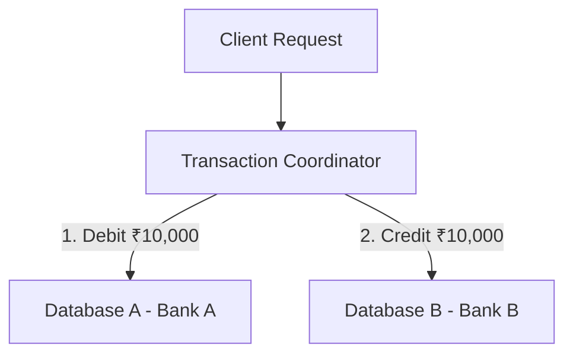
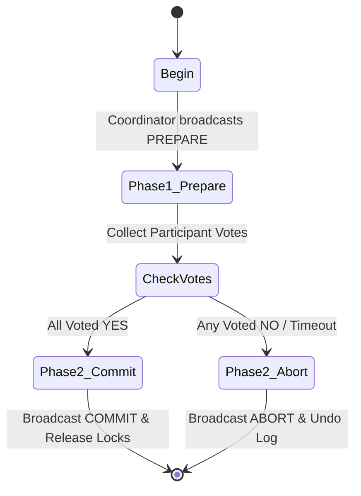
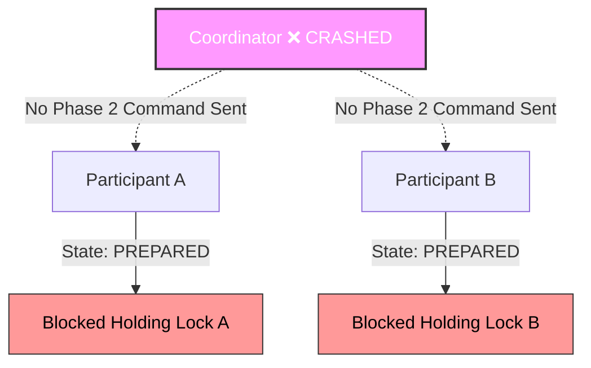
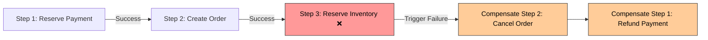

# Day 20 — Distributed Transactions

Imagine you log into your banking app and hit **"Send ₹10,000"** to transfer money to a friend at another bank. 

Behind the scenes, your bank's Core Banking Service decrements your balance. Simultaneously, your friend's bank credits their balance. 

When both accounts live inside a single SQL database table on a single physical machine, ensuring that money is neither created out of thin air nor lost to the void is trivial. You open an ACID database transaction, execute `UPDATE balance SET balance = balance - 10000`, execute `UPDATE balance SET balance = balance + 10000`, and hit `COMMIT`. If the power cuts out mid-way, the database server restarts, inspects its local undo log, rolls back the uncommitted debit, and restores complete consistency.

Now split those two accounts across **two independent databases running on two different servers managed by two separate microservices**:

```text
  Account A (Database 1)                  Account B (Database 2)
  ├── Service: Core Banking               ├── Service: Retail Banking
  └── Balance: ₹10,000                    └── Balance: ₹5,000
```

How do you guarantee that **either both operations succeed, or neither happens**, when a fiber-optic cable is severed, a router drops an ACK packet, or a database process crashes right between the first operation and the second?

This is the fundamental problem of **Distributed Transactions**.

---

## The Problem

To understand why distributed transactions are difficult, consider what happens when a single business operation spans two independent physical state stores.

Suppose a client attempts to transfer ₹10,000 from **Account A (Database 1)** to **Account B (Database 2)**:

```text
Account A
Database 1

    │
    │  ₹10,000 Transfer Request
    ▼

Account B
Database 2
```

### Failure Scenario 1: Partial Execution (Network Loss Mid-Workflow)

The orchestrator executes the workflow step-by-step:

1. **Debit Account A** on Database 1: **SUCCESS** (Account A balance becomes ₹0).
2. **Network Connection Fails**: The link between the caller and Database 2 drops completely.
3. **Credit Account B** on Database 2: **NEVER OCCURS**.

```text
[Step 1] Debit Account A (DB 1) ──► SUCCESS (Balance: ₹0)
                                         │
                                   [Network Fails!]
                                         │
[Step 2] Credit Account B (DB 2) ──► NEVER EXECUTED (Balance: ₹5,000)
```

**The Result**:
* **Account A**: Debited ₹10,000 (New balance: ₹0).
* **Account B**: Unchanged (Balance: ₹5,000).
* **Total System Money**: Changed from ₹15,000 to ₹5,000. **₹10,000 has vanished into thin air.**

Notice the uncomfortable reality: **Both Database 1 and Database 2 behaved perfectly correctly according to their own local rules.** Database 1 received a valid SQL command to deduct funds and committed it locally. Database 2 never received a command and untouched its state. Neither database has a bug, yet the global system is severely corrupted.

### Failure Scenario 2: Lost Confirmation & Blind Retry

Now consider the inverse failure:

1. Debit Account A succeeds on Database 1.
2. Credit Account B succeeds on Database 2.
3. The HTTP `200 OK` response from Database 2 back to the coordinator is **lost due to a network timeout**.
4. The coordinator/client assumes failure and **retries the transfer workflow**.

```text
Coordinator                       Database 2 (Account B)
     │                                     │
     │─── 1. Credit Account B (₹10,000) ──►│ (Balance updated to ₹15,000)
     │                                     │
     │ X ── 2. HTTP 200 Response LOST! ────│
     │                                     │
(Timeout Error!)                           │
     │                                     │
     │─── 3. RETRY Credit Account B ──────►│ (Balance updated to ₹25,000!)
```

**The Result**:
Because the confirmation was lost in transit, the retried request credits Account B a second time. **₹10,000 was created out of thin air.**

Distributed workflows inherently create **failure windows** between operations. In a single database, execution is instant and isolated. Across a network, execution is asynchronous, multi-step, and exposed to unpredictable delays.

---

## Why This Happens

Why can't we simply wrap both database operations in a standard `try/except` block or a distributed `lock`?

Because a distributed system is defined by independent failure domains separated by an unreliable physical network:

```text
                  DISTRIBUTED FAILURE REALITIES
                  
  ┌──────────────────┐    Network Drop    ┌──────────────────┐
  │   Database 1     │ ◄─── (Packet) ───► │   Database 2     │
  │ (Independent DB) │   Timeout / Crash  │ (Independent DB) │
  └────────┬─────────┘                    └────────┬─────────┘
           │                                       │
     Local Lock A                            Local Lock B
   (Knows nothing of                        (Knows nothing of
     Database 2)                              Database 1)
```

In a distributed environment:
1. **Independent Databases**: Database 1 and Database 2 run separate storage engines, separate lock managers, and separate transaction logs. Neither database knows the state of the other.
2. **Independent Services**: Service A owns Database 1; Service B owns Database 2. Direct cross-database joins or distributed locks violate service boundaries and create cascading operational failures.
3. **Network Failures & Timeouts**: Messages sent over a network can be delayed, corrupted, duplicated, or dropped entirely.
4. **Server Crashes**: A coordinator or participant can crash at any microsecond—before processing a request, after writing to disk, or before sending an acknowledgement.
5. **Partial Success & Partial Failure**: Step 1 can commit permanently while Step 2 encounters an unrecoverable disk error or network timeout.
6. **Lost Acknowledgements**: A database can commit a transaction successfully, but the network ACK back to the caller can be lost.

### The Core Insight

> [!IMPORTANT]
> **The difficult part of distributed transactions is NOT executing the individual operations.**
> 
> The difficult part is ensuring that **all independent participants reach a single, consistent final decision (COMMIT or ABORT) despite hardware crashes, network partitions, and lost messages.**

### The Bank Branch Analogy

Imagine coordinating a major wire transfer between three physical bank branches located in different cities during a storm. 
- Branch A (Mumbai) must deduct money.
- Branch B (London) must convert currency.
- Branch C (New York) must deposit money.

You cannot rely on Branch A's local vault locking to ensure Branch C receives the funds. If the phone lines die after Branch A hands cash to a courier, Branch A cannot unilaterally put the money back without knowing whether Branch B and Branch C completed their jobs. 

Someone must actively **coordinate** the shared decision, or every branch must know how to execute **compensating actions** if the storm breaks communication midway.

---

## The Wrong Solution

When software engineers first encounter this problem, they usually write naive sequential code like this:

```python
# NAIVE DISTRIBUTED IMPLEMENTATION (DO NOT USE IN PRODUCTION)
def transfer_money(account_a, account_b, amount):
    # Step 1: Call Bank A service
    bank_a_service.debit(account_a, amount)  # Returns HTTP 200 OK
    
    # Step 2: Call Bank B service
    bank_b_service.credit(account_b, amount) # Throws Timeout Exception!
```

### Why Naive Sequential Execution Fails

If `bank_a_service.debit()` succeeds, Account A has lost ₹10,000. If `bank_b_service.credit()` then fails due to a network partition, the function crashes, leaving the system permanently out of balance.

### Why Simple `try-except` Catch Blocks DO NOT Solve It

Engineers often attempt to fix this by adding a local error handler:

```python
# NAIVE ERROR HANDLING (STILL BROKEN IN DISTRIBUTED SYSTEMS)
def transfer_money(account_a, account_b, amount):
    bank_a_service.debit(account_a, amount)
    try:
        bank_b_service.credit(account_b, amount)
    except Exception:
        # Attempt manual rollback
        bank_a_service.credit(account_a, amount) # <--- WHAT IF THIS FAILS?
```

This code assumes that `bank_a_service.credit(account_a, amount)` inside the `except` block will always succeed. But in a distributed environment:

```text
Operation A (Debit A) ──► SUCCESS
   │
   ▼
Operation B (Credit B) ──► FAILURE (Network Drop)
   │
   ▼
Compensation (Refund A) ──► ANOTHER FAILURE! (Service A crashes or network drops!)
```

What happens when the rollback code itself times out or crashes? 
* The exception handler fails.
* Account A remains debited.
* The system is left corrupted.

Wrapping sequential calls in `try/except` creates an infinite regress of potential network failures: **Who compensates the failed compensation?**

---

## The Right Mental Model

To navigate distributed transaction boundaries, you must first separate **Local Transactions** from **Distributed Transactions**.

```text
┌─────────────────────────────────────────────────────────────────────────┐
│                           LOCAL TRANSACTION                             │
│                                                                         │
│   One physical database engine controls all reads, writes, and locks.   │
│                                                                         │
│                             Database Server                             │
│                        ┌───────────────────────┐                        │
│                        │  BEGIN TRANSACTION    │                        │
│                        │  ├── Operation A      │                        │
│                        │  ├── Operation B      │                        │
│                        │  └── COMMIT           │                        │
│                        └───────────────────────┘                        │
└─────────────────────────────────────────────────────────────────────────┘

                                     VS

┌─────────────────────────────────────────────────────────────────────────┐
│                        DISTRIBUTED TRANSACTION                          │
│                                                                         │
│     Multiple independent systems participate across a network.          │
│                                                                         │
│                              Coordinator                                │
│                                /     \                                  │
│                               /       \                                 │
│                              v         v                                │
│                        Database A   Database B                          │
└─────────────────────────────────────────────────────────────────────────┘
```

When an operation crosses independent systems, you have two fundamental strategies for maintaining business correctness:

1. **Two-Phase Commit (2PC)**: **Coordinated Decision**. All systems prepare state beforehand and commit atomically under the strict direction of a central coordinator.
2. **Saga Pattern**: **Sequence of Local Transactions + Compensation**. Each step commits locally immediately; if a downstream step fails, explicit compensating business transactions are executed backward to restore balance.

```text
               THE CENTRAL DISTRIBUTED TRANSACTION PARADIGM
               
                 2PC  ────────► Coordinates decision
                 Saga ────────► Compensates failures
```

Neither strategy is a silver bullet. Both represent explicit architectural trade-offs between consistency, availability, latency, and operational complexity.

---

## How It Actually Works

### Part 1 — Two-Phase Commit (2PC)

Two-Phase Commit is an atomic commit protocol designed to ensure that all database participants in a distributed transaction either all commit or all abort.

As the name implies, 2PC operates in two distinct phases coordinated by a transaction coordinator node.

#### Phase 1 — Prepare Phase

The Coordinator asks all participant databases whether they are ready to commit their portion of the transaction:

```text
Coordinator
     │
     │─── PREPARE? ───┐
     │                │
 +───┴───+        +───┴───+
 │ DB A  │        │ DB B  │
 +───┬───+        +───┬───+
     │                │
     └─── YES / NO ───┘
```

Before answering **YES**, each participant MUST perform heavy local validation:
1. Acquire necessary database locks (e.g., lock Account A and Account B rows).
2. Verify constraints (e.g., check that balance $\ge 10,000$).
3. Write all changes to local **Write-Ahead Logs (WAL)** on durable disk (both undo and redo records).
4. Guarantee that it can commit if commanded to do so by the coordinator, even if the power dies immediately after responding.

If any participant cannot guarantee completion (due to lock contention, constraint failure, or disk error), it votes **NO**.

#### Phase 2 — Commit / Abort Phase

The Coordinator evaluates all votes:

```text
                             COORDINATOR DECISION
                                      │
                         Did ALL participants vote YES?
                                      │
                      ┌───────────────┴───────────────┐
                      ▼                               ▼
                 [ ALL YES ]                     [ ANY NO ]
                      │                               │
             Coordinator writes               Coordinator writes
             COMMIT to WAL                    ABORT to WAL
                      │                               │
            Broadcasts COMMIT                Broadcasts ABORT
                      │                               │
              ┌───────┴───────┐               ┌───────┴───────┐
              ▼               ▼               ▼               ▼
            DB A            DB B            DB A            DB B
           Commit          Commit          Rollback        Rollback
```

1. **If ALL participants voted YES**:
   * The Coordinator writes a `COMMIT` record to its own local Write-Ahead Log on disk. (This is the official point of commit!).
   * The Coordinator broadcasts a `COMMIT` command to all participants.
   * Participants write `COMMIT` to their WAL, apply changes, release locks, and return `ACK`.
2. **If ANY participant voted NO (or timed out)**:
   * The Coordinator writes an `ABORT` record to its local WAL.
   * The Coordinator broadcasts an `ABORT` command to all participants.
   * Participants undo changes using their local WAL records, release locks, and return `ACK`.

---

### Part 2 — 2PC Failure Scenarios & Blocking

2PC provides strong distributed atomicity, but it has a fundamental flaw: **It is a blocking protocol.**

Let's examine what happens under real-world component failures.

#### Scenario A: Participant Failure Before Prepare
If Participant B crashes during Phase 1, the Coordinator receives no response, times out, writes `ABORT` to its WAL, and instructs Participant A to release locks. **Safe and clean.**

#### Scenario B: Participant Failure After Prepare
If Participant B votes `YES` and then crashes, the Coordinator still broadcasts `COMMIT`. When Participant B restarts, its database engine reads its local WAL, discovers the `PREPARED` transaction state, contacts the Coordinator, discovers the `COMMIT` decision, and completes the write. **Safe.**

#### Scenario C: Coordinator Failure After Prepare (The Blocking Disaster!)

What happens if the Coordinator crashes **AFTER** both Participant A and Participant B have voted `YES`, but **BEFORE** the Coordinator broadcasts the Phase 2 `COMMIT` command?

```text
Participant A ────── PREPARED (YES) ───┐
                                       │
                                 Coordinator ❌ (CRASHED!)
                                       │
Participant B ────── PREPARED (YES) ───┘
```

Look at the position of Participant A and Participant B:
* Both nodes are in the `PREPARED` state.
* Both nodes have acquired local row locks and reserved resources.
* **Participant A does NOT know if Participant B voted YES or NO.**
* **Participant A CANNOT commit unilaterally**: If Participant B actually voted NO, committing on A would corrupt the system.
* **Participant A CANNOT abort unilaterally**: If the Coordinator woke up for a millisecond, wrote `COMMIT` to disk, and sent `COMMIT` to B before crashing, aborting on A would corrupt the system.

> [!CAUTION]
> **Prepared Does Not Mean Committed**: In 2PC, once a participant votes `YES`, it surrendered its autonomy. It cannot unilaterally commit or abort. It MUST block indefinitely holding database locks until the coordinator recovers or an operator manually intervenes.

This blocking behavior can cause system-wide outages where database locks pile up, connection pools exhaust, and all cascading queries freeze.

---

### Part 3 — Saga Pattern

Because 2PC introduces locking overhead, blocking risks, and coordinator dependencies, modern microservices architectures often favor the **Saga Pattern**.

A Saga is a sequence of **local transactions**. Each step updates data within a single service's local database and immediately commits it. 

#### Example: E-Commerce Order Placement Saga

```text
[Step 1: Payment Service] ──► [Step 2: Order Service] ──► [Step 3: Inventory Service] ──► [Step 4: Shipping Service]
   Reserve Payment (Commit)       Create Order (Commit)        Reserve Inventory (Commit)     Schedule Shipment (Commit)
```

Notice the key difference from 2PC: **There are no multi-phase locks across services.** Step 1 commits its database transaction immediately. Step 2 commits its database transaction immediately.

#### Handling Failures via Compensating Actions

If Step 3 (Reserve Inventory) fails (e.g., out of stock):

```text
[Step 1: Payment] ──► [Step 2: Order] ──► [Step 3: Inventory ❌]
      │                      │                     │
   SUCCESS                SUCCESS               FAILED!
      │                      │                     │
      ▼                      ▼                     │
[Compensate Step 1] ◄── [Compensate Step 2] ◄──────┘
  Refund Payment          Cancel Order
```

The Saga orchestrator/engine triggers **Compensating Transactions** in reverse order:
1. Execute `Cancel Order` on Order Service.
2. Execute `Refund Payment` on Payment Service.

> [!NOTE]
> **Compensation is NOT a Database Rollback**: A database rollback deletes or reverts uncommitted disk bytes in an isolated transaction log. A compensating action is a **brand-new forward business transaction** (e.g., depositing money back into an account, issuing a credit note, or sending a cancellation email) that explicitly undoes the business effect of a previously committed step.

---

### Part 4 — Saga Failure Scenarios

What happens if a compensating transaction itself fails?

#### Example: Refund Failure

```text
1. Debit Payment    ──► SUCCESS
2. Create Order     ──► SUCCESS
3. Inventory Check  ──► FAILURE!
4. Refund Payment   ──► NETWORK ERROR / BANK DECLINE! ❌
```

Saga does NOT provide magical distributed rollback guarantees. If compensation fails, the system cannot simply pretend the debit never occurred.

To survive compensation failures, a Saga architecture requires:
1. **Durable Workflow Log**: The orchestrator must write its current step state to durable storage (e.g., PostgreSQL, Temporal, or AWS Step Functions) before sending any RPC call.
2. **Infinite Retries with Exponential Backoff**: Compensating operations MUST be retried until they succeed. Transient network drops will eventually resolve.
3. **Strict Idempotency**: Because compensations are retried, compensating APIs (e.g., `refund_payment(saga_id)`) MUST be completely idempotent.
4. **Dead-Letter Queues (DLQ) & Human Escalation**: If a compensation fails permanently due to a business constraint (e.g., user account closed), the workflow must alert ops teams for manual accounting adjustment.

> [!IMPORTANT]
> **Saga is Forward Recovery, Not Magical Rollback**: Saga achieves business correctness by moving forward through compensating actions, relying heavily on idempotency and durable retry logs.

---

### Part 5 — 2PC vs Saga

| Property | Two-Phase Commit (2PC) | Saga Pattern |
| :--- | :--- | :--- |
| **Main Idea** | Coordinate atomic commit across nodes | Execute local commits + compensate failures |
| **Atomicity** | Strong (ACID across services) | Business-level (Eventually consistent) |
| **Blocking** | Possible (Participants lock on Prepare) | Generally avoids global prepare blocking |
| **Long Workflows** | Poor fit (Holds database locks too long) | Better fit (Each step commits immediately) |
| **Implementation** | Infrastructure-heavy (DB WAL / XA drivers) | Application/workflow-heavy (Code & Orchestrators) |
| **Compensation Logic** | Unnecessary (Handled by DB undo logs) | Required (Explicit code for every step) |
| **Failure Handling** | Coordinator-driven abort | Workflow-driven compensating sequence |
| **Isolation Level** | High (Read Committed / Serializable) | Low (Intermediate state visible to other users!) |
| **Best For** | Low-latency, tightly coupled DB shards | Long-running microservice business workflows |

---

## Visual Explanation

### 1. Distributed Transfer Topology

```text
                              Client
                                │
                                │  "Transfer ₹10,000"
                                ▼
                           Coordinator
                            /       \
                           /         \
                          v           v
                     Database A   Database B
                       (Debit)     (Credit)
```



---

### 2. 2PC Lifecycle

```text
  BEGIN
    │
    ▼
 PREPARE ────► [Ask Participants: Can you commit?]
    │
    +────► All Voted YES?
             │
          +──┴──+
          │     │
         YES    NO
          │     │
          v     v
       COMMIT  ABORT
```



---

### 3. Coordinator Failure & Insecurity Window

```text
Participant A ─── PREPARED State ───┐
                                    │
                               Coordinator ❌ (CRASHED!)
                                    │
Participant B ─── PREPARED State ───┘
```



---

### 4. Saga Workflow & Compensation Execution

```text
Step 1: Debit Account
      ↓
Step 2: Create Order
      ↓
Step 3: Reserve Inventory ❌ (FAILED!)
      ↓
Compensate Step 2: Cancel Order
      ↓
Compensate Step 1: Refund Account
```



---

### 5. Architectural Decision Comparison

```text
2PC Approach:
Coordinate ──► Prepare (Lock) ──► Commit (Release)

Saga Approach:
Execute Local Tx 1 ──► Execute Local Tx 2 ──► Failure! ──► Compensate Local Tx 1
```

---

### Required Architecture Diagrams in `assets/`

The following visual artifacts describe the diagrams that belong in `assets/` for visual documentation:

1. [`assets/distributed-transaction.png`](file:///d:/30_Days_of_Distributed_Systems/days/Day-20-Distributed-Transactions/assets/distributed-transaction.png): High-resolution architectural layout showing a client initiating a cross-database transaction, illustrating service boundaries, network hops, and failure points.
2. [`assets/two-phase-commit.png`](file:///d:/30_Days_of_Distributed_Systems/days/Day-20-Distributed-Transactions/assets/two-phase-commit.png): Detailed sequence diagram illustrating the Prepare Phase, vote collection, WAL disk flush, and Commit Phase execution across two database nodes.
3. [`assets/coordinator-failure.png`](file:///d:/30_Days_of_Distributed_Systems/days/Day-20-Distributed-Transactions/assets/coordinator-failure.png): State diagram showing participant nodes trapped in the `PREPARED` state following a coordinator process crash, illustrating lock retention.
4. [`assets/saga-workflow.png`](file:///d:/30_Days_of_Distributed_Systems/days/Day-20-Distributed-Transactions/assets/saga-workflow.png): Workflow diagram illustrating forward execution steps and backward compensating steps managed by an asynchronous Saga Orchestration Engine.
5. [`assets/2pc-vs-saga.png`](file:///d:/30_Days_of_Distributed_Systems/days/Day-20-Distributed-Transactions/assets/2pc-vs-saga.png): Comparative matrix highlighting latency profiles, locking behaviors, and failure recovery mechanics between 2PC and Saga.

*(Note: These diagram specifications serve as blueprint descriptions for visual creation).*

---

## Real World Example: Uber Trip & Payment Workflow

Consider a large-scale real-world distributed business workflow such as **Uber**:

```text
[Trip Service] ──► [Payment Service] ──► [Driver Payout Service] ──► [Notification Service]
 Complete Trip       Charge Passenger       Credit Driver Wallet      Send Push Notification
```

### Why a Single Database Transaction Is Impossible
1. **Service Ownership**: Trip data lives in a sharded Cassandra cluster, Payment data lives in a transactional MySQL/Spanner cluster, Driver Wallet data lives in an isolated financial ledger database.
2. **Autonomous Microservices**: Wrapping all four services in a single 2PC transaction would mean that if the Notification Service or Driver Wallet database experienced a transient glitch, the entire trip completion would block, holding database locks on the passenger's fare!
3. **Long Latency**: Trip billing involves third-party bank gateways (Stripe/Adyen/UPI) that take 1,500ms to answer. Holding SQL locks for 1.5 seconds under millions of concurrent trips would instantly collapse Uber's infrastructure.

### How Saga-Style Architecture Solves It
Uber treats trip completion as an **Asynchronous Saga Workflow**:
1. **Local Commit 1**: Trip Service marks trip state as `COMPLETED` in its local database.
2. **Local Commit 2**: Payment Service receives an event and authorizes the passenger's credit card.
3. **Local Commit 3**: Driver Payout Service credits the driver's earnings ledger.
4. **Compensation Handling**: If the passenger's credit card is declined in Step 2:
   * Trip Service is **NOT** rolled back to `IN_PROGRESS` (the driver already drove the miles!).
   * Instead, a **compensating business workflow** is triggered: The passenger's account is flagged with an `UNPAID_BALANCE` block, preventing them from booking future rides until the balance is settled, while the driver is still paid from Uber's clearing account.

*(Note: This represents a conceptual architecture model illustrating long-running microservice transaction design, not Uber's proprietary internal codebase).*

---

## Build It Yourself

Hands-on executable code simulations are provided in the [`code/`](file:///d:/30_Days_of_Distributed_Systems/days/Day-20-Distributed-Transactions/code/) directory to let you observe distributed transaction failure modes and mitigation strategies directly.

### 1. Naive Non-Atomic Transfer Simulation
File: [`distributed_transfer.py`](file:///d:/30_Days_of_Distributed_Systems/days/Day-20-Distributed-Transactions/code/distributed_transfer.py)

Demonstrates:
* **Scenario 1**: Successful transfer across two isolated databases.
* **Scenario 2**: Network failure after debiting Account A but before crediting Account B. Output shows total system balance dropping from ₹15,000 to ₹13,000 as money vanishes into thin air.
* **Scenario 3**: Naive local `try-except` rollback failure when the compensating call itself encounters a network timeout.

### 2. Two-Phase Commit (2PC) Protocol Simulation
File: [`two_phase_commit.py`](file:///d:/30_Days_of_Distributed_Systems/days/Day-20-Distributed-Transactions/code/two_phase_commit.py)

Demonstrates:
* **Prepare Phase & Vote Logic**: Participants lock funds, write WAL entries, and return `YES` or `NO`.
* **Atomic Commit & Abort**: Coordinator collects consensus and issues Phase 2 commands.
* **Coordinator Crash Simulation**: Coordinator crashes after all participants enter `PREPARED` state, demonstrating why participants become blocked indefinitely holding resource locks.

### 3. Saga Pattern & Compensation Simulation
File: [`saga_transfer.py`](file:///d:/30_Days_of_Distributed_Systems/days/Day-20-Distributed-Transactions/code/saga_transfer.py)

Demonstrates:
* **Local Transaction Sequence**: Each step commits immediately in local service state.
* **Automatic Business Compensation**: Step 2 failure automatically triggers a compensating refund transaction on Step 1.
* **Compensation Failure Handling**: Simulates transient errors during compensation and resolves them using durable workflow retries and idempotency keys.

Run the simulations directly:

```bash
cd days/Day-20-Distributed-Transactions/code
python distributed_transfer.py
python two_phase_commit.py
python saga_transfer.py
```

---

## Common Misconceptions

### 1. "A distributed transaction is just a bigger database transaction."
**False**. A local database transaction runs inside one process with single-threaded lock coordination and direct RAM access to undo/redo buffers. A distributed transaction crosses network boundaries where nodes crash independently, messages drop, and time is non-synchronized.

### 2. "2PC guarantees availability."
**False**. 2PC prioritizes **Consistency over Availability** (CP in CAP theorem). If the coordinator or any participant fails during Prepare, the transaction cannot proceed, sacrificing availability to protect atomicity.

### 3. "2PC never blocks."
**False**. If the coordinator crashes after participants have prepared but before broadcasting the decision, participants are trapped in an uncertain `PREPARED` state holding locks until the coordinator recovers.

### 4. "Saga is the same as rollback."
**False**. Database rollback discards uncommitted transient state in a single transaction. Saga compensation executes a **new forward business transaction** to offset the effect of a previously committed step.

### 5. "Compensation always restores the exact previous state."
**False**. Compensation restores business balance, not exact physical state. If Account A was debited ₹1,000 and refunded ₹1,000 later, other concurrent transactions may have read the intermediate ₹9,000 balance in between.

### 6. "Saga is always better than 2PC."
**False**. Saga lacks isolation (`I` in ACID). Intermediate state changes are visible to outside queries immediately. If your business domain strictly requires serializable isolation (e.g., core stock exchanges or bank ledger clearing), 2PC or distributed SQL (Spanner/CockroachDB) is required.

### 7. "2PC is always better because it provides stronger atomicity."
**False**. 2PC scales poorly across high-latency WAN links or autonomous microservices due to blocking risks and resource locking overhead.

### 8. "A failed transaction means nothing happened."
**False**. In distributed systems, a failed transaction might mean Step 1 committed, Step 2 failed, and Step 3 was never reached. State was mutated.

### 9. "A timeout means the transaction was rolled back."
**False**. A network timeout means **"Status Unknown."** The remote node may have committed the transaction, aborted it, or never received the request at all.

### 10. "Retries alone solve distributed transaction failures."
**False**. Retrying non-idempotent operations across distributed steps creates duplicate debits and corrupted ledger balances.

### 11. "Every microservice workflow should use Saga."
**False**. If a workflow can be designed statelessly, asynchronously, or bounded within a single database boundary, Saga adds unnecessary orchestration complexity.

### 12. "Every distributed transaction requires 2PC."
**False**. Modern distributed systems overwhelmingly favor eventual consistency, Saga workflows, event-driven architectures, and idempotent compensation over heavy 2PC protocols.

---

## Production Trade-offs

```text
┌─────────────────────────────────────────────────────────────────────────┐
│                       PRODUCTION TRADE-OFF MATRIX                        │
├──────────────────────┬────────────────────────┬─────────────────────────┤
│ Architectural Metric │ Two-Phase Commit (2PC) │       Saga Pattern      │
├──────────────────────┼────────────────────────┼─────────────────────────┤
│ Latency              │ High (2 network RTTs + │ Low per step (Local     │
│                      │ disk WAL syncs)        │ async commits)          │
├──────────────────────┼────────────────────────┼─────────────────────────┤
│ Failure Recovery     │ Coordinator WAL replay │ Durable orchestrator    │
│                      │                        │ retries + compensation  │
├──────────────────────┼────────────────────────┼─────────────────────────┤
│ Operational Risk     │ Global lock deadlock & │ Dirty reads & complex   │
│                      │ coordinator blocking   │ compensation debugging  │
├──────────────────────┼────────────────────────┼─────────────────────────┤
│ Observability        │ Coordinator logs       │ Workflow trace trees &  │
│                      │                        │ Saga state metrics      │
├──────────────────────┼────────────────────────┼─────────────────────────┤
│ Data Ownership       │ Shared DB or XA driver │ Strict service-owned    │
│                      │ coupling               │ databases               │
└──────────────────────┴────────────────────────┴─────────────────────────┘
```

---

## Key Takeaways

* **2PC coordinates a shared decision** before committing state across distributed nodes.
* **Saga coordinates recovery through business-level compensation** after local transactions commit.
* **A distributed transaction is a coordination problem**, not merely a database query problem.
* **Compensation is NOT rollback**: It is a forward business action that offsets a previously committed local transaction.
* **A timeout does NOT tell you what actually happened**: In distributed systems, a timeout represents an unresolved state of uncertainty.
* **Prepared does NOT mean committed**: A 2PC participant in the prepared state has surrendered autonomy and must wait for coordinator consensus.
* **Saga trades Isolation for Availability**: Intermediate states are visible to external callers during workflow execution.
* **Idempotency is mandatory for Saga compensations**: Because compensations can fail and be retried, compensating endpoints must safely process duplicate requests.
* **Durable workflow logs are essential**: Saga orchestrators must persist workflow step execution state to survive process crashes.

---

## Interview Questions & Answers

### Q1: Why is a distributed transaction fundamentally harder than a local database transaction?
**Answer**: A local database transaction runs on a single physical node where a single transaction manager controls memory buffers, disk locks, and undo/redo logs atomically. If power fails, local recovery logs guarantee ACID guarantees. A distributed transaction spans multiple autonomous servers separated by noisy physical networks. Nodes can crash independently, network links can drop or delay packets arbitrarily, and local lock managers have no visibility into remote systems. Achieving atomicity requires reaching consensus over an unreliable network, which is structurally subject to timeouts, partial failures, and lost acknowledgements.

### Q2: Walk through the two phases of Two-Phase Commit (2PC).
**Answer**: 
* **Phase 1 (Prepare)**: The coordinator sends a `PREPARE` request to all database participants. Each participant checks constraints, acquires local locks, writes undo/redo records to its Write-Ahead Log (WAL), and votes `YES` if it can guarantee completion, or `NO` if it cannot.
* **Phase 2 (Commit/Abort)**: If all participants voted `YES`, the coordinator writes `COMMIT` to its own WAL and broadcasts `COMMIT` to all participants, who apply changes and release locks. If any participant voted `NO` or timed out, the coordinator writes `ABORT` to its WAL and broadcasts `ABORT` to all participants, who undo changes using their WAL records and release locks.

### Q3: What happens if the 2PC coordinator crashes after participants prepare?
**Answer**: This is the classic 2PC blocking problem. Participants that voted `YES` enter the `PREPARED` state and surrender their autonomy. A participant cannot unilaterally commit (because another node might have voted NO) and cannot unilaterally abort (because the coordinator might have written COMMIT to disk before crashing). The prepared participants are blocked indefinitely, holding database row locks and resources, until the coordinator recovers, reads its WAL, and resolves the transaction decision.

### Q4: Why can 2PC cause major performance bottlenecks in microservice architectures?
**Answer**: 2PC requires holding database locks across all participant nodes for the entire duration of Phase 1 and Phase 2, including network round-trip times (RTTs). In a microservice architecture spanning multiple services or WAN regions, network latencies are high. Holding row locks for hundreds of milliseconds exhausts database connection pools, causes severe lock contention, decreases throughput, and exposes the entire system to cascading deadlocks if a single participant slows down.

### Q5: What is the fundamental difference between a database rollback and a Saga compensating transaction?
**Answer**: A database rollback discards uncommitted data modifications at the storage engine level by reversing uncommitted undo log buffers within an isolated transaction boundary. A Saga compensating transaction is an independent, newly executed **forward business transaction** (e.g., executing a refund API call) that undoes the business impact of a previously committed local transaction. Because the original step was already committed to disk, its effects were visible to other systems prior to the compensation.

### Q6: When would you choose Saga over 2PC?
**Answer**: You should choose Saga over 2PC when:
1. Operations span multiple autonomous microservices with independent databases where direct XA/2PC database coupling is unacceptable.
2. Workflows are long-running (e.g., order fulfillment, hotel bookings, multi-step approvals) where holding 2PC database locks for seconds or minutes would destroy system performance.
3. High availability and horizontal scalability are prioritized over strict serializable isolation.

### Q7: How do you make Saga compensating steps idempotent, and why is this required?
**Answer**: Compensating steps are made idempotent by assigning a unique, deterministic `saga_id` (or `compensation_key`) to the workflow. The compensating endpoint checks whether `REFUND_saga_id` has already been applied in its local transaction store before executing the credit. If it has, the endpoint skips balance mutation and returns `200 OK`. Idempotency is required because network timeouts during compensation force the Saga orchestrator to retry compensating calls. Without idempotency, retrying a refund would credit the user's balance multiple times.

### Q8: What happens if a compensating transaction fails in a Saga workflow?
**Answer**: If a compensating transaction fails due to a transient network error, the Saga orchestrator uses exponential backoff to retry the compensation until it succeeds. If a compensation fails permanently due to a non-retriable business failure (e.g., destination account closed), the orchestrator logs a critical error to a Dead-Letter Queue (DLQ), triggers security alerts, and flags the workflow for human operator intervention or manual accounting reconciliation.

### Q9: How would you design a distributed bank transfer between two microservices?
**Answer**: 
1. Use an **Orchestrated Saga Pattern** managed by a durable workflow engine (e.g., Temporal).
2. **Step 1**: Debit Account A at Bank Service A with a unique `transfer_id`. Commit locally and persist state.
3. **Step 2**: Credit Account B at Bank Service B idempotently using `transfer_id`.
4. **If Step 2 succeeds**: Mark Saga complete.
5. **If Step 2 fails**: Trigger compensating action: Credit Account A at Bank Service A using `REFUND_transfer_id`.
6. Ensure both debit, credit, and refund endpoints enforce strict idempotency keys to handle network retries safely.

### Q10: What key observability metrics are required for production Saga workflows?
**Answer**: Production Saga observability requires:
1. **Distributed Tracing**: Contextual `trace_id` header propagation across all microservice calls in the workflow.
2. **Saga Duration Metrics**: Percentile histograms ($p_{50}, p_{95}, p_{99}$) measuring workflow completion latency.
3. **Compensation Failure Rate**: Alarms tracking the ratio of started compensations versus failed/retried compensations.
4. **Stuck Workflow Gauges**: Alerts on sagas remaining in `IN_PROGRESS` or `COMPENSATING` state past defined SLA thresholds.

---

## Further Reading

* Explore the curated collection of books, research papers, engineering blogs, documentation, and technical talks in [`references.md`](file:///d:/30_Days_of_Distributed_Systems/days/Day-20-Distributed-Transactions/references.md).

## What You'll Build Intuition For Tomorrow

Tomorrow in **Day 21 — Retries**, we will explore what happens when network packets drop, services time out, and client libraries must decide how and when to retry requests without causing catastrophic cascading failure spikes across distributed systems.
