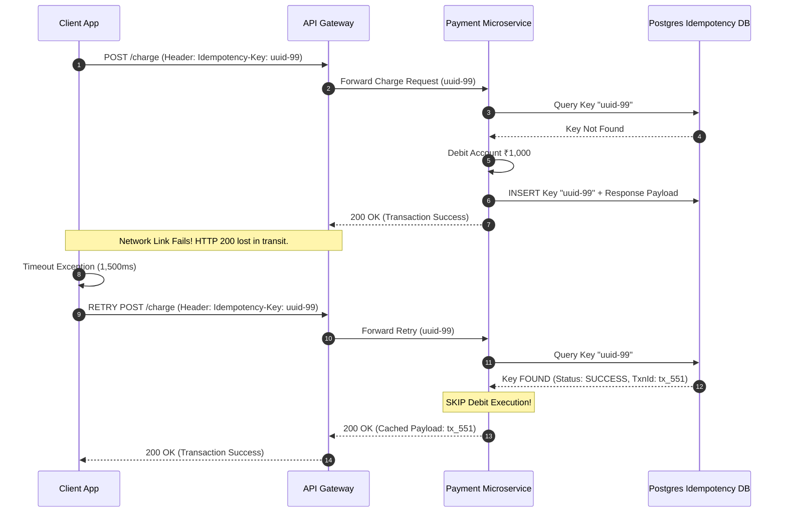

# Day 21 — Retries: Why Retries Sometimes Make Things Worse

At 2:14 AM on a Cyber Monday sales peak, a payment processing cluster at an e-commerce platform began experiencing a minor 3% increase in database query latency. 

Within four minutes, the entire payment microservice architecture collapsed into a total black-hole outage. CPU utilization across 400 application nodes spiked to 100%, network connection pools were completely exhausted, memory pressure triggered aggressive garbage collection pauses, and the underlying PostgreSQL database cluster crashed under a 10x surge in incoming query volume.

Post-mortem investigations revealed an ironic root cause: the payment cluster was destroyed not by a denial-of-service attack, an intruder, or bad code deployment, but by its **own automated retry mechanism**.

When a network connection drops or a server fails to answer, our immediate instinct as engineers is simple: *try again*. Retries are routinely described as a fundamental building block of system resilience. Yet, in large-scale distributed systems, automated retries frequently transform tiny transient delays into fatal cascading outages.

This brings us to a crucial question that every staff engineer must answer:

> **"If retries help failed requests, how can retries cause an outage?"**

---

## The Problem

To understand how retries can destroy a healthy distributed system, consider a standard multi-tier microservice architecture:

```text
  +------------+             +---------------+             +--------------+
  |   Client   |  ─────────► |    Service    |  ─────────► |   Database   |
  | (Frontend) |             | (Order Engine)|             | (State Store)|
  +------------+             +---------------+             +--------------+
```

Under normal operating conditions, an HTTP request flows from the client frontend to the order service, which executes a quick database query (taking 5ms) and returns `200 OK` in under 20ms.

Now suppose the database experiences a brief transient spike in write operations—perhaps caused by a scheduled background analytics job or a temporary disk I/O lock.

Here is how a localized 5ms delay escalates into a global system crash:

1. **The Database Slows Down**: Database query response times increase from 5ms to 2,000ms (2 seconds).
2. **Requests Begin Timing Out**: The Order Service has a configured network client timeout of 1,500ms (1.5 seconds). Because the database now takes 2.0s to respond, every in-flight database query times out at the service layer.
3. **The Service Retries**: Following a standard "retry on error" policy, the Order Service immediately re-issues every timed-out query back to the database.
4. **More Requests Reach the Database**: The database is already struggling under its original workload of 1,000 queries/sec. Now, it must handle the original 1,000 queries/sec **plus** 1,000 retried queries/sec. Total inbound load surges to 2,000 queries/sec.
5. **The Database Becomes Even Slower**: Overwhelmed by double the traffic, database query execution times degrade from 2.0s to 10.0s.
6. **More Requests Timeout**: 100% of client requests now exceed the 1.5s timeout.
7. **More Retries Appear**: Application nodes execute secondary and tertiary retries. The database is bombarded with 4,000 queries/sec.
8. **Total System Collapse**: The database connection pool fills up, worker threads saturate, memory leaks occur due to queued requests, and the service crashes completely.

```text
                     THE RETRY STORM AMPLIFICATION FEEDBACK LOOP

    +-------------------+        1. Database Slows Down (Query Latency > Timeout)
    | Localized Storage |
    |      Latency      | ───┐
    +-------------------+    │
                             ▼
                    +------------------+
                    | Client Request   |
                    |     Times Out    |
                    +------------------+
                             │
                             │ 2. Automated Immediate Retry
                             ▼
                    +------------------+
                    | Inbound Traffic  | ◄───┐ 
                    |   Surges (2x-4x) |     │ 4. Amplified Load
                    +------------------+     │    Slowing Down
                             │               │    Dependency Further
                             │ 3. Connection Pool & CPU Saturation
                             ▼               │
                    +------------------+     │
                    | Downstream Target| ────┘
                    | Fully Overloaded |
                    +------------------+
```

### Failure Amplification

This phenomenon is known as **Failure Amplification**. In a distributed system, an naive retry strategy acts as an *amplifier* for downstream degradation:

$$\text{Total Inbound Load} = \text{Original Traffic} \times \left(1 + \sum_{k=1}^{\text{Max Retries}} P(\text{Failure at step } k)\right)$$

If an unhealthy downstream service has a 100% failure rate and clients perform 3 retries per request, the system generates **400% of its normal baseline traffic** precisely at the moment when the target service is least capable of processing load.

---

## Why This Happens

Why does an automated retry policy fail so catastrophically in production? The answer lies in the fundamental physics of distributed networking.

### 1. Timeouts Are Ambiguous
In a single-process application, function calls are synchronous and deterministic. A call either returns a value or throws an exception.

Across a network, communication is **asynchronous and non-deterministic**. When a client sends a request over TCP and encounters a socket timeout, the client has received **zero information** about what actually happened on the remote server.

```text
  Client                                             Server
    │                                                   │
    │ ─── 1. POST /payment (Transfer ₹1,000) ──────────►│ (Server receives request)
    │                                                   │ (Server updates DB balance)
    │                                                   │ (Server sends 200 OK ACK)
    │ X ◄── 2. Response LOST due to Network Drop ───────│
    │                                                   │
 (Client Timeout!)                                      │
    │                                                   │
  "Did the money transfer happen, or did it fail?"
```

A timeout does **not** mean the operation failed. It only means the response did not return before the client's patience expired. The remote server may have:
- Received the request, processed it, and committed the result, but the response packet was dropped by a router.
- Received the request and queued it behind 5,000 other requests, meaning processing is ongoing.
- Crashed before receiving the request packet.

Clients cannot distinguish failure from delayed success.

### 2. Retries Consume Real System Resources
A retry is not a harmless virtual operation. Every single retried request consumes tangible hardware capacity across the entire call stack:
- **CPU Cycles**: Serialization, JSON parsing, SSL/TLS encryption handshakes.
- **Memory**: Buffering request payloads and response frames in RAM.
- **Connection Pools**: Holding open TCP sockets and HTTP connection handles.
- **Thread Pools**: Occupying worker threads in blocking web servers (e.g., Tomcat, Puma, Gunicorn).
- **Queue Slots**: Filling OS kernel socket buffers and application task queues.

### 3. The Emergency Room Analogy
Imagine a hospital Emergency Room (ER) that can treat 20 patients per hour.

Suppose 40 sick patients arrive at 9:00 AM. A line forms outside. Because the wait is long, every patient in line walks up to the intake desk every 5 minutes to demand an update. 

The intake nurse, who should be spending 100% of their time triaging incoming patients, now spends 80% of their time answering repetitive inquiries from patients who are already in line.

Because intake slows down to 4 patients per hour, the line outside grows longer. As the line grows, more people walk up to ask questions. The hospital collapses not because it lacked doctors, but because **the communication traffic overwhelmed the processing capacity**.

```text
┌─────────────────────────────────────────────────────────────────────────────┐
│                             THE TRAFFIC JAM ANALOGY                         │
├─────────────────────────────────────────────────────────────────────────────┤
│ When a highway lane is blocked by construction (downstream bottleneck),     │
│ telling drivers behind the jam to "drive faster and honk continuously"       │
│ (immediate retries) does not clear the construction. It creates a complete  │
│ gridlock that blocks emergency vehicles and adjacent highways (cascading   │
│ service failures).                                                          │
└─────────────────────────────────────────────────────────────────────────────┘
```

---

## The Wrong Solution

When engineers first encounter network transient errors, they frequently write code that looks like this:

```python
# DANGEROUS CODE: DO NOT USE IN PRODUCTION
def fetch_user_profile(user_id):
    max_retries = 3
    for attempt in range(max_retries):
        try:
            return http_client.get(f"/users/{user_id}")
        except Exception as e:
            if attempt == max_retries - 1:
                raise e
            # Immediate retry loop!
```

### Why Naive Retries Are Dangerous

1. **Zero Delay Between Attempts**: Retrying instantly (within 1 millisecond) hits the downstream dependency while it is still processing the previous request.
2. **Ignored Failure Reasons**: This code retries indiscriminately on HTTP 400 (Bad Request), HTTP 401 (Unauthorized), HTTP 404 (Not Found), and HTTP 500 (Internal Server Error). Retrying a `401 Unauthorized` request 3 times will never magically validate an invalid JWT token—it only wastes bandwidth.
3. **Thundering Herd Amplification**:

```text
 1,000 Original Requests
         │
         ▼ (Downstream experiences transient latency spike)
 1,000 Timed-Out Requests
         │
         ▼ (Immediate Retry executed simultaneously)
 1,000 Retry Requests
         │
         ▼
 Total Volume: 2,000 Concurrent Requests Bombarding Downstream
         │
         ▼
 Downstream CPU Exhaustion & Connection Pool Lockup
         │
         ▼
 System Outage
```

### The Hazard of Infinite Retries

An even more catastrophic anti-pattern is the infinite retry loop:

```python
# EXTREMELY DANGEROUS CODE
def publish_event_to_bus(event):
    while True:
        try:
            kafka_producer.send(event)
            break
        except Exception:
            time.sleep(1) # Infinite loop until success
```

If the messaging cluster experiences a persistent outage lasting 2 hours, thousands of worker threads will become trapped in this infinite retry loop. System memory will balloon as queued requests pile up, eventually triggering an Out-Of-Memory (`OOMKilled`) process termination by the operating system kernel.

---

## The Right Mental Model

To design resilient distributed systems, software engineers must internalize two foundational mental models.

### Mental Model #1: A Retry Is New Traffic

Never view a retry as a "recovery mechanism." **A retry is brand new network traffic.**

```text
┌─────────────────────────────────────────────────────────────────────────────┐
│                            MENTAL MODEL RULE #1                             │
├─────────────────────────────────────────────────────────────────────────────┤
│ Every retry issued by an application consumes the exact same CPU, network   │
│ bandwidth, database connections, and worker threads as a brand-new user     │
│ clicking "Purchase" on your frontend.                                       │
│                                                                             │
│ You must budget for retry traffic during capacity planning.                 │
└─────────────────────────────────────────────────────────────────────────────┘
```

### Mental Model #2: A Timeout Does Not Equal Failure

Never confuse a lost ACK with an unexecuted operation.

```text
                      TWO DISTINCT FAILURE MODES

      Scenario A: Request Failed              Scenario B: Response Failed
   (Operation NEVER Executed)              (Operation WAS Executed)

       Client       Server                     Client       Server
         │            │                          │            │
         │── Request ─X                          │── Request ─►│ (State updated!)
         │  (Dropped)                            │            │
         │                                       │ X─ ACK ────│
         ▼                                       ▼ (Dropped)
    (Safe to retry)                         (UNSAFE to retry without
                                             Idempotency!)
```

When designing client retries, you must explicitly ask:
1. *Is the operation idempotent?* If the server received and executed the request, will running it a second time corrupt data?
2. *Is the failure transient?* Is the downstream service overloaded, or is the client request malformed?

---

## How It Actually Works: Safe Retry Design

Building a production-grade retry architecture requires layering eight distinct resilience mechanisms together.

```text
                        SAFE RETRY ARCHITECTURE LAYERS

 ┌───────────────────────────────────────────────────────────────────────────┐
 │ 1. Failure Classification (Retry only transient errors: 502/503/504)      │
 ├───────────────────────────────────────────────────────────────────────────┤
 │ 2. Strict Retry Limits (Max 2-3 attempts total)                           │
 ├───────────────────────────────────────────────────────────────────────────┤
 │ 3. Exponential Backoff (Delay increases exponentially: 1s -> 2s -> 4s)    │
 ├───────────────────────────────────────────────────────────────────────────┤
 │ 4. Random Jitter (De-synchronize client retry clocks)                     │
 ├───────────────────────────────────────────────────────────────────────────┤
 │ 5. Idempotency Guarantees (Unique request keys prevent duplicate side-effects)│
 ├───────────────────────────────────────────────────────────────────────────┤
 │ 6. Circuit Breakers (Fast-fail when downstream health drops below threshold)│
 ├───────────────────────────────────────────────────────────────────────────┤
 │ 7. Retry Budgets (Cap global retry traffic to <= 10% of total volume)      │
 ├───────────────────────────────────────────────────────────────────────────┤
 │ 8. Coordinated Layering (Retry at only ONE layer in the service graph)    │
 └───────────────────────────────────────────────────────────────────────────┘
```

---

### 1. Retry Only Appropriate Failures

Never retry blindly on every error. System errors must be divided into three distinct buckets:

| Failure Category | HTTP / RPC Status Codes | Root Cause | Retry Action |
| :--- | :--- | :--- | :--- |
| **Permanent Client Errors** | `400 Bad Request`<br>`401 Unauthorized`<br>`403 Forbidden`<br>`422 Unprocessable` | Malformed payload, invalid auth credentials, business validation rule violation. | **DO NOT RETRY**. Retrying will never change the outcome. Return error immediately. |
| **Transient Infrastructure Errors** | `502 Bad Gateway`<br>`503 Service Unavailable`<br>`504 Gateway Timeout`<br>Network Socket Drops | Temporary network blip, container restart, load balancer target failover. | **SAFE TO RETRY** (using backoff + jitter). |
| **Downstream Overload Errors** | `429 Too Many Requests`<br>`503 Service Unavailable` | Target dependency is actively struggling under excessive traffic load. | **RETRY WITH CAUTION**. Honor `Retry-After` headers if present. Require circuit breaker protection. |

---

### 2. Retry Limits

Every retry policy must enforce an absolute ceiling on total attempts (typically 2 or 3 attempts total).

$$\text{Total Requests} = 1 \text{ (Original Attempt)} + N \text{ (Max Retries)}$$

Setting $\text{Max Retries} = 2$ guarantees that a broken service will receive at most **200% baseline traffic** instead of an infinite multiplication loop.

---

### 3. Exponential Backoff

Instead of retrying immediately, clients must wait progressively longer between successive retry attempts.

Exponential backoff calculates delay using the formula:

$$T_{\text{wait}} = \min\left(T_{\text{max}}, T_{\text{initial}} \times 2^{\text{attempt}}\right)$$

Where:
- $T_{\text{initial}}$ is the base delay (e.g., 100ms).
- $\text{attempt}$ is the 0-indexed retry count ($0, 1, 2, 3$).
- $T_{\text{max}}$ is the ceiling cap to prevent infinite delays (e.g., 10 seconds).

```text
 Attempt 0 (Initial)  ──► 0ms delay (Immediate call)
 Attempt 1 (Retry 1)  ──► 100ms delay  (100 * 2^0)
 Attempt 2 (Retry 2)  ──► 200ms delay  (100 * 2^1)
 Attempt 3 (Retry 3)  ──► 400ms delay  (100 * 2^2)
 Attempt 4 (Retry 4)  ──► 800ms delay  (100 * 2^3)
```

**Why this works**: Increasing delay gives an overloaded downstream service breathing room to clear its internal request queues and recover.

---

### 4. Jitter

While Exponential Backoff increases delay between retries, it introduces a critical hidden bug in multi-client systems: **Synchronization (The Thundering Herd)**.

Suppose a network router restarts, dropping connections for 1,000 connected mobile apps at $t = 0.0\text{s}$. If all 1,000 apps use deterministic exponential backoff ($T_{\text{initial}} = 1.0\text{s}$), what happens?
- At $t = 1.0\text{s}$: All 1,000 apps retry **at the exact same millisecond**.
- At $t = 3.0\text{s}$: All 1,000 apps retry **again at the exact same millisecond**.

```text
WITHOUT JITTER (Deterministic Retry Spikes)

Client A ──► 1.0s ──► RETRY SPIKE! ──► 2.0s ──► RETRY SPIKE!
Client B ──► 1.0s ──► RETRY SPIKE! ──► 2.0s ──► RETRY SPIKE!
Client C ──► 1.0s ──► RETRY SPIKE! ──► 2.0s ──► RETRY SPIKE!
Client D ──► 1.0s ──► RETRY SPIKE! ──► 2.0s ──► RETRY SPIKE!
                      ▲                         ▲
                      │ 1,000 requests          │ 1,000 requests
                      │ in 1ms window           │ in 1ms window
```

To break this synchronization, we inject **Jitter**—random noise—into the delay calculation.

#### AWS Full Jitter Algorithm

$$T_{\text{sleep}} = \text{random}\left(0, \min\left(T_{\text{max}}, T_{\text{initial}} \times 2^{\text{attempt}}\right)\right)$$

```text
WITH FULL JITTER (Smoothly Distributed Traffic)

Client A ──► 0.3s ──► Retry
Client B ──► 0.8s ──────► Retry
Client C ──► 0.1s ─► Retry
Client D ──► 0.95s ─────────► Retry
             ▲
             │ Retries are spread smoothly across the time interval.
             │ Spikes are completely eliminated!
```

---

### 5. Idempotency

Retrying a read operation (e.g. `GET /users/42`) is generally safe because read operations do not alter state. Retrying a write operation (e.g. `POST /payments/charge`) can result in double-charging a customer if the first request succeeded on the server but timed out on the network.

An operation is **Idempotent** if executing it multiple times produces the exact same system state as executing it once:

$$f(f(x)) = f(x)$$

> [!WARNING]
> **HTTP Method Fallacy**: Never assume all HTTP `GET` requests are universally safe in every application code base. If a legacy API executes database side-effects inside a `GET` endpoint (e.g. `GET /account/withdraw?amt=100`), retrying it is highly dangerous. Retry safety is governed by **actual operation business semantics**, not just the HTTP verb.

#### Idempotency Keys in Practice
To make non-idempotent operations safe to retry, clients generate a unique **Idempotency Key** (UUIDv4) for every distinct business intent and pass it in the request header:

```http
POST /api/v1/charges HTTP/1.1
Host: api.payments.com
Idempotency-Key: 7b9e4a21-998a-4c2d-b0a1-83ef4a112233
Content-Type: application/json

{
  "amount": 10000,
  "currency": "INR",
  "account_id": "acc_8812"
}
```

```text
                      IDEMPOTENCY PROCESSING FLOW

  Client                                          Payment Server
    │                                                   │
    │ ─── 1. POST /charge (Key: abc123) ───────────────►│
    │                                                   │ Check DB for Key: "abc123"
    │                                                   │ Not found -> Debit ₹100 from DB
    │                                                   │ Store Key "abc123" -> Result: OK
    │ X ◄── 2. Response LOST in transit! ───────────────│
    │                                                   │
 (Client Timeout!)                                      │
    │                                                   │
    │ ─── 3. RETRY POST /charge (Same Key: abc123) ────►│
    │                                                   │ Check DB for Key: "abc123"
    │                                                   │ FOUND in DB!
    │                                                   │ SKIP Debit execution!
    │ ◄── 4. Return CACHED Result: ₹100 Debited ────────│
```

---

### 6. Circuit Breakers

While retries help individual clients recover from isolated transient errors, retrying when a downstream service is 100% down only accelerates system collapse.

A **Circuit Breaker** acts as an automatic safety fuse between services. It monitors error rates and immediately cuts off traffic when a downstream dependency is unhealthy.

```text
                        CIRCUIT BREAKER STATE MACHINE

               ┌─────────────────────────────────────────┐
               │                                         │
               ▼                                         │
       ┌───────────────┐  Failure Threshold Exceeded     │ Success Threshold
       │    CLOSED     │ ──────────────────────────┐     │     Reached
       │(Normal Traffic│                           │     │
       └───────────────┘                           ▼     │
               ▲                          ┌─────────────────┐
               │                          │      OPEN       │
               │                          │  (Fast Failure! │
               │                          │ Zero Downstream │
               │                          │     Calls)      │
               │                          └─────────────────┘
               │                                   │
               │ Trial Request             Sleep   │
               │ Succeeded                 Timer   │
               │                           Elapsed │
               │                                   ▼
               │                          ┌─────────────────┐
               └───────────────────────── │    HALF-OPEN    │
                                          │(Trial Requests) │
                                          └─────────────────┘
```

#### The Circuit Breaker States:
1. **CLOSED**: Normal state. All requests flow to downstream. Consecutive errors are monitored. If error rate exceeds a threshold (e.g. 50% failures over 10 seconds), circuit trips to **OPEN**.
2. **OPEN**: The circuit is broken! Requests fail **immediately** on the client side (`CircuitBreakerOpenException`) without placing a single TCP connection to the downstream server. This gives the downstream service 100% quiet time to recover.
3. **HALF-OPEN**: After a sleeping timer expires (e.g. 30 seconds), the circuit allows a small fraction of trial requests through. If trial requests succeed, the circuit returns to **CLOSED**. If they fail, it trips back to **OPEN**.

> [!NOTE]
> **Complementary Roles**: Circuit breakers do not replace retries; they **protect retries**. Retries handle transient 1-second blips for single users. Circuit breakers stop retries when a system-wide outage occurs.

---

### 7. Retry Budgets

Even with backoff and jitter, if 100% of incoming requests fail, a client executing 3 attempts will still double total system traffic.

To prevent high-volume clients from overwhelming downstream targets during outages, production architectures implement **Retry Budgets**.

A Retry Budget limits retry traffic to a fixed percentage of total request volume (typically **10%**).

```text
┌─────────────────────────────────────────────────────────────────────────────┐
│                            RETRY BUDGET CONCEPT                             │
├─────────────────────────────────────────────────────────────────────────────┤
│ Each client service node maintains a rolling token bucket:                   │
│                                                                             │
│ • Every SUCCESSFUL original request adds +1 Token to the budget.            │
│ • Every RETRY attempt consumes -10 Tokens from the budget.                  │
│                                                                             │
│ If downstream failures exceed 10%, the retry token bucket empties.          │
│ The client automatically SUSPENDS all retries and passes errors back to    │
│ the caller immediately.                                                     │
└─────────────────────────────────────────────────────────────────────────────┘
```

---

### 8. Layered Retries

In a modern microservices architecture, a single user request traverses multiple service hops:

```text
  Client ──► API Gateway ──► Order Service ──► Inventory Service ──► Database
```

What happens if **every layer** independently retries failed calls 3 times?

$$\text{Amplification Factor} = 3 \times 3 \times 3 \times 3 = 81 \text{ total calls!}$$

```text
                       LAYERED RETRY MULTIPLICATION

    Client
      │ Retries 3x
      ▼
   API Gateway
      │ Retries 3x
      ▼
   Order Service
      │ Retries 3x
      ▼
   Inventory Service
      │ Retries 3x
      ▼
   Database  ◄─── 81 Queries arrive for ONE initial user button click!
```

### The Golden Rule of Layered Retries
Retries must be executed at **ONLY ONE LAYER** in the call stack—preferably at the lowest layer closest to the failure, OR exclusively at the top-level edge gateway.

---

## Visual Explanation

### ASCII Diagram 1: Retry Storm

```text
Retry Storm
Clients
  │
  ├──── Request ────→ Service ────→ Database
  │
  ├──── Retry ──────→ Service ────→ Database
  │
  ├──── Retry ──────→ Service ────→ Database
  │
  └──── Retry ──────→ Service ────→ Database


              ↓
        More Load
              ↓
        More Timeouts
              ↓
        More Retries
```

```text
  Client Cluster                 Edge Service                Database Layer
       │                             │                             │
       │ ── 1. 1,000 Requests ──────►│                             │
       │                             │ ── 2. 1,000 DB Queries ────►│ (Database overloaded!
       │                             │                             │  Latency = 5,000ms)
       │                             │ ◄── 3. TIMEOUT Error ───────│
       │                             │                             │
       │                             │ ── 4. RETRY 1 (1,000 queries)►│ (DB Load: 2,000 qps)
       │ ◄── 5. Client Timeout ──────│                             │
       │                             │                             │
       │ ── 6. Client RETRY ────────►│ ── 7. RETRY 2 (1,000 queries)►│ (DB Load: 4,000 qps)
       │    (1,000 Requests)         │                             │
       ▼                             ▼                             ▼
  [  CASCADING SYSTEM COLLAPSE: Connection pools exhausted, CPU @ 100%  ]
```

### ASCII Diagram 2: Exponential Backoff + Jitter

```text
Exponential Backoff + Jitter
Without jitter:

Client A → 1s → retry
Client B → 1s → retry
Client C → 1s → retry
Client D → 1s → retry

       ↓

Retry spike
```

```text
Deterministic Backoff (Without Jitter):
  Time:   0s        1s        2s                  4s
  Clients # ───────► # ──────► # ─────────────────► #  (Massive synchronized load spikes)

Randomized Backoff (Full Jitter):
  Time:   0s        1s        2s                  4s
  Clients # ───#───#───#───#───  ───#───#───#───#──► (Smoothly distributed baseline traffic)
```

### ASCII Diagram 3: Circuit Breaker

```text
Circuit Breaker

CLOSED ────► OPEN ────► HALF-OPEN ────► CLOSED
```

### ASCII Diagram 4: Idempotency

```text
Idempotency
Client
  │
  ├── Charge ₹100 + key=abc123 ──→ Payment Service
  │
  └── Retry key=abc123 ───────────→ Same operation recognized
```

### Mermaid Diagram 1: Idempotent Payment Retry Sequence



---

### Architectural Assets (inside `assets/`)

The conceptual diagrams above are preserved as visual reference assets inside `assets/`:

1. [`assets/retry-storm.png`](file:///d:/30_Days_of_Distributed_Systems/days/Day-21-Retries/assets/retry-storm.png): High-resolution architectural diagram depicting failure amplification across client, service gateway, and database layers during a retry storm.
2. [`assets/exponential-backoff-jitter.png`](file:///d:/30_Days_of_Distributed_Systems/days/Day-21-Retries/assets/exponential-backoff-jitter.png): Visual line graph comparing traffic spikes produced by deterministic exponential backoff vs the smooth traffic curve achieved via AWS Full Jitter.
3. [`assets/circuit-breaker.png`](file:///d:/30_Days_of_Distributed_Systems/days/Day-21-Retries/assets/circuit-breaker.png): Finite state machine diagram visualizing transitions between CLOSED, OPEN, and HALF-OPEN circuit breaker states.
4. [`assets/idempotency-flow.png`](file:///d:/30_Days_of_Distributed_Systems/days/Day-21-Retries/assets/idempotency-flow.png): Detailed sequence flow depicting client key generation, cache lookup, database deduplication, and replay of cached responses.

---

## Real World Example: Service Resilience at Netflix

As one of the world's largest consumer microservice platforms—handling tens of billions of daily RPC calls across thousands of microservices—**Netflix** pioneered modern service-to-service resilience patterns.

```text
                     NETFLIX SERVICE MESH EVOLUTION

  Early Microservice Era (2012-2017)           Modern Service Mesh Era (2018+)
 ┌──────────────────────────────────┐        ┌──────────────────────────────────┐
 │ Client-Side Java Libraries       │        │ Sidecar Proxy Architecture       │
 │                                  │        │                                  │
 │  App Code ──► Ribbon (Retries)   │        │  App Code                        │
 │                   │              │        │     │ (Local Socket)             │
 │               Hystrix (Breakers) │        │     ▼                            │
 └──────────────────────────────────┘        │  Envoy Sidecar Proxy             │
                                             │  (Backoff, Jitter, Breakers,     │
                                             │   Retry Budgets out of process)  │
                                             └──────────────────────────────────┘
```

### 1. The Early Era: Client-Side Resilience (Ribbon & Hystrix)
In the early Java microservice stack, Netflix open-sourced two landmark libraries:
- **Ribbon**: An IPC HTTP/gRPC client library that embedded configurable exponential backoff and retry rules directly inside Java application runtimes.
- **Hystrix**: A dedicated latency and fault tolerance library. Hystrix isolated RPC calls using thread pools (Bulkheads) and automatically tripped **Circuit Breakers** when downstream dependency error rates exceeded 50%.

### 2. The Modern Era: Envoy Sidecar Service Mesh
As Netflix expanded its polyglot microservice ecosystem (Node.js, Python, Go, Java), embedding resilience logic in language-specific client libraries created severe maintainability challenges. 

Netflix transitioned to an out-of-process **Sidecar Service Mesh** architecture (using custom control-planes alongside Envoy proxies):
- Retries, exponential backoff, jitter, and circuit breaking are offloaded to an Envoy proxy process running alongside each application container.
- If a service fails, Envoy enforces a strict **Retry Budget** (capping total retries to < 10% of total call volume) before the request ever touches the network.

> [!IMPORTANT]
> **Principles vs Implementations**: While Netflix popularized tools like Hystrix and Envoy, the underlying distributed systems fundamentals—*exponential backoff, jitter, idempotency, circuit breaking, and failure amplification*—are universal invariants that apply across every programming language, cloud vendor, and service mesh implementation.

---

## Build It Yourself

To build intuition for safe retries, inspect the four executable Python demonstrations located inside [`code/`](file:///d:/30_Days_of_Distributed_Systems/days/Day-21-Retries/code/):

```text
days/Day-21-Retries/code/
├── retry_backoff.py       # Exponential Backoff math implementation
├── retry_jitter.py        # Thundering Herd simulation comparing No Jitter vs Jitter
├── circuit_breaker.py     # State machine implementation (CLOSED, OPEN, HALF-OPEN)
└── idempotency_demo.py    # Idempotent payment processor with deduplication key store
```

> [!NOTE]
> All code examples are written using standard Python 3 standard libraries for clarity. They are educational reference implementations intended for learning, not production deployment.

### 1. Exponential Backoff ([`code/retry_backoff.py`](file:///d:/30_Days_of_Distributed_Systems/days/Day-21-Retries/code/retry_backoff.py))
Demonstrates how delay scales exponentially between retries when calling a failing downstream dependency.

```bash
python days/Day-21-Retries/code/retry_backoff.py
```

### 2. Jitter & Thundering Herd Simulation ([`code/retry_jitter.py`](file:///d:/30_Days_of_Distributed_Systems/days/Day-21-Retries/code/retry_jitter.py))
Simulates 50 concurrent client nodes experiencing a simultaneous failure at $t=0.0\text{s}$. Visually displays ASCII histograms showing how Full Jitter eliminates traffic spikes.

```bash
python days/Day-21-Retries/code/retry_jitter.py
```

### 3. Circuit Breaker State Machine ([`code/circuit_breaker.py`](file:///d:/30_Days_of_Distributed_Systems/days/Day-21-Retries/code/circuit_breaker.py))
Implements a complete `CLOSED` $\to$ `OPEN` $\to$ `HALF-OPEN` circuit breaker that intercepts client requests and fast-fails calls when error thresholds are exceeded.

```bash
python days/Day-21-Retries/code/circuit_breaker.py
```

### 4. Idempotency Key Processor ([`code/idempotency_demo.py`](file:///d:/30_Days_of_Distributed_Systems/days/Day-21-Retries/code/idempotency_demo.py))
Demonstrates how passing a unique `Idempotency-Key` prevents double-debiting an account when network responses are lost in transit.

```bash
python days/Day-21-Retries/code/idempotency_demo.py
```

---

## Common Misconceptions

| # | Common Misconception | Engineering Reality |
| :---: | :--- | :--- |
| **1** | *"Retries always improve system reliability."* | **False.** Uncoordinated retries trigger retry storms, multiplying load and turning minor slowdowns into global outages. |
| **2** | *"A network timeout means the remote server definitely failed."* | **False.** Timeouts are ambiguous. The server may have completed the operation, but the ACK response packet was lost. |
| **3** | *"Increasing max retries from 3 to 10 improves availability."* | **False.** Higher retry counts increase latency and worsen downstream overload during sustained outages. |
| **4** | *"Exponential backoff completely solves the retry storm problem."* | **False.** Exponential backoff increases delay but preserves synchronization. Without **Jitter**, clients still cause periodic load spikes. |
| **5** | *"Jitter and Backoff are the exact same thing."* | **False.** Backoff increases average delay over time; Jitter injects randomness to break client synchronization. |
| **6** | *"Every failed HTTP request should be retried."* | **False.** Retrying `4xx` client errors (like `401 Unauthorized` or `400 Bad Request`) wastes bandwidth. Only retry transient errors (`502/503/504`). |
| **7** | *"HTTP POST requests can never be retried safely."* | **False.** `POST` requests are safe to retry if designed with **Idempotency Keys** (`Idempotency-Key: <uuid>`). |
| **8** | *"Circuit breakers replace the need for retries."* | **False.** Circuit breakers protect against systemic outages; retries handle isolated transient blips. They are complementary. |
| **9** | *"A single global retry policy works for all downstream dependencies."* | **False.** Fast in-memory caches require different timeout and retry rules than slow payment gateways or third-party APIs. |
| **10**| *"Retrying at every microservice layer increases reliability."* | **False.** Layered retries cause multiplicative traffic expansion ($3 \times 3 \times 3 = 27\text{x}$ traffic). Retry at only one layer. |

---

## Production Trade-offs

```text
┌──────────────────────────────────────────────────────────────────────────────┐
│                               PROS & CONS                                    │
├──────────────────────────────────────────────┬───────────────────────────────┤
│ ADVANTAGES                                   │ DISADVANTAGES                 │
├──────────────────────────────────────────────┼───────────────────────────────┤
│ • Seamless recovery from network transient   │ • Risk of catastrophic retry  │
│   packet loss.                               │   storms.                     │
│ • Improved perceived availability for end    │ • Latency amplification (tail │
│   users.                                     │   latency degradation).       │
│ • Tolerance of brief container restarts and  │ • Risk of duplicate execution │
│   load balancer failovers.                   │   and data corruption.        │
│                                              │ • Resource exhaustion across  │
│                                              │   threads, CPU, and sockets.  │
└──────────────────────────────────────────────┴───────────────────────────────┘
```

---

## Failure Cases

In production systems, retry misconfigurations lead to standard outage signatures:

1. **Database Connection Pool Exhaustion**: Retried queries occupy connections in application pools, leaving 0 connections for incoming organic traffic.
2. **Cascading Microservice Outages**: A failure in a downstream shipping service propagates upstream to the order and payment gateways due to blocking retry loops.
3. **Thundering Herd Spikes**: Thousands of client nodes retrying at identical backoff intervals produce periodic load spikes that re-crash recovering databases.
4. **Duplicate Financial Charges**: Retrying payment requests without idempotency keys results in multi-debiting customer accounts.
5. **Garbage Collection (GC) Lockup**: Memory pressure from queued retried requests causes long Stop-The-World GC pauses in JVM/Node.js runtimes.
6. **Network Buffer Saturation**: TCP socket queues fill up on edge routers, dropping legitimate control-plane traffic.
7. **Deadlocks in Multi-Region Failovers**: Retries during cross-region traffic shifting double load on the backup region, causing immediate secondary failover collapse.

---

## Performance Implications

```text
  Latency Metrics            Throughput Capacity           Connection Health
┌─────────────────┐         ┌───────────────────┐         ┌─────────────────┐
│ Tail Latency    │         │ Effective         │         │ Connection      │
│ Degraded        │         │ Throughput Plummets│         │ Pool Exhaustion │
│ (p999 spikes)   │         │ (Wasteful Retries)│         │ (Socket Leak)   │
└─────────────────┘         └───────────────────┘         └─────────────────┘
```

- **P99.9 Tail Latency**: Executing 3 retries with exponential backoff ($1\text{s} + 2\text{s} + 4\text{s}$) increases the 99.9th percentile request latency from 50ms to 7,000ms.
- **Throughput Capacity**: When 50% of system bandwidth is occupied by retries of failing requests, useful business throughput drops by 50%.
- **Connection Pools**: Thread-per-request web servers exhaust worker pools rapidly when requests wait out multi-second backoff delays.

---

## Scaling Implications

When sizing infrastructure capacity, capacity planners must factor in the **Retry Multiplier**:

$$\text{Required Capacity} = \text{Peak Organic QPS} \times \left(1 + \text{Retry Budget Limit}\right)$$

If your application handles 10,000 Peak QPS and enforces a 10% Retry Budget, your downstream services, firewalls, and database connection pools must be provisioned to handle **11,000 QPS minimum**.

---

## Operational Considerations

### Essential Retry Metrics

To maintain observability over retry health, export the following Prometheus/OpenTelemetry metrics:

```text
# 1. Total Retry Rate by Target Service
rate(http_client_retries_total[1m]) by (target_service)

# 2. Retry Attempt Histogram Distribution
histogram_quantile(0.99, rate(http_client_retry_attempts_bucket[5m]))

# 3. Circuit Breaker State (0 = CLOSED, 1 = HALF-OPEN, 2 = OPEN)
circuit_breaker_state{dependency="payment_db"}

# 4. Idempotency Key Cache Hit Rate
rate(idempotency_cache_hits_total[1m]) / rate(idempotency_requests_total[1m])
```

### Distributed Tracing
Ensure W3C Trace Context (`traceparent`) and Jaeger/Zipkin headers are propagated across retried requests. The span attempt count (`retry.attempt = 2`) must be logged within the trace context to visualize retry fan-out in Jaeger UI.

---

## Key Takeaways

1. **Retries are additional traffic. Treat them as capacity, not magic recovery.**
2. A timeout does **not** mean the operation failed. It only means the response was delayed.
3. Naive retries (`if failure: retry()`) convert localized transient latency into fatal system-wide retry storms.
4. Always apply **Exponential Backoff** to give failing downstream dependencies time to clear queues.
5. Always add **Randomized Jitter** to exponential backoff to break client synchronization and prevent thundering herd spikes.
6. Make non-idempotent write operations safe to retry using **Idempotency Keys** (`Idempotency-Key: <uuid>`).
7. Protect downstream services using **Circuit Breakers** to fast-fail traffic when error rates exceed thresholds.
8. Enforce a **Retry Budget** (capping total retries to $\le 10\%$ of total request volume).
9. Never execute retries at multiple microservice layers—retry at **ONLY ONE LAYER** in the service graph.
10. Differentiate error types: **Never retry permanent client errors (`4xx`)**.

---

## Interview Questions & Answers

### Q1: How can automated retries turn a minor performance slowdown into a complete outage?
**Answer**: When a downstream service slows down, incoming requests begin to time out. If clients immediately retry timed-out calls, total inbound traffic to the downstream service multiplies (e.g. 2x to 4x baseline load). This extra retry volume consumes CPU, memory, and connection pools, causing the downstream service to slow down further. This creates a positive feedback loop known as a **Retry Storm**, leading to total system collapse.

### Q2: What is the ambiguity of a network timeout, and why does it complicate retry logic?
**Answer**: A network timeout is non-deterministic. The client receives no information regarding whether the request failed before reaching the server, or whether the server processed the request successfully but the HTTP response ACK was dropped by the network. Retrying a non-idempotent operation after a timeout risks executing duplicate side-effects (such as double-charging a credit card).

### Q3: Why is exponential backoff alone insufficient to prevent retry spikes in large multi-client systems?
**Answer**: Exponential backoff increases the delay between retries, but if thousands of clients experience a failure simultaneously (e.g. during a network blip), deterministic backoff schedules cause all clients to retry at the exact same time increments ($t=1s, 3s, 7s$). This synchronization produces severe periodic traffic spikes (Thundering Herd). **Jitter** must be added to randomize retry timing and smooth out traffic across time.

### Q4: How does Full Jitter differ from Equal Jitter?
**Answer**: Full Jitter picks a uniform random value between 0 and the maximum exponential backoff ceiling ($\text{sleep} = \text{random}(0, \text{backoff})$), providing maximum de-synchronization. Equal Jitter keeps half the backoff deterministic and randomizes the remaining half ($\text{sleep} = \frac{\text{backoff}}{2} + \text{random}(0, \frac{\text{backoff}}{2})$), guaranteeing a minimum sleep floor while still breaking synchronization.

### Q5: How do Idempotency Keys ensure safe retries for payment charges?
**Answer**: The client generates a unique ID (UUIDv4) for a business transaction and sends it in an `Idempotency-Key` header. The server records the processing status and response of that key in an atomic data store. If the client retries the request with the same key due to a network timeout, the server detects the existing key, skips executing the payment debit a second time, and returns the stored result.

### Q6: How do Circuit Breakers complement Retry policies?
**Answer**: Retries handle transient, short-lived errors for individual requests. Circuit Breakers protect the system against sustained, widespread outages. When downstream failure rates cross a critical threshold, the Circuit Breaker trips to `OPEN`, intercepting client requests and failing fast locally. This stops retry traffic from reaching the downstream service, granting it time to recover.

### Q7: What is the risk of Layered Retries in a microservice graph?
**Answer**: If every service in a multi-tier call chain (Gateway $\to$ Service A $\to$ Service B $\to$ DB) independently executes 3 retries upon failure, the retry count multiplies across layers ($3 \times 3 \times 3 = 27$ attempts). A single user request can generate 27 database queries, creating massive failure amplification. Retries must be constrained to a single layer in the stack.

### Q8: What is a Retry Budget, and how does it protect downstream dependencies?
**Answer**: A Retry Budget caps the maximum ratio of retry traffic relative to original traffic (typically $\le 10\%$). Each client tracks successful calls and retry attempts using a token bucket. If downstream failure rates rise above 10%, the retry budget is exhausted, and the client automatically halts further retries, passing errors directly to the caller to prevent cascading overload.

---

## Further Reading

For primary research papers, authoritative engineering blogs, official documentation, and conference talks on retries and resilience, consult [`references.md`](file:///d:/30_Days_of_Distributed_Systems/days/Day-21-Retries/references.md).

---

What you'll build intuition for tomorrow...
