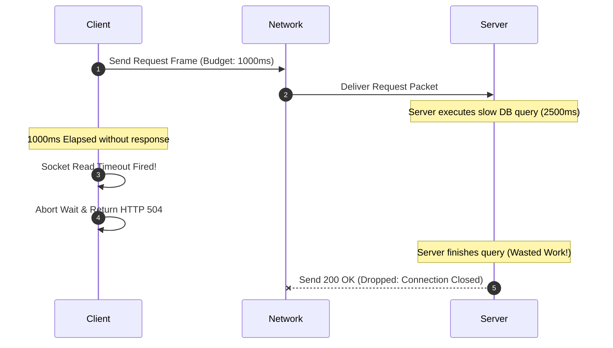

# Day 22 — Timeouts: The Bounded Waiting Principle

At 09:14 AM during a Monday morning peak, a payment API gateway at a major fintech platform stopped accepting new traffic. 

Inside the infrastructure, no servers had crashed. CPU utilization sat under 15%, memory usage was nominal, and disk I/O was pristine. Yet, 100% of user checkout attempts were failing with gateway HTTP 504 errors.

Post-mortem telemetry revealed a subtle failure mode. A secondary fraud-verification service had experienced a database lock, causing its API response time to stretch from 40ms to 45 seconds. 

The payment API gateway—which called the fraud service synchronously—had no configured waiting limit. For every checkout request, worker threads opened a socket connection to the fraud service and waited. Within three minutes, all 2,000 application worker threads were stuck in a blocking read state. TCP connection pools were drained. Incoming user requests queued up at the load balancer until request buffers overflowed and crashed the gateway.

A single slow dependency, combined with unbounded waiting, had brought down the entire payment architecture.

This brings us to a fundamental realization in systems engineering:

> **Unbounded waiting transforms a localized downstream delay into a global catastrophic failure.**

---

## The Problem

Consider a standard multi-tier microservice call graph:

```text
  +------------+             +---------------+             +------------------+
  |   Client   |  ─────────► |   Service A   |  ─────────► |    Service B     |
  | (Frontend) |             | (API Gateway) |             | (Fraud Verifier) |
  +------------+             +---------------+             +------------------+
```

Under healthy operating conditions:
1. The client sends a request to **Service A**.
2. Service A executes an outbound HTTP call to **Service B**.
3. Service B processes the payload in 20ms and returns `200 OK`.
4. Service A responds to the client in 50ms.

Now suppose **Service B** encounters a performance degradation. Perhaps a background database migration has locked a row, or a garbage collection pause has frozen its process threads. Service B does not throw an error; it simply stops sending data packets back over the wire.

What happens to **Service A** if it keeps waiting?

### The Hidden Cost of Waiting

Waiting across a network is not a passive, cost-free activity. Holding an open network call consumes critical OS and application resources:

1. **Worker Threads**: In thread-per-request architectures (such as Java Tomcat, Python Gunicorn, or Ruby Passenger), a thread waiting for a socket read cannot process any other work. 500 slow requests stall 500 worker threads.
2. **TCP Connection Pools**: HTTP clients maintain pools of open TCP connections to downstream hosts. If Service B stalls, Service A's connection pool fills up, forcing subsequent requests to queue locally.
3. **Memory Allocation**: Every waiting request holds its HTTP payload, headers, stack frames, and buffer memory in RAM. As thousands of requests stall, heap memory pressure surges.
4. **Request Queues**: Incoming user traffic continues to arrive at Service A. When worker threads are exhausted, new requests pile up in OS socket listen queues. Once queues fill, the operating system drops incoming TCP SYN packets.
5. **User-Facing Latency**: End users experience frozen spinners and endless loading screens, eventual gateway timeouts, or double-click checkout submissions.
6. **Cascading Failure**: Once Service A's threads are exhausted, upstream services that depend on Service A fail as well.

Service A cannot wait forever. It requires an operational boundary.

---

## Why This Happens

Why can't a distributed system immediately detect why a remote service has stopped responding?

In a single monolithic binary executing on one machine, a function call is deterministic. Either the function completes and returns a value, or the OS hardware raises a memory violation or exception.

Across a network, communication is **non-deterministic**. When Service A sends a request packet to Service B and receives no answer for 5 seconds, Service A cannot deduce what happened.

```text
  Service A                                         Service B
      │                                                 │
      │ ─── 1. POST /verify-fraud (Request Packet) ───► │ (Packet Lost in Router?)
      │                                                 │ (Server Processing Slowly?)
      │                                                 │ (Database Lock Pending?)
      │ X ◄── 2. Response Stalled / Dropped ───────────│ (ACK Lost on Return?)
      │                                                 │
   (5 seconds pass... Silence)
```

The absence of a response could be caused by any of the following distinct root causes:

1. **Target Server Crashed**: Service B suffered a panic or power loss after receiving the packet.
2. **Target Server Overloaded**: Service B received the request, but its internal task queue is 10,000 items deep.
3. **Network Packet Loss**: The request TCP packet was dropped by an intermediate switch.
4. **Network Path Failure**: A BGP routing change severed the network path between Service A and Service B.
5. **Slow Downstream Dependency**: Service B is waiting on its own database, which is stalled.
6. **Return Response Dropped**: Service B processed the request successfully, but the returning ACK packet was lost.
7. **Connection Handshake Stalled**: The TCP or TLS handshake established a connection, but no HTTP data frame arrived.

### The Key Insight

> **Silence is ambiguous.**
>
> A network socket cannot distinguish between a server that is working hard, a server that has crashed, a network router that dropped a packet, or a response that was lost on the return path.

Because distributed systems cannot know *why* a dependency is silent, they must decide *how long* they are willing to wait without knowing.

---

## The Wrong Solution

When engineers first attempt to solve network unresponsiveness, they often implement intuitive policies that degrade system reliability.

```text
                       NAIVE TIMEOUT ANTI-PATTERNS
  
  ┌──────────────────┐    ┌──────────────────┐    ┌──────────────────┐
  │   Wait Forever   │    │   Huge Timeout   │    │   Tiny Timeout   │
  │                  │    │                  │    │                  │
  │ Thread Pools     │    │ Latency Surges;  │    │ Rejects Healthy  │
  │ Exhausted        │    │ Resources Held   │    │ Burst Latency    │
  └──────────────────┘    └──────────────────┘    └──────────────────┘
```

### 1. Wait Forever
Relying on default operating system TCP keep-alive settings (which can take up to 2 hours to detect a dead socket) leads directly to thread pool exhaustion, memory leaks, and total microservice blackout.

### 2. Use One Huge Timeout (e.g., 60 Seconds)
Setting a massive static timeout (e.g., 60 seconds "just to be safe") protects against eventual socket leaks, but keeps application worker threads and connection pools occupied for a full minute during downstream outages. Under 100 requests/sec, a 60-second timeout accumulates 6,000 blocked threads within one minute.

### 3. Use One Tiny Timeout Everywhere (e.g., 50 Milliseconds)
Setting an overly aggressive global timeout across all endpoints terminates healthy requests whenever garbage collection pauses or minor network jitter occurs. This degrades system availability and inflates false error rates.

### 4. Retry Immediately After Every Timeout
This is the most dangerous anti-pattern. Connecting back to [Day 21 — Retries](file:///d:/30_Days_of_Distributed_Systems/days/Day-21-Retries/README.md), issuing an immediate retry when a request times out creates a catastrophic **Failure Amplification Loop**:

```text
                       TIMEOUT + RETRY AMPLIFICATION LOOP

     +-------------------+         1. Backend Database Latency Surges
     | Backend Latency   |
     |   Degradation     | ───┐
     +-------------------+    │
                              ▼
                     +------------------+
                     | Client Request   |
                     |     Times Out    |
                     +------------------+
                              │
                              │ 2. Immediate Automated Retry
                              ▼
                     +------------------+
                     | Inbound Traffic  | ◄───┐ 
                     |   Surges (2x-4x) |     │ 4. Amplified Load
                     +------------------+     │    Slowing Backend
                              │               │    Further
                              │ 3. Connection & Queue Saturation
                              ▼               │
                     +------------------+     │
                     | Target Service   | ────┘
                     | Fully Overloaded |
                     +------------------+
```

When a client times out after 1,000ms, the downstream server may still be actively processing the original request in its queue. If the client sends a second attempt, the server is now forced to process **two concurrent requests** for the exact same client interaction.

This doubles downstream CPU and memory pressure, pushing processing times even higher, triggering more timeouts, and initiating a self-reinforcing retry storm.

---

## The Right Mental Model

To design resilient distributed systems, we must establish precise terminology around bounded waiting:

```text
┌─────────────────────────────────────────────────────────────────────────────┐
│                           THE FOUR BOUNDARY PRIMITIVES                      │
├─────────────────────────────────────────────────────────────────────────────┤
│ 1. TIMEOUT    : "How long am I willing to wait for this specific operation?"│
│ 2. DEADLINE   : "At what exact absolute time must this request finish?"    │
│ 3. CANCELLATION: "Stop working on this, because nobody cares about the result."│
│ 4. TIME BUDGET: "How much total time remains for the entire request chain?" │
└─────────────────────────────────────────────────────────────────────────────┘
```

### The Airport Traveler Analogy

Imagine a traveler catching a flight at 3:00 PM:

* **Deadline**: 3:00 PM (an absolute point in time).
* **Time Budget**: At 1:00 PM, the traveler has a total budget of 2 hours.
* **Timeout**: The traveler allocates a maximum of 20 minutes to wait for a taxi. If no taxi arrives in 20 minutes, they stop waiting and try an alternative.
* **Cancellation**: If the flight is canceled at 2:00 PM, the traveler cancels their taxi reservation because the end goal is no longer achievable.

### Why Deadlines Beat Independent Timeouts

In a multi-tier microservice architecture, configuring static timeouts independently on each microservice hop is brittle.

If Service A has a 5-second timeout, Service B has a 5-second timeout, and Service C has a 5-second timeout, a single end-to-end user request could potentially wait **15 seconds** before returning an error to the user—even if the original user HTTP request header specified a maximum client timeout of 3 seconds!

An **End-to-End Deadline** establishes an absolute timestamp when the entire end-to-end operation becomes invalid. Every downstream service inherits the remaining **Time Budget** rather than a static configuration.

---

## How It Actually Works

Implementing bounded waiting in production requires configuring timeouts across distinct networking layers and propagating deadlines across service boundaries.

### 1. The Socket Timeout Hierarchy

Network clients must differentiate between distinct phases of a network connection:

```text
  Client                                                     Server
    │                                                          │
    ├── TCP SYN ──────────────────────────────────────────────►│ ──┐
    │◄── TCP SYN-ACK ──────────────────────────────────────────│   ├── CONNECTION TIMEOUT
    ├── TCP ACK ──────────────────────────────────────────────►│ ──┘
    │                                                          │
    ├── HTTP POST /checkout (Request Write) ──────────────────►│ ──┐
    │                                                          │   ├── WRITE TIMEOUT
    │                [Server Processing Phase]                 │
    │                                                          │ ──┐
    │◄── HTTP 200 OK (Response Header / Read) ─────────────────│   ├── READ / RESPONSE TIMEOUT
    │◄── Payload Body Frames ──────────────────────────────────│ ──┘
```

* **Connection Timeout**: The maximum time allowed to establish a TCP 3-way handshake (and TLS handshake) with the remote server. Typically kept short (e.g., 200ms to 500ms).
* **Write Timeout**: The maximum time allowed to push request payload bytes onto the network socket buffer.
* **Read (Socket) Timeout**: The maximum time allowed between receiving consecutive data packets from the remote server once a connection is established.
* **Overall Request Timeout**: The total duration from request creation to receiving the complete response body.

### 2. Deadline Propagation Across Call Chains

Consider an API request traveling down a 4-tier system:

```text
Client (Total Budget: 2,000ms)
  │
  │  Headers: X-Deadline-Remaining: 2000ms
  ▼
Service A (API Gateway)
  │  [Spends 300ms in local authentication & routing]
  │
  │  Headers: X-Deadline-Remaining: 1700ms
  ▼
Service B (Order Service)
  │  [Spends 800ms executing business logic]
  │
  │  Headers: X-Deadline-Remaining: 900ms
  ▼
Database (Storage Engine)
     [Executes SQL Query]
```

1. **Initial Budget Allocation**: The Client initiates an API call with a 2,000ms total deadline budget.
2. **Hop 1 (Gateway)**: Service A receives the request, parses the deadline header, and subtracts its local processing time ($2000\text{ms} - 300\text{ms} = 1700\text{ms}$).
3. **Hop 2 (Service B)**: Service A passes `X-Deadline-Remaining: 1700ms` downstream to Service B. Service B processes logic for 800ms ($1700\text{ms} - 800\text{ms} = 900\text{ms}$).
4. **Hop 3 (Database)**: Service B issues a SQL query to the database, passing a query timeout of **900ms**.
5. **Early Abort**: If the database query exceeds 900ms, the database driver cancels the query. The database does **not** attempt to run a 5-second query when the client upstream has already given up!

### 3. Server-Side Context Cancellation

A client-side timeout halts the client's waiting, but does **not** automatically stop the server from executing work. 

Without explicit server-side cancellation hooks (such as Go's `context.Context` or gRPC stream cancellation), the downstream server will continue running expensive database queries, cryptographic hashes, or third-party calls for a request whose response will be immediately discarded upon delivery.

```text
  Client                             Service A                         Service B
    │                                    │                                 │
    │ ── 1. POST /order ────────────────►│                                 │
    │                                    │ ── 2. RPC Process Order ───────►│ (Starts Heavy DB Query)
    │                                    │                                 │
    │ ── 3. Client Timeout (2.0s) ──────►│                                 │
    │    (Client drops connection)       │ ── 4. Cancel Context Signal ───►│ (Aborts DB Query immediately!)
```

### 4. Workload-Driven Timeout Tuning ($p_{95} / p_{99}$)

Timeout boundaries should never be chosen arbitrarily (e.g., picking 5 seconds because it "feels safe"). They must be derived mathematically from empirical latency percentiles:

$$\text{Timeout Boundary} = \text{Target Percentile Latency } (p_{99}) + \text{Safety Buffer } (\Delta t)$$

If a service has a $p_{99}$ latency of 120ms under normal operation and a maximum acceptable Service Level Objective (SLO) of 500ms, setting a timeout between 300ms and 500ms ensures that 99% of healthy requests succeed while catching tail latency anomalies quickly.

---

## Visual Explanation

### 1. Basic Timeout Lifecycle

```text
Client                     Network Path                   Server
  │                             │                            │
  ├─── 1. HTTP Request ────────►│                            │
  │                             ├─── 2. Packet In Flight ───►│ (Server Stalls / Locked)
  │                             │                            │
  │ ⏱️ Timer T = 0ms             │                            │
  │                             │                            │
  │ ⏱️ Timer T = 1000ms          │                            │
  ├─── 3. TIMEOUT EXPIRED! ─────┤                            │
  │    (Halts Socket Read)      │                            │
  │    (Frees Thread/Worker)    │                            │
  ▼                             ▼                            ▼
```



### 2. Timeout Across Microservice Dependencies

```text
                               MULTI-TIER LATENCY ACCUMULATION
  
Client ──(Budget: 2.0s)──► Service A ──(Budget: 1.5s)──► Service B ──(Budget: 1.0s)──► Database
                              │                                │                           │
                              ├─ Local Work: 0.5s              ├─ Local Work: 0.5s         └─ Slow Lock: 3.0s
                              │                                │                              (TIMED OUT!)
                              └─ Time Left: 1.5s               └─ Time Left: 1.0s
```

### 3. Deadline Propagation Budget Decay

```text
  1000ms Total Budget
    │
    ├── Service A Processing : 200ms consumed ──► [Remaining Budget: 800ms]
    │
    ├── Service B Processing : 350ms consumed ──► [Remaining Budget: 450ms]
    │
    └── Database Query       : Maximum execution window capped at 450ms!
```



```mermaid
gantt
    title End-to-End Time Budget Decay (Total: 1000ms)
    dateFormat  SS
    axisFormat %S.%L s
    section Service A
    Local Gateway Routing  :a1, 00, 200ms
    section Service B
    Order Validation       :a2, after a1, 350ms
    section Database
    Capped SQL Execution   :a3, after a2, 450ms
```

### 4. Timeout + Retry Failure Loop

```text
  Slow Backend Target (Latency > Timeout)
            │
            ▼
   Client Socket Timeout Fired
            │
            ▼
  Immediate Retry Attempt Issued
            │
            ▼
  2x - 4x Inbound Traffic Surge on Target
            │
            ▼
   Target Latency Escalates (10s+)
            │
            ▼
  Cascading Failure across All Clients
```

---

## Assets

Visual asset specifications for graphic diagrams are maintained in `assets/`:

- [assets/timeout-lifecycle.png](file:///d:/30_Days_of_Distributed_Systems/days/Day-22-Timeouts/assets/README.md#1-timeout-lifecyclepng): Visualizing the transition from an open socket request to a timed-out client state, demonstrating how time elapsed reaches a boundary while remote server state remains ambiguous.
- [assets/deadline-propagation.png](file:///d:/30_Days_of_Distributed_Systems/days/Day-22-Timeouts/assets/README.md#2-deadline-propagationpng): Visualizing end-to-end deadline budget decay as a user request travels through a multi-tier microservice architecture.
- [assets/timeout-retry-loop.png](file:///d:/30_Days_of_Distributed_Systems/days/Day-22-Timeouts/assets/README.md#3-timeout-retry-loop-png): Visualizing the destructive feedback loop when client timeouts trigger unthrottled immediate retries against an overloaded backend.

---

## Real World Example

### Google gRPC & Envoy Proxy: Distributed Deadline Propagation

In large-scale cloud infrastructure such as Google's internal microservice ecosystem (Stubby/gRPC) and modern service meshes using Envoy Proxy, bounded waiting is strictly enforced using **Context Deadlines**.

```text
                               GRPC DEADLINE HEADER PROPAGATION
  
  Client (gRPC)                      Envoy Edge Proxy                    Backend Microservice
  Context(Deadline=2.0s)             Header: grpc-timeout: 2000m         Context(Deadline=Remaining)
        │                                  │                                   │
        ├── 1. RPC Call ──────────────────►│                                   │
        │                                  ├── 2. Forward with updated ────────►│
        │                                  │      grpc-timeout: 1850m          │
        │                                  │                                   ├── 3. Spawns Worker
        │                                  │                                   │    Checks ctx.Done()
```

#### Engineering Architecture
1. **The `grpc-timeout` Header**: When a gRPC client invokes a remote procedure, the gRPC library automatically serializes the remaining time budget into a standardized HTTP/2 header (e.g., `grpc-timeout: 1500m` representing 1,500 milliseconds).
2. **Envoy Proxy Deadline Rewriting**: As the request passes through service mesh proxies (Envoy), each proxy measures the elapsed transit and processing time, updates the `grpc-timeout` header, and passes the reduced time budget to the next downstream node.
3. **HTTP/2 Stream Cancellation (`RST_STREAM`)**: If a client's deadline expires before receiving a response, the gRPC client transport immediately transmits an HTTP/2 `RST_STREAM` frame with error code `CANCELLED`.
4. **Server Cancellation Signals**: Upon receiving the `RST_STREAM` frame or observing local deadline expiration, the backend server's gRPC runtime fires a cancellation signal on the thread context (`ctx.Done()` in Go or `CancellationListener` in Java). Active database queries and background goroutines halt execution immediately, freeing CPU and thread resources.

This architecture prevents wasted work across millions of daily RPC calls across Google and cloud enterprise networks.

---

## Build It Yourself

Below is an educational Python implementation demonstrating:
1. A slow backend service.
2. Socket read timeouts.
3. Deadline context propagation with budget decay.
4. Deadline-bounded retries.

The complete executable code is located in [`code/timeout_demo.py`](file:///d:/30_Days_of_Distributed_Systems/days/Day-22-Timeouts/code/timeout_demo.py).

```python
import time
import socket
from urllib.request import urlopen, Request
from urllib.error import URLError
from dataclasses import dataclass

@dataclass
class TimeBudget:
    """Represents an end-to-end request deadline budget."""
    deadline_timestamp: float  # Unix timestamp when work MUST finish

    @classmethod
    def start_new(cls, budget_seconds: float) -> "TimeBudget":
        return cls(deadline_timestamp=time.time() + budget_seconds)

    def remaining_seconds(self) -> float:
        """Returns seconds remaining in budget, capped at 0.0."""
        return max(0.0, self.deadline_timestamp - time.time())

class ServiceAClient:
    def __init__(self, service_b_url: str):
        self.service_b_url = service_b_url

    def call_service_b(self, endpoint: str, budget: TimeBudget) -> dict:
        # Step 1: Check if budget is ALREADY exhausted before network I/O
        remaining = budget.remaining_seconds()
        if remaining <= 0.001:
            print("  [Service A] Budget exhausted BEFORE network call! Aborting.")
            return {"error": "DeadlineExceeded"}

        print(f"  [Service A] Calling Service B (Budget Left: {remaining:.3f}s)...")

        # Step 2: Use remaining_time as the socket read/request timeout
        start_t = time.time()
        try:
            url = f"{self.service_b_url}{endpoint}"
            req = Request(url)
            with urlopen(req, timeout=remaining) as response:
                elapsed = time.time() - start_t
                return {"status": "ok", "elapsed": elapsed, "body": response.read().decode()}
        except URLError as e:
            elapsed = time.time() - start_t
            if isinstance(e.reason, socket.timeout):
                print(f"  [Service A] TIMEOUT! Socket read timed out after {elapsed:.3f}s")
                return {"error": "Timeout", "elapsed": elapsed}
            return {"error": "NetworkError", "detail": str(e.reason)}
        except TimeoutError:
            elapsed = time.time() - start_t
            print(f"  [Service A] TIMEOUT! Read timed out after {elapsed:.3f}s")
            return {"error": "Timeout", "elapsed": elapsed}
```

To execute the interactive demo scenarios, run:

```bash
python days/Day-22-Timeouts/code/timeout_demo.py
```

---

## Common Misconceptions

| Misconception | Engineering Reality |
| :--- | :--- |
| **1. "A timeout means the remote server failed."** | False. A timeout only means the client's patience expired. The remote server may have succeeded, but the response packet was delayed or dropped. |
| **2. "A timeout means the network cable is broken."** | False. Timeouts are frequently caused by downstream thread pool saturation, database row locks, or long garbage collection pauses. |
| **3. "Longer timeouts are safer."** | False. Generous timeouts keep worker threads and connection pools occupied for longer during outages, accelerating cascading failure. |
| **4. "Shorter timeouts are always better."** | False. Overly aggressive timeouts terminate healthy requests during minor latency spikes, causing unnecessary availability drops. |
| **5. "Every timeout should trigger a retry."** | False. Retrying timed-out requests against an overloaded server amplifies load and creates destructive retry storms. |
| **6. "A client timeout cancels server-side work."** | False. Client timeouts only stop client-side waiting. Unless server-side context cancellation is implemented, the server continues processing wasted work. |
| **7. "One global timeout value should be used."** | False. Timeouts must be tailored to specific endpoint SLAs, work complexity, and network topologies. |
| **8. "Timeout and deadline mean the same thing."** | False. A timeout is a relative duration ($1000\text{ms}$). A deadline is an absolute timestamp ($15:04:05.000\text{ UTC}$). |
| **9. "Increasing timeouts fixes high latency."** | False. Increasing timeouts merely masks latency issues while causing queue accumulation and memory degradation upstream. |

---

## Production Trade-offs

```text
┌─────────────────────────────────────────────────────────────────────────────┐
│                       ADVANTAGES vs. DISADVANTAGES                          │
├──────────────────────────────────────────────────┬──────────────────────────┤
│ ADVANTAGES                                       │ DISADVANTAGES            │
├──────────────────────────────────────────────────┼──────────────────────────┤
│ • Prevents indefinite thread & pool locking      │ • False timeouts on      │
│ • Limits tail latency impact on end users        │   transient spikes       │
│ • Isolates failure to degraded components        │ • Increases config       │
│ • Forces explicit fallback paths in application  │   management complexity  │
│ • Provides backpressure bounds across services   │ • Risk of wasted server  │
│                                                  │   processing without ctx │
└──────────────────────────────────────────────────┴──────────────────────────┘
```

---

## Failure Cases

### 1. The Slow Dependency Trap
When a low-level service (e.g., an internal billing lookup) slows down from 20ms to 5,000ms, every caller upstream that lacks a timeout accumulates blocked threads until the entire API edge crashes.

### 2. Cascading Thread Exhaustion
In synchronous microservice architectures without timeouts, latency in a deep leaf node propagates upstream hop by hop, exhausting thread pools in every parent service until the front-end gateway dies.

### 3. Retry Storm Amplification
When clients combine static timeouts with unthrottled retries, timing out requests re-issue traffic against struggling backends, multiplying total inbound query volume ($2\times - 4\times$) during peak outages.

### 4. Connection Pool Starvation
If an HTTP client configures a connection timeout but omits a read timeout, connections establish successfully but block indefinitely on data reads, exhausting client connection pools.

### 5. Queue Buildup & Buffer Bloat
When downstream dependencies stall, upstream services queue pending requests in memory. Once memory limits are exceeded, process nodes trigger Out-Of-Memory (OOM) kills.

---

## Performance Implications

Holding open network calls consumes hardware capacity proportional to incoming request rate ($R$) and waiting duration ($T$):

$$\text{Active Blocked Threads} = R \times T$$

If an API handles $R = 500 \text{ requests/sec}$ and waiting duration surges from $T = 0.1\text{s}$ to $T = 10\text{s}$, active blocked worker threads increase from **50 threads** to **5,000 threads**.

```text
  500 req/sec @ 0.1s Wait  ==►   50 Worker Threads Occupied  (Healthy)
  500 req/sec @ 10.0s Wait ==► 5000 Worker Threads Occupied  (System Crash!)
```

Bounding $T$ via strict timeouts caps maximum thread pool and memory consumption during outages.

---

## Scaling Implications

As distributed microservice graphs grow deeper, latency variance compounds exponentially:

$$\text{Probability of Success} = \prod_{i=1}^{N} P(\text{Service } i \text{ responds within } T)$$

In a call graph with $N = 10$ serial microservices, if each service has a 99% probability ($P=0.99$) of responding under 200ms, the end-to-end success probability drops to:

$$0.99^{10} \approx 90.4\%$$

10% of end-to-end requests will experience tail latency or timeouts. Without strict deadline propagation, complex microservice trees suffer severe tail latency degradation.

---

## Operational Considerations

### 1. Key Metrics & Telemetry
To monitor timeout health, track the following metrics in Prometheus / Datadog:
* `http_client_timeouts_total{dependency="service_b"}`: Counter of socket timeouts per downstream target.
* `rpc_deadline_exceeded_total`: Counter of requests aborted due to expired deadlines.
* `dependency_latency_seconds{quantile="0.99"}`: $p_{99}$ latency of downstream calls.

### 2. Alerting Rules
* **Alert on Timeout Rate Spikes**: Alert if socket timeouts exceed 1% of total outgoing requests over a 5-minute window.
* **Alert on Budget Exhaustion**: Alert if downstream services drop requests due to expired deadline headers.

### 3. Logging & Tracing Context
Always log timeout events with distributed tracing context (`trace_id`, `span_id`, `remaining_budget_ms`, `target_service`).

---

## Key Takeaways

1. **A timeout is a boundary on waiting**: It defines how long a system is willing to spend resources waiting for another component.
2. **Silence is ambiguous**: A timeout does not prove a server crashed; it only means the response did not arrive in time.
3. **Unbounded waiting causes cascading failure**: Waiting holds threads, sockets, memory, and connection pools, causing total system collapse.
4. **Prefer Deadlines over static timeouts**: Deadlines establish an absolute completion time across multi-tier service calls.
5. **Propagate time budgets downstream**: Subtract local processing time at each hop so downstream services do not execute expired work.
6. **Cancel server-side work**: Client timeouts must trigger server-side context cancellation (`ctx.Done()`) to avoid wasted CPU cycles.
7. **Tune timeouts using percentiles**: Base timeout values on empirical $p_{95}/p_{99}$ latency metrics plus a safety buffer.
8. **Bound retries by remaining budget**: Never retry a timed-out request if the remaining request time budget is exhausted.
9. **Separate socket timeouts**: Configure distinct connection, write, and read timeouts on all HTTP/RPC clients.
10. **A timeout tells you how long you are willing to wait without knowing what happened.**

---

## Interview Questions

### Q1: Why are timeouts necessary in distributed systems?
**Answer**: Network communication is non-deterministic. A client cannot distinguish between a slow server, a crashed server, or a dropped packet. Without timeouts, application worker threads and socket connection pools remain blocked indefinitely, leading to resource exhaustion, queue buildup, and cascading outages across the entire architecture.

### Q2: What is the technical difference between a timeout and a deadline?
**Answer**: A **timeout** is a relative time duration (e.g., "wait 2,000 milliseconds for a response"). A **deadline** is an absolute point in time (e.g., "this request must complete by 15:04:05.500 UTC"). Deadlines are passed downstream in call chains so every microservice knows the exact absolute time when work becomes useless.

### Q3: How does deadline propagation prevent wasted server work?
**Answer**: When Service A calls Service B, it includes its remaining time budget in the request headers (e.g., `grpc-timeout` or `X-Deadline-Remaining`). Service B inspects the budget before processing and passes the remaining decayed budget to its database. If the budget expires at any point, downstream execution is aborted early, preventing CPU and memory waste on requests the client has already abandoned.

### Q4: Why can increasing a timeout value make a system less reliable?
**Answer**: Increasing a timeout keeps worker threads, RAM, and TCP connection handles locked for longer durations during downstream outages. Under steady inbound load, longer timeouts cause thread pools to saturate faster, converting localized dependency delays into global gateway crashes.

### Q5: What happens when client retries interact with timeouts?
**Answer**: If a client times out after 1.0s and immediately issues a retry while the backend server is still processing the original request, inbound traffic to the backend doubles or triples. This creates a **Failure Amplification Loop** (retry storm), escalating backend latency and expanding the outage. Retries must always be bounded by the remaining time budget and governed by circuit breakers and backoff.

### Q6: Does a client-side socket timeout stop execution on the remote server?
**Answer**: No. A client socket timeout only stops the client from waiting and frees the client thread. The remote server remains unaware of the client's timeout unless explicit server cancellation mechanisms (such as HTTP/2 `RST_STREAM` frames, Go `context.Context` cancellation signals, or gRPC cancellation handlers) are supported and processed by the server application.

### Q7: How should an engineer select a timeout value for a database query?
**Answer**: Examine empirical query latency distributions ($p_{95}$ and $p_{99}$) under peak load. Set the database query timeout slightly above the $p_{99}$ latency (e.g., $p_{99} + \text{safety buffer}$) while staying strictly within the calling service's remaining time budget. Never use arbitrary numbers without looking at telemetry.

### Q8: How would you debug a sudden surge in HTTP 504 Gateway Timeouts?
**Answer**: First, check distributed traces (`trace_id`) to identify which specific downstream microservice or database is experiencing elevated $p_{99}$ latency. Second, inspect thread pool and connection pool saturation metrics across calling services. Third, verify whether downstream services are receiving deadline headers or if client retry loops are amplifying load.

---

## Further Reading

For primary research papers, authoritative books, engineering blogs, and conference talks on timeouts and deadline propagation, refer to:

👉 [**references.md**](file:///d:/30_Days_of_Distributed_Systems/days/Day-22-Timeouts/references.md)

---

## What You'll Build Intuition for Tomorrow

Tomorrow, in **Day 23**, we tackle what happens when a dependency is degraded so severely that waiting—even for a short timeout—begins to destroy your system.

Imagine a system that notices a dependency is failing, **stops calling it entirely**, and allows it to recover in complete isolation before safely probing it again.

You'll discover how systems build automated self-defense shields to trip open under pressure and self-heal when stability returns.
