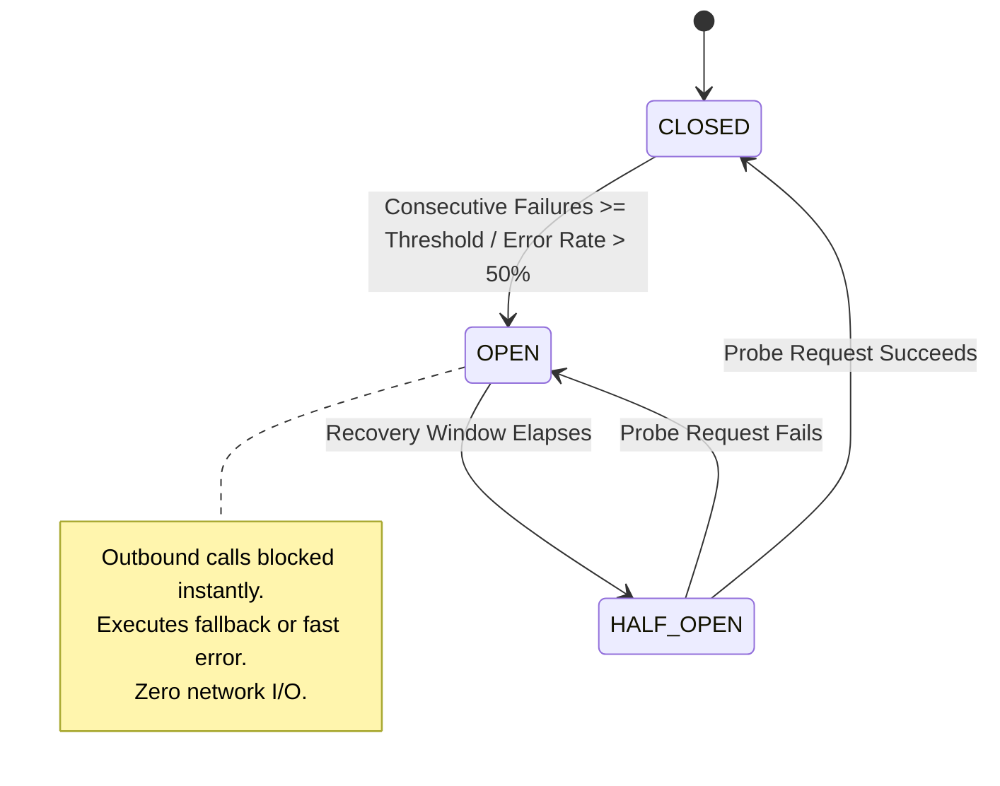

# Day 23 — Circuit Breakers: Failure Containment & Cascading Isolation

At 02:14 PM on a high-concurrency trading day, an order management API began rejecting 100% of incoming user requests with `HTTP 503 Service Unavailable`.

Engineers rushing to inspect the dashboard found a puzzling telemetry graph. The core order management service was entirely healthy: its CPU utilization was under 12%, memory pressure was normal, and its local databases had zero lock contention. Yet, every incoming request failed within milliseconds.

Upstream tracing revealed the root cause. A non-critical recommendation engine—responsible for generating "Recommended Items" at the bottom of the checkout page—had suffered an internal database deadlock. Its API response time surged from 15ms to 40 seconds. 

The order management service had continued calling the recommendation engine for every checkout request. Within minutes, hundreds of worker threads in the order service became stuck waiting for socket reads. Connection pools were completely drained, request queues overflowed, and the entire checkout pipeline collapsed. A non-critical feature had brought down the entire primary revenue pipeline.

The order service didn't crash because the recommendation engine failed. It crashed because it **kept trying to talk to it while it was failing**.

---

## The Problem

Consider a standard multi-tier distributed architecture:

```text
  +------------+             +---------------+             +---------------+             +------------+
  |   Client   |  ─────────► |   Service A   |  ─────────► |   Service B   |  ─────────► |  Database  |
  | (Frontend) |             | (API Gateway) |             | (Recommendation|            | (SQL Store)|
  +------------+             +---------------+             +---------------+             +------------+
```

Under healthy operating conditions:
1. The client sends a request to **Service A**.
2. Service A sends a synchronous HTTP call to **Service B**.
3. Service B queries the **Database**, formats the response, and returns within 20ms.
4. Service A responds to the client in 50ms.

Now suppose **Service B** or its underlying **Database** becomes slow or completely unavailable. Service B does not immediately throw a connection reset error; it simply stalls, taking 30 to 60 seconds per request or timing out completely.

What happens to **Service A** when it continues sending requests?

```text
  Client Traffic (1,000 req/sec)
        │
        ▼
   +─────────+
   |Service A| ── (Stuck Threads: 500/500) ──► Queues Overflow ──► Gateway Collapses!
   +─────────+
        │ (Unbounded Outbound Requests)
        ▼
   +─────────+
   |Service B| ── (Stalled / Latency: 45s)
   +─────────+
```

1. **Service A Continues Sending Requests**: Service A assumes Service B is temporarily busy and keeps issuing synchronous HTTP calls for every incoming client request.
2. **Requests Begin Timing Out**: Outbound calls to Service B wait until Service A's configured read timeout (e.g., 5 seconds) expires.
3. **Threads and Connections Remain Occupied**: While waiting, Service A's worker threads and TCP socket connections remain locked. A worker thread holding an open socket cannot process any other work.
4. **Queues Grow**: Incoming user traffic keeps arriving at Service A. As active worker threads saturate, new requests pile up in Service A's OS socket listen queues.
5. **Latency Increases**: End-to-end response times surge from 50ms to over 5,000ms for all user requests, including requests that do not even require Service B.
6. **More Requests Arrive**: Impatient users refresh their browsers or client apps automatically retry, multiplying the incoming traffic volume.
7. **Service A Fails Completely**: Service A exhausts its heap memory, thread pool, and file descriptors. Service A collapses and begins returning `503 Service Unavailable` or timing out to its own upstream clients.

### What is a Cascading Failure?

A **cascading failure** occurs when a failure in a single downstream component propagates upstream, progressively knocking out healthy services across the system. 

In this scenario, Service A was entirely healthy. However, because Service A lacked a mechanism to stop sending traffic to a failing dependency, the downstream failure cascaded upstream and destroyed Service A as well.

---

## Why This Happens

Why do distributed systems suffer from cascading failures when single-process monolithic applications do not?

In a single-process application running on a single CPU, a function call is deterministic. If function `B()` raises an exception or takes too long, the executing thread unwinds immediately, and the OS manages memory within a single address space.

Across a network, communication is **non-deterministic** and resource-bound:

```text
                                DISTRIBUTED RESOURCE EXHAUSTION
  
  +-----------------------------------------------------------------------------------+
  | Network Latency      Packet delays force threads to wait across physical distance.|
  | Timeouts             Waiting 5s for 1,000 requests consumes 5,000 thread-seconds. |
  | Connection Pools     Fixed TCP socket pools drain rapidly during dependency stalls|
  | Thread Exhaustion    Worker threads block on socket I/O, saturating thread pools. |
  | Queue Growth         Listen queues fill up; OS drops TCP SYN frames.              |
  | Retry Amplification  Clients retry timed-out calls, multiplying inbound traffic.  |
  | Resource Contention  RAM and CPU shift from processing work to managing queues.   |
  +-----------------------------------------------------------------------------------+
```

### The Key Distinction

Engineers must make a fundamental distinction when building distributed architecture:

> **A dependency being unhealthy is one problem.**
> 
> **Continuing to depend on an unhealthy dependency is another.**

You cannot always prevent a remote database or third-party API from failing. But you *can* control whether your service continues hammering that failing dependency and destroying itself in the process.

### Real-World Analogy: The Electrical Circuit Breaker

Think of an electrical circuit breaker in your home. 

When a toaster short-circuits, it draws massive, unsafe levels of electric current. If the wire allowed current to flow continuously, the overheating wire would melt the insulation, ignite the drywall, and burn down the entire house.

An electrical circuit breaker senses the excessive current draw and **trips OPEN**, physically severing the connection. The toaster remains broken, but the house does not burn down. The breaker isolates the localized fault to protect the broader infrastructure.

---

## The Wrong Solution

When engineers first encounter dependency failures, they often implement intuitive fixes that actually amplify the severity of the outage.

```text
                           NAIVE ANTI-PATTERNS
  
  "Just keep retrying."    ──► Amplifies traffic against an already drowning backend.
  "Increase the timeout."  ──► Holds worker threads blocked for even longer periods.
  "Add more threads."      ──► Surges memory usage and context-switching overhead.
  "Wait for dependency."   ──► Ensures total upstream collapse during prolonged outages.
```

### 1. "Just Keep Retrying"
If Service B is failing because its CPU is at 100%, sending 3 retries per failed request quadruples the inbound load on Service B ($1 \text{ initial} + 3 \text{ retries} = 4 \text{ requests}$). Retrying against a drowning dependency turns a minor slowdown into a total catastrophic collapse.

### 2. "Just Increase the Timeout"
Increasing the client timeout from 2 seconds to 30 seconds allows requests "more time to complete." In reality, it forces Service A's worker threads to remain blocked 15 times longer. Thread pools exhaust 15 times faster, accelerating upstream collapse.

### 3. "Just Add More Threads"
Increasing thread pool capacity from 200 to 2,000 threads consumes massive amounts of RAM (stack memory per thread) and increases CPU context-switching overhead. Eventually, the expanded thread pool fills up anyway, consuming more system resources before failing.

### 4. "Just Wait for the Dependency"
Assuming the downstream service will recover "any second" guarantees that Service A will remain unavailable for the entire duration of Service B's outage.

> **Note**: Retries and timeouts are not inherently bad; they are essential building blocks. However, without carefully designed limits, boundaries, and cutoffs, they act as load amplifiers during outages.

---

## The Right Mental Model

A **Circuit Breaker** is a failure containment mechanism placed between a service caller and a remote dependency.

Instead of allowing outbound calls to proceed blindly, the circuit breaker monitors the success and failure rates of calls passing through it. When failures cross a configured threshold, the circuit breaker **trips OPEN**, intercepting subsequent requests and returning fast failures or fallback responses immediately—without touching the network.

### The 3-State Model

The circuit breaker operates as a finite state machine with three distinct states:

```text
                  failures >= threshold
     CLOSED ───────────────────────────────────► OPEN
        ▲                                         │
        │                                         │ recovery window
        │                                         │ elapses
        │                                         ▼
        └────────────── success ────────────── HALF-OPEN
                         (probe)                  │
                                                  │ probe fails
                                                  ▼
                                                OPEN
```

```text
┌───────────┬────────────────────────────────────────────────────────────────────────────────────────┐
│ State     │ Behavior & Description                                                                 │
├───────────┼────────────────────────────────────────────────────────────────────────────────────────┤
│ CLOSED    │ • Normal operation. Outbound calls pass through directly to the dependency.           │
│           │ • Circuit breaker measures success rate, failure rate, and response latency.           │
│           │ • If failure metrics stay below threshold, circuit remains CLOSED.                     │
├───────────┼────────────────────────────────────────────────────────────────────────────────────────┤
│ OPEN      │ • Dependency is unhealthy. Outbound calls are short-circuited immediately.             │
│           │ • Zero network I/O occurs. Fast failure or fallback response is returned instantly.    │
│           │ • Protects upstream threads/connections and gives downstream dependency time to heal. │
├───────────┼────────────────────────────────────────────────────────────────────────────────────────┤
│ HALF-OPEN │ • Recovery probing window. A limited number of trial requests are allowed through.     │
│           │ • If trial requests SUCCEED ──► Dependency has healed. Reset metrics & return to CLOSED.│
│           │ • If trial requests FAIL ────► Dependency is still sick. Re-trip circuit back to OPEN. │
└───────────┴────────────────────────────────────────────────────────────────────────────────────────┘
```

### Why Does HALF-OPEN Exist?

Imagine a database that crashed due to high CPU load. The database restarts and comes back online.

If the circuit breaker transitioned directly from `OPEN` to `CLOSED`, 100% of production traffic (e.g., 10,000 req/sec) would hit the freshly restarted database simultaneously. The sudden surge—known as a **recovery storm** or **thundering herd**—would instantly crash the database again.

`HALF-OPEN` acts as a controlled valve. It allows a single test request (or a small percentage of traffic) through to probe downstream health. Only when the probe confirms downstream stability does the circuit breaker reopen full traffic flow.

---

## How It Actually Works

### The Request Lifecycle

When a service invokes a dependency wrapped in a circuit breaker, the request follows a strict evaluation path:

```text
Incoming Request
       │
       ▼
Check Circuit State?
       │
       ├─── OPEN ──────────────────────────────────────────► Return Fast Failure / Fallback
       │                                                         (0 Network Traffic)
       │
       ├─── HALF-OPEN ──► Is Trial Allowed?
       │                      ├── YES ──► Call Dependency
       │                      └── NO  ──► Return Fast Failure / Fallback
       │
       └─── CLOSED ─────────────────────► Call Dependency
                                              │
                                     ┌────────┴────────┐
                                     ▼                 ▼
                                  SUCCESS           FAILURE
                                     │                 │
                                  Return           Record Failure
                                 Response              │
                                                       ▼
                                            Threshold Reached?
                                                       │
                                              ├── NO  ──► Stay CLOSED
                                              └── YES ──► Trip to OPEN
```

### The Recovery Cycle

Once a circuit breaker trips into the `OPEN` state, it initiates a timer called the **recovery window**:

```text
 Circuit Tripped (OPEN)
          │
          ▼
Wait Recovery Window (e.g., 5.0 seconds)
          │
          ▼
Transition to HALF-OPEN State
          │
          ▼
Issue Single Test Request
          │
     ┌────┴────────────────────────┐
     ▼                             ▼
Test Succeeded?               Test Failed?
     │                             │
     ▼                             ▼
Transition to CLOSED          Transition back to OPEN
Reset Failure Counters        Reset Recovery Window Timer
```

### Key Configuration Parameters

Circuit breakers differ across libraries (e.g., Resilience4j, Envoy, Hystrix), but they rely on six primary configuration knobs:

1. **Failure Rate Threshold**: The percentage of failed requests (e.g., $50\%$) or consecutive failures (e.g., $5$ in a row) required to trip the circuit.
2. **Request Volume Threshold**: Minimum number of requests in a rolling window required before computing error percentages (prevents 1 failed request out of 1 total call from tripping the circuit).
3. **Sliding Evaluation Window**: Time period (e.g., last 10 seconds) or call count (e.g., last 100 calls) over which metrics are measured.
4. **Recovery Window / Sleep Window**: Duration (e.g., 5,000ms) the circuit breaker remains `OPEN` before trying a probe request in `HALF-OPEN`.
5. **Timeout Bound**: Maximum time allowed for a single downstream call before the breaker counts it as a failure.
6. **Fallback Handler**: Alternative execution path (e.g., returning cached data, default static values, or degraded UI responses) executed when the circuit is `OPEN`.

---

## Visual Explanation

### 1. State Machine Transitions (ASCII)

```text
               +---------------------------------------------------+
               |                      CLOSED                       |
               |       (Normal Traffic / Failure Monitoring)       |
               +---------------------------------------------------+
                                   │           ▲
        Consecutive Failures       │           │ Probe Request
        >= Failure Threshold       │           │ Succeeds
                                   ▼           │
               +---------------------------------------------------+
               |                       OPEN                        |
               |      (Short-Circuiting / Fast Fallbacks)          |
               +---------------------------------------------------+
                                   │
                                   │ Recovery Window
                                   │ Elapses (Timer)
                                   ▼
               +---------------------------------------------------+
               |                    HALF-OPEN                      |
               |           (Limited Probe Request)                 |
               +---------------------------------------------------+
                                   │
                                   │ Probe Request Fails
                                   ▼
                       (Re-trip back to OPEN)
```

### 2. Mermaid State Diagram



### 3. Failure Cascade Diagram

```text
  [ Downstream Database Deadlock / Slowdown ]
                      │
                      ▼
  [ Service B Response Latency Spikes (45s) ]
                      │
                      ▼
  [ Service A Requests Block Waiting on Socket Read ]
                      │
                      ▼
  [ Service A Worker Thread Pool Exhausted (100% Busy) ]
                      │
                      ▼
  [ Service A Socket Listen Queue Overflows ]
                      │
                      ▼
  [ Service A Times Out & Fails Upstream Client Traffic ]
                      │
                      ▼
  💥 CASCADING FAILURE COMPLETE (Healthy Service A Destroyed)
```

### 4. Protected Architecture Diagram

```text
                              PROTECTED ARCHITECTURE
  
    +----------+         +-----------+         +-----------------+         +-----------+
    |  Client  | ──────► | Service A | ──────► | Circuit Breaker | ──────► | Service B |
    +----------+         +-----------+         +--------┬--------+         +-----------+
                                                        │
                                    ┌───────────────────┼───────────────────┐
                                    ▼                   ▼                   ▼
                                [CLOSED]              [OPEN]           [HALF-OPEN]
                                   │                    │                   │
                                Pass Call        Fast Short-Circuit     Single Probe
                             to Service B         to Fallback           Test Call
```

---

## Real World Example: Netflix & Hystrix

No discussion of circuit breakers is complete without examining **Netflix**, which pioneered fault isolation patterns at global cloud scale.

```text
  ┌────────────────────────────────────────────────────────────────────────────────────────┐
  │                                   HISTORICAL NOTE                                      │
  │ Do not speculate about Netflix's current internal architecture. Hystrix is presented   │
  │ here accurately in its historical context as the foundational library that proved       │
  │ microservice fault tolerance patterns to the engineering industry.                     │
  └────────────────────────────────────────────────────────────────────────────────────────┘
```

### The Scale Challenge

In 2011–2012, Netflix migrated its monolithic infrastructure to AWS microservices. A single user click on the Netflix home screen triggered outbound RPC calls to over **30 distinct microservices** (user profiles, bookmarks, recommendations, billing, movie artwork, localized subtitles, device capabilities).

Under a naive architecture, if 1 of those 30 services experienced a 99.9% availability rate ($0.1\%$ failure rate), the composite availability of the home screen collapsed:

$$\text{Availability} = 0.999^{30} \approx 97.04\%$$

A $97\%$ overall availability meant **billions of failed user requests per month**. Worse, when any single non-critical service (such as recommendation algorithms) slowed down, client threads stalled, triggering cascading outages across the entire Netflix API gateway.

### The Hystrix Solution

To solve this, Netflix created **Hystrix**, an open-source latency and fault tolerance library.

Hystrix wrapped every outbound dependency call in a circuit breaker backed by **bulkheads** (isolated thread pools or semaphores per dependency):

```text
  +-----------------------------------------------------------------------------------+
  |                               NETFLIX HYSTRIX ARCHITECTURE                        |
  |                                                                                   |
  |  API Gateway                                                                      |
  |  ┌─────────────────────────────────────────────────────────────────────────────┐  |
  |  │ Request ──► [ User Profile Breaker ]   ──► Thread Pool A (10) ──► Service A │  |
  |  │         ──► [ Movie Artwork Breaker ]  ──► Thread Pool B (20) ──► Service B │  |
  |  │         ──► [ Recommendations Breaker] ──► Thread Pool C (10) ──► Service C │  |
  |  └─────────────────────────────────────────────────────────────────────────────┘  |
  +-----------------------------------------------------------------------------------+
```

#### Key Engineering Ideas Introduced by Hystrix:

1. **Short-Circuiting Unhealthy Dependencies**: If the failure rate for a service exceeded $50\%$ over a 10-second rolling window (with a minimum of 20 calls), Hystrix tripped the circuit `OPEN`.
2. **Fallback Isolation**: When `OPEN`, Hystrix intercepted calls instantly and executed fallback logic (e.g., if the personalized recommendation engine failed, Hystrix returned a static list of "Top 10 Popular Movies").
3. **Dependency-Specific Bulkheads**: Each dependency was allocated a dedicated thread pool (e.g., 10 threads). If Service C stalled, only its 10 dedicated threads filled up. Service A and Service B continued running unaffected.
4. **Real-Time Telemetry Dashboard**: Hystrix streamed real-time state metrics (`CLOSED`, `OPEN`, latency percentiles, short-circuit counts) to a central operator dashboard.

### Maintenance Status & Modern Evolution

In 2018, Netflix placed Hystrix into **maintenance mode**, stating that modern Netflix engineering had evolved toward adaptive concurrency limits and service-mesh telemetry. For new project implementations, Netflix recommended community-driven resilience libraries such as **Resilience4j** (for JVM applications) or sidecar proxy circuit breaking (such as **Envoy Proxy**).

---

## Build It Yourself

Below is an educational, zero-dependency implementation of the 3-state Circuit Breaker pattern in Python. 

The full implementation is located in [`code/circuit_breaker.py`](file:///d:/30_Days_of_Distributed_Systems/days/Day-23-Circuit-Breakers/code/circuit_breaker.py) and demonstrated in [`code/demo.py`](file:///d:/30_Days_of_Distributed_Systems/days/Day-23-Circuit-Breakers/code/demo.py).

```python
import time
import enum
import logging
from typing import Callable, Any, Optional

class CircuitState(enum.Enum):
    CLOSED = "CLOSED"
    OPEN = "OPEN"
    HALF_OPEN = "HALF_OPEN"

class CircuitBreakerOpenException(Exception):
    """Raised when a request is short-circuited in OPEN state."""
    pass

class CircuitBreaker:
    def __init__(
        self,
        failure_threshold: int = 3,
        recovery_timeout: float = 3.0,
        expected_exception: type = Exception,
        fallback: Optional[Callable[..., Any]] = None,
    ):
        self.failure_threshold = failure_threshold
        self.recovery_timeout = recovery_timeout
        self.expected_exception = expected_exception
        self.fallback = fallback

        self.state = CircuitState.CLOSED
        self.failure_count = 0
        self.last_state_change = time.time()

    def call(self, func: Callable[..., Any], *args: Any, **kwargs: Any) -> Any:
        # Step 1: Check if recovery window has passed while in OPEN state
        self._check_state_transition()

        # Step 2: Short-circuit if OPEN
        if self.state == CircuitState.OPEN:
            if self.fallback:
                return self.fallback(*args, **kwargs)
            raise CircuitBreakerOpenException(f"Circuit OPEN for '{func.__name__}'")

        # Step 3: Execute call in CLOSED or HALF-OPEN state
        try:
            result = func(*args, **kwargs)
            self._on_success()
            return result
        except self.expected_exception as exc:
            self._on_failure()
            if self.fallback:
                return self.fallback(*args, **kwargs)
            raise exc

    def _check_state_transition(self) -> None:
        if self.state == CircuitState.OPEN:
            elapsed = time.time() - self.last_state_change
            if elapsed >= self.recovery_timeout:
                self._transition_to(CircuitState.HALF_OPEN)

    def _on_success(self) -> None:
        if self.state == CircuitState.HALF_OPEN:
            self.failure_count = 0
            self._transition_to(CircuitState.CLOSED)
        elif self.state == CircuitState.CLOSED:
            self.failure_count = 0

    def _on_failure(self) -> None:
        self.failure_count += 1
        if self.state == CircuitState.HALF_OPEN:
            self._transition_to(CircuitState.OPEN)
        elif self.state == CircuitState.CLOSED:
            if self.failure_count >= self.failure_threshold:
                self._transition_to(CircuitState.OPEN)

    def _transition_to(self, new_state: CircuitState) -> None:
        self.state = new_state
        self.last_state_change = time.time()
```

### Running the Demonstration

To execute the interactive demonstration simulating real-world service outages and recovery probes, run:

```bash
python days/Day-23-Circuit-Breakers/code/demo.py
```

---

## Common Misconceptions

```text
❌ Myth 1: "A circuit breaker fixes the failing dependency."
   ✔ Reality: A circuit breaker does NOT fix the downstream service. It protects THE CALLER from being destroyed while the downstream service is broken.

❌ Myth 2: "OPEN state means the dependency has crashed."
   ✔ Reality: OPEN simply means the dependency crossed configured threshold boundaries. It could be suffering high network latency, packet loss, or lock contention.

❌ Myth 3: "Circuit breakers eliminate failures."
   ✔ Reality: Circuit breakers do not eliminate failures; they make failures EXPLICIT, FAST, and CONTAINED.

❌ Myth 4: "Circuit breakers replace timeouts."
   ✔ Reality: Circuit breakers DEPEND on timeouts. A timeout detects individual slow calls; the circuit breaker counts those timeouts over time to trip the circuit.

❌ Myth 5: "Circuit breakers replace retries."
   ✔ Reality: Retries handle transient, single-packet network glitches. Circuit breakers handle sustained, multi-second service outages.

❌ Myth 6: "HALF-OPEN means normal traffic resumes."
   ✔ Reality: HALF-OPEN permits only a tightly throttled trial volume (e.g. 1 request) to probe stability before releasing full traffic.

❌ Myth 7: "Every failure should trip a circuit breaker."
   ✔ Reality: Expected client-side validation errors (HTTP 400 Bad Request, 404 Not Found) should NOT trip circuit breakers. Only server-side infrastructural failures (503, Timeouts, 500 Internal Error) should count.

❌ Myth 8: "More aggressive failure thresholds always mean better resilience."
   ✔ Reality: Overly aggressive thresholds (e.g. trip after 1 failure) trigger false positives, cutting off healthy services during minor network jitters.

❌ Myth 9: "A fallback is always safe."
   ✔ Reality: If a fallback handler performs disk I/O or calls another database, the fallback itself can fail or consume resources, worsening the outage.

❌ Myth 10: "Circuit breakers guarantee 100% system availability."
   ✔ Reality: Circuit breakers enable graceful degradation. If the core feature cannot run without the failing dependency, the user still experiences degraded service.
```

---

## Production Trade-offs

Implementing circuit breakers introduces operational complexity and trade-offs that engineers must manage.

### Advantages
- **Limits Cascading Failures**: Prevents localized downstream outages from destroying upstream services.
- **Reduces Wasted Resources**: Short-circuits requests in 0ms, saving CPU, thread pools, and TCP sockets.
- **Enables Graceful Degradation**: Allows services to return fallback UI or cached data rather than crash.
- **Provides Fast Failure**: End users receive immediate feedback instead of waiting 60 seconds on a spinner.
- **Gives Downstream Time to Recover**: Halting traffic frees downstream databases from incoming load so they can finish recovery.

### Disadvantages
- **Risk of False Positives**: Misconfigured thresholds can trip during minor network spikes, unnecessarily cutting off traffic to healthy dependencies.
- **Hidden Failures**: Silent fallbacks (e.g. returning empty lists) can mask severe backend outages from monitoring dashboards if fallback rates are not logged properly.
- **State Complexity**: In distributed microservice deployments, managing circuit breaker state across 500 instances of a service can lead to inconsistent behavior.
- **Recovery Traffic Spikes**: If many circuit instances transition from `HALF-OPEN` to `CLOSED` simultaneously, they can unleash a coordinated burst of traffic against the recovering backend.

### Failure Edge Cases

1. **Low Traffic Services (False Positives / Negatives)**:
   - If a service receives only 2 requests every 5 minutes, an error rate threshold of $50\%$ will trip the breaker after a single failure. Conversely, if volume thresholds require 100 calls, a low-traffic service will *never* trip its circuit breaker during an outage.
2. **Circuit Flapping**:
   - If the recovery window is too short (e.g. 500ms), the breaker trips `OPEN`, transitions to `HALF-OPEN`, succeeds on 1 probe, closes to `CLOSED`, immediately floods the dependency, fails, and trips back to `OPEN`. This rapid cycling is called **flapping**.
3. **Fallback Secondary Failures**:
   - If the fallback logic calls a secondary Redis cache that is also overwhelmed, the fallback throws an unhandled exception, failing the client call anyway.

### Operational Monitoring

Engineers running circuit breakers in production must monitor eight core telemetry metrics:

```text
┌───────────────────────────┬────────────────────────────────────────────────────────────────────────┐
│ Metric                    │ Description & Operational Threshold                                     │
├───────────────────────────┼────────────────────────────────────────────────────────────────────────┤
│ Open-Circuit State Rate   │ Percentage of time a breaker spends in OPEN state. (Alert if > 0%).    │
│ Failure Rate              │ Ratio of failed vs. successful calls across rolling window.            │
│ Timeout Rate              │ Percentage of calls exceeding latency deadlines.                       │
│ Latency ($p_{99}$)        │ 99th percentile response time of downstream calls.                      │
│ Short-Circuited Requests  │ Count of calls blocked fast by OPEN state.                             │
│ Fallback Execution Rate   │ Percentage of total requests triggering fallback logic.                │
│ HALF-OPEN Success Rate    │ Ratio of probe requests succeeding vs. re-tripping the breaker.         │
│ Downstream Health Status  │ Out-of-band health probe state of remote dependency.                   │
└───────────────────────────┴────────────────────────────────────────────────────────────────────────┘
```

---

## Key Takeaways

- **Resilience is often about deciding what NOT to do when something is already failing.**
- A circuit breaker does not prevent downstream failures; it **contains** them so they do not destroy upstream systems.
- Unbounded waiting across network boundaries transforms localized delays into global system outages.
- The 3-state state machine model (`CLOSED` $\rightarrow$ `OPEN` $\rightarrow$ `HALF-OPEN`) provides failure detection, fast short-circuiting, and controlled recovery.
- `HALF-OPEN` state is critical to prevent recovery storms (thundering herd) against recovering services.
- Never count client-side validation errors (HTTP 400, 404) toward circuit breaker trip thresholds.
- Always configure a **Request Volume Threshold** to avoid misleading error percentages during low-traffic periods.
- Fallback handlers must be lightweight, isolated, and fail-safe.
- Circuit breakers must be combined with timeouts, retries with backoff/jitter, and bulkheads for end-to-end stability.
- Short-circuiting saves worker threads, TCP connection pools, memory, and CPU.

---

## Interview Questions & Answers

### Q1: Why do circuit breakers exist if we already have timeouts?
**Answer**: A timeout limits how long a *single request* will wait for a response. However, if 1,000 incoming requests per second each wait for a 2-second timeout, 2,000 worker threads remain permanently blocked on socket reads, exhausting system memory and connections. A circuit breaker tracks failures across *many* requests over time. Once it detects sustained failures, it trips `OPEN`, short-circuiting future requests in 0ms without waiting for timeouts. Timeouts bound individual call waiting; circuit breakers protect system capacity across sustained outages.

### Q2: How can retries and circuit breakers interact badly?
**Answer**: If retries are placed *inside* or *behind* a circuit breaker without coordination, retries amplify downstream load during failure, accelerating the rate at which the failure threshold is reached. If retries are placed *in front* of an open circuit breaker, clients will repeatedly hammer an open circuit, consuming local CPU and thread cycles. Retries should be bounded, backed off with jitter, and configured to respect open circuit states immediately.

### Q3: Why is HALF-OPEN state necessary?
**Answer**: When a failing downstream service begins recovering, its internal state, connection pools, and caches are cold or fragile. If a circuit breaker transitions directly from `OPEN` to `CLOSED`, 100% of production traffic instantly hits the recovering service (a "recovery storm"). `HALF-OPEN` acts as a trial valve, allowing a single test request through to probe stability before releasing full traffic load.

### Q4: When should a circuit open based on error percentage versus consecutive failures?
**Answer**: Consecutive failure thresholds (e.g. 5 errors in a row) work best in low-latency synchronous RPC pipelines where any sequence of errors indicates a definitive connection loss. Error percentage thresholds (e.g. $>50\%$ failure over a 10-second rolling window) are superior for high-volume, variable microservice traffic because they account for intermittent transient errors without tripping unnecessarily on a single brief network blip.

### Q5: What happens if the fallback itself depends on another service?
**Answer**: If a fallback depends on another remote service (e.g. fetching static defaults from a remote Redis cache), that secondary service must *also* be protected by strict timeouts and its own circuit breaker. If the fallback service fails or blocks, it defeats the entire purpose of the circuit breaker. Best-practice fallbacks rely on in-memory local state, cached data, or static default values requiring zero network I/O.

### Q6: How can a circuit breaker accidentally reduce system availability?
**Answer**: Misconfigured circuit breakers cause false positives. If the failure threshold is set too low (e.g. 2 consecutive errors) or the request volume threshold is ignored on a low-traffic service, normal transient network noise can trip the breaker `OPEN`. This cuts off access to a completely healthy backend service, unnecessarily failing user requests and degrading overall system availability.

### Q7: How would you monitor a circuit breaker in production?
**Answer**: Production monitoring requires metrics tracking: (1) Current state gauge (`0=CLOSED`, `1=HALF-OPEN`, `2=OPEN`), (2) Short-circuited request rate, (3) Fallback execution rate, (4) Downstream latency $p_{99}$, and (5) $HALF-OPEN$ probe outcome rate. Alerts should fire immediately when any circuit breaker enters `OPEN` state or when fallback rates exceed $1\%$.

### Q8: How would you design circuit-breaker behavior for a low-traffic service?
**Answer**: Low-traffic services suffer from small-sample statistical bias (e.g. 1 error out of 2 requests = $50\%$ error rate). To design circuit breakers for low-traffic services: (1) Enforce a minimum **Request Volume Threshold** (e.g. minimum 10 requests) before evaluating percentages, (2) Combine time-based sliding windows with count-based bounds, or (3) Use out-of-band active health checking (heartbeats/ping probes) to evaluate dependency health independently of user request volume.

---

## Further Reading

For curated books, foundational research papers, engineering blogs, and official documentation, refer to [`references.md`](file:///d:/30_Days_of_Distributed_Systems/days/Day-23-Circuit-Breakers/references.md).

---

## Summary & Key Mental Model

To master distributed resilience, keep this fundamental triad clear:

```text
  Timeout:          "Stop waiting."
  Retry:            "Try again carefully."
  Circuit Breaker:  "Stop sending traffic to something that is currently failing."
```

Resilience is not about eliminating failure. It is about containing failure before it spreads.

---

## What you'll build intuition for tomorrow

Tomorrow, in **Day 24**, we tackle how distributed systems spread traffic across clusters of healthy nodes once individual failures are contained—answering the fundamental question: *When you have 100 identical servers, how do you decide which single machine gets the next request?*
