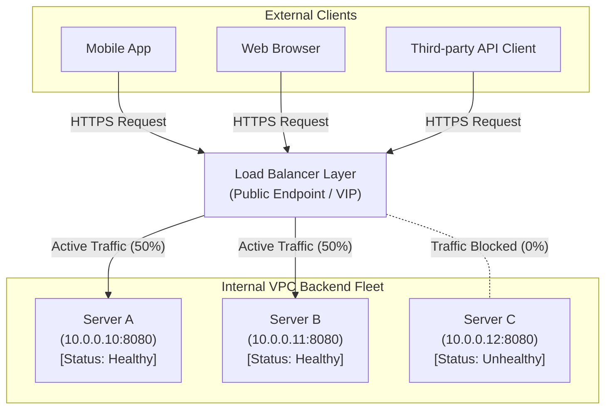
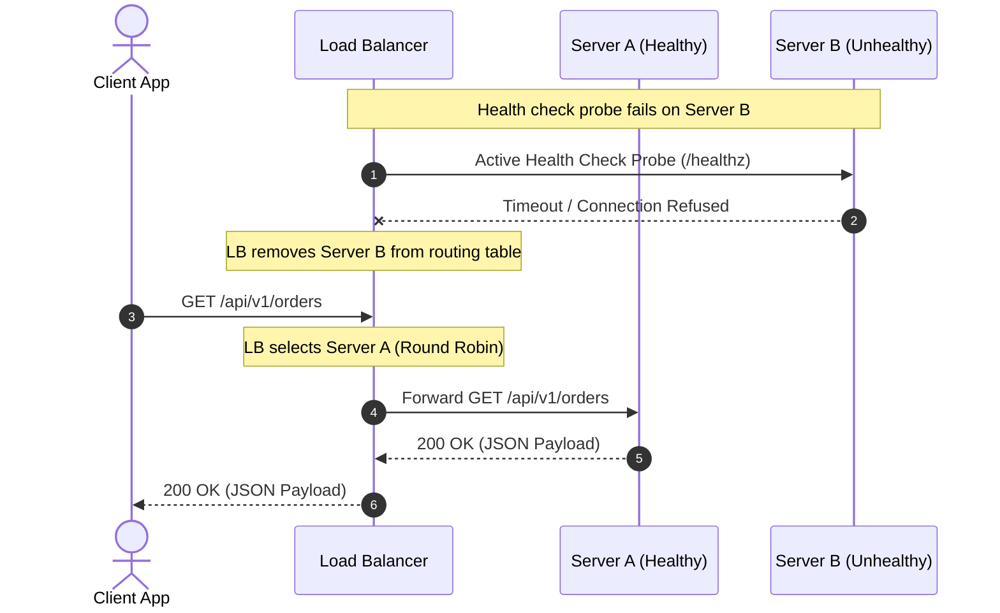

# Day 24 — Load Balancers

Your application was fine with 1,000 users.

Then traffic doubled.

You added another server.

Nothing crashed.

But your second server is sitting at 5% CPU while the first one is drowning.

Why?

Because adding servers doesn't automatically distribute traffic.

---

## The Problem

When an application starts out, a single client connects directly to a single application server:

```text
Clients
   ↓
Server
```

As user traffic grows, hardware resources on that single server become depleted. CPU utilization hits 100%, memory pressure forces heavy swapping, and socket listen queues overflow. 

To solve this, you deploy two additional instances of your application server. You now have `Server A`, `Server B`, and `Server C` running in your cloud environment:

```text
Clients
   ↓
Server A
Server B
Server C
```

Now you face a fundamental distributed systems question:

**Who decides where each request goes?**

If you leave this decision entirely up to client applications (e.g., mobile apps, single-page web apps, or upstream microservices), severe operational challenges emerge immediately:

- **Clients need server knowledge**: Every client must maintain a hardcoded list of backend IP addresses or domain names (`10.0.0.1`, `10.0.0.2`, `10.0.0.3`).
- **Server membership changes**: When a new server is launched or an old server is decommissioned, every client on the internet must somehow update its internal configuration.
- **Failed servers must be detected**: If `Server B` suffers a hardware crash, clients will continue hammering `Server B` with network calls, experiencing connection timeouts on every request.
- **Traffic distribution becomes inconsistent**: Without coordination, thousands of independent clients may randomly select `Server A` at the same time, leaving `Server B` and `Server C` completely idle.
- **Deployments become harder**: Zero-downtime rolling upgrades become impossible because clients cannot be seamlessly instructed to stop sending traffic to a specific server during updates.
- **Scaling becomes harder**: Adding 50 new backend instances to handle a flash sale requires publishing code updates or configuration pushes to millions of client devices.
- **Clients become tightly coupled to infrastructure**: Application clients become tightly coupled to the physical layout, network topology, and security perimeters of internal infrastructure.

Putting traffic distribution decisions inside clients creates chaos. A separate, dedicated **traffic-management layer** is required to sit between clients and servers.

---

## Why This Happens

As traffic grows, systems inevitably hit physical resource limits. Load balancing becomes necessary due to several core engineering realities:

- **Increasing traffic**: Unpredictable growth in concurrent user connections and API requests.
- **Limited server capacity**: Individual physical or virtual machines have finite CPU cores, RAM, network interfaces, and socket descriptors.
- **Horizontal scaling**: The architecture pattern of adding more discrete server instances rather than upgrading a single machine.
- **Server failures**: Hardware faults, kernel panics, out-of-memory (OOM) kills, and network blips will cause individual servers to fail.
- **Uneven workloads**: Different client requests consume vastly different resources (e.g., fetching a cached static asset vs. rendering an expensive PDF report).
- **Deployments**: The requirement to update backend application code without taking down the entire service.
- **Autoscaling**: Dynamically adding or removing servers in response to real-time traffic spikes or lulls.
- **Geographic distribution**: Routing users to datacenters or cloud regions physically closest to them to reduce latency.

### Vertical Scaling vs. Horizontal Scaling

Engineers face two primary dimensions when scaling an application:

#### Vertical scaling (Scale Up)

**Bigger machine** — Upgrading a single server to have 64 CPU cores, 512GB RAM, and 10Gbps network interfaces.

#### Horizontal scaling (Scale Out)

**More machines** — Adding dozens or hundreds of standard, commodity server instances operating in parallel.

While vertical scaling is simple initially, it quickly hits a hard economic and physical ceiling: high-end hardware becomes exponentially expensive, single-instance RAM/CPU limits are reached, and a single machine remains a single point of failure (SPOF). 

Horizontal scaling unlocks virtually unlimited capacity and fault tolerance. However, horizontal scaling introduces a new core problem:

> **Once you have multiple machines, something must decide where each request goes.**

---

## The Wrong Solution

Before arriving at a modern load balancer, teams often explore several intuitive but flawed approaches.

### 1. One giant server

Attempting to scale vertically forever by purchasing the largest available bare-metal machine.

Eventually, a single machine becomes constrained by:
- **CPU**: Thread contention and lock saturation across hundreds of logical cores.
- **Memory**: Exhaustion of RAM or long garbage collection (GC) pauses on huge heaps.
- **Network**: Saturation of the single network interface card (NIC) bandwidth.
- **Storage**: Disk I/O ops per second (IOPS) limits on attached storage volumes.
- **Failure impact**: When the giant server fails, 100% of your application goes offline instantly.

### 2. Let clients choose servers

Providing clients with a raw list of server IP addresses and letting them pick one (or rely on DNS round-robin directly from the client).

This leads to severe operational friction:
- **Stale server lists**: Mobile clients cache IP addresses for hours or days.
- **Failure detection**: Clients spend 5 to 30 seconds waiting for network timeouts when a server dies.
- **Uneven traffic**: Client-side selection algorithms (like random picking) lead to statistical imbalance and hot-spotting.
- **Infrastructure leakage**: Exposing internal server IP addresses to the public internet creates massive security risks.
- **Difficult deployments**: Draining traffic off a machine for maintenance requires waiting for client caches to expire.

### 3. Always send traffic to the fastest server

Configuring clients or gateways to track response latencies and always route traffic to the server that responded fastest to the previous request.

This approach is highly misleading:
- Response latency fluctuates instantly. A server may return a fast cached response for request 1, but become saturated milliseconds later when handling an expensive database query for request 2.
- Routing all traffic to the "fastest" server immediately overburdens it, causing its latency to spike, triggering a wild oscillation ("thundering herd") of traffic swinging back and forth between servers.

### 4. Randomly select a server

Picking a destination backend at random for every request (`random.choice(servers)`).

While random selection is mathematically simple and works sufficiently in low-concurrency or homogeneous environments, it fails to account for:
- Backend health and failure states.
- Active connection depth on each server.
- Differing machine hardware capacities.
- Variable request processing times (long-running vs. short-lived requests).
- Data locality and caching affinity.

*Note: Simple strategies like DNS round-robin or client-side random selection are not universally wrong. For small internal scripts, stateless microservices with identical workloads, or read-only static asset mirrors, simple strategies can be entirely sufficient.*

---

## The Right Mental Model

The core mental model of distributed traffic management is straightforward:

> **A load balancer is the traffic-control layer that decides where requests go across available capacity.**

```text
                ┌──→ Server A
                │
Clients → Load Balancer ──→ Server B
                │
                └──→ Server C
```

From the perspective of external clients, the load balancer represents a **single unified service**. The client makes an HTTP request to `api.example.com` without knowing—or caring—how many servers exist behind that endpoint.

Behind the scenes, the load balancer continuously gathers signals from the backend fleet and makes routing decisions based on:
- **Round Robin**: Distributing requests sequentially across healthy servers.
- **Weighted Round Robin**: Assigning a higher proportion of requests to more powerful machines.
- **Least Connections**: Steering traffic toward backends currently processing the fewest active requests.
- **Health Checks**: Continuously probing backends and stripping unhealthy instances out of rotation.
- **Consistent Hashing**: Routing requests with identical keys (e.g., user IDs) to the same backend for cache optimization.
- **Geographic Routing**: Directing traffic to the nearest datacenter based on IP geolocation.
- **Layer 4 Balancing**: Routing TCP/UDP transport packets at high speed without inspecting application payloads.
- **Layer 7 Balancing**: Inspecting HTTP headers, URLs, cookies, and payloads to make content-aware routing decisions.

---

## How It Actually Works

Let's walk through the exact lifecycle of an HTTP request passing through a load-balanced architecture.

```text
Step 1 — Client sends request
Client
  ↓
Service endpoint (e.g., https://api.example.com -> Load Balancer IP)

Step 2 — Load balancer receives it
The Load Balancer acts as the primary public entry point (Reverse Proxy).

Step 3 — It chooses a backend
Applying its configured algorithm across healthy instances:
Request 1 → Server A
Request 2 → Server B
Request 3 → Server C
Request 4 → Server A

Step 4 — Backend processes request
The chosen backend handles business logic and returns the payload.

Step 5 — Response returns
The Load Balancer forwards the response back to the client.
```

### Direct Connection vs. Load-Balanced Proxying

Notice the structural difference between direct client-server interaction and proxy-based load balancing:

#### Client → Server directly
Client establishes a TCP connection directly to the application server's IP address. Infrastructure topology is exposed.

#### Client → Load Balancer → Server
Client establishes a TCP connection to the Load Balancer (Frontend). The Load Balancer opens or reuses a separate connection to the backend server (Backend). Infrastructure details remain hidden.

---

### Health Checks: Detecting Unhealthy Backends

A load balancer maintains an active registry of all registered backend servers. To ensure requests are only sent to functioning machines, the load balancer performs periodic **health checks**:

```text
Load Balancer
   │
   ├── Server A ✓ (HTTP 200 OK)
   ├── Server B ✓ (HTTP 200 OK)
   └── Server C ✗ (Connection Refused / Timeout)
```

When `Server C` fails its health check:
1. The load balancer updates its internal routing table, marking `Server C` as **UNHEALTHY**.
2. `Server C` is immediately removed from the active traffic pool.
3. Subsequent client requests are distributed exclusively between `Server A` and `Server B`.
4. The load balancer continues probing `Server C` in the background. When `Server C` recovers and passes consecutive health probes, it is automatically re-integrated into active rotation.

> [!IMPORTANT]
> **Health Check Design Caution**: A server responding to a basic TCP ping or returning `200 OK` on a static `/ping` route does *not* necessarily mean the application is healthy. If the application server lost its database connection pool, a generic ping endpoint might still return `200 OK` while 100% of actual user requests crash! Production health checks should validate critical application dependencies (like database ping, cache connectivity, and disk space) before reporting health.

---

### Load-Balancing Algorithms

Load balancers evaluate different signals depending on the chosen algorithm:

#### 1. Round Robin
Sequential cycle through all healthy servers:

`Server A → Server B → Server C → Server A → Server B → Server C`

- **Best for**: Homogeneous server fleets where all machines have identical hardware specs and incoming requests take roughly equal processing time.

#### 2. Weighted Routing
Proportional distribution based on assigned machine capacity weights:

`Server A (Weight: 50%) | Server B (Weight: 30%) | Server C (Weight: 20%)`

- **Best for**: Heterogeneous fleets combining older 8-core servers with newer 32-core servers.

#### 3. Least Connections
Directs incoming requests to whichever healthy server currently has the fewest active TCP connections/requests:

- **Best for**: Workloads with variable request durations (e.g., long file downloads mixed with fast key-value lookups). Prevents a single backend from getting stuck with multiple slow requests while other backends sit idle.

#### 4. Consistent Hashing
Maps a request key (such as `user_id`, `session_id`, or `client_ip`) to a hash ring, preferentially routing requests with the same key to the exact same backend server.

- **Best for**: Distributed caching, session affinity, and stateful partitioned workloads.
- **Key benefit**: If a server is added or removed, consistent hashing minimizes key reshuffling, ensuring only $1/N$ of keys are remapped rather than $100\%$ of keys.
- *Note: Consistent hashing is a specialized pattern used for caching and stateful routing; ordinary stateless API services do not require consistent hashing.*

---

## Visual Explanation

### Basic Load Balancing

```text
        Clients
           │
           ▼
    ┌──────────────┐
    │ Load Balancer│
    └──────┬───────┘
       ┌───┼───┐
       ▼   ▼   ▼
      A    B    C
```

### Health-Aware Routing

```text
             Load Balancer
              /    |    \
             /     |     \
            ✓      ✓      ✗
           A       B       C
```

### Scaling Transformation

```text
Before:

Users → Server


After:

             ┌→ Server A
Users → LB ──┼→ Server B
             └→ Server C
```

### Mermaid Architecture Diagram



### Mermaid Sequence Diagram



---

## Real World Example: Edge Traffic Routing at Netflix

Consider how **Netflix** manages traffic routing across its global streaming platform using established, publicly documented architecture principles.

When a user hits "Play" on a movie, millions of client devices (smart TVs, mobile phones, web browsers, game consoles) send API requests to Netflix's edge.

```text
Client Applications (Smart TVs, Mobile Apps, Web Browsers)
                         │
                         ▼
        Public Edge Traffic Routing Layer
                         │
        ┌────────────────┴────────────────┐
        ▼                                 ▼
Service Discovery Registry         API Gateway / Proxy Fleet
(Tracks healthy instances)       (Routes request to microservice)
        │                                 │
        └────────────────┬────────────────┘
                         ▼
           Backend Microservice Cluster
      (Playback, Recommendations, User Profile)
```

1. **Decoupling Physical Topology**: Client devices do not hardcode the IP address of individual microservices. They hit a single public edge routing layer.
2. **Service Discovery & Health Awareness**: Internal service registries dynamically keep track of thousands of microservice instances launching, terminating, and failing across cloud regions.
3. **Traffic Steering**: Edge proxy gateways inspect incoming requests, authenticate tokens, and route traffic to the appropriate backend microservice cluster based on path and capacity signals.
4. **Horizontal Scale & Resilience**: If an entire cluster of video metadata microservices in one availability zone experiences degradation, the traffic routing layer dynamically shifts requests to healthy instances in alternate zones.

The key lesson aligns directly with our mental model: **Clients should never need to understand the physical topology or real-time health of the underlying infrastructure.**

---

## Build It Yourself

To build deep intuition for load balancing decision-making, explore our educational Python implementation:

- [`code/load_balancer.py`](file:///d:/30_Days_of_Distributed_Systems/days/Day-24-Load-Balancing/code/load_balancer.py): Implements the `LoadBalancer` and `BackendServer` classes, managing server registry state, health status, and Round Robin routing algorithms.
- [`code/demo.py`](file:///d:/30_Days_of_Distributed_Systems/days/Day-24-Load-Balancing/code/demo.py): An interactive simulation script demonstrating 3 healthy backends, traffic distribution, backend failure, dynamic rerouting, and server recovery.

### Conceptual Interface

```python
# Initialize Load Balancer with backend server pool
balancer = LoadBalancer(["server-a", "server-b", "server-c"])

# Request 1 -> server-a
server = balancer.next_server()

# Request 2 -> server-b
server = balancer.next_server()

# Simulate server-b crash
balancer.set_server_health("server-b", is_healthy=False)

# Request 3 -> server-c (server-b skipped automatically!)
server = balancer.next_server()
```

### Running the Demo

Execute the demo script directly with Python 3:

```bash
cd code
python demo.py
```

> [!NOTE]
> This code is an educational simulation designed for clarity and conceptual understanding. Production load balancers operating in real-world infrastructure utilize high-performance kernel bypass, epoll event loops, connection pooling, and specialized hardware acceleration.

---

## Common Misconceptions

### 1. A load balancer automatically makes applications faster
**Correction**: A load balancer adds a small network hop latency to every request. It enables scalability under high total load by spreading traffic across machines, but it does *not* speed up the execution time of an individual single-threaded database query.

### 2. Load balancing and autoscaling are the same thing
**Correction**: Autoscaling *spawns or terminates* server instances based on metrics (like CPU load). Load balancing *distributes traffic* among existing servers. Autoscaling provisions capacity; load balancing utilizes capacity.

### 3. Round robin always distributes traffic evenly
**Correction**: Round robin distributes *request counts* evenly, not *workload*. If Server A receives 10 light static file requests while Server B receives 10 heavy machine-learning rendering requests, Server B will become severely overloaded under Round Robin.

### 4. A healthy TCP connection means the application is healthy
**Correction**: A server's OS network stack may happily accept TCP connections on port 80/443 even while the underlying application process is stuck in a deadlocked state or out of memory.

### 5. Every system needs a dedicated hardware load balancer
**Correction**: Modern cloud and microservice architectures rely heavily on software load balancers (such as NGINX, HAProxy, Envoy, and AWS ALB) running on standard commodity servers or container sidecars.

### 6. Load balancing only happens at Layer 7
**Correction**: Load balancing operates at multiple layers of the OSI model: Layer 4 (Transport layer — TCP/UDP packet routing by IP/Port) provides extreme throughput, while Layer 7 (Application layer — HTTP header/URL routing) provides rich content-aware flexibility.

### 7. Load balancers eliminate server failures
**Correction**: Load balancers do not prevent individual servers from crashing; they isolate client applications from feeling the *impact* of those crashes by rerouting subsequent requests away from dead servers.

### 8. Sticky sessions are always bad
**Correction**: While sticky sessions (routing a user's requests to the same server via cookies) complicate load balancing and can cause traffic imbalances, they can be useful for legacy applications that rely on local in-memory session state.

### 9. More backend servers automatically solve every scaling problem
**Correction**: Adding 100 backend API servers will not improve performance if all 100 servers are blocked waiting on a single un-sharded, bottlenecked relational database.

### 10. A load balancer itself cannot become a failure point
**Correction**: If you deploy a single load balancer instance, that load balancer becomes a single point of failure (SPOF). Production load balancing layers require active-passive or active-active high availability pairings using Virtual IPs (VIPs), Keepalived/VRRP, or DNS round-robin across multiple load balancers.

---

## Production Trade-offs

| Dimension | Advantages | Disadvantages |
| :--- | :--- | :--- |
| **Scalability** | Unlocks horizontal scaling by adding backends seamlessly. | Requires managing multi-instance infrastructure & deployments. |
| **Resilience** | Automatic health-aware rerouting isolates server outages. | Health check misconfigurations can trigger false-positive outages. |
| **Architecture** | Decouples client applications from physical server topology. | Introduces an extra network hop (adding ~0.5ms - 2ms latency). |
| **Operations** | Centralizes TLS termination, logging, and rate limiting. | Adds operational complexity; the load balancer layer must be maintained. |

### Failure Cases in Production

1. **Load Balancer Failure**: A single load balancer instance crashes, taking down all client access. *Mitigation: High-Availability (HA) pairs with floating VIPs or Anycast IP routing.*
2. **Backend Failure**: A bug causes backends to crash under specific request payloads. *Mitigation: Fast health checks, circuit breakers, and canary deployments.*
3. **Health-Check Flapping**: Aggressive health check thresholds cause servers to rapidly cycle between healthy and unhealthy, destabilizing routing tables. *Mitigation: Flap detection, hysteresis timers, and conservative health thresholds.*
4. **Uneven Traffic (Hot-spotting)**: Long-lived persistent connections (e.g., WebSockets or gRPC streams) stick to a few backends, creating heavy resource imbalance under Round Robin. *Mitigation: Least connections routing, periodic connection draining, or L7 request-level rebalancing.*
5. **Connection Exhaustion**: High-concurrency traffic exhausts the load balancer's ephemeral TCP socket ports when connecting to backends. *Mitigation: Connection pooling, keep-alive connections, and multi-IP binding.*
6. **Slow Backends (Gray Failure)**: A backend server does not fail health checks, but processes requests 100x slower due to CPU throttling or disk degradation. *Mitigation: Latency-aware routing, least response time algorithms, and adaptive concurrency limits.*
7. **Network Partitions**: Network split causes the load balancer to lose connection to healthy backends in a specific subnet. *Mitigation: Multi-availability-zone load balancing.*
8. **DNS-Related Failures**: DNS caching delays client awareness of load balancer IP changes. *Mitigation: Low DNS Time-To-Live (TTL) values.*

### Performance & Scaling Implications

As incoming traffic scales from thousands to millions of requests per second, the load balancer itself must scale:

```text
More Inbound Traffic
        ↓
Additional Backend Instances
        ↓
Load Balancer Layer (Scales via Anycast / L4 Hardware / HA Pairs)
        ↓
Workload Distributed Across Fleet
```

- **TLS Termination**: Offloading CPU-intensive SSL/TLS handshake decryption at the load balancer layer frees up backend servers to focus purely on application business logic.
- **Connection Pooling**: Reusing established TCP connections between the load balancer and backends reduces TCP handshake overhead.

---

## Key Takeaways

1. **Horizontal scaling requires load balancing**: Adding servers alone does not distribute traffic; a traffic director is mandatory.
2. **Single Entry Point**: Load balancers hide infrastructure complexity, letting clients communicate with a single service endpoint.
3. **Health Checks Are Crucial**: Load balancers continuously monitor backend health and strip failed servers out of rotation automatically.
4. **Reachable $\neq$ Healthy**: Application health checks must validate critical dependencies, not just TCP connectivity.
5. **Algorithm Choice Matters**: Round Robin works for identical workloads; Least Connections works for variable request durations; Consistent Hashing works for caching.
6. **L4 vs. L7 Trade-offs**: Layer 4 load balancing provides ultra-high packet throughput; Layer 7 load balancing provides rich HTTP content-aware routing.
7. **Load Balancers Are Proxies**: A load balancer terminates client connections and opens backend connections, adding a small network hop.
8. **The Load Balancer Layer Must Be HA**: Avoid single points of failure by deploying load balancers in redundant, high-availability pairs.
9. **Horizontal scaling gives you more machines. Load balancing makes those machines behave like one service.**

---

## Interview Questions

### 1. Why do we need a load balancer?
**Answer**: As user traffic exceeds the capacity of a single server, applications must scale horizontally across multiple servers. A load balancer provides a single public entry point for clients, decoupling them from backend topology while distributing incoming requests, isolating server failures via health checks, and enabling zero-downtime deployments.

### 2. What is the difference between Layer 4 and Layer 7 load balancing?
**Answer**: Layer 4 load balancing operates at the Transport layer (TCP/UDP). It routes packets based on IP addresses and ports without inspecting application payload content, offering extremely high throughput and low CPU overhead. Layer 7 load balancing operates at the Application layer (HTTP/HTTPS). It inspects HTTP headers, URLs, cookies, and payloads to make content-aware routing decisions (e.g., routing `/api/v1/video` to a specialized video service), but incurs higher CPU overhead for TLS decryption and packet parsing.

### 3. How does a load balancer detect unhealthy servers?
**Answer**: Load balancers use periodic active probes (sending HTTP GET requests to `/healthz` or opening TCP connections) and passive monitoring (tracking actual client request error rates). If a backend fails a configured number of consecutive checks (e.g., 3 failed probes), it is marked UNHEALTHY and removed from the active routing pool until it passes consecutive recovery checks.

### 4. When would round robin perform poorly?
**Answer**: Round Robin performs poorly when backend servers have unequal hardware capacities (heterogeneous fleet) or when client requests have wildly varying processing times (e.g., some requests take 2ms while others take 10 seconds). In these cases, Round Robin leads to severe resource imbalance and backend hot-spotting.

### 5. When is least-connections better than round robin?
**Answer**: Least-connections is superior when request processing times vary significantly or when long-lived connections (like streaming or file uploads) exist. By routing new requests to the backend with the fewest active connections, it prevents already-busy servers from accumulating additional backlog.

### 6. What is consistent hashing and when is it useful?
**Answer**: Consistent hashing maps request keys (like `user_id` or `cache_key`) to a hash ring mapped across backend nodes. It ensures that requests with the same key preferentially hit the exact same backend server. It is useful for distributed caching and stateful routing because adding or removing a node only remaps $1/N$ of keys rather than reshuffling all keys.

### 7. What happens if the load balancer itself fails?
**Answer**: If a standalone load balancer fails, it becomes a single point of failure (SPOF) and takes down the entire application. In production, load balancers are deployed in High-Availability (HA) pairs (Active-Passive or Active-Active) using Virtual IPs (VIPs) managed by VRRP/Keepalived, or globally distributed via BGP Anycast routing.

### 8. How would you design a highly available load-balancing layer?
**Answer**: Use a multi-tier approach: At the edge, use BGP Anycast to announce a single IP address across multiple physical Layer 4 load balancers (like Google Maglev or Cloudflare Unimog). Behind the L4 layer, deploy a fleet of Layer 7 software load balancers (like NGINX or Envoy) in an active-active setup managed by health probes and DNS round-robin.

### 9. How do sticky sessions affect scalability?
**Answer**: Sticky sessions lock a user's requests to a specific backend server using session cookies or client IP hashes. This limits scalability because if a server becomes overloaded, traffic for sticky users cannot be rebalanced to idle servers. Furthermore, if a server crashes, all users stickied to that server lose their in-memory session state.

### 10. How would you handle a backend that is technically healthy but extremely slow?
**Answer**: A slow backend ("gray failure") can pass basic health checks while bottlenecking user requests. To handle this, implement latency-aware load balancing algorithms (like Peak EWMA or Least Response Time), enforce aggressive request timeouts with circuit breakers, and configure health checks to measure 99th percentile response latency rather than simple TCP reachability.

---

## Further Reading

For primary engineering sources, foundational research papers, official documentation, and technical conference talks, refer to [`references.md`](file:///d:/30_Days_of_Distributed_Systems/days/Day-24-Load-Balancing/references.md).

---

## Learning Progression & Final Mental Model

- **Curiosity**: One server receives more traffic than it can physically handle.
- **Confusion**: Adding more servers didn't automatically distribute traffic; the original server still drowned while new servers sat idle.
- **Insight**: A dedicated traffic director is required to sit between clients and servers.
- **Confidence**: Load balancing distributes requests across capacity while automatically bypassing unhealthy servers.
- **Connection**: Load balancing is the core enabling abstraction for horizontal scaling, elasticity, and fault tolerance.

> **A load balancer is not just distributing requests. It is hiding infrastructure complexity from clients while continuously making traffic decisions as capacity and health change.**

---

### What you'll build intuition for tomorrow

Tomorrow, in **Day 25 — Service Discovery**, we explore how load balancers and microservices dynamically find where backend servers live in elastic environments where IP addresses change every minute!
