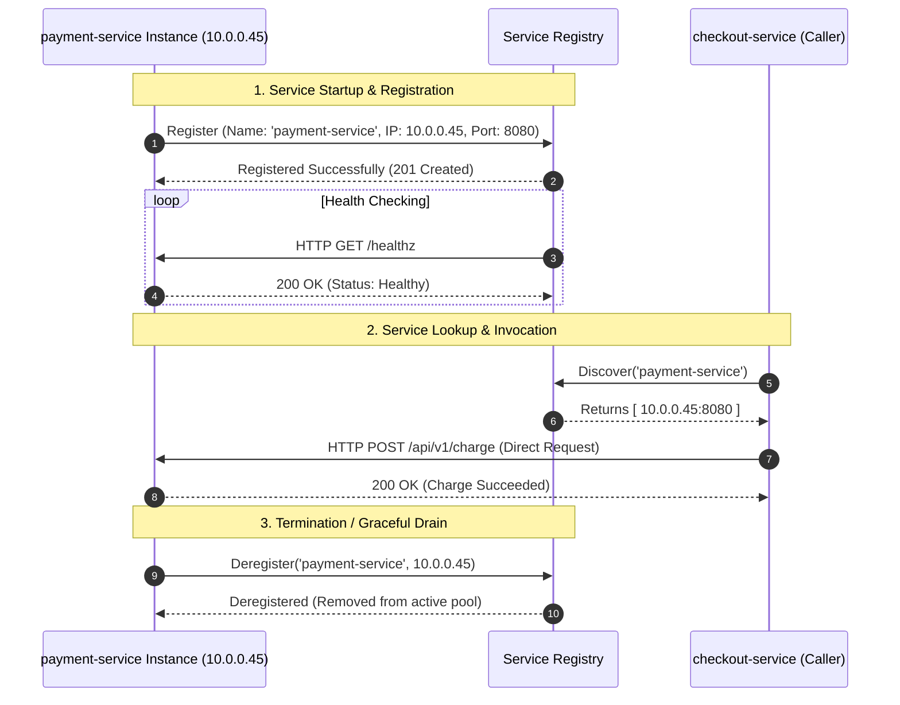

# Day 25 — Service Discovery: How Services Find Each Other

Your `checkout-service` needs to process a credit card charge. It makes an HTTP call to `10.0.0.12:8080`, where `payment-service` has been running smoothly for weeks.

At 2:00 AM, the underlying hardware node hosting that container suffers a memory fault and reboots.

Within seconds, your container orchestrator detects the failure, launches a brand-new `payment-service` instance on a healthy server, and marks it completely ready to accept traffic. The new payment instance is healthy, idle, and listening on `10.0.0.45:8080`.

Yet, back on the checkout service, every single customer checkout is failing with connection timeouts.

The target service is alive and healthy. The network is functioning normally. But communication is completely broken because the caller is still attempting to speak to a ghost.

This brings us to one of the most fundamental questions in modern distributed architecture:

**How can one service find another when machines, containers, and instances are constantly changing?**

---

## The Problem

In a traditional, static computing environment, applications were deployed onto long-lived physical servers with fixed IP addresses. If you had an inventory service, you gave it a static IP address (`192.168.1.50`), entered that address into a configuration file on your other machines, and left it alone for years.

In a modern distributed system, this assumption of permanence completely collapses.

Consider an e-commerce platform where `checkout-service` must communicate with `payment-service`:

```text
checkout-service (Caller) ───[ HTTP POST /charge ]───▶ payment-service (10.0.0.12:8080)
```

At first glance, hardcoding `10.0.0.12:8080` or setting `PAYMENT_SERVICE_HOST=10.0.0.12` in an environment variable seems simple and straightforward. But in production, physical network addresses are in a constant state of flux:

- **Rolling Deployments**: When a new version of `payment-service` is deployed, the old containers are drained and terminated. New containers spin up with entirely new, randomly assigned IP addresses.
- **Hardware & Node Failures**: Virtual machines crash, underlying hypervisors undergo maintenance, and container engines restart unexpectedly, moving workloads to different physical hosts.
- **Autoscaling Spikes**: During a flash sale, traffic surges 10x. Autoscaling launches 20 new instances of `payment-service` to share the load. The caller has no idea these new instances even exist.
- **Scale-Down Events**: When traffic subsides at night, half of the instances are decommissioned. Callers continuing to send requests to those decommissioned IP addresses experience immediate connection refused errors.
- **Ephemeral Infrastructure**: In cloud environments, container runtimes and serverless engines treat compute instances as disposable resources rather than permanent servers.

```text
                         [ Container Replaced ]
checkout-service ───▶ 10.0.0.12 ❌ (Connection Refused)
                         
                      10.0.0.45 ✅ (Healthy, but undiscovered!)
```

When you hardcode physical locations, any change to your infrastructure breaks your application logic. Physical network addresses are too volatile to serve as reliable contracts between services.

---

## Why This Happens

Distributed architectures are designed to be dynamic and elastic. Systems continuously adapt to changing traffic demands and unexpected hardware failures:

- **Instances starting and stopping**: Services scale up during peak business hours and scale down during lulls.
- **Machines failing**: Cloud hardware is commodity hardware; disk drives degrade, network interfaces drop packets, and nodes get preempted.
- **Autoscaling**: Compute capacity expands and contracts automatically based on real-time CPU, memory, and queue depth signals.
- **Container restarts**: Memory leaks or uncaught exceptions trigger container restarts, often rescheduling workloads onto different cluster nodes with different network namespaces.
- **New deployments**: Continuous deployment pipelines release new application versions multiple times a day.
- **Changing IP addresses**: Dynamic Host Configuration Protocol (DHCP) and Software-Defined Networks (SDN) assign dynamic IP addresses from available subnets on demand.
- **Multiple instances of the same service**: To handle high throughput and provide redundancy, a single logical service runs across dozens or hundreds of discrete physical instances simultaneously.

### Identity vs. Location

The root of this problem stems from confusing two fundamentally different concepts:

| Concept | What It Represents | Examples | Stability |
| :--- | :--- | :--- | :--- |
| **Service Identity** | *What* a service is and what capability it provides | `payment-service`, `auth-service`, `inventory` | **Stable** (Does not change across deploys) |
| **Service Location** | *Where* a specific instance happens to be running right now | `10.0.0.12:8080`, `192.168.4.22:9000` | **Ephemeral** (Changes constantly) |

A caller only cares about the **identity** of its dependency. The checkout service does not care which physical rack or virtual container processes a credit card, as long as it is an authentic, healthy instance of `payment-service`.

This leads directly to our core design principle:

> **Clients should ask for a service by name, not permanently remember where that service happens to be running.**

---

## The Wrong Solution

Before arriving at modern service discovery, teams frequently try several naive workarounds that quickly fall apart under real-world conditions.

### 1. Hardcoding Addresses in Static Configuration Files

The most intuitive approach is storing the target IP address directly in application environment variables or configuration files:

```bash
# config.env on checkout-service host
PAYMENT_SERVICE_URL="http://10.0.0.12:8080"
```

When `10.0.0.12` crashes and is replaced by `10.0.0.45`:
1. The checkout service fails every request until an engineer notices the alert.
2. The engineer must manually locate the new IP address of `payment-service`.
3. The engineer updates `config.env` across all running checkout instances.
4. The engineer restarts the checkout instances to load the new configuration.

This manual process takes minutes or hours, guarantees downtime during every deployment, and completely destroys the value of automated cloud elasticity.

### 2. Static Configuration Lists of Multiple IPs

To support multiple instances, teams often attempt to maintain a list of all known IPs:

```bash
PAYMENT_SERVICE_HOSTS="10.0.0.10:8080,10.0.0.11:8080,10.0.0.12:8080"
```

This introduces a severe distributed coordination problem:
- When autoscaling adds instance `10.0.0.13`, every client fleet must receive an updated configuration push.
- If one instance crashes, clients keep sending traffic to the dead IP until another configuration push removes it.
- As the number of microservices and instances grows ($M \times N$ connections), managing configuration pushes becomes a brittle, error-prone synchronization nightmare.

### 3. Static Operating System Hosts Files (`/etc/hosts`)

Some organizations attempt to map hostnames locally via `/etc/hosts` on every virtual machine:

```text
10.0.0.12  payment-service.internal
```

This simply relocates the hardcoding problem to the operating system level. Synchronizing static hosts files across thousands of ephemeral containers launching and terminating every minute is impossible.

---

## The Right Mental Model

To understand service discovery, consider a simple real-world analogy: **a hotel reception desk**.

```text
Without Directory:
Guest asks: "I need to speak to Alice. Is she in Room 304?"
Desk replies: "Alice checked out yesterday. Room 304 is empty now." (Failure)

With Directory:
Guest asks: "I need to speak to Alice." (Identity)
Reception checks system: "Alice is currently in Room 512." (Location)
Guest is connected to Room 512. (Success)
```

When you visit a hotel, you do not need to memorize which room your colleague is staying in. You go to the front desk and ask for them by **name**. The front desk maintains a live, updated guest ledger that tracks who is currently in which room. When guests check in, move rooms, or check out, the ledger updates immediately.

In distributed systems, **Service Discovery** acts as that real-time directory:

```text
Services move. Names should remain stable.
```

- When a service instance launches, it announces its current location to the directory.
- When a service instance shuts down or fails, it is removed from the directory.
- When a client wants to communicate with a dependency, it queries the directory by logical name (`payment-service`) to obtain a list of currently healthy, available physical addresses.

---

## How It Actually Works

Service discovery is not a single tool; it is an end-to-end lifecycle that coordinates how dynamic workloads publish their locations and how callers locate them.

### The Service Discovery Lifecycle

```text
 1. Instance Starts       ──▶ [ Launches with IP 10.0.0.45:8080 ]
 2. Registration          ──▶ [ Registers "payment-service" @ 10.0.0.45:8080 ]
 3. Health Monitoring     ──▶ [ Periodic /healthz probes succeed ]
 4. Client Request        ──▶ [ Client asks: "Where is payment-service?" ]
 5. Discovery Resolution  ──▶ [ Registry returns: 10.0.0.45:8080 ]
 6. Request Dispatched    ──▶ [ Client communicates directly with healthy instance ]
 7. Deregistration / Drop ──▶ [ Upon crash or drain, instance removed from registry ]
```

1. **Instance Starts**: A new container or process boots up and is assigned a dynamic IP and port by the host or orchestrator.
2. **Registration**: The new instance (or an external orchestrator agent) registers its network location (`10.0.0.45:8080`), logical name (`payment-service`), and metadata in the discovery system.
3. **Health Monitoring**: The discovery system continuously monitors the instance using active health probes or incoming heartbeats.
4. **Lookup / Query**: A client needing to call `payment-service` issues a lookup query using the stable logical name.
5. **Resolution**: The discovery system filters out dead or degraded nodes and returns one or more healthy network addresses.
6. **Traffic Routing**: The client (or an intermediary proxy) sends the network request to an active destination.
7. **Deregistration**: When the instance is terminated or fails health checks, it is stripped from the active pool so no further traffic is routed to it.

There are two primary paradigms for implementing this lifecycle: **DNS-Based Discovery** and **Dedicated Service Registries**.

---

### DNS-Based Service Discovery

Domain Name System (DNS) is the most universal naming mechanism on networks. In DNS-based service discovery, an internal nameserver maps a stable fully qualified domain name (FQDN) to dynamic IP addresses:

```text
payment-service.company.internal ──▶ Resolves to [ 10.0.0.10, 10.0.0.11, 10.0.0.13 ]
```

#### How it works conceptually:
- The caller simply configures its HTTP client to use `http://payment-service.company.internal:8080`.
- Before establishing a TCP socket, the caller's operating system issues a standard DNS lookup query (`A` or `AAAA` record) to the internal DNS server.
- The internal DNS server returns the list of active backend IP addresses.
- For applications requiring dynamic port resolution, DNS **SRV records** (RFC 2782) can be used to advertise both IP addresses and port numbers.

#### Advantages & Operational Considerations:
- **Zero Client Modification**: Almost every programming language and HTTP library natively supports DNS resolution out of the box without requiring specialized SDKs.
- **The DNS Caching Challenge**: DNS was originally designed for relatively static internet mappings. Operating systems, language runtimes (like the JVM), and HTTP client libraries aggressively cache DNS responses. If a DNS record has a high Time-To-Live (TTL), clients will continue sending traffic to dead instances for minutes after they terminate. Conversely, setting TTL to 0 can overwhelm internal DNS servers with a massive query volume.

---

### Service Registry (e.g., HashiCorp Consul)

A **Service Registry** is a dedicated, real-time database specifically optimized for tracking dynamic service instances, their network locations, and their live health states.

A prominent example of a dedicated service registry is **HashiCorp Consul**.

```text
              ┌──────────────────────────────────────┐
              │      Consul Service Registry         │
              │  "payment-service":                  │
              │    - 10.0.0.10:8080 (Healthy)        │
              │    - 10.0.0.13:8080 (Healthy)        │
              └──────────────────┬───────────────────┘
                    ▲            │
      1. Registers  │            │ 2. Queries healthy
      & Heartbeats  │            │    instances
                    │            ▼
         ┌──────────┴────┐    ┌──┴────────────┐
         │ payment-inst  │    │  checkout     │
         └───────────────┘    └───────────────┘
```

#### Core Responsibilities of a Registry:
1. **Registration & Deregistration**: Instances make API calls to register their IP, port, and health check endpoints upon startup, and cleanly deregister upon SIGTERM.
2. **Active Health Checking**: The registry actively queries `/healthz` endpoints or monitors heartbeat TTLs. If an instance becomes unresponsive, the registry marks it unhealthy within milliseconds.
3. **Rich Querying & Metadata**: Clients can query not only by name, but filter by tags, versions (`version=v2`), and datacenter locality (`zone=us-east-1a`).

#### Client-Side vs. Server-Side Discovery

When using a service registry, systems generally adopt one of two structural patterns:

```text
[ Client-Side Discovery ]
Client ──▶ Queries Registry ──▶ Receives IP list ──▶ Client selects & calls backend directly

[ Server-Side Discovery ]
Client ──▶ Calls Router/Load Balancer (Stable VIP) ──▶ Router queries Registry & forwards request
```

- **Client-Side Discovery** (e.g., Netflix Eureka + Ribbon): The client application talks directly to the registry, gets the list of healthy instances, and runs its own load-balancing algorithm.
  - *Pros*: Direct network path (no middle proxy bottleneck); latency is minimized.
  - *Cons*: Requires discovery client SDKs in every programming language used in the company.
- **Server-Side Discovery** (e.g., AWS ALB, NGINX, or Kubernetes Services): The client sends requests to an intermediary proxy or router with a stable address. The proxy queries the registry and routes the packet to a healthy backend.
  - *Pros*: Simple client code (standard HTTP calls); centralized traffic policy enforcement.
  - *Cons*: Extra network hop through the proxy layer; the proxy fleet must be scaled and maintained.

---

### Service Discovery in Kubernetes

**Kubernetes** implements service discovery as a foundational, built-in primitive, resolving the dynamic container problem through a clean layered abstraction:

```text
Pod (Ephemeral IP) ──┐
Pod (Ephemeral IP) ──┼──▶ [ Kubernetes Service (Stable Virtual IP & DNS Name) ]
Pod (Ephemeral IP) ──┘
```

#### 1. Pods are Ephemeral
In Kubernetes, applications run in **Pods**. Each Pod receives its own unique IP address within the cluster software-defined network. However, Pods are ephemeral: when a Pod dies, scales down, or is updated during a rolling deploy, it is destroyed forever. The replacement Pod receives a completely new IP address.

#### 2. The Kubernetes Service Abstraction
To provide stability, Kubernetes introduces the **Service** resource. A Service represents a logical group of Pods delivering the same functionality. 
- A Service is assigned a permanent, unchanging **Virtual IP** (known as the `ClusterIP`).
- A Service uses **Labels and Selectors** (e.g., `app: payment`) to dynamically track which Pods belong to the pool.
- The list of active, healthy Pod IPs matching the selector is continuously maintained in an internal controller object called an **EndpointSlice**.

#### 3. Cluster DNS Resolution
Kubernetes runs an internal DNS server (CoreDNS). When a Service named `payment-service` is created in the `default` namespace, CoreDNS automatically publishes a cluster-wide DNS record:

```text
payment-service.default.svc.cluster.local ──▶ Resolves to ClusterIP (e.g., 10.96.0.15)
```

When `checkout-service` sends a request to `http://payment-service:8080`:
1. DNS resolves `payment-service` to the stable Virtual IP `10.96.0.15`.
2. The packet travels through the local node's networking layer (`kube-proxy` using iptables or IPVS).
3. The node transparently rewrites the destination IP from the virtual ClusterIP to one of the live, healthy Pod IPs currently listed in the Service's active endpoints.

Workloads communicate reliably using a clean, unchanging hostname without ever needing to track individual Pod lifecycles.

---

## Visual Explanation

### 1. The Hardcoded Address Problem

```text
STATIC HARDCODED ROUTING (BRITTLE):
┌──────────────────┐
│ checkout-service │
└────────┬─────────┘
         │
         │  HTTP POST to 10.0.0.12:8080
         ▼
       ❌ 10.0.0.12 (CRASHED / TERMINATED)
       
       ✅ 10.0.0.45 (NEW INSTANCE RUNNING, BUT UNREACHABLE)

-------------------------------------------------------------------------

DYNAMIC SERVICE DISCOVERY (RESILIENT):
┌──────────────────┐
│ checkout-service │
└────────┬─────────┘
         │
         │  "Where is 'payment-service'?"
         ▼
┌──────────────────────────┐
│ Service Discovery Layer  │ ──▶ Returns: 10.0.0.45:8080
└──────────────────────────┘
         │
         │  HTTP POST to 10.0.0.45:8080
         ▼
       ✅ 10.0.0.45 (HEALTHY BACKEND)
```

---

### 2. Service Discovery Lifecycle



---

### 3. DNS-Based Discovery

```text
┌──────────────────┐
│  Client Service  │
└────────┬─────────┘
         │ 1. DNS Query: "payment-service.internal"
         ▼
┌──────────────────┐
│  Internal DNS    │ ──▶ Returns A Records: [ 10.0.0.10, 10.0.0.11 ]
└────────┬─────────┘
         │
         │ 2. Direct TCP Connection to resolved IP
         ▼
┌────────────────────────────────────────┐
│ Target Fleet (10.0.0.10 / 10.0.0.11)   │
└────────────────────────────────────────┘
```

---

### 4. Service Registry with Consul

```text
      ┌─────────────────────────┐
      │  payment-inst-1 (Host A)│──┐
      └─────────────────────────┘  │ 1. Self-Registration
      ┌─────────────────────────┐  │    & Health Checks
      │  payment-inst-2 (Host B)│──┼───────────────┐
      └─────────────────────────┘  │               ▼
                                   │     ┌───────────────────┐
                                   └────▶│   Consul Cluster  │
                                         │  (Service Catalog)│
                                         └─────────┬─────────┘
                                                   ▲
      ┌─────────────────────────┐                  │ 2. Query Available
      │  checkout-service       │──────────────────┘    Healthy Instances
      └─────────────────────────┘
```

---

### 5. Kubernetes Service Discovery

```text
┌─────────────────────┐
│ Client Pod          │
│ (checkout)          │
└──────────┬──────────┘
           │
           │ 1. DNS Query: "payment-service" -> Resolves to ClusterIP (10.96.0.15)
           │ 2. Sends HTTP Request to 10.96.0.15:8080
           ▼
┌───────────────────────────────────────────────────────────┐
│ Kubernetes Service: payment-service (VIP: 10.96.0.15)     │
│ Managed via EndpointSlice tracking live Pod IPs           │
└──────────┬──────────────────────┬──────────────────────┬──┘
           │ (kube-proxy L4 DNAT) │                      │
           ▼                      ▼                      ▼
┌────────────────────┐ ┌────────────────────┐ ┌────────────────────┐
│ Pod A              │ │ Pod B              │ │ Pod C              │
│ IP: 10.244.1.12    │ │ IP: 10.244.2.44    │ │ IP: 10.244.3.89    │
│ (Healthy)          │ │ (Healthy)          │ │ (Healthy)          │
└────────────────────┘ └────────────────────┘ └────────────────────┘
```

---

### Visual Assets Reference

The following visual diagrams are specified for rendering in the [`assets/`](file:///d:/30_Days_of_Distributed_Systems/days/Day-25-Service-Discovery/assets/) directory:

1. `hardcoded-address-problem.png`: Side-by-side contrast diagram showing a client failing when connecting to a hardcoded dead IP vs. succeeding when resolving dynamically through service discovery.
2. `service-discovery-lifecycle.png`: Illustrated sequence diagram tracking the full instance journey: bootstrap, registry registration, periodic health checks, client query resolution, and graceful deregistration.
3. `dns-service-discovery.png`: Architectural flow illustrating a microservice issuing an internal DNS query, the nameserver returning active A/SRV records, and traffic routing to healthy backends.
4. `consul-service-registry.png`: Diagram showing multiple microservice instances registering with a central Consul cluster, active health check evaluations, and client-side querying.
5. `kubernetes-service-discovery.png`: Detailed infrastructure graphic showing how CoreDNS resolves a Service name to a ClusterIP Virtual IP, and how `kube-proxy` transparently distributes traffic across ephemeral backend Pods.

---

## Real World Example: Kubernetes Service Networking

Let's examine how a modern microservices workflow operates inside a production **Kubernetes** cluster without any service hardcoding.

Imagine a user placing an order in an online store. The request flows across three distinct tiers:

```text
User ──▶ [ frontend-service ] ──▶ [ checkout-service ] ──▶ [ payment-service ]
```

```text
+-----------------------------------------------------------------------------------------+
|                                  Kubernetes Cluster                                     |
|                                                                                         |
|  [ frontend Pods ]                                                                      |
|         │                                                                               |
|         ▼ HTTP call to "http://checkout-service:8080"                                   |
|  [ checkout-service Service ] (ClusterIP: 10.96.0.20)                                   |
|         │                                                                               |
|         ├───────────────────────────────┐                                               |
|         ▼                               ▼                                               |
|    checkout-pod-1 (10.244.1.5)     checkout-pod-2 (10.244.2.8)                          |
|         │                                                                               |
|         ▼ HTTP call to "http://payment-service:8080"                                    |
|  [ payment-service Service ] (ClusterIP: 10.96.0.40)                                    |
|         │                                                                               |
|         ├───────────────────────────────┐                                               |
|         ▼                               ▼                                               |
|    payment-pod-1 (10.244.1.9)      payment-pod-2 (10.244.3.14)                          |
+-----------------------------------------------------------------------------------------+
```

### Why This Architecture Succeeds in Production:
1. **Zero Knowledge of Physical Topology**: The engineers writing `checkout-service` only need to know one string: `http://payment-service:8080`. They never know—nor do they care—what IP addresses the payment pods have, what physical server nodes they live on, or how many replicas exist.
2. **Seamless Rolling Deploys**: When the payment engineering team deploys version `v2.4.0`, Kubernetes starts new Pods, waits for their readiness probes to pass, adds their new IPs to the `EndpointSlice`, and shuts down old Pods. The checkout service experiences 0% downtime and zero dropped connections.
3. **Transparent Autoscaling**: If payment processing load spikes, an autoscaler scales the payment deployment from 2 Pods to 20 Pods. The Service abstraction immediately starts spreading traffic across all 20 Pods without any configuration change in the checkout service.

---

## Build It Yourself

To build concrete intuition for how service discovery works under the hood, explore our educational Python implementation:

- [`code/service_instance.py`](file:///d:/30_Days_of_Distributed_Systems/days/Day-25-Service-Discovery/code/service_instance.py): Represents discrete running microservice instances with IP addresses, ports, heartbeat timestamps, and real-time health flags.
- [`code/service_registry.py`](file:///d:/30_Days_of_Distributed_Systems/days/Day-25-Service-Discovery/code/service_registry.py): Implements the central `ServiceRegistry` managing registration, graceful deregistration, active health states, heartbeat tracking, and dynamic name lookups.
- [`code/client.py`](file:///d:/30_Days_of_Distributed_Systems/days/Day-25-Service-Discovery/code/client.py): Demonstrates client-side discovery, querying the registry by logical name, selecting healthy backends via Round Robin, and executing calls.
- [`code/demo.py`](file:///d:/30_Days_of_Distributed_Systems/days/Day-25-Service-Discovery/code/demo.py): An interactive end-to-end simulation executing dynamic instance registration, traffic dispatching, node failure exclusion, rolling upgrades, and heartbeat TTL eviction.

### Conceptual Interface

```python
from service_registry import ServiceRegistry
from service_instance import ServiceInstance
from client import ServiceDiscoveryClient

# 1. Initialize central registry
registry = ServiceRegistry(heartbeat_ttl_seconds=10.0)

# 2. Instances register on startup
inst_1 = ServiceInstance("payment-service", "inst-1", "10.0.0.10", 8080)
inst_2 = ServiceInstance("payment-service", "inst-2", "10.0.0.11", 8080)
registry.register(inst_1)
registry.register(inst_2)

# 3. Client resolves dependencies dynamically by NAME
client = ServiceDiscoveryClient(registry, client_id="checkout-service")
response = client.invoke("payment-service", "/api/v1/charge", {"amount": 49.99})

# 4. Failed instances are marked unhealthy and automatically bypassed
registry.set_health("payment-service", "inst-1", is_healthy=False)
response = client.invoke("payment-service", "/api/v1/charge", {"amount": 99.00})
```

### Running the Demo

Run the interactive simulation directly using Python 3:

```bash
cd code
python demo.py
```

### Thought Experiment: What Happens in a Real Distributed Environment?

Our Python implementation uses an in-memory dictionary protected by thread locks. In a real large-scale distributed system, the service registry itself is a distributed system, introducing deeper challenges:

1. **What if the registry itself fails?**
   If a single registry server crashes, discovery is paralyzed. Production registries (like Consul or etcd) run as a replicated cluster using consensus protocols (like Raft) or gossip protocols (like Serf) to survive node crashes.
2. **What if health information is stale?**
   If an instance crashes between health check intervals, the registry may return a dead IP for several seconds. Production clients pair service discovery with **retries**, **timeouts**, and **circuit breakers** (from Days 21, 22, and 23) to handle transient discovery lag gracefully.
3. **What if an instance disappears without deregistering?**
   If a node loses power or suffers a kernel panic, it cannot send a deregistration message. Registries use **Time-To-Live (TTL) Heartbeats**—if an instance fails to ping the registry within a specified threshold, the registry automatically evicts it.
4. **What happens when multiple registries disagree (Split-Brain)?**
   During a network partition, registry nodes on different sides of a cluster may see different sets of healthy instances. Systems choose between consistency (refusing queries until consensus is reached, like Consul/etcd) or availability (returning slightly stale local instance lists to keep traffic flowing, like Netflix Eureka).

---

## Common Misconceptions

### 1. “Service discovery is just DNS.”
**Correction**: While DNS is one mechanism used to implement service discovery, traditional DNS lacks rapid health-checking feedback loops, struggles with aggressive client-side caching, and historically did not support port mapping or rich metadata without specialized SRV records.

### 2. “A service name always points to one machine.”
**Correction**: A service name represents a *logical capability*, not a physical host. A single service name like `payment-service` frequently resolves to dozens or hundreds of distinct container instances running across multiple availability zones.

### 3. “Kubernetes Pods have stable addresses.”
**Correction**: Kubernetes Pod IPs are strictly ephemeral. They change every time a Pod is rescheduled, restarted, or updated. Stability is provided by the Kubernetes **Service** abstraction (the ClusterIP Virtual IP), not the individual Pods.

### 4. “A service registry automatically solves every networking problem.”
**Correction**: A registry only provides a directory of *where instances live*. It does not handle network partitions, transient packet loss, payload encryption (mTLS), distributed rate limiting, or application deadlocks.

### 5. “Health checks are always perfectly accurate.”
**Correction**: Health checks are point-in-time samples. An instance might return `200 OK` on a shallow `/healthz` ping while simultaneously failing real user database queries due to connection pool exhaustion ("gray failures").

### 6. “Service discovery removes the need for load balancing.”
**Correction**: Service discovery tells a client *which instances exist and are healthy*. Load balancing is the decision policy that chooses *which specific instance among that healthy pool should receive the next request*. Discovery and load balancing work together in tandem.

---

## Production Trade-offs

```text
┌──────────────────────────────────────────────────────────────────────────┐
│                     Service Discovery Trade-offs                         │
├─────────────────────────────────────┬────────────────────────────────────┤
│             ADVANTAGES              │           DISADVANTAGES            │
├─────────────────────────────────────┼────────────────────────────────────┤
│ • Stable logical service identities │ • Additional infrastructure tier   │
│ • Seamless autoscaling & deploys    │ • Risk of stale lookup info        │
│ • Automated failure isolation       │ • Health-check overhead on nodes   │
│ • Decouples code from topology      │ • DNS/client caching complexity    │
│ • Multi-zone resilience support     │ • Registry itself can become SPOF  │
└─────────────────────────────────────┴────────────────────────────────────┘
```

### Failure Cases to Plan For:
- **Registry Outage**: If the registry goes down, new instances cannot register and callers cannot discover new endpoints. Production systems mitigate this with aggressive local client-side caching of the last known healthy instance list.
- **Stale Discovery Data**: An instance terminates abruptly, but the registry still returns its IP for a few seconds. Callers must handle initial connection drops with retries and circuit breakers.
- **Flapping Health Checks**: An overloaded server fails a health probe, is removed from discovery, recovers because it has zero traffic, passes the next health check, gets slammed with traffic again, and loops indefinitely. This requires hysteresis (requiring multiple consecutive successes to rejoin the pool).
- **Network Partition between Registry and Instances**: Instances may be healthy and reachable by clients, but unable to reach the registry. If the registry aggressively evicts them due to missing heartbeats, it can trigger a cascading outage.

### Performance & Scaling Implications:
- **Lookup Overhead**: Querying a remote registry over the network before every single RPC adds unacceptable latency. Real-world systems cache the service directory locally in memory and use long-polling (or streaming gRPC watches) to receive instant change notifications only when membership updates occur.
- **Query Storms on Registration**: When 500 instances scale up simultaneously, querying and registering in a central database can cause thundering herd contention. Distributed gossip protocols (like Serf in Consul) distribute this gossip traffic evenly across nodes.

---

## Key Takeaways

1. **Physical addresses are ephemeral**: In elastic container and cloud environments, IP addresses and ports change constantly.
2. **Services move, names remain stable**: Applications should depend on stable logical identities (`payment-service`), never temporary network coordinates.
3. **Decouple identity from location**: Service discovery acts as the live directory mapping permanent service names to transient physical instances.
4. **The Complete Lifecycle**: Service discovery encompasses registration, continuous health checking, dynamic name resolution, and graceful deregistration.
5. **DNS vs. Dedicated Registries**: DNS offers broad compatibility, while dedicated registries (like Consul) provide rapid sub-second health updates and rich metadata.
6. **Kubernetes Solves This via Services**: Kubernetes abstracts ephemeral Pod IPs behind stable Virtual IPs (ClusterIPs) paired with CoreDNS name resolution.
7. **Client-Side vs. Server-Side Discovery**: Client-side discovery removes proxy bottlenecks; server-side discovery simplifies application code and centralizes routing.
8. **Discovery Requires Resilient Clients**: Because discovery information can be momentarily stale, callers must always implement timeouts, retries, and circuit breakers.
9. **A distributed system should depend on stable service identities, not temporary physical locations.**

---

## Interview Questions

### 1. Why is hardcoding service IP addresses problematic in distributed systems?
**Answer**: In modern cloud and containerized environments, infrastructure is elastic and ephemeral. Rolling deployments, node failures, autoscaling events, and container restarts frequently replace instances with new ones possessing completely different IP addresses. Hardcoding IP addresses couples applications to volatile physical locations, causing immediate outages whenever underlying infrastructure changes.

### 2. What is the difference between service identity and service location?
**Answer**: **Service Identity** represents *what* a service is and the logical capability it provides (e.g., `payment-service` or `auth-service`), which remains stable across the lifetime of the application. **Service Location** represents *where* a particular instance is physically executing right now (e.g., `10.0.0.12:8080`), which is transient and changes dynamically as instances scale, fail, or redeploy.

### 3. How does DNS-based service discovery work conceptually?
**Answer**: DNS-based discovery maps a stable Fully Qualified Domain Name (FQDN) to one or more active backend IP addresses. When a client makes a call, the local operating system resolves the domain name against an internal DNS server (such as CoreDNS) before initiating the TCP handshake. Advanced implementations use DNS SRV records to advertise both IP addresses and port numbers.

### 4. What role does a service registry play?
**Answer**: A service registry acts as a centralized, real-time database of all active microservice instances. It handles instance self-registration on startup, performs continuous health monitoring via active probes or heartbeats, tracks instance metadata, and allows client applications or proxies to query for currently available, healthy instances of a target service.

### 5. What happens when service discovery returns stale information?
**Answer**: If discovery data is stale (e.g., an instance recently crashed but has not yet been evicted from the registry or local client cache), a client will attempt to connect to a dead IP address and experience a connection timeout or refusal. Distributed systems mitigate this by pairing discovery lookups with local client retries to alternative instances, fast connection timeouts, and circuit breakers.

### 6. How does Kubernetes solve the problem of changing Pod IP addresses?
**Answer**: Kubernetes introduces the **Service** resource, which assigns a stable, permanent Virtual IP (`ClusterIP`) and a DNS name (via CoreDNS) to a logical set of Pods defined by label selectors. When client Pods communicate with the Service's DNS name or ClusterIP, internal routing components (`kube-proxy` via iptables or IPVS) automatically translate the Virtual IP to one of the live, healthy Pod IPs tracked in dynamic `EndpointSlice` objects.

### 7. What is the difference between client-side and server-side discovery?
**Answer**: In **Client-Side Discovery**, the calling service queries the registry directly, receives a list of available instance addresses, and runs its own client-side load-balancing algorithm to pick a destination. In **Server-Side Discovery**, the client sends the request to an intermediate load balancer or proxy with a stable address, and that proxy queries the registry and forwards the request to an available backend instance.

### 8. Does service discovery replace load balancing? Why or why not?
**Answer**: No. Service discovery and load balancing solve complementary problems. Service discovery determines the *membership pool* of available, healthy backend instances. Load balancing is the *decision algorithm* that chooses which specific instance from that healthy pool should receive an incoming request (e.g., Round Robin, Least Connections, or Consistent Hashing).

---

## Further Reading

For primary engineering sources, seminal papers, official Kubernetes & Consul documentation, and architectural conference talks, refer to [`references.md`](file:///d:/30_Days_of_Distributed_Systems/days/Day-25-Service-Discovery/references.md).

---

### What you'll build intuition for tomorrow

Now that your microservices can dynamically discover each other and balance traffic across dynamic clusters, how do distributed systems index, rank, and retrieve massive volumes of data across thousands of machines in sub-second response times?

Tomorrow, in **Day 26 — Distributed Search**, we explore how web-scale search engines like Google partition inverted indexes, route search queries, and aggregate results in parallel!
