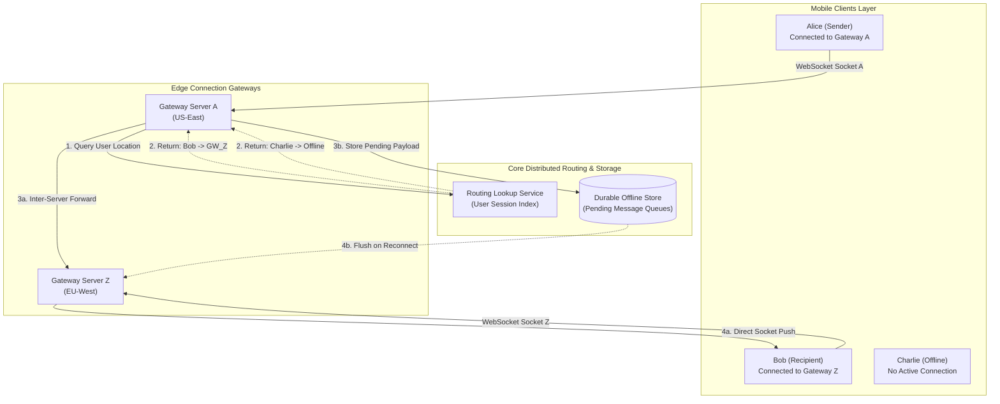

# Day 27 — How WhatsApp Delivers Billions of Messages
### The distributed system behind real-time, global-scale messaging

You open a messaging app on your phone, type `"Hey, are you free?"`, and press send. 

A tiny green checkmark appears instantly beside your message. A second later, a second checkmark appears. Shortly after, both checkmarks turn blue. 

To you, the interaction feels instantaneous, simple, and direct—as if a direct physical wire runs from your smartphone to your friend's phone across town, or halfway around the world.

**But what actually happened behind that single tap?**

Did your phone open a direct peer-to-peer radio connection to your friend's device? What if your friend was flying at 30,000 feet with their phone in Airplane Mode? What if they were driving through a tunnel, switching from Wi-Fi to 5G, or battery-dead when you hit send?

Delivering billions of messages every day to billions of devices operating across lossy cellular networks, shifting IP addresses, and unpredictable offline states is one of the most remarkable feats of modern distributed systems engineering. 

Behind that clean chat UI lies a high-concurrency, stateful delivery network designed to route messages across thousands of servers in milliseconds—and ensure that not a single message is lost, even when connections drop continuously.

---

## The Problem

To understand real-time messaging, imagine a realistic scenario.

Alice opens her chat app and sends a message to Bob:

* **Scenario A**: Bob is actively using the app on a high-speed fiber Wi-Fi connection.
* **Scenario B**: Bob is on a subway train where his phone completely loses signal for ten minutes.
* **Scenario C**: Bob is walking down the street, and his phone silently transitions from home Wi-Fi to a 4G cellular tower mid-transmission.
* **Scenario D**: Bob's phone battery dies just as Alice presses send, and remains off for six hours.

If you attempt to model this system as a traditional client-server web app—where a **Sender** sends an HTTP request to a **Server**, which immediately forwards it to a **Receiver**—the model breaks down almost instantly.

```text
  Sender ────────▶ Server ────────▶ Receiver
(Alice)           (Central)          (Bob)
```

Why is this naive mental model completely insufficient?

1. **Passive Receivers**: In normal web browsing, clients initiate requests to servers. Servers cannot spontaneously open an inbound HTTP request to a mobile phone that sits behind NAT (Network Address Translation) routers and cellular firewalls.
2. **Fleeting Connectivity**: Mobile devices do not stay cleanly connected. Sockets abruptly drop, cell towers hand off connections, IP addresses change without notice, and devices enter low-power sleep modes.
3. **Asynchronous Availability**: Sender and recipient are rarely in the exact same online state at the exact same millisecond. 

A large-scale messaging system must deal with hundreds of millions of independent, volatile users whose network connections are constantly appearing, degrading, and disappearing.

---

## Why This Happens

Why does real-time messaging become extraordinarily difficult as user scale grows? 

Let's build the engineering constraints step by step.

### 1. Persistent, Long-Lived Connections
To push a message to a mobile device the instant it arrives, the server infrastructure cannot wait for the recipient to poll for updates every few seconds (which would destroy mobile battery life and hammer servers with billions of wasteful polling queries). Instead, the recipient must maintain an active, long-lived TCP socket connection (e.g., via WebSockets or custom binary protocols) open to the messaging infrastructure.

### 2. Dispersed Connection State
With hundreds of millions of active users, no single physical server can hold all open socket connections. The system must run across thousands of gateway servers. 
* Alice might be connected to **Connection Server 42** in Virginia.
* Bob might be connected to **Connection Server 809** in London.
* Charlie might be completely **Offline**.

How does Server 42 know where Bob is currently connected? Connection state is **distributed state**, and it changes constantly as users lock their phones, switch networks, or lose signal.

### 3. Asynchronous Survival
When Bob is offline, Alice's message cannot simply be dropped or rejected with a `404 Not Found`. The system must accept responsibility for the message, store it safely in durable infrastructure, and hold it until Bob's device re-establishes a valid connection.

### 4. Reliable Acknowledgements & Retries
Wireless networks drop packets without warning. If Server 809 pushes a message over Bob's TCP connection, did Bob's app actually process it, or did the TCP packet vanish when his phone entered an elevator? The infrastructure needs explicit application-level acknowledgements (`ACKs`) from recipient devices, paired with automated retries.

### 5. Duplicate Risks & Ordering
If the server retries delivering a message because an `ACK` was lost in transit, Bob's app might receive the same message twice. Furthermore, if Alice sends three messages in rapid succession (`"Are you there?"`, `"Call me"`, `"Nevermind"`), delivering them out of order confuses the user experience.

---

## The Wrong Solution

To see why scale breaks naive implementations, let's observe the simplest design a developer might build.

### The Naive Single-Server Design

```text
Alice (Sender) ──▶ [ Single Messaging Server ] ──▶ Bob (Receiver)
                         │
                         ▼
                   [ In-Memory Map ]
                   (User -> Socket)
```

In this naive design:
1. Alice and Bob both open long-lived TCP connections to a single central server.
2. The server keeps an in-memory hash table mapping `user_id -> socket_connection`.
3. When Alice sends a message for Bob, the server looks up Bob's socket in its memory and writes the payload directly into the socket.

### Why This Solution Collapses

1. **Memory & Connection Limits**: A single server reaches OS file-descriptor and memory limits (e.g., Linux `epoll` limits or RAM overhead per socket) long before handling millions of concurrent connections.
2. **Single Point of Failure**: If that single server reboots or crashes, every active connection in the entire company drops, and all in-memory message queues vanish instantly.
3. **No Support for Offline Users**: If Bob is disconnected, looking up his socket returns `null`. If the server drops the message, it is lost forever. If it buffers messages in server RAM, the server runs out of memory.

### "Why Not Just Add a Load Balancer?"

A developer's first instinct to solve single-server limits is to throw a standard HTTP Load Balancer in front of multiple messaging servers:

```text
                  ┌──▶ [ Server A ] (Holds Alice's Socket)
Alice ──┐         │
        ├──▶ [ Load Balancer ]
Bob   ──┘         │
                  └──▶ [ Server B ] (Holds Bob's Socket)
```

**Why does this still fail?**

If Alice sends a message to Bob, her request lands on **Server A**. But Bob's TCP socket is connected to **Server B**. 

A standard load balancer balances *incoming requests*, but it does not tell Server A *which server currently holds Bob's active socket*. Server A has no visibility into Server B's memory. Placing servers behind a load balancer without a routing coordinate layer leaves the servers completely isolated from one another.

---

## The Right Mental Model

To design a scalable messaging system, you must shift your fundamental mental model:

> **A large-scale messaging system is not a synchronous request-response system. It is an asynchronous delivery network operating across unreliable, constantly changing connection endpoints.**

### The Post Office Analogy

Think of a real-world messaging system like a **p2p post office network**:

1. **Dropping Off the Parcel**: You walk to your local post office and hand them a letter. Once the clerk stamps it and gives you a receipt, your job is done. The post office has accepted responsibility.
2. **Sorting & Routing**: The post office looks up the destination address in a central routing registry to determine which regional hub manages that destination.
3. **Delivery Attempt**: If the recipient is at home, the carrier hands them the letter and asks for a signature (Delivery ACK).
4. **Temporary Holding (Offline)**: If the recipient is away on vacation, the letter is not thrown in the trash. It is stored safely in a holding bin at the local sorting facility until the recipient returns and requests their mail.

```text
Sender ──▶ Connection Gateway ──▶ Recipient Reachable?
                                         │
                   ┌─────────────────────┴─────────────────────┐
                   ▼                                           ▼
              [ YES ]                                     [ NO ]
                   │                                           │
         Direct Socket Push                         Store in Offline Storage
                   │                                           │
         Recipient ACKs Receipt                      Recipient Reconnects
                   │                                           │
                   │                                  Flush & Push Pending Queue
                   │                                           │
                   └─────────────────────┬─────────────────────┘
                                         ▼
                            Propagate ACK to Sender
```

> [!IMPORTANT]
> **Key Memory Anchor**: *Sending a message and delivering a message are not always the same event.* Sending is synchronous between sender and server. Delivering is asynchronous between server and recipient.

---

## How It Actually Works

Let's step through the progressive architecture required to power billions of messages.

```text
1 Server ──▶ Many Users ──▶ Many Servers ──▶ Distributed Routing ──▶ Offline Storage ──▶ Reliable ACKs
```

### 1. Connection Layer (Stateful Gateway Infrastructure)

Instead of establishing a heavy HTTP connection (with headers, TLS handshakes, and overhead) for every single message, devices maintain a **long-lived, persistent connection** to edge connection servers.

* Sockets stay open for hours or days using lightweight application-level heartbeats (pings).
* The infrastructure uses highly concurrent event-driven networking runtimes capable of handling hundreds of thousands of idle TCP sockets per node with minimal RAM footprint per connection.

### 2. User Routing (The Directory Problem)

When Alice (on Server A) sends a message to Bob (on Server Z), Server A needs to route the message to Server Z. 

How does the system discover where Bob is?

```text
Alice ──▶ Gateway A ──▶ Query Routing Table ──▶ Returns: "Bob is on Gateway Z" ──▶ Gateway Z ──▶ Bob
```

* **User Routing Table / Session Store**: A distributed, ultra-fast key-value store (or in-memory distributed index) maintains an active mapping of `user_id -> server_address`.
* When Bob connects to Gateway Z, Gateway Z registers `bob -> Gateway_Z_IP` in the routing table.
* When Alice sends a message to Bob, Gateway A queries the routing table, discovers Gateway Z, and forwards the message internally across the backend network.

### 3. Message Acceptance vs. Final Delivery

A messaging system explicitly separates message states:

```text
[ Client Sent ] ──▶ [ Accepted by Server ] ──▶ [ Delivered to Device ] ──▶ [ Read by User ]
                         (Single Tick ✓)           (Double Ticks ✓✓)       (Blue Ticks ✓✓)
```

1. **Sent**: Client dispatched payload over its local socket.
2. **Accepted (Server ACK)**: Gateway received the message, generated a globally unique ID, and persisted it. The server sends a single checkmark back to Alice. *Alice can now close her app; the infrastructure guarantees delivery.*
3. **Delivered (Device ACK)**: The message reached Bob's phone socket, and Bob's OS background process acknowledged receipt. The server forwards double checkmarks to Alice.
4. **Read (App ACK)**: Bob opened the specific chat UI. The app sends a read notification to the server, which turns Alice's checkmarks blue.

### 4. Offline Delivery (Store-and-Forward)

If the routing lookup reveals that Bob is offline (no active entry in the user routing table), the message transitions to the **Store-and-Forward** path:

* The message payload is written to a durable **Offline Message Store** (indexed by `recipient_id`).
* When Bob powers on his phone or exits a subway tunnel, his client establishes a new socket to a Gateway server.
* Upon registration, the Gateway checks the Offline Store, fetches all pending messages queued for Bob, pushes them sequentially over the new socket, and purges them from server storage once Bob's device sends back delivery ACKs.

### 5. Reliability, Retries & Idempotency

What if Gateway Z pushes a message to Bob, but Bob's socket drops before his device can send back the delivery `ACK`?

* **At-Least-Once Delivery**: The server assumes the message was not delivered and queues it for retry.
* **Client Idempotency**: Because retries can cause Bob's device to receive the same message twice, every message carries a immutable client-generated or server-generated `message_id`. Bob's app maintains a local database of received IDs. If a duplicate `message_id` arrives, the client suppresses the visual notification but re-sends the delivery `ACK` so the server stops retrying.

```text
Step 1: Gateway pushes Message #101 to Bob.
Step 2: Bob's app writes #101 to local SQLite storage.
Step 3: Network drops! Delivery ACK lost.
Step 4: Gateway retries pushing Message #101 upon reconnect.
Step 5: Bob's app detects #101 already in local SQLite -> Drops duplicate, re-sends ACK.
```

### 6. Message Ordering

In a conversation, message order matters. If Alice sends Message 1 (`"Can you talk?"`) and Message 2 (`"Nevermind"`), Bob must see them in that exact order.

* **Why Global Ordering is Expensive**: Forcing a global physical clock across distributed gateway servers requires complex distributed lock coordination.
* **Per-Conversation Sequence Numbers**: Instead of global clock synchronization, order is enforced **per conversation**. Senders append a strictly monotonically increasing client sequence number or logical timestamp to messages within a conversation context. The recipient client sorts incoming messages by conversation sequence numbers before rendering.

### 7. Scaling Progression

The evolutionary path of a real-time messaging architecture:

```text
[ 1 Server ] ──▶ [ Connection Gateways + Central Database ] ──▶ [ Distributed Routing + Store-and-Forward Shards ]
```

---

## Visual Explanation

### ASCII Diagram 1 — Basic Messaging Flow

```text
+-------------------+             +----------------------------------+             +-------------------+
|   Alice's Phone   |             |     Messaging Infrastructure     |             |    Bob's Phone    |
| (Client Gateway A)|             |  (Routing Layer & Core Routers)  |             | (Client Gateway Z)|
+---------+---------+             +----------------+-----------------+             +---------+---------+
          |                                        |                                         |
          | --- 1. Send Msg ("Hi Bob") ----------> |                                         |
          | <== 2. Server ACK (Single Tick ✓) ---- |                                         |
          |                                        | --- 3. Route & Push Payload ----------> |
          |                                        | <== 4. Delivery ACK (Double Ticks ✓v) - |
          | <== 5. Propagate Delivery ACK -------- |                                         |
```

### ASCII Diagram 2 — Recipient Offline Scenario

```text
Alice                            Messaging Infrastructure                            Bob (Offline)
  |                                         |                                              |
  | --- Send Msg ("Meeting at 5?") -------> |                                              |
  | <== Server ACK (Single Tick ✓) -------- |                                              |
  |                                         | --- Check Routing Table ---> [ Bob Offline ] |
  |                                         |                                      |       |
  |                                         | --- Write to Offline Message Store --+       |
  |                                         |                                              |
  |                                         | <========== Bob Reconnects & Authenticates ==|
  |                                         |                                              |
  |                                         | --- Fetch & Push Pending Messages ---------> |
  |                                         | <== Device Delivery ACK (Double Ticks ✓✓) -- |
  | <== Propagate Delivery ACK ------------ |                                              |
```

### Mermaid Diagram — Distributed Messaging Architecture



### Sequence Diagram — Message Lifecycle & Acknowledgements

```mermaid
sequenceDiagram
    autonumber
    actor Alice as Alice (Sender)
    participant GW as Gateway Server
    participant Store as Offline Storage
    actor Bob as Bob (Recipient)

    rect rgb(15, 23, 42)
    note over Alice, Bob: Scenario 1: Immediate Delivery (Bob Online)
    Alice->>GW: Send Message ("Hello Bob")
    GW-->>Alice: Server ACK (Single Tick ✓)
    GW->>Bob: Direct Push Message Payload
    Bob-->>GW: Delivery ACK
    GW-->>Alice: Update Status: Delivered (Double Ticks ✓✓)
    Bob->>Bob: User Opens Conversation
    Bob->>GW: Read ACK
    GW-->>Alice: Update Status: Read (Blue Ticks ✓✓)
    end

    rect rgb(30, 41, 59)
    note over Alice, Bob: Scenario 2: Store-and-Forward (Bob Offline)
    Alice->>GW: Send Message ("Are you there?")
    GW-->>Alice: Server ACK (Single Tick ✓)
    GW->>Store: Recipient Offline -> Save Payload
    note over Bob: ... Bob reconnects to network ...
    Bob->>GW: TCP Handshake & Authenticate
    GW->>Store: Query Pending Messages for Bob
    Store-->>GW: Return Pending Message Payload
    GW->>Bob: Deliver Pending Message
    Bob-->>GW: Delivery ACK
    GW->>Store: Delete Delivered Message from Store
    GW-->>Alice: Update Status: Delivered (Double Ticks ✓✓)
    end
```



---

## Real-World Example: WhatsApp's Erlang/BEAM Infrastructure

WhatsApp provides one of the most famous real-world examples of high-concurrency messaging engineering.

```text
            +-------------------------------------------------------+
            |        WhatsApp FreeBSD Gateway Node (Erlang)        |
            |                                                       |
            |   [BEAM Process] <---> [Socket connection for User 1] |
            |   [BEAM Process] <---> [Socket connection for User 2] |
            |   [BEAM Process] <---> [Socket connection for User 3] |
            |   ... (2,000,000 Light-weight Processes per Node) ...  |
            +-------------------------------------------------------+
```

### Key Publicly Documented Architectural Highlights

1. **Lightweight Concurrency with Erlang/Elixir (BEAM)**:
   WhatsApp famously scaled to handle tens of millions of concurrent connections with a remarkably small engineering team by leveraging Erlang on the BEAM virtual machine.
   * In Erlang, every connected user is allocated an isolated, lightweight Erlang **actor process**.
   * Erlang processes are managed by the VM (not OS threads), taking as little as **2 KB of RAM** per process.
   * A single physical server running tuned FreeBSD/Linux was publicly documented by WhatsApp engineers to support over **2 million concurrent active TCP connections**.

2. **Transient Message Passing**:
   WhatsApp operates primarily as a **store-and-forward queue**, not a long-term media/text archive server.
   * Once a message is successfully delivered to the recipient's phone and acknowledged, it is purged from WhatsApp's intermediate server storage.
   * Primary message history resides client-side on user devices (stored in encrypted local database files).

3. **Custom Protocol Tuning**:
   To minimize mobile data usage and battery drain, WhatsApp replaced heavy JSON/HTTP payloads with a customized binary protocol built over persistent TCP sockets, wrapping encrypted frames with minimal header overhead.

---

## Build It Yourself: Educational Python Simulation

Inside the [`code/`](file:///d:/30_Days_of_Distributed_Systems/days/Day-27-WhatsApp/code/) directory, you will find a complete Python simulation demonstrating connection management, user routing, store-and-forward persistence, and acknowledgement propagation.

### Included Files
* **[`message_store.py`](file:///d:/30_Days_of_Distributed_Systems/days/Day-27-WhatsApp/code/message_store.py)**: Defines `Message`, `MessageStatus` (`SENT_TO_SERVER`, `DELIVERED`, `READ`), and `OfflineMessageStore`.
* **[`client.py`](file:///d:/30_Days_of_Distributed_Systems/days/Day-27-WhatsApp/code/client.py)**: Simulates mobile devices (`UserClient`) connecting, disconnecting, and dispatching ACKs.
* **[`server.py`](file:///d:/30_Days_of_Distributed_Systems/days/Day-27-WhatsApp/code/server.py)**: Implements the `MessagingServer` routing table and store-and-forward pipeline.
* **[`demo.py`](file:///d:/30_Days_of_Distributed_Systems/days/Day-27-WhatsApp/code/demo.py)**: Executable script running both online and offline delivery scenarios.

### Running the Demo

Execute from your terminal:

```bash
python code/demo.py
```

### Walkthrough of Scenarios Run in the Code

#### 1. Online Immediate Delivery Path

```python
# Alice & Bob connect to server
alice.connect()
bob.connect()

# Alice sends a message to Bob
msg = alice.send_message("bob", "Hey Bob! Are you free for a call?")
# -> Server checks routing table: Bob is ONLINE.
# -> Pushes payload to Bob's socket immediately.
# -> Bob's app sends back DELIVERED ACK.
# -> Alice sees message status update to DELIVERED.
```

#### 2. Offline Store-and-Forward Path

```python
# Charlie is disconnected (OFFLINE)
# Alice sends a message to Charlie
msg = alice.send_message("charlie", "Hey Charlie, let me know when you get back online!")
# -> Server checks routing table: Charlie is OFFLINE.
# -> Server stores payload in OfflineMessageStore.
# -> Alice receives Server ACK (SENT_TO_SERVER).

# Later, Charlie toggles Airplane Mode off and connects:
charlie.connect()
# -> Server detects Charlie's connection.
# -> Flushes queued offline message to Charlie.
# -> Charlie sends back DELIVERED ACK -> Alice sees status update to DELIVERED!
```

---

## Common Misconceptions

> [!CAUTION]
> Misunderstanding 1: **"Real-time messaging is just standard HTTP requests."**
> **Reality**: Standard HTTP is unidirectional and stateless. Mobile clients cannot receive spontaneous inbound HTTP requests without maintaining persistent sockets (WebSockets/TCP) or relying on mobile OS push notification gateways (APNs/FCM).

> [!WARNING]
> Misunderstanding 2: **"If the sender sees 'Sent', the recipient has received the message."**
> **Reality**: 'Sent' (single checkmark) only means the message reached the server infrastructure safely. It guarantees nothing about whether the recipient's phone is powered on, has network signal, or received the payload.

> [!NOTE]
> Misunderstanding 3: **"Adding more servers behind a load balancer automatically scales messaging."**
> **Reality**: Load balancers route incoming network connections, but they do not solve the **User Routing Problem**. Servers must share a distributed state index to know which node holds which user's active socket.

> [!NOTE]
> Misunderstanding 4: **"Retries always increase reliability."**
> **Reality**: Unbounded retries without idempotency keys create duplicate messages. Under severe outages, aggressive client retries cause a **thundering herd storm** that overwhelms recovering gateways.

> [!NOTE]
> Misunderstanding 5: **"Exactly-once delivery is easy to guarantee over networks."**
> **Reality**: Due to the Two Generals' Problem, network ACKs can always be lost. Systems implement **At-Least-Once delivery + Client-side De-duplication** to achieve *effective* exactly-once processing.

> [!NOTE]
> Misunderstanding 6: **"Global clock timestamps keep all messages perfectly ordered."**
> **Reality**: Wall-clock timestamps drift across servers and mobile phones. Reliable systems use per-conversation sequence numbers or logical clocks to guarantee ordering.

> [!NOTE]
> Misunderstanding 7: **"An offline recipient means the server must reject the message."**
> **Reality**: Asynchronous messaging relies on store-and-forward infrastructure. The server accepts the message, queues it in durable storage, and completes delivery when the user re-establishes connectivity.

---

## Production Trade-offs

```text
+-------------------------------------------------------+-------------------------------------------------------+
|                      ADVANTAGES                       |                     DISADVANTAGES                     |
+-------------------------------------------------------+-------------------------------------------------------+
| • Real-Time Delivery: Sub-second push to active users.| • Stateful Infrastructure: Servers hold active socket |
| • Offline Resilience: Messages survive network loss.  |   state, making rolling deploys more complex.        |
| • Scalable Edge: Decouples connection nodes from core | • Duplicate Delivery Risk: Retries require client-side|
|   storage databases.                                  |   idempotency filtering.                              |
+-------------------------------------------------------+-------------------------------------------------------+
```

### Failure Cases & Mitigations

1. **Gateway Node Crash**:
   - *Failure*: Gateway Server A dies, dropping 100,000 active user sockets.
   - *Mitigation*: Clients detect TCP socket drop via heartbeat timeouts, back off exponentially, and reconnect to another healthy Gateway node. The new Gateway updates the distributed routing table.
2. **Recipient Disconnects Mid-Delivery**:
   - *Failure*: Server pushes message payload, but recipient loses signal before sending an `ACK`.
   - *Mitigation*: Server timeout triggers retries. When recipient reconnects, payload is re-sent; recipient deduplicates using `message_id`.
3. **Stale Routing Directory Entry**:
   - *Failure*: Gateway Z crashes without unregistering Bob's routing entry; Gateway A tries forwarding to Gateway Z.
   - *Mitigation*: Inter-gateway communication uses short timeouts. If Gateway Z is unreachable, Gateway A falls back to placing the message in the Offline Store.

### Performance & Scaling Implications

* **Memory Management**: Managing 1 million concurrent TCP sockets requires tuning OS kernel buffers (`wmem`/`rmem`), reducing per-socket RAM, and using non-blocking I/O multiplexing (`epoll`/`kqueue`).
* **Bandwidth & Serialization**: Compact binary formats (Protobuf, FlatBuffers, or custom binary frames) replace heavy JSON strings to minimize mobile cellular data usage.

---

## Key Takeaways

1. **Sending and Delivering are Separate Events**: Sending is synchronous (Client ──▶ Server); delivering is asynchronous (Server ──▶ Recipient).
2. **Connection State is Distributed State**: Sockets live on specific servers; a distributed directory is required to route messages between servers.
3. **Store-and-Forward Enables Offline Resilience**: Messages for offline users must be safely stored and flushed upon reconnection.
4. **Acknowledgements Define System Truth**: Single tick = Server Accepted; Double ticks = Device Received; Blue ticks = User Read.
5. **Networks cause Duplicates**: At-least-once retries require client-side deduplication using unique `message_ids`.
6. **Ordering is Local, Not Global**: Sort messages using per-conversation sequence numbers rather than synchronized wall-clock timestamps.
7. **Long-Lived Sockets Beat Polling**: Persistent connections minimize latency, reduce server overhead, and preserve mobile battery life.
8. **Erlang/Actor Models Excel at Scale**: Lightweight isolated green threads handle millions of concurrent idle sockets efficiently.

---

## Interview Questions

### Q1: How would you design a messaging architecture for 100 million concurrent users?
**Answer**: Separate the system into three distinct layers:
1. **Edge Connection Gateways**: Scalable pool of gateway servers (e.g., Erlang/Go/Netty) maintaining persistent WebSockets/TCP connections with clients.
2. **User Session Routing Index**: An in-memory distributed store (e.g., Redis Cluster or distributed hash table) mapping `user_id -> gateway_ip`.
3. **Store-and-Forward Layer**: Distributed queue / key-value store (e.g., Cassandra / RocksDB) holding pending messages for offline recipients.
When User A sends a message to User B, Gateway A queries the Session Index. If User B is connected to Gateway Z, Gateway A forwards the payload to Gateway Z for immediate socket push. If User B is offline, Gateway A writes the message to the Store-and-Forward layer.

### Q2: What exact steps occur when a recipient reconnects after being offline for two days?
**Answer**: 
1. Client device establishes a new TCP/TLS connection to an edge Gateway server and sends an authentication handshake.
2. Gateway registers the new session (`user_id -> Gateway_IP`) in the User Session Index.
3. Gateway queries the Store-and-Forward storage for pending messages matching `user_id`.
4. Storage streams pending messages sequentially to the Gateway.
5. Gateway pushes messages over the open socket to the client device.
6. Client device receives payloads, saves them locally, and responds with delivery `ACKs`.
7. Upon receiving `ACKs`, the Gateway purges the delivered messages from the Store-and-Forward store and propagates delivery status updates back to the original senders.

### Q3: How do you handle duplicate messages when network ACKs are lost?
**Answer**: Implement **At-Least-Once Delivery with Client-Side Idempotency**. The sender or server assigns a globally unique `message_id` (e.g., UUID or sequence hash) to each message. If the server does not receive a delivery `ACK` from the recipient within a timeout window, it re-transmits the message. When the recipient client receives a message, it checks its local device database. If the `message_id` already exists, the client suppresses duplicate rendering but re-transmits the `ACK` back to the server to clear the retry loop.

### Q4: Why is global clock ordering difficult, and how should message ordering be enforced?
**Answer**: Global wall-clock synchronization across millions of distributed devices and servers is impossible due to NTP clock drift and network jitter. Relying on client timestamps allows out-of-order rendering if a user's phone clock is wrong. Instead, order should be enforced **per conversation** using monotonically increasing sequence numbers generated by the sender client or the conversation server shard. Recipients order messages locally using conversation sequence IDs.

---

## Further Reading

For primary technical papers, engineering blog posts, Erlang scaling reports, and video lectures, check out today's **[`references.md`](file:///d:/30_Days_of_Distributed_Systems/days/Day-27-WhatsApp/references.md)** file.

---

## What You'll Build Intuition for Tomorrow

Today, we explored how a distributed system routes small, real-time text messages across millions of volatile point-to-point connections. 

But what happens when the data being delivered isn't a 50-byte text message, but a **4K video stream requiring gigabits per second of continuous bandwidth** delivered smoothly to millions of viewers watching at the exact same second?

Tomorrow, on **Day 28**, we will explore **How Netflix Streams Video Worldwide**—uncovering how Content Delivery Networks (CDNs), adaptive bitrate chunking, and edge caching deliver flawless video without burning down the internet!
